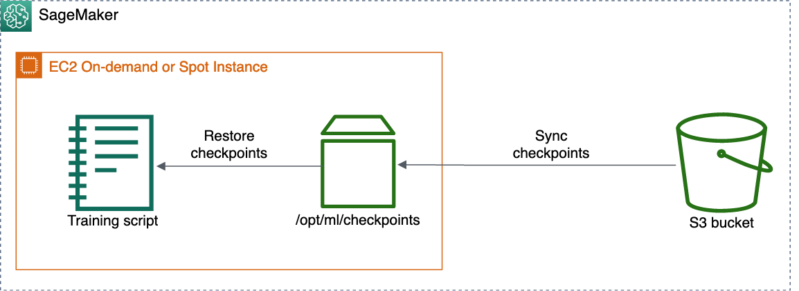

# Resume training from a checkpoint

To resume a training job from a checkpoint, run a new estimator with the same
`checkpoint_s3_uri` that you created in the [Enable checkpointing](model-checkpoints-enable.md "model-checkpoints-enable.md")
section. Once the training has resumed, the checkpoints from this S3 bucket are restored
to `checkpoint_local_path` in each instance of the new training job. Ensure
that the S3 bucket is in the same Region as that of the current SageMaker AI session.

