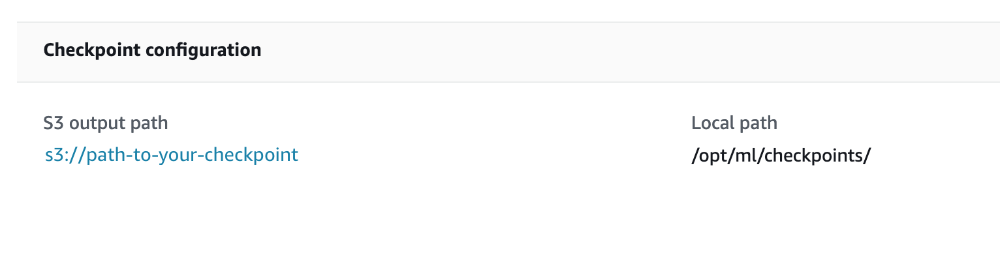

# Browse checkpoint files

Locate checkpoint files using the SageMaker Python SDK and the Amazon S3 console.

**To find the checkpoint files programmatically**

To retrieve the S3 bucket URI where the checkpoints are saved, check the following
estimator attribute:

```
estimator.checkpoint_s3_uri
```

This returns the S3 output path for checkpoints configured while requesting the
`CreateTrainingJob` request. To find the saved checkpoint files using the
S3 console, use the following procedure.

###### To find the checkpoint files from the S3 console

1. Sign in to the AWS Management Console and open the SageMaker AI console at [https://console.aws.amazon.com/sagemaker/](https://console.aws.amazon.com/sagemaker/ "https://console.aws.amazon.com/sagemaker/").
2. In the left navigation pane, choose **Training jobs**.
3. Choose the link to the training job with checkpointing enabled to open
   **Job settings**.
4. On the **Job settings** page of the training job, locate the
   **Checkpoint configuration** section.

 5. Use the link to the S3 bucket to access the checkpoint files.
