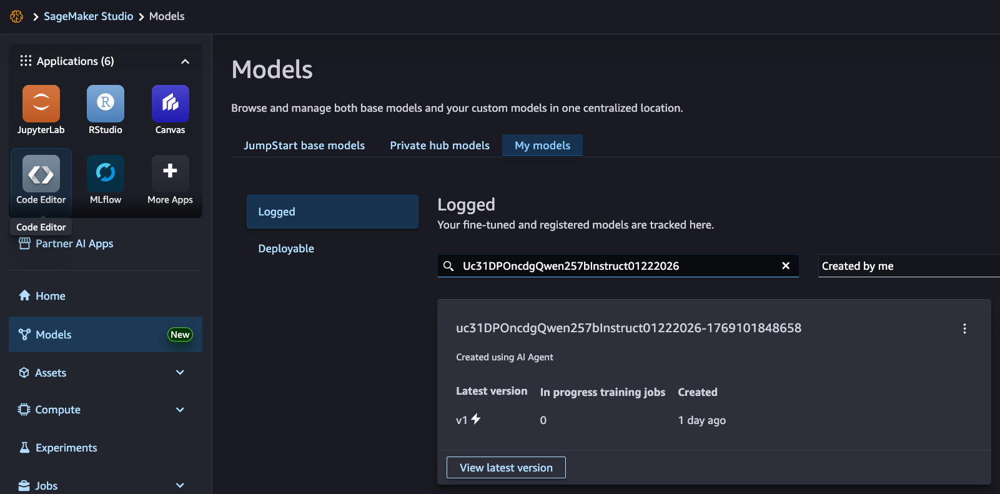
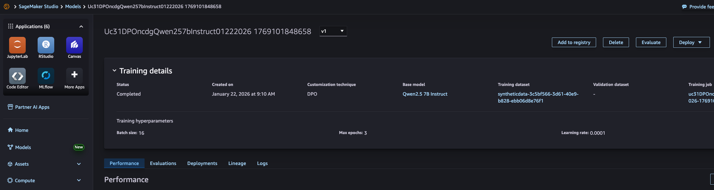
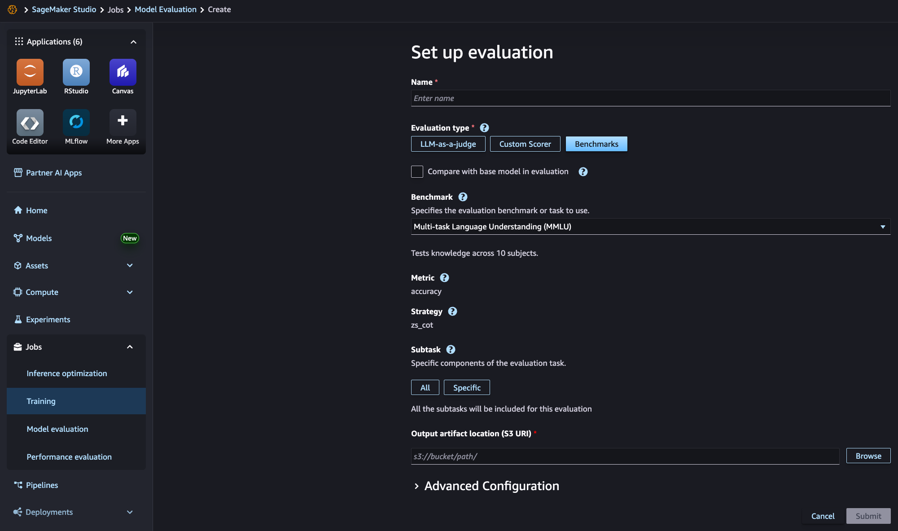
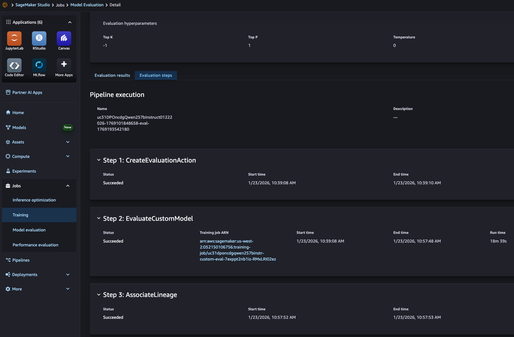
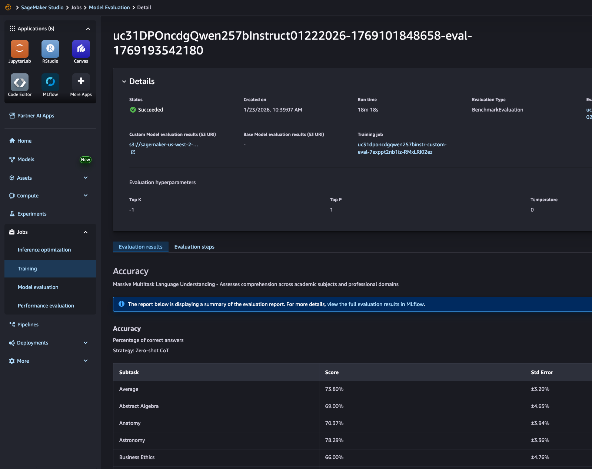
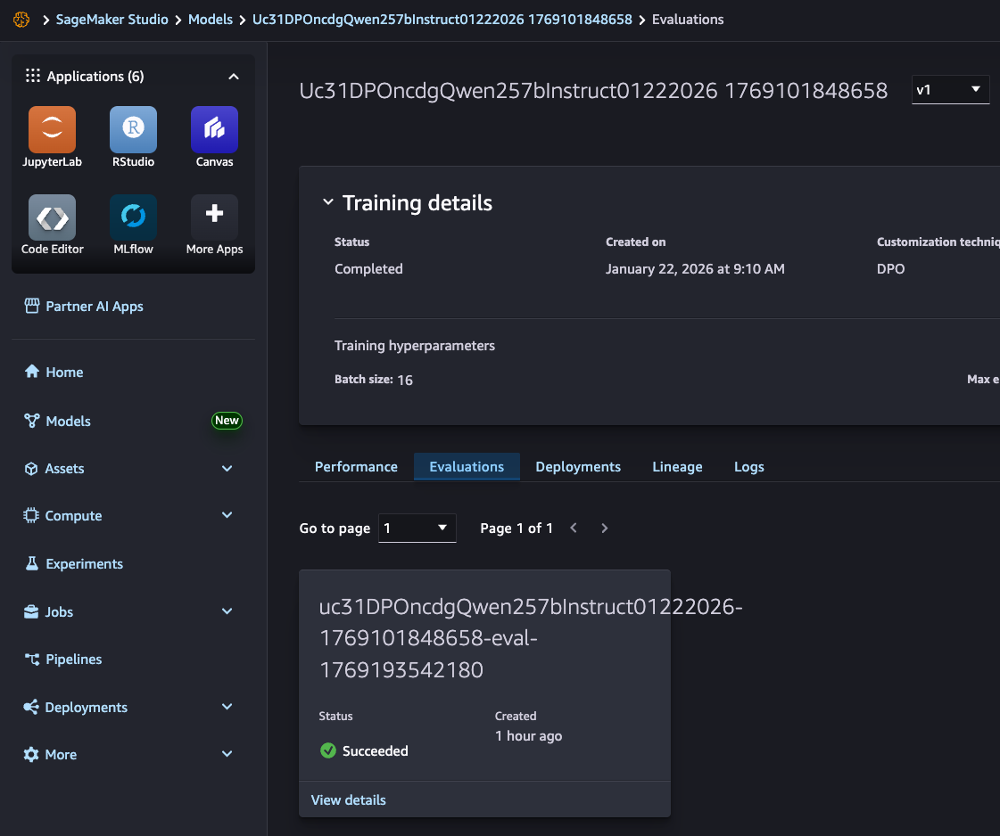

# Getting Started

## Submit an Evaluation Job Through SageMaker Studio

### Step 1: Navigate to Evaluation From Your Model Card

After you customize your model, navigate to the evaluation page from your model card.

For information on open-weight custom model training: [https://docs.aws.amazon.com/sagemaker/latest/dg/model-customize-open-weight-job.html](model-customize-open-weight-job.md "model-customize-open-weight-job.md")

SageMaker visualizes your customized model on the My Models tab:



Choose View latest version, then choose Evaluate:



### Step 2: Submit Your Evaluation Job

Choose the Submit button and submit your evaluation job. This submits a minimal MMLU benchmark job.

For information on the supported evaluation job types, see [Evaluation types and Job Submission](model-customize-evaluation-types.md "model-customize-evaluation-types.md").



### Step 3: Track Your Evaluation Job Progress

Your evaluation job progress is tracked in the Evaluation steps tab:



### Step 4: View Your Evaluation Job Results

Your evaluation job results are visualized in the Evaluation results tab:



### Step 5: View Your Completed Evaluations

Your completed evaluation job is displayed in Evaluations of your model card:



## Submit Your Evaluation Job Through SageMaker Python SDK

### Step 1: Create Your BenchMarkEvaluator

Pass your registered trained model, AWS S3 output location, and MLFlow resource ARN to `BenchMarkEvaluator` and then initialize it.

```
from sagemaker.train.evaluate import BenchMarkEvaluator, Benchmark

evaluator = BenchMarkEvaluator(
    benchmark=Benchmark.MMLU,
    model="arn:aws:sagemaker:<region>:<account-id>:model-package/<model-package-name>/<version>",
    s3_output_path="s3://<bucket-name>/<prefix>/eval/",
    mlflow_resource_arn="arn:aws:sagemaker:<region>:<account-id>:mlflow-tracking-server/<tracking-server-name>",
    evaluate_base_model=False
)
```

### Step 2: Submit Your Evaluation Job

Call the `evaluate()` method to submit the evaluation job.

```
execution = evaluator.evaluate()
```

### Step 3: Track Your Evaluation Job Progress

Call the `wait()` method of the execution to get a live update of the evaluation job progress.

```
execution.wait(target_status="Succeeded", poll=5, timeout=3600)
```

### Step 4: View Your Evaluation Job Results

Call the `show_results()` method to display your evaluation job results.

```
execution.show_results()
```
