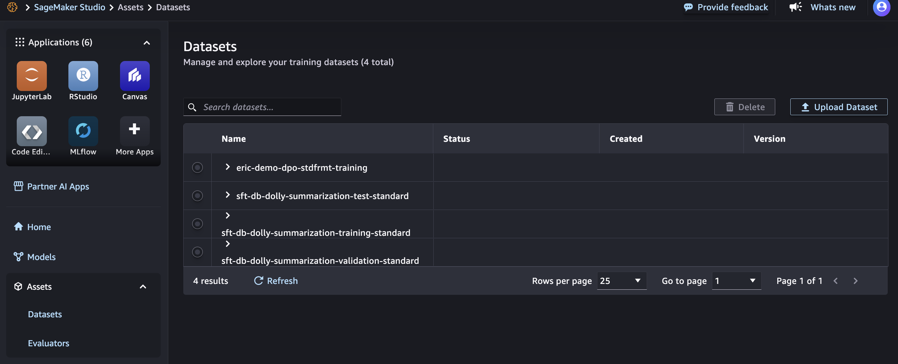
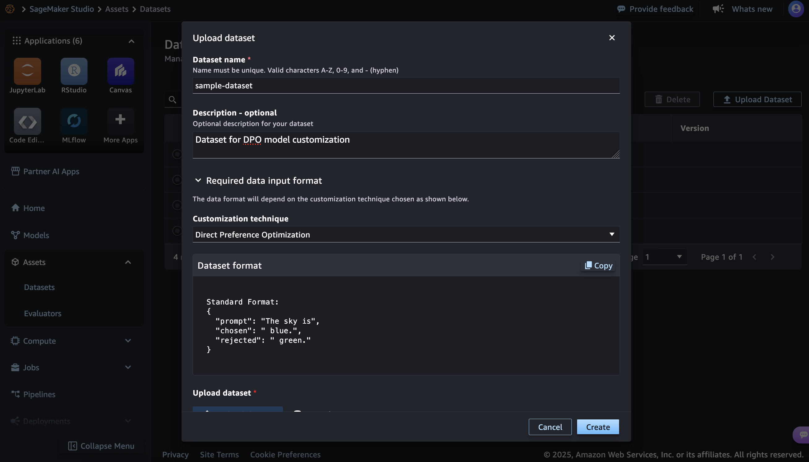
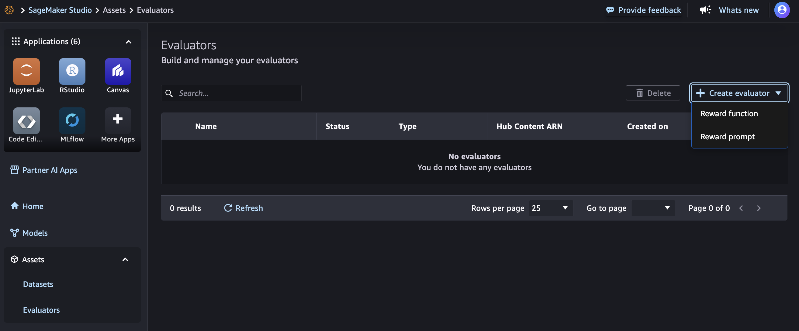
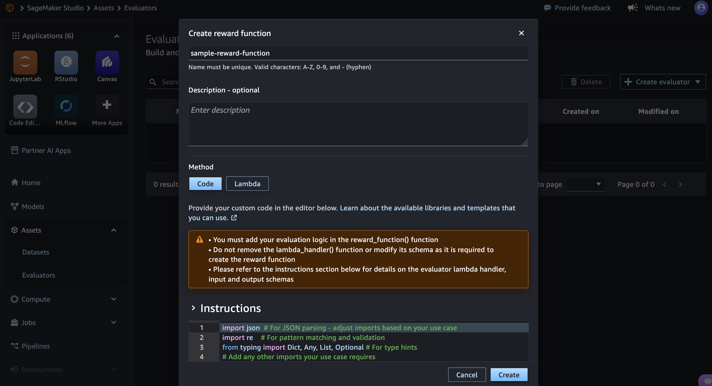

# Creating assets for model customization in the UI

You can create and manage the dataset and evaluator assets that you can use for
model customization in the UI.

## Assets

Select **Assets** in the left hand panel and the
Amazon SageMaker Studio UI and then select **Datasets**.



Choose **Upload Dataset** to add the dataset that you will use in your model
customization jobs. By choosing the **Required data input format**, you can access a
reference of dataset format to use.



## Evaluators

You can also add **Reward Functions** and **Reward
Prompts** for your Reinforcement Learning customization
jobs.



The UI also provides guidance on the format required for the reward function
or reward prompt.



## Assets for model customization using AWS SDK

You can also use the SageMaker AI Python SDK to create assets. See sample code snippet below:

```
from sagemaker.ai_registry.air_constants import REWARD_FUNCTION, REWARD_PROMPT
from sagemaker.ai_registry.dataset import DataSet, CustomizationTechnique
from sagemaker.ai_registry.evaluator import Evaluator

# Creating a dataset example
dataset = DataSet.create(
            name="sdkv3-gen-ds2",
            source="s3://sample-test-bucket/datasets/training-data/jamjee-sft-ds1.jsonl", # or use local filepath as source.
            customization_technique=CustomizationTechnique.SFT
        )

# Refreshes status from hub
dataset.refresh()
pprint(dataset.__dict__)

# Creating an evaluator. Method : Lambda
evaluator = Evaluator.create(
                name = "sdk-new-rf11",
                source="arn:aws:lambda:us-west-2:<>:function:<function-name>8",
                type=REWARD_FUNCTION
        )

# Creating an evaluator. Method : Bring your own code
evaluator = Evaluator.create(
                name = "eval-lambda-test",
                source="/path_to_local/eval_lambda_1.py",
                type = REWARD_FUNCTION
        )

# Optional wait, by default we have wait = True during create call.
evaluator.wait()

evaluator.refresh()
pprint(evaluator)
```
