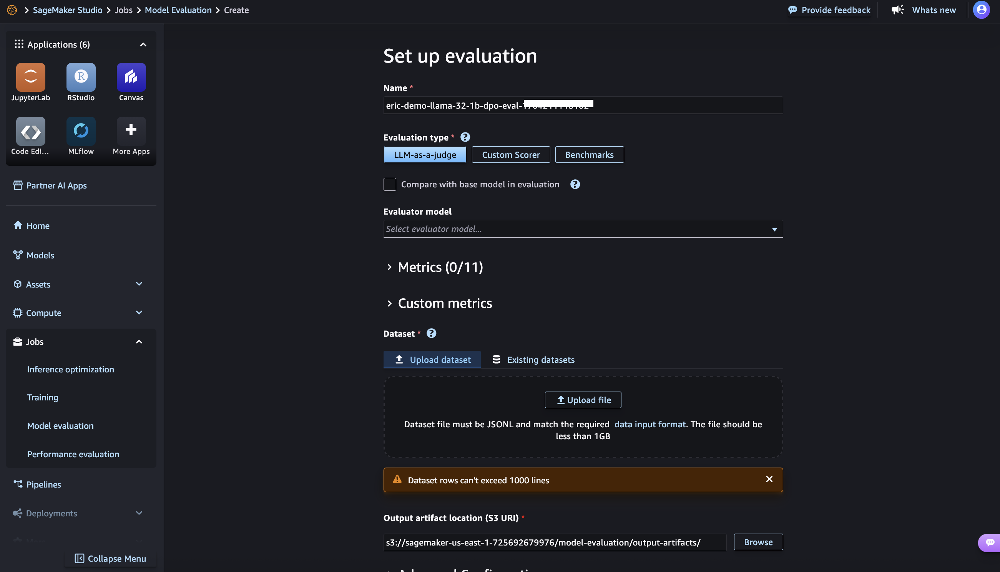
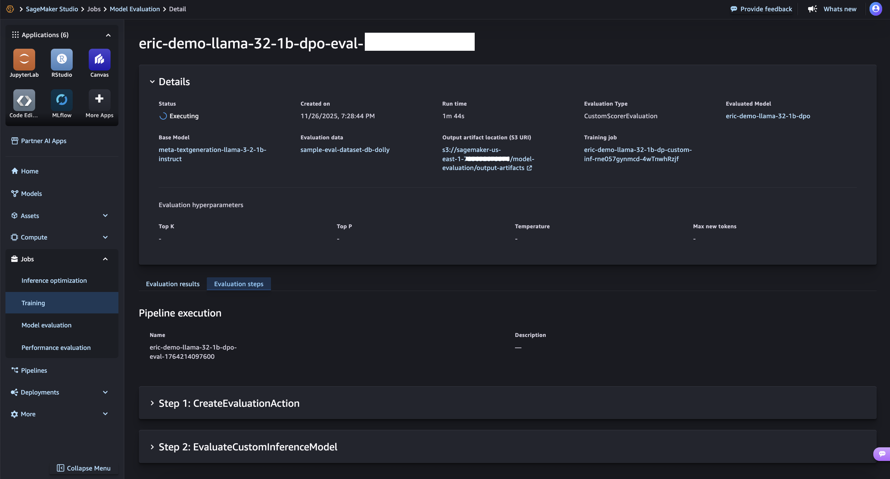

# Model evaluation job submission

You can choose to launch an evaluation job from your custom model details page and
select between run a LLM as a Judge (LLMAJ) evaluation, Custom scorer evaluation
where you can pull an Evaluator you have previously defined, or run a quick
Benchmark evaluation.

Once submitted you will be able to monitor your model evaluation job.

