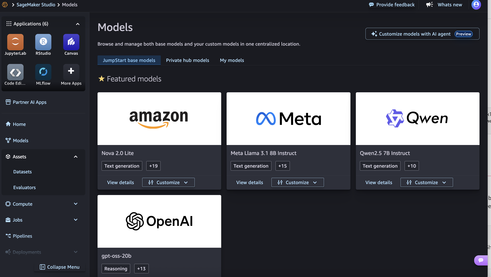
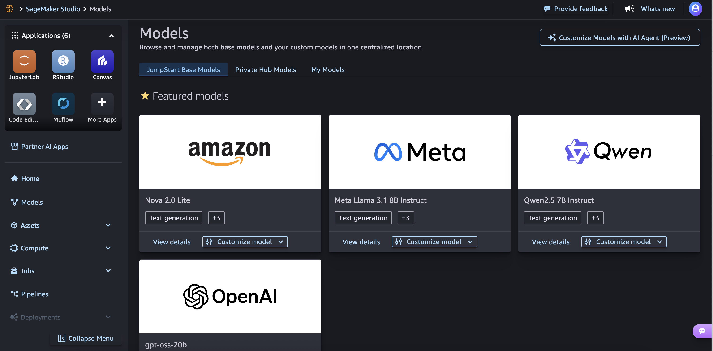
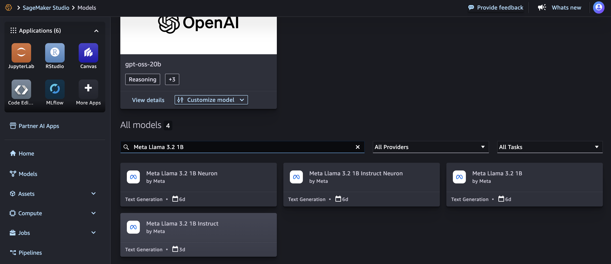
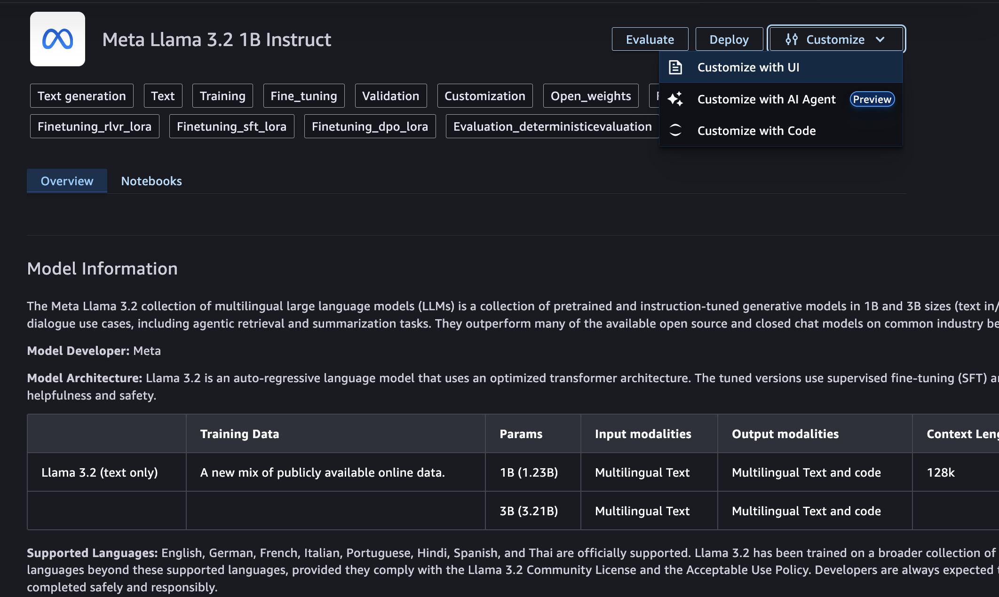
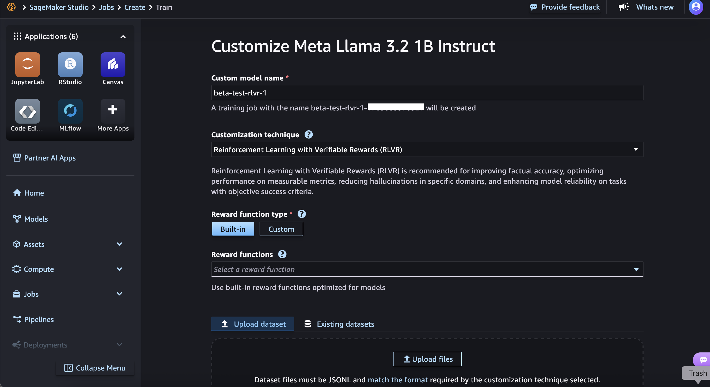
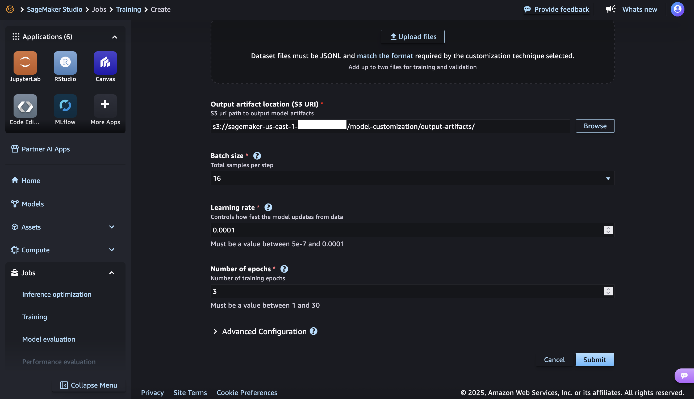
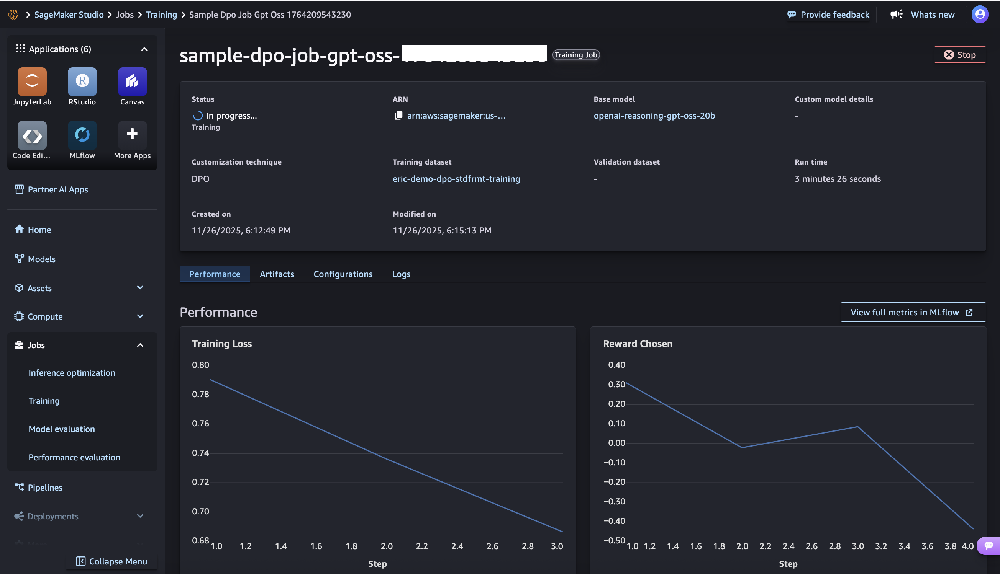
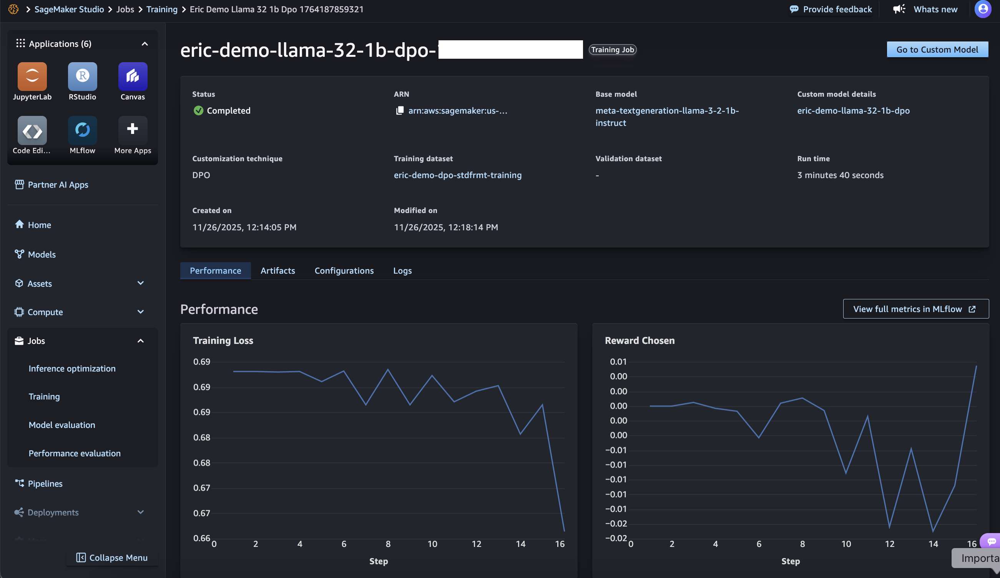
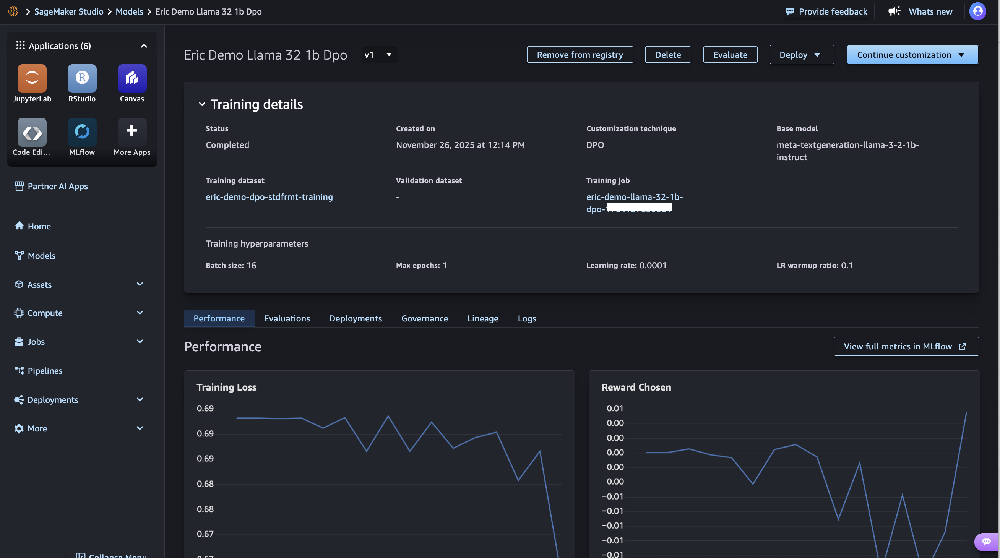

# Open weight model customization

This topic walks you through the process to get started with open weight model
customization.

## Prerequisites

Before you begin, complete the following prerequisites:

- Onboard to a SageMaker AI domain with Studio access. If you don't have
  permissions to set Studio as the default experience for your domain, contact
  your administrator. For more information, see [Amazon SageMaker AI domain overview](gs-studio-onboard.md "gs-studio-onboard.md").
- Update the AWS CLI by following the steps in [Installing the current AWS CLI Version](../../../cli/latest/userguide/install-cliv1.md#install-tool-bundled "../../../cli/latest/userguide/install-cliv1.md#install-tool-bundled").
- From your local machine, run `aws configure` and provide your
  AWS credentials. For information about AWS credentials, see [Understanding and getting your AWS credentials](../../../IAM/latest/UserGuide/security-creds.md "../../../IAM/latest/UserGuide/security-creds.md").

## Required IAM permissions

SageMaker AI model customization requires adding appropriate permissions to your
SageMaker AI domain execution. To do this, you can create an inline IAM
permissions policy and attach it to the IAM role. For information about adding
policies, see [Adding and removing IAM identity permissions](../../../IAM/latest/UserGuide/access_policies_manage-attach-detach.md "../../../IAM/latest/UserGuide/access_policies_manage-attach-detach.md") in the _AWS Identity and Access Management User Guide_.

```
{
    "Version": "2012-10-17",
    "Statement": [
        {
            "Sid": "AllowNonAdminStudioActions",
            "Effect": "Allow",
            "Action": [
                "sagemaker:CreatePresignedDomainUrl",
                "sagemaker:DescribeDomain",
                "sagemaker:DescribeUserProfile",
                "sagemaker:DescribeSpace",
                "sagemaker:ListSpaces",
                "sagemaker:DescribeApp",
                "sagemaker:ListApps"
            ],
            "Resource": [
                "arn:aws:sagemaker:*:*:domain/*",
                "arn:aws:sagemaker:*:*:user-profile/*",
                "arn:aws:sagemaker:*:*:app/*",
                "arn:aws:sagemaker:*:*:space/*"
             ]
        },
        {
            "Sid": "LambdaListPermissions",
            "Effect": "Allow",
            "Action": [
                "lambda:ListFunctions"
            ],
            "Resource": [
                "*"
            ]
        },
        {
            "Sid": "LambdaPermissionsForRewardFunction",
            "Effect": "Allow",
            "Action": [
                "lambda:CreateFunction",
                "lambda:DeleteFunction",
                "lambda:InvokeFunction",
                "lambda:GetFunction"
            ],
            "Resource": [
                "arn:aws:lambda:*:*:function:*SageMaker*",
                "arn:aws:lambda:*:*:function:*sagemaker*",
                "arn:aws:lambda:*:*:function:*Sagemaker*"
            ],
            "Condition": {
                "StringEquals": {
                    "aws:ResourceAccount": "${aws:PrincipalAccount}"
                }
            }
        },
        {
            "Sid": "LambdaLayerForAWSSDK",
            "Effect": "Allow",
            "Action": [
                "lambda:GetLayerVersion"
            ],
            "Resource": [
                "arn:aws:lambda:*:336392948345:layer:AWSSDK*"
            ]
        },
        {
            "Sid": "SageMakerPublicHubPermissions",
            "Effect": "Allow",
            "Action": [
                "sagemaker:ListHubContents"
            ],
            "Resource": [
                "arn:aws:sagemaker:*:aws:hub/SageMakerPublicHub"
            ]
        },
        {
            "Sid": "SageMakerHubPermissions",
            "Effect": "Allow",
            "Action": [
                "sagemaker:ListHubs",
                "sagemaker:ListHubContents",
                "sagemaker:DescribeHubContent",
                "sagemaker:DeleteHubContent",
                "sagemaker:ListHubContentVersions",
                "sagemaker:Search"
            ],
            "Resource": [
                "*"
            ],
            "Condition": {
                "StringEquals": {
                    "aws:ResourceAccount": "${aws:PrincipalAccount}"
                }
            }
        },
        {
            "Sid": "JumpStartAccess",
            "Effect": "Allow",
            "Action": [
                "s3:GetObject",
                "s3:ListBucket"
            ],
            "Resource": [
                "arn:aws:s3:::jumpstart*"
            ]
        },
        {
            "Sid": "ListMLFlowOperations",
            "Effect": "Allow",
            "Action": [
                "sagemaker:ListMlflowApps",
                "sagemaker:ListMlflowTrackingServers"
            ],
            "Resource": [
                "*"
            ]
        },
        {
            "Sid": "MLFlowAccess",
            "Effect": "Allow",
            "Action": [
                "sagemaker:UpdateMlflowApp",
                "sagemaker:DescribeMlflowApp",
                "sagemaker:CreatePresignedMlflowAppUrl",
                "sagemaker:CallMlflowAppApi",
                "sagemaker-mlflow:*"
            ],
            "Resource": [
                "arn:aws:sagemaker:*:*:mlflow-app/*"
            ],
            "Condition": {
                "StringEquals": {
                    "aws:ResourceAccount": "${aws:PrincipalAccount}"
                }
            }
        },
        {
            "Sid": "BYODataSetS3Access",
            "Effect": "Allow",
            "Action": [
                "s3:ListBucket",
                "s3:GetObject",
                "s3:PutObject"
            ],
            "Resource": [
                "arn:aws:s3:::*SageMaker*",
                "arn:aws:s3:::*Sagemaker*",
                "arn:aws:s3:::*sagemaker*"
            ]
        },
        {
            "Sid": "AllowHubPermissions",
            "Effect": "Allow",
            "Action": [
                "sagemaker:ImportHubContent"
            ],
            "Resource": [
                "arn:aws:sagemaker:*:*:hub/*",
                "arn:aws:sagemaker:*:*:hub-content/*"
            ],
            "Condition": {
                "StringEquals": {
                    "aws:ResourceAccount": "${aws:PrincipalAccount}"
                }
            }
        },
        {
            "Sid": "PassRoleForSageMaker",
            "Effect": "Allow",
            "Action": [
                "iam:PassRole"
            ],
            "Resource": [
                "arn:aws:iam::*:role/service-role/AmazonSageMaker-ExecutionRole-*"
            ],
            "Condition": {
                "StringEquals": {
                    "iam:PassedToService": "sagemaker.amazonaws.com",
                    "aws:ResourceAccount": "${aws:PrincipalAccount}"
                }
            }
        },
        {
            "Sid": "PassRoleForAWSLambda",
            "Effect": "Allow",
            "Action": [
                "iam:PassRole"
            ],
            "Resource": [
                "arn:aws:iam::*:role/service-role/AmazonSageMaker-ExecutionRole-*"
            ],
            "Condition": {
                "StringEquals": {
                    "iam:PassedToService": "lambda.amazonaws.com",
                    "aws:ResourceAccount": "${aws:PrincipalAccount}"
                }
            }
        },
        {
            "Sid": "PassRoleForBedrock",
            "Effect": "Allow",
            "Action": [
                "iam:PassRole"
            ],
            "Resource": [
                "arn:aws:iam::*:role/service-role/AmazonSageMaker-ExecutionRole-*"
            ],
            "Condition": {
                "StringEquals": {
                    "iam:PassedToService": "bedrock.amazonaws.com",
                    "aws:ResourceAccount": "${aws:PrincipalAccount}"
                }
            }
        },
        {
            "Sid": "TrainingJobRun",
            "Effect": "Allow",
            "Action": [
                "sagemaker:CreateTrainingJob",
                "sagemaker:DescribeTrainingJob",
                "sagemaker:ListTrainingJobs"
            ],
            "Resource": [
                "arn:aws:sagemaker:*:*:training-job/*"
            ],
            "Condition": {
                "StringEquals": {
                    "aws:ResourceAccount": "${aws:PrincipalAccount}"
                }
            }
        },
        {
            "Sid": "ModelPackageAccess",
            "Effect": "Allow",
            "Action": [
                "sagemaker:CreateModelPackage",
                "sagemaker:DescribeModelPackage",
                "sagemaker:ListModelPackages",
                "sagemaker:CreateModelPackageGroup",
                "sagemaker:DescribeModelPackageGroup",
                "sagemaker:ListModelPackageGroups",
                "sagemaker:CreateModel"
            ],
            "Resource": [
                "arn:aws:sagemaker:*:*:model-package-group/*",
                "arn:aws:sagemaker:*:*:model-package/*",
                "arn:aws:sagemaker:*:*:model/*"
            ],
            "Condition": {
                "StringEquals": {
                    "aws:ResourceAccount": "${aws:PrincipalAccount}"
                }
            }
        },
        {
            "Sid": "TagsPermission",
            "Effect": "Allow",
            "Action": [
                "sagemaker:AddTags",
                "sagemaker:ListTags"
            ],
            "Resource": [
                "arn:aws:sagemaker:*:*:model-package-group/*",
                "arn:aws:sagemaker:*:*:model-package/*",
                "arn:aws:sagemaker:*:*:hub/*",
                "arn:aws:sagemaker:*:*:hub-content/*",
                "arn:aws:sagemaker:*:*:training-job/*",
                "arn:aws:sagemaker:*:*:model/*",
                "arn:aws:sagemaker:*:*:endpoint/*",
                "arn:aws:sagemaker:*:*:endpoint-config/*",
                "arn:aws:sagemaker:*:*:pipeline/*",
                "arn:aws:sagemaker:*:*:inference-component/*",
                "arn:aws:sagemaker:*:*:action/*"
            ],
            "Condition": {
                "StringEquals": {
                    "aws:ResourceAccount": "${aws:PrincipalAccount}"
                }
            }
        },
        {
            "Sid": "LogAccess",
            "Effect": "Allow",
            "Action": [
                "logs:DescribeLogGroups",
                "logs:DescribeLogStreams",
                "logs:GetLogEvents"
            ],
            "Resource": [
                "arn:aws:logs:*:*:log-group*",
                "arn:aws:logs:*:*:log-group:/aws/sagemaker/TrainingJobs:log-stream:*"
            ],
            "Condition": {
                "StringEquals": {
                    "aws:ResourceAccount": "${aws:PrincipalAccount}"
                }
            }
        },
        {
            "Sid": "BedrockDeploy",
            "Effect": "Allow",
            "Action": [
                "bedrock:CreateModelImportJob"
            ],
            "Resource": [
                "arn:aws:bedrock:*:*:*"
            ],
            "Condition": {
                "StringEquals": {
                    "aws:ResourceAccount": "${aws:PrincipalAccount}"
                }
            }
        },
        {
            "Sid": "BedrockOperations",
            "Effect": "Allow",
            "Action": [
                "bedrock:GetModelImportJob",
                "bedrock:GetImportedModel",
                "bedrock:ListProvisionedModelThroughputs",
                "bedrock:ListCustomModelDeployments",
                "bedrock:ListCustomModels",
                "bedrock:ListModelImportJobs",
                "bedrock:GetEvaluationJob",
                "bedrock:CreateEvaluationJob"
            ],
            "Resource": [
                "arn:aws:bedrock:*:*:evaluation-job/*",
                "arn:aws:bedrock:*:*:imported-model/*",
                "arn:aws:bedrock:*:*:model-import-job/*"
            ],
            "Condition": {
                "StringEquals": {
                    "aws:ResourceAccount": "${aws:PrincipalAccount}"
                }
            }
        },
        {
            "Sid": "BedrockFoundationModelOperations",
            "Effect": "Allow",
            "Action": [
                "bedrock:GetFoundationModelAvailability",
                "bedrock:ListFoundationModels"
            ],
            "Resource": [
                "*"
            ]
        },
        {
            "Sid": "SageMakerPipelinesAndLineage",
            "Effect": "Allow",
            "Action": [
                "sagemaker:ListActions",
                "sagemaker:ListArtifacts",
                "sagemaker:QueryLineage",
                "sagemaker:ListAssociations",
                "sagemaker:AddAssociation",
                "sagemaker:DescribeAction",
                "sagemaker:AddAssociation",
                "sagemaker:CreateAction",
                "sagemaker:CreateContext",
                "sagemaker:DescribeTrialComponent"
            ],
            "Resource": [
                "arn:aws:sagemaker:*:*:artifact/*",
                "arn:aws:sagemaker:*:*:action/*",
                "arn:aws:sagemaker:*:*:context/*",
                "arn:aws:sagemaker:*:*:action/*",
                "arn:aws:sagemaker:*:*:model-package/*",
                "arn:aws:sagemaker:*:*:context/*",
                "arn:aws:sagemaker:*:*:pipeline/*",
                "arn:aws:sagemaker:*:*:experiment-trial-component/*"
            ],
            "Condition": {
                "StringEquals": {
                    "aws:ResourceAccount": "${aws:PrincipalAccount}"
                }
            }
        },
        {
            "Sid": "ListOperations",
            "Effect": "Allow",
            "Action": [
                "sagemaker:ListInferenceComponents",
                "sagemaker:ListWorkforces"
            ],
            "Resource": [
                "*"
            ],
            "Condition": {
                "StringEquals": {
                    "aws:ResourceAccount": "${aws:PrincipalAccount}"
                }
            }
        },
        {
            "Sid": "SageMakerInference",
            "Effect": "Allow",
            "Action": [
                "sagemaker:DescribeInferenceComponent",
                "sagemaker:CreateEndpoint",
                "sagemaker:CreateEndpointConfig",
                "sagemaker:DescribeEndpoint",
                "sagemaker:DescribeEndpointConfig",
                "sagemaker:ListEndpoints"
            ],
            "Resource": [
                "arn:aws:sagemaker:*:*:inference-component/*",
                "arn:aws:sagemaker:*:*:endpoint/*",
                "arn:aws:sagemaker:*:*:endpoint-config/*"
            ],
            "Condition": {
                "StringEquals": {
                    "aws:ResourceAccount": "${aws:PrincipalAccount}"
                }
            }
        },
        {
            "Sid": "SageMakerPipelines",
            "Effect": "Allow",
            "Action": [
                "sagemaker:DescribePipelineExecution",
                "sagemaker:ListPipelineExecutions",
                "sagemaker:ListPipelineExecutionSteps",
                "sagemaker:CreatePipeline",
                "sagemaker:UpdatePipeline",
                "sagemaker:StartPipelineExecution"
            ],
            "Resource": [
                "arn:aws:sagemaker:*:*:pipeline/*"
            ],
            "Condition": {
                "StringEquals": {
                    "aws:ResourceAccount": "${aws:PrincipalAccount}"
                }
            }
        }
    ]
}
```

You must then click on **Edit Trust Policy** and replace it with the following
policy, then click on **Update Policy**.

```
{
    "Version": "2012-10-17",
    "Statement": [
        {
            "Effect": "Allow",
            "Principal": {
                 "Service": "lambda.amazonaws.com"
            },
            "Action": "sts:AssumeRole"
        },
        {
            "Effect": "Allow",
            "Principal": {
                   "Service": "sagemaker.amazonaws.com"
            },
            "Action": "sts:AssumeRole"
        },
        {
            "Effect": "Allow",
            "Principal": {
                  "Service": "bedrock.amazonaws.com"
            },
            "Action": "sts:AssumeRole"
        }
    ]
}
```

## Creating assets for model customization in the UI

You can create and manage the dataset and evaluator assets that you can use for
model customization in the UI.

### Assets

Select **Assets** in the left hand panel and the
Amazon SageMaker Studio UI and then select **Datasets**.


Choose **Upload Dataset** to add the dataset that you will use in your model
customization jobs. By choosing the **Required data input format**, you can access a
reference of dataset format to use.


### Evaluators

You can also add **Reward Functions** and **Reward
Prompts** for your Reinforcement Learning customization
jobs.


The UI also provides guidance on the format required for the reward function
or reward prompt.


## Assets for model customization using AWS SDK

You can also use the SageMaker AI Python SDK to create assets. See sample code snippet below:

```
CUSTOMIZATION_TECHNIQUE = "" #Available Options: CustomizationTechnique.SFT, RLVR, RLAIF, DPO

# Create a dataset asset in SageMaker AI. This creates a versioned dataset that can be referenced by ARN
dataset = DataSet.create(
    name="demo-sft-dataset",
    data_location="s3://your-bucket/dataset/training_dataset.jsonl",
    customization_technique=CUSTOMIZATION_TECHNIQUE,
    wait=True
)

# Missing the create evaluator code - to be added

print(f"TRAINING_DATASET ARN: {dataset.arn}")
# TRAINING_DATASET = dataset.arn
```

## AI model customization job submission

The SageMaker AI model customization capability can be accessed from Amazon SageMaker Studio’s Models page in the left hand panel. You can also find the
Assets page where you can create and manage your model customization Datasets and Evaluators.



To begin a model customization job submission, select the Models option to access
the Jumpstart Base Models tab:



You can directly click Customize model in the model card or you can search for any model from Meta that is the one that your interested to customize.



Upon clicking the model card, you can access the model details page and launch the customization job by clicking Customize model and then selecting Customize with UI
to kick-off configuring your RLVR job.



You can then enter your custom model name, select the model customization
technique to use and configure your job hyperparameters:





## AI model customization job submission using SDK

You can also use the SageMaker AI Python SDK to submit a model customization job:

```
# Submit a DPO model customization job

from sagemaker.modules.train.dpo_trainer import DPOTrainer
from sagemaker.modules.train.common import TrainingType

trainer = DPOTrainer(
    model=BASE_MODEL,
    training_type=TrainingType.LORA,
    model_package_group_name=MODEL_PACKAGE_GROUP_NAME,
    training_dataset=TRAINING_DATASET,
    s3_output_path=S3_OUTPUT_PATH,
    sagemaker_session=sagemaker_session,
    role=ROLE_ARN
)
```

## Monitoring your customization job

Immediately after submitting your job, you will be re-directed to your model customization training job page.



Once the job completes you can go to your custom model details page by clicking the Go to **Custom Model** button in the upper right corner.



In the custom model details page you can further work with your custom model
by:

1. Checking information about performance, generated artifacts location,
   training configuration hyper-parameters and training logs.
2. Launch an evaluation job with a different dataset (Continued
   customization).
3. Deploy the model using SageMaker AI Inference endpoints or Amazon Bedrock Custom
   Model Import.



## Model evaluation job submission

You can choose to launch an evaluation job from your custom model details page and
select between run a LLM as a Judge (LLMAJ) evaluation, Custom scorer evaluation
where you can pull an Evaluator you have previously defined, or run a quick
Benchmark evaluation.


Once submitted you will be able to monitor your model evaluation job.


## Model deployment

From the custom models details page you can also deploy your custom model using
either SageMaker AI Inference endpoints or Amazon Bedrock.


## Sample datasets and evaluators

**Sample datasets**

These sample datasets have valid format per customization technique:

DPO:
`s3://recipes-datasets/dpo/preference_dataset_train_256.jsonl`

SFT: `s3://recipes-datasets/sft/zc_train_256.jsonl`

RLVR: `s3://recipes-datasets/rlvr_1024/train_1024.jsonl`

RLAIF: `s3://recipes-datasets/rlaif_1024/train_rlaif_1024.jsonl`

**Sample reward function code**

```
# RLVR Evaluator for OSS
# lambda_grader.py

import json
import re
import uuid from typing
import Any, Dict, List

def custom_reward(assistant_answer: str, ground_truth: str) -> float:
    """
    Add custom reward computation here

    Example:-
    Reward = fraction of ground-truth words that are correct
    in the correct position.

    Example:
      gt:   "the cat sat"
      ans:  "the dog sat"

      word-by-word:
        "the" == "the"  -> correct
        "dog" != "cat"  -> wrong
        "sat" == "sat"  -> correct

      correct = 2 out of 3 -> reward = 2/3 ≈ 0.67
    """
    ans_words = assistant_answer.strip().lower().split()
    gt_words = ground_truth.strip().lower().split()

    if not gt_words:
        return 0.0

    correct = 0
    for aw, gw in zip(ans_words, gt_words):
        if aw == gw:
            correct += 1

    return correct / len(gt_words)


# Lambda utility functions
def _ok(body: Any, code: int = 200) -> Dict[str, Any]:
    return {
        "statusCode": code,
        "headers": {
            "content-type": "application/json",
            "access-control-allow-origin": "*",
            "access-control-allow-methods": "POST,OPTIONS",
            "access-control-allow-headers": "content-type",
        },
        "body": json.dumps(body),
    }

def _assistant_text(sample: Dict[str, Any]) -> str:
    """Extract assistant text from sample messages."""
    for m in reversed(sample.get("messages", [])):
        if m.get("role") == "assistant":
            return (m.get("content") or "").strip()
    return ""

def _sample_id(sample: Dict[str, Any]) -> str:
    """Generate or extract sample ID."""
    if isinstance(sample.get("id"), str) and sample["id"]:
        return sample["id"]

    return str(uuid.uuid4())

def _ground_truth(sample: Dict[str, Any]) -> str:
    """Extract ground truth from sample or metadata if available"""

    if isinstance(sample.get("reference_answer"), str) and sample["reference_answer"]:
        return sample["reference_answer"].strip()

    md = sample.get("metadata") or {}
    gt = md.get("reference_answer", None) or md.get("ground_truth", None)
    if gt is None:
        return ""
    return str(gt).strip()


def _score_and_metrics(sample: Dict[str, Any]) -> Dict[str, Any]:
    sid = _sample_id(sample)
    solution_text = _assistant_text(sample)

    # Extract ground truth
    gt = _ground_truth(sample)

    metrics_list: List[Dict[str, Any]] = []

    # Custom rlvr scoring
    if solution_text and gt:

        # Compute score
        reward_score = custom_reward(
            assistant_answer=solution_text,
            ground_truth=gt
        )

        # Add detailed metrics
        metrics_list.append({
            "name": "custom_reward_score",
            "value": float(reward_score),
            "type": "Reward"
        })

        # The aggregate reward score is the custom reward score
        aggregate_score = float(reward_score)

    else:
        # No solution text or ground truth - default to 0
        aggregate_score = 0.0
        metrics_list.append({
            "name": "default_zero",
            "value": 0.0,
            "type": "Reward"
        })
    print("detected score", {
        "id": sid,
        "aggregate_reward_score": float(aggregate_score),
        "metrics_list": metrics_list,
    })
    return {
        "id": sid,
        "aggregate_reward_score": float(aggregate_score),
        "metrics_list": metrics_list,
    }

def lambda_handler(event, context):
    """AWS Lambda handler for custom reward lambda grading."""
    # CORS preflight
    if event.get("requestContext", {}).get("http", {}).get("method") == "OPTIONS":
        return _ok({"ok": True})

    # Body may be a JSON string (API GW/Function URL) or already a dict (Invoke)
    raw = event.get("body") or "{}"
    try:
        body = json.loads(raw) if isinstance(raw, str) else raw
    except Exception as e:
        return _ok({"error": f"invalid JSON body: {e}"}, 400)

    # Accept top-level list, {"batch":[...]}, or single sample object
    if isinstance(body, dict) and isinstance(body.get("batch"), list):
        samples = body["batch"]
    else:
        return _ok({
            "error": "Send a sample object, or {'batch':[...]} , or a top-level list of samples."
        }, 400)

    try:
        results = [_score_and_metrics(s) for s in samples]
    except Exception as e:
        return _ok({"error": f"Custom scoring failed: {e}"}, 500)

    return _ok(results)

```

**Sample reward prompt**

```
You are an expert RAG response evaluator specializing in faithfulness and relevance assessment.
Given: Context documents, a question, and response statements.
Goal: Evaluate both statement-level faithfulness and overall response relevance to the question.

Scoring rubric (start at 0.0, then add or subtract):

Core Components:

Faithfulness Assessment (0.6 max)
Per statement evaluation:
- Direct support in context: +0.2
- Accurate inference from context: +0.2
- No contradictions with context: +0.2
Deductions:
- Hallucination: -0.3
- Misrepresentation of context: -0.2
- Unsupported inference: -0.1

Question Relevance (0.4 max)
- Direct answer to question: +0.2
- Appropriate scope/detail: +0.1
- Proper context usage: +0.1
Deductions:
- Off-topic content: -0.2
- Implicit/meta responses: -0.2
- Missing key information: -0.1

Critical Flags:
A. Complete hallucination
B. Context misalignment
C. Question misinterpretation
D. Implicit-only responses

Additional Instructions:
- Evaluate each statement independently
- Check for direct textual support
- Verify logical inferences
- Assess answer completeness
- Flag any unsupported claims

Return EXACTLY this JSON (no extra text):
{
    "statements_evaluation": [
        {
            "statement": "<statement_text>",
            "verdict": <0 or 1>,
            "reason": "<detailed explanation>",
            "context_support": "<relevant context quote or 'None'>"
        }
    ],
    "overall_assessment": {
        "question_addressed": <0 or 1>,
        "reasoning": "<explanation>",
        "faithfulness_score": <0.0-1.0>,
        "relevance_score": <0.0-1.0>
    },
    "flags": ["<any critical issues>"]
}

## Current Evaluation Task

### Context
{{ ground_truth }}

### Question
{{ extra_info.question }}

### Model's Response
{{ model_output }}
```
