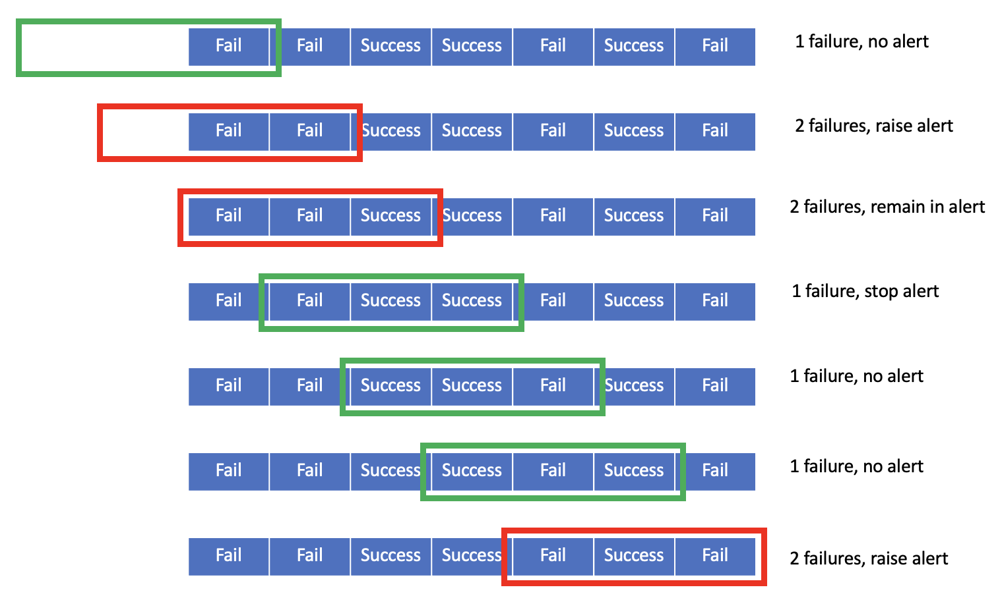

# View and edit alerts

The Model Dashboard displays alerts you configured in Amazon CloudWatch. You can modify the alert
criteria within the dashboard itself. The alert criteria depend upon two parameters:

- **Datapoints to alert**: Within the evaluation period, how many
  execution failures raise an alert.
- **Evaluation period**: The number of most recent monitoring
  executions to consider when evaluating alert status.
  The following image shows an example scenario of a series of Model Monitor executions in which
  we set a hypothetical **Evaluation period** of 3 and a **Datapoints
  to alert** value of 2. After every monitoring execution, the number of failures
  are counted within the **Evaluation period** of 3. If the number of
  failures meets or exceeds the **Datapoints to alert** value 2, the monitor
  raises an alert and remains in alert status until the number of failures within the
  **Evaluation period** becomes less than 2 in subsequent iterations. In the
  image, the evaluation windows are red when the monitor raises an alert or remains in alert
  status, and green otherwise.

Note that even if the evaluation window size has not reached the **Evaluation
period** of 3, as shown in the first 2 rows of the image, the monitor still
raises an alert if the number of failures meets or exceeds the **Datapoints to
alert** value of 2.

Within the monitor details page, you can view your alert history, edit existing alert
criteria, and view job reports to help you debug alert failures. For instructions about how
to view alert history or job reports for failed monitoring executions, see [View alert history or job reports](model-dashboard-alerts-view.md "model-dashboard-alerts-view.md"). For
instructions about how to edit alert criteria, see [Edit alert criteria](model-dashboard-alerts-edit.md "model-dashboard-alerts-edit.md").
