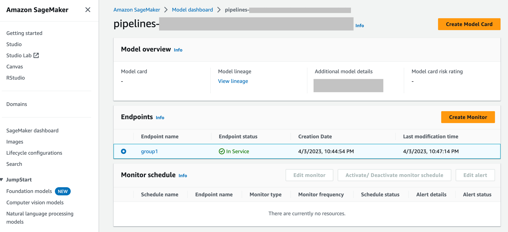

# Model Monitor FAQs

Refer to the following FAQs for more information about Amazon SageMaker Model Monitor.

**Q: How do Model Monitor and SageMaker Clarify help customers monitor model
behavior?**

Customers can monitor model behavior along four dimensions - [Data quality](model-monitor-data-quality.md "model-monitor-data-quality.md"), [Model
quality](model-monitor-model-quality.md "model-monitor-model-quality.md"), [Bias drift](clarify-model-monitor-bias-drift.md "clarify-model-monitor-bias-drift.md"), and
[Feature
Attribution drift](clarify-model-monitor-feature-attribution-drift.md "clarify-model-monitor-feature-attribution-drift.md") through Amazon SageMaker Model Monitor and SageMaker Clarify. [Model Monitor](https://aws.amazon.com/sagemaker/model-monitor/ "https://aws.amazon.com/sagemaker/model-monitor/") continuously monitors the quality of
Amazon SageMaker AI machine learning models in production. This includes monitoring drift in data
quality and model quality metrics such as accuracy and RMSE. [SageMaker Clarify](https://aws.amazon.com/sagemaker/clarify/?sagemaker-data-wrangler-whats-new.sort-by=item.additionalFields.postDateTime&sagemaker-data-wrangler-whats-new.sort-order=desc "https://aws.amazon.com/sagemaker/clarify/?sagemaker-data-wrangler-whats-new.sort-by=item.additionalFields.postDateTime&sagemaker-data-wrangler-whats-new.sort-order=desc") bias monitoring helps data scientists and ML engineers monitor bias in
model’s prediction and feature attribution drift.

**Q: What happens in the background when Sagemaker Model monitor is
enabled?**

Amazon SageMaker Model Monitor automates model monitoring alleviating the need to monitor the models manually or
building any additional tooling. In order to automate the process, Model Monitor provides you with
the ability to create a set of baseline statistics and constraints using the data with which
your model was trained, then set up a schedule to monitor the predictions made on your
endpoint. Model Monitor uses rules to detect drift in your models and alerts you when it happens.
The following steps describe what happens when you enable model monitoring:

- **Enable model monitoring**: For a real-time
  endpoint, you have to enable the endpoint to capture data from incoming requests to
  a deployed ML model and the resulting model predictions. For a batch transform job, enable data capture of the batch transform inputs
  and outputs.
- **Baseline processing job**: You then create a
  baseline from the dataset that was used to train the model. The baseline computes
  metrics and suggests constraints for the metrics. For example, the recall score for
  the model shouldn't regress and drop below 0.571, or the precision score shouldn't
  fall below 1.0. Real-time or batch predictions from your model are compared to the
  constraints and are reported as violations if they are outside the constrained
  values.
- **Monitoring job**: Then, you create a monitoring
  schedule specifying what data to collect, how often to collect it, how to analyze
  it, and which reports to produce.
- **Merge job**: This is only applicable if you are
  leveraging Amazon SageMaker Ground Truth. Model Monitor compares the predictions your model makes with Ground Truth
  labels to measure the quality of the model. For this to work, you periodically label
  data captured by your endpoint or batch transform job and upload it to Amazon S3.

After you create and upload the Ground Truth labels, include the location of the labels
as a parameter when you create the monitoring job.
When you use Model Monitor to monitor a batch transform job instead of a real-time endpoint,
instead of receiving requests to an endpoint and tracking the predictions, Model Monitor monitors
inference inputs and outputs. In a Model Monitor schedule, the customer provides the count and type
of instances that are to be used in the processing job. These resources remain reserved
until the schedule is deleted irrespective of the status of current execution.

**Q: What is Data Capture, why is it required, and how can I enable
it?**

In order to log the inputs to the model endpoint and the inference outputs from the
deployed model to Amazon S3, you can enable a feature called [Data Capture](model-monitor-data-capture.md "model-monitor-data-capture.md"). For more
details about how to enable it for a real-time endpoint and batch transform job, see [Capture data from real-time endpoint](model-monitor-data-capture-endpoint.md "model-monitor-data-capture-endpoint.md") and [Capture data from batch transform job](model-monitor-data-capture-batch.md "model-monitor-data-capture-batch.md").

**Q: Does enabling Data Capture impact the performance of a real-time
endpoint ?**

Data Capture happens asynchronously without impacting production traffic. After you have
enabled the data capture, then the request and response payload, along with some additional
meta data, is saved in the Amazon S3 location that you specified in the
`DataCaptureConfig`. Note that there can be a delay in the propagation of the
captured data to Amazon S3.

You can also view the captured data by listing the data capture files stored in Amazon S3. The
format of the Amazon S3 path is:
`s3:///{endpoint-name}/{variant-name}/yyyy/mm/dd/hh/filename.jsonl`. Amazon S3
Data Capture should be in the same region as the Model Monitor schedule. You should also ensure that
the column names for the baseline dataset only have lowercase letters and an underscore
(`_`) as the only separator.

**Q: Why is Ground Truth needed for model monitoring?**

Ground Truth labels are required by the following features of Model Monitor:

- **Model quality monitoring** compares the predictions
  your model makes with Ground Truth labels to measure the quality of the model.
- **Model bias monitoring** monitors predictions for
  bias. One way bias can be introduced in deployed ML models is when the data used in
  training differs from the data used to generate predictions. This is especially
  pronounced if the data used for training changes over time (such as fluctuating
  mortgage rates), and the model prediction is not as accurate unless the model is
  retrained with updated data. For example, a model for predicting home prices can be
  biased if the mortgage rates used to train the model differ from the most current
  real-world mortgage rate.
  **Q: For customers leveraging Ground Truth for labeling, what are the steps I
  can take to monitor the quality of the model?**

Model quality monitoring compares the predictions your model makes with Ground Truth labels to
measure the quality of the model. For this to work, you periodically label data captured by
your endpoint or batch transform job and upload it to Amazon S3. Besides captures, model bias
monitoring execution also requires Ground Truth data. In real use cases, Ground Truth data should be
regularly collected and uploaded to the designated Amazon S3 location. To match Ground Truth labels with
captured prediction data, there must be a unique identifier for each record in the dataset.
For the structure of each record for Ground Truth data, see [Ingest Ground Truth Labels and
Merge Them With Predictions](model-monitor-model-quality-merge.md "model-monitor-model-quality-merge.md").

The following code example can be used for generating artificial Ground Truth data for a tabular
dataset.

```
import random

def ground_truth_with_id(inference_id):
    random.seed(inference_id)  # to get consistent results
    rand = random.random()
    # format required by the merge container
    return {
        "groundTruthData": {
            "data": "1" if rand < 0.7 else "0",  # randomly generate positive labels 70% of the time
            "encoding": "CSV",
        },
        "eventMetadata": {
            "eventId": str(inference_id),
        },
        "eventVersion": "0",
    }


def upload_ground_truth(upload_time):
    records = [ground_truth_with_id(i) for i in range(test_dataset_size)]
    fake_records = [json.dumps(r) for r in records]
    data_to_upload = "\n".join(fake_records)
    target_s3_uri = f"{ground_truth_upload_path}/{upload_time:%Y/%m/%d/%H/%M%S}.jsonl"
    print(f"Uploading {len(fake_records)} records to", target_s3_uri)
    S3Uploader.upload_string_as_file_body(data_to_upload, target_s3_uri)
# Generate data for the last hour
upload_ground_truth(datetime.utcnow() - timedelta(hours=1))
# Generate data once a hour
def generate_fake_ground_truth(terminate_event):
    upload_ground_truth(datetime.utcnow())
    for _ in range(0, 60):
        time.sleep(60)
        if terminate_event.is_set():
            break


ground_truth_thread = WorkerThread(do_run=generate_fake_ground_truth)
ground_truth_thread.start()
```

The following code example shows how to generate artificial traffic to send to the model
endpoint. Notice the `inferenceId` attribute used above to invoke. If this is
present, it is used to join with Ground Truth data (otherwise, the `eventId` is
used).

```
import threading

class WorkerThread(threading.Thread):
    def __init__(self, do_run, *args, **kwargs):
        super(WorkerThread, self).__init__(*args, **kwargs)
        self.__do_run = do_run
        self.__terminate_event = threading.Event()

    def terminate(self):
        self.__terminate_event.set()

    def run(self):
        while not self.__terminate_event.is_set():
            self.__do_run(self.__terminate_event)
def invoke_endpoint(terminate_event):
    with open(test_dataset, "r") as f:
        i = 0
        for row in f:
            payload = row.rstrip("\n")
            response = sagemaker_runtime_client.invoke_endpoint(
                EndpointName=endpoint_name,
                ContentType="text/csv",
                Body=payload,
                InferenceId=str(i),  # unique ID per row
            )
            i += 1
            response["Body"].read()
            time.sleep(1)
            if terminate_event.is_set():
                break


# Keep invoking the endpoint with test data
invoke_endpoint_thread = WorkerThread(do_run=invoke_endpoint)
invoke_endpoint_thread.start()
```

You must upload Ground Truth data to an Amazon S3 bucket that has the same path format as captured
data, which is in the following format:
`s3://<bucket>/<prefix>/yyyy/mm/dd/hh`

###### Note

The date in this path is the date when the Ground Truth label is collected. It doesn't have
to match the date when the inference was generated.

**Q: How can customers customize monitoring
schedules?**

In addition to using the built-in monitoring mechanisms, you can create your own custom
monitoring schedules and procedures using pre-processing and post-processing scripts, or by
using or building your own container. It's important to note that pre-processing and
post-processing scripts only work with data and model quality jobs.

Amazon SageMaker AI provides the capability for you to monitor and evaluate the data observed by the
model endpoints. For this, you have to create a baseline with which you compare the
real-time traffic. After a baseline is ready, set up a schedule to continuously evaluate and
compare against the baseline. While creating a schedule, you can provide the pre-processing
and post-processing script.

The following example shows how you can customize monitoring schedules with pre-processing
and post-processing scripts.

```
import boto3, osfrom sagemaker import get_execution_role, Sessionfrom sagemaker.model_monitor import CronExpressionGenerator, DefaultModelMonitor
# Upload pre and postprocessor scripts
session = Session()
bucket = boto3.Session().resource("s3").Bucket(session.default_bucket())
prefix = "demo-sagemaker-model-monitor"
pre_processor_script = bucket.Object(os.path.join(prefix, "preprocessor.py")).upload_file("preprocessor.py")
post_processor_script = bucket.Object(os.path.join(prefix, "postprocessor.py")).upload_file("postprocessor.py")
# Get execution role
role = get_execution_role() # can be an empty string
# Instance type
instance_type = "instance-type"
# instance_type = "ml.m5.xlarge" # Example
# Create a monitoring schedule with pre and post-processing
my_default_monitor = DefaultModelMonitor(
    role=role,
    instance_count=1,
    instance_type=instance_type,
    volume_size_in_gb=20,
    max_runtime_in_seconds=3600,
)

s3_report_path = "s3://{}/{}".format(bucket, "reports")
monitor_schedule_name = "monitor-schedule-name"
endpoint_name = "endpoint-name"
my_default_monitor.create_monitoring_schedule(
    post_analytics_processor_script=post_processor_script,
    record_preprocessor_script=pre_processor_script,
    monitor_schedule_name=monitor_schedule_name,
    # use endpoint_input for real-time endpoint
    endpoint_input=endpoint_name,
    # or use batch_transform_input for batch transform jobs
# batch_transform_input=batch_transform_name,
    output_s3_uri=s3_report_path,
    statistics=my_default_monitor.baseline_statistics(),
    constraints=my_default_monitor.suggested_constraints(),
    schedule_cron_expression=CronExpressionGenerator.hourly(),
    enable_cloudwatch_metrics=True,
)
```

**Q: What are some of the scenarios or use cases where I can leverage
a pre-processing script?**

You can use pre-processing scripts when you need to transform the inputs to your model
monitor. Consider the following example scenarios:

1. Pre-processing script for data transformation.

Suppose the output of your model is an array: `[1.0, 2.1]`. The Model Monitor
container only works with tabular or flattened JSON structures, such as
`{“prediction0”: 1.0, “prediction1” : 2.1}`. You could use a
pre-processing script like the following example to transform the array into the
correct JSON structure.

```
def preprocess_handler(inference_record):
    input_data = inference_record.endpoint_input.data
    output_data = inference_record.endpoint_output.data.rstrip("\n")
    data = output_data + "," + input_data
    return { str(i).zfill(20) : d for i, d in enumerate(data.split(",")) }
```

2. Exclude certain records from Model Monitor's metric calculations.

Suppose your model has optional features and you use `-1` to denote
that the optional feature has a missing value. If you have a data quality monitor,
you may want to remove the `-1` from the input value array so that it
isn't included in the monitor's metric calculations. You could use a script like the
following to remove those values.

```
def preprocess_handler(inference_record):
    input_data = inference_record.endpoint_input.data
    return {i : None if x == -1 else x for i, x in enumerate(input_data.split(","))}
```

3. Apply a custom sampling strategy.

You can also apply a custom sampling strategy in your pre-processing script. To do
this, configure Model Monitor's first-party, pre-built container to ignore a percentage of
the records according to your specified sampling rate. In the following example, the
handler samples 10% of the records by returning the record in 10% of handler calls
and an empty list otherwise.

```
import random

def preprocess_handler(inference_record):
    # we set up a sampling rate of 0.1
    if random.random() > 0.1:
        # return an empty list
        return []
    input_data = inference_record.endpoint_input.data
    return {i : None if x == -1 else x for i, x in enumerate(input_data.split(","))}
```

4. Use custom logging.

You can log any information you need from your script to Amazon CloudWatch. This can be
useful when debugging your pre-processing script in case of an error. The following
example shows how you can use the `preprocess_handler` interface to log
to CloudWatch.

```

def preprocess_handler(inference_record, logger):
    logger.info(f"I'm a processing record: {inference_record}")
    logger.debug(f"I'm debugging a processing record: {inference_record}")
    logger.warning(f"I'm processing record with missing value: {inference_record}")
    logger.error(f"I'm a processing record with bad value: {inference_record}")
    return inference_record
```

###### Note

When the pre-processing script is run on batch transform data, the input type is not
always the `CapturedData` object. For CSV data, the type is a string. For
JSON data, the type is a Python dictionary.

**Q: When can I leverage a post-processing script?**

You can leverage a post-processing script as an extension following a successful
monitoring run. The following is a simple example, but you can perform or call any business
function that you need to perform after a successful monitoring run.

```
def postprocess_handler():
    print("Hello from the post-processing script!")

```

**Q: When should I consider bringing my own container for model
monitoring?**

SageMaker AI provides a pre-built container for analyzing data captured from endpoints or batch
transform jobs for tabular datasets. However, there are scenarios where you might want to
create your own container. Consider the following scenarios:

- You have regulatory and compliance requirements to only use the containers that
  are created and maintained internally in your organization.
- If you want to include a few third-party libraries, you can place a
  `requirements.txt` file in a local directory and reference it using
  the `source_dir` parameter in the [SageMaker AI estimator](https://sagemaker.readthedocs.io/en/stable/api/training/estimators.html#sagemaker.estimator.Estimator "https://sagemaker.readthedocs.io/en/stable/api/training/estimators.html#sagemaker.estimator.Estimator"), which enables library installation at run-time.
  However, if you have lots of libraries or dependencies that increase the
  installation time while running the training job, you might want to leverage
  BYOC.
- Your environment forces no internet connectivity (or Silo), which prevents package
  download.
- You want to monitor data that's in data formats other than tabular, such as NLP or
  CV use cases.
- When you require additional monitoring metrics than the ones supported by
  Model Monitor.
  **Q: I have NLP and CV models. How do I monitor them for data
  drift?**

Amazon SageMaker AI's prebuilt container supports tabular datasets. If you want to monitor NLP and CV
models, you can bring your own container by leveraging the extension points provided by
Model Monitor. For more details about the requirements, see [Bring your own
containers](model-monitor-byoc-containers.md "model-monitor-byoc-containers.md"). Some of the following are more examples:

- For a detailed explanation of how to use Model Monitor for a computer vision use case, see
  [Detecting and Analyzing incorrect predictions](https://aws.amazon.com/blogs/machine-learning/detecting-and-analyzing-incorrect-model-predictions-with-amazon-sagemaker-model-monitor-and-debugger/ "https://aws.amazon.com/blogs/machine-learning/detecting-and-analyzing-incorrect-model-predictions-with-amazon-sagemaker-model-monitor-and-debugger/").
- For a scenario where Model Monitor can be leveraged for a NLP use case, see [Detect NLP data drift using custom Amazon SageMaker Model Monitor](https://aws.amazon.com/blogs/machine-learning/detect-nlp-data-drift-using-custom-amazon-sagemaker-model-monitor/ "https://aws.amazon.com/blogs/machine-learning/detect-nlp-data-drift-using-custom-amazon-sagemaker-model-monitor/").
  **Q: I want to delete the model endpoint for which Model Monitor was enabled,
  but I'm unable to do so since the monitoring schedule is still active. What should I
  do?**

If you want to delete an inference endpoint hosted in SageMaker AI which has Model Monitor enabled, first
you must delete the model monitoring schedule (with the
`DeleteMonitoringSchedule`
[CLI](../../../cli/latest/reference/sagemaker/delete-monitoring-schedule.md "../../../cli/latest/reference/sagemaker/delete-monitoring-schedule.md") or
[API](../APIReference/API_DeleteMonitoringSchedule.md "../APIReference/API_DeleteMonitoringSchedule.md")).
Then, delete the endpoint.

**Q: Does SageMaker Model Monitor calculate metrics and statistics for
input?**

Model Monitor calculates metrics and statistics for output, not input.

**Q: Does SageMaker Model Monitor support multi-model endpoints?**

No, Model Monitor only supports endpoints that host a single model and doesn't support monitoring
multi-model endpoints.

**Q: Does SageMaker Model Monitor provide monitoring data about individual
containers in an inference pipeline?**

Model Monitor supports monitoring inference pipelines, but capturing and analyzing data is done
for the entire pipeline, not for individual containers in the pipeline.

**Q: What can I do to prevent impact to inference requests when data
capture is set up?**

To prevent impact to inference requests, Data Capture stops capturing requests at high
levels of disk usage. It is recommended you keep your disk utilization below 75% in order to
ensure data capture continues capturing requests.

**Q: Can Amazon S3 Data Capture be in a different AWS region than the
region in which the monitoring schedule was set up?**

No, Amazon S3 Data Capture must be in the same region as the monitoring schedule.

**Q: What is a baseline, and how do I create one? Can I create a
custom baseline?**

A baseline is used as a reference to compare real-time or batch predictions from the
model. It computes statistics and metrics along with constraints on them. During monitoring,
all of these are used in conjunction to identify violations.

To use the default solution of Amazon SageMaker Model Monitor, you can leverage the [Amazon SageMaker Python SDK](https://sagemaker.readthedocs.io/en/stable/api/inference/model_monitor.html "https://sagemaker.readthedocs.io/en/stable/api/inference/model_monitor.html"). Specifically, use the [suggest_baseline](https://sagemaker.readthedocs.io/en/stable/api/inference/model_monitor.html#sagemaker.model_monitor.model_monitoring.DefaultModelMonitor.suggest_baseline "https://sagemaker.readthedocs.io/en/stable/api/inference/model_monitor.html#sagemaker.model_monitor.model_monitoring.DefaultModelMonitor.suggest_baseline") method of the [ModelMonitor](https://sagemaker.readthedocs.io/en/stable/api/inference/model_monitor.html#sagemaker.model_monitor.model_monitoring.DefaultModelMonitor "https://sagemaker.readthedocs.io/en/stable/api/inference/model_monitor.html#sagemaker.model_monitor.model_monitoring.DefaultModelMonitor") or the [ModelQualityMonitor](https://sagemaker.readthedocs.io/en/stable/api/inference/model_monitor.html#sagemaker.model_monitor.model_monitoring.ModelQualityMonitor "https://sagemaker.readthedocs.io/en/stable/api/inference/model_monitor.html#sagemaker.model_monitor.model_monitoring.ModelQualityMonitor") class to trigger a processing job that computes the metrics
and constraints for the baseline.

The result of a baseline job are two files: `statistics.json` and
`constraints.json`. [Schema for
statistics](model-monitor-byoc-statistics.md "model-monitor-byoc-statistics.md") and [schema for
constraints](model-monitor-byoc-constraints.md "model-monitor-byoc-constraints.md") contain the schema of the respective files. You can review the
generated constraints and modify them before using them for monitoring. Based on your
understanding of the domain and business problem, you can make a constraint more aggressive,
or relax it to control the number and nature of the violations.

**Q: What are the guidelines to create a baseline
dataset?**

The primary requirement for any kind of monitoring is to have a baseline dataset that is
used to compute metrics and constraints. Typically, this is the training dataset used by the
model, but in some cases you might choose to use some other reference dataset.

The column names of the baseline dataset should be compatible with Spark. In order to
maintain the maximum compatibility between Spark, CSV, JSON and parquet it is advisable to
use only lowercase letters, and only use `_` as the separator. Special characters
including `“ ”` can cause issues.

**Q: What are the `StartTimeOffset` and
`EndTimeOffset` parameters, and when are they used?**

When Amazon SageMaker Ground Truth is required for monitoring jobs like model quality, you need to ensure that
a monitoring job only uses data for which Ground Truth is available. The
`start_time_offset` and `end_time_offset` parameters of [EndpointInput](https://sagemaker.readthedocs.io/en/stable/api/inference/model_monitor.html#sagemaker.model_monitor.model_monitoring.EndpointInput "https://sagemaker.readthedocs.io/en/stable/api/inference/model_monitor.html#sagemaker.model_monitor.model_monitoring.EndpointInput") can be used to select the data that the monitoring job uses. The
monitoring job uses the data in the time window that is defined by
`start_time_offset` and `end_time_offset`. These parameters need
to be specified in the [ISO
8601 duration format](https://en.wikipedia.org/wiki/ISO_8601#Durations "https://en.wikipedia.org/wiki/ISO_8601#Durations"). The following are some examples:

- If your Ground Truth results arrive 3 days after the predictions have been made, set
  `start_time_offset="-P3D"` and `end_time_offset="-P1D"`,
  which is 3 days and 1 day respectively.
- If the Ground Truth results arrive 6 hours after the predictions and you have an hourly
  schedule, set `start_time_offset="-PT6H"` and
  `end_time_offset="-PT1H"`, which is 6 hours and 1 hour.
  **Q: Can I run ‘on demand' monitoring jobs?**

Yes, you can run ‘on demand’ monitoring jobs by running a SageMaker Processing job. For Batch
Transform, [Pipelines](pipelines-overview.md "pipelines-overview.md") has a [MonitorBatchTransformStep](https://sagemaker.readthedocs.io/en/stable/workflows/pipelines/sagemaker.workflow.pipelines.html#sagemaker.workflow.monitor_batch_transform_step.MonitorBatchTransformStep "https://sagemaker.readthedocs.io/en/stable/workflows/pipelines/sagemaker.workflow.pipelines.html#sagemaker.workflow.monitor_batch_transform_step.MonitorBatchTransformStep") that you can use to create a SageMaker AI pipeline that runs
monitoring jobs on demand. The SageMaker AI examples repository has code samples for running [data quality](https://github.com/aws/amazon-sagemaker-examples/blob/main/sagemaker_model_monitor/model_monitor_batch_transform/SageMaker-ModelMonitoring-Batch-Transform-Data-Quality-With-SageMaker-Pipelines-On-Demand.ipynb "https://github.com/aws/amazon-sagemaker-examples/blob/main/sagemaker_model_monitor/model_monitor_batch_transform/SageMaker-ModelMonitoring-Batch-Transform-Data-Quality-With-SageMaker-Pipelines-On-Demand.ipynb") and [model quality](https://github.com/aws/amazon-sagemaker-examples/blob/main/sagemaker_model_monitor/model_monitor_batch_transform/SageMaker-ModelMonitoring-Batch-Transform-Model-Quality-With-SageMaker-Pipelines-On-Demand.ipynb "https://github.com/aws/amazon-sagemaker-examples/blob/main/sagemaker_model_monitor/model_monitor_batch_transform/SageMaker-ModelMonitoring-Batch-Transform-Model-Quality-With-SageMaker-Pipelines-On-Demand.ipynb") monitoring jobs on demand.

**Q: How do I set up Model Monitor?**

You can set up Model Monitor in the following ways:

- **[Amazon SageMaker AI Python
  SDK](https://sagemaker.readthedocs.io/en/stable/index.html "https://sagemaker.readthedocs.io/en/stable/index.html")** – There is a [Model Monitor module](https://sagemaker.readthedocs.io/en/stable/api/inference/model_monitor.html "https://sagemaker.readthedocs.io/en/stable/api/inference/model_monitor.html") which contains classes and functions that assist in
  suggesting baselines, creating monitoring schedules, and more. See the [Amazon SageMaker Model Monitor notebook examples](https://github.com/aws/amazon-sagemaker-examples/tree/main/sagemaker_model_monitor "https://github.com/aws/amazon-sagemaker-examples/tree/main/sagemaker_model_monitor") for detailed notebooks that leverage the SageMaker AI
  Python SDK for setting up Model Monitor.
- **[Pipelines](pipelines-overview.md "pipelines-overview.md")**
  – Pipelines are integrated with Model Monitor through the [QualityCheck Step](build-and-manage-steps.md#step-type-quality-check "build-and-manage-steps.md#step-type-quality-check") and [ClarifyCheckStep](build-and-manage-steps.md#step-type-clarify-check "build-and-manage-steps.md#step-type-clarify-check") APIs. You can create a SageMaker AI pipeline that contains
  these steps and that can be used to run monitoring jobs on demand whenever the
  pipeline is executed.
- **[Amazon SageMaker Studio Classic](studio.md "studio.md")**
  – You can create a data or model quality monitoring schedule along with model
  bias and explainability schedules directly from the UI by selecting an endpoint from
  the list of deployed model endpoints. Schedules for other types of monitoring can be
  created by selecting the relevant tab in the UI.
- **[SageMaker Model Dashboard](model-dashboard.md "model-dashboard.md")**
  – You can enable monitoring on endpoints by selecting a model that has been
  deployed to an endpoint. In the following screenshot of the SageMaker AI console, a model
  named `group1` has been selected from the **Models**
  section of the **Model dashboard**. On this page, you can create a
  monitoring schedule, and you can edit, activate or deactivate existing monitoring
  schedules and alerts. For a step by step guide on how to view alerts and model
  monitor schedules, see [View Model Monitor schedules and
  alerts](model-dashboard-schedule.md "model-dashboard-schedule.md").


**Q: How does Model Monitor Integrate with SageMaker Model Dashboard**

[SageMaker Model Dashboard](model-dashboard.md "model-dashboard.md")
gives you unified monitoring across all your models by providing automated alerts about
deviations from expected behavior and troubleshooting to inspect models and analyze factors
impacting model performance over time.
