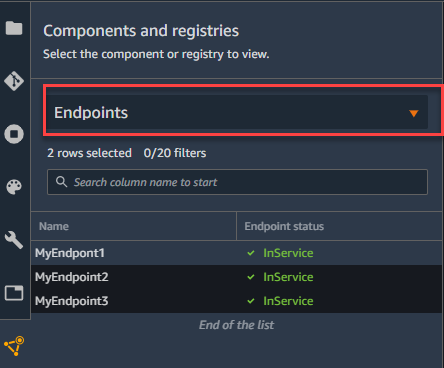
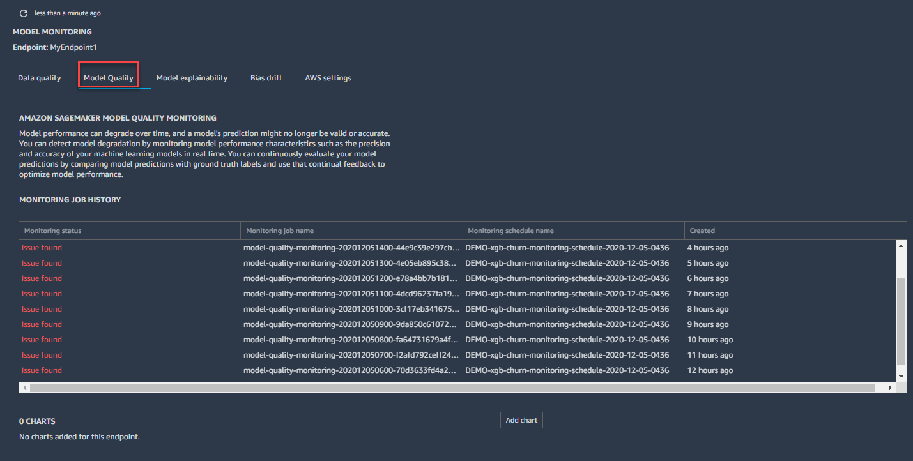
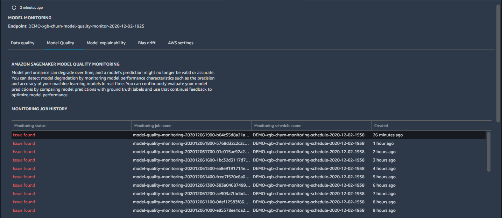
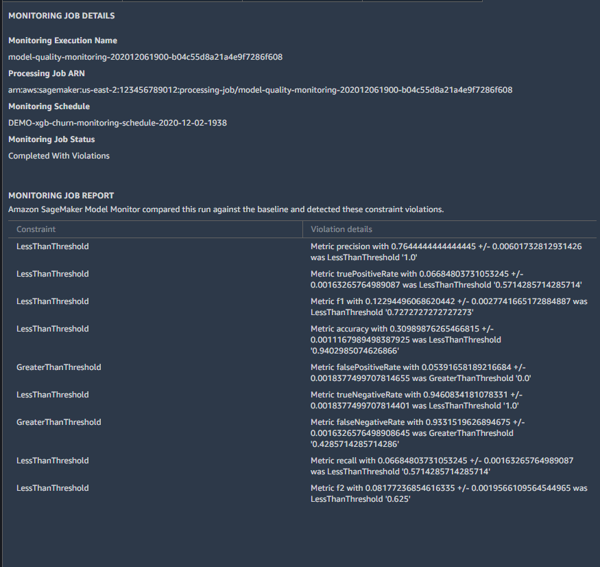
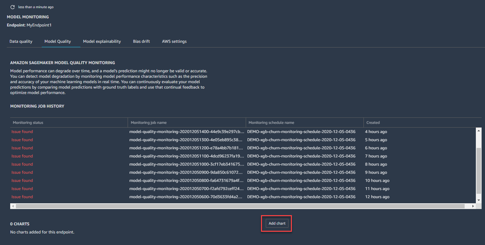
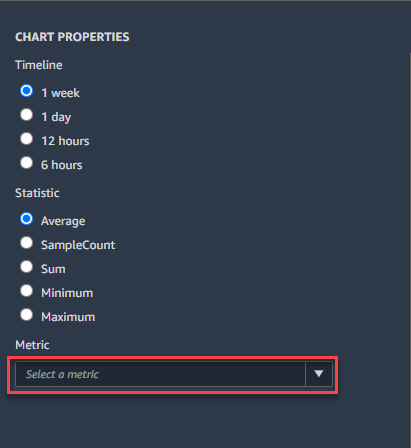
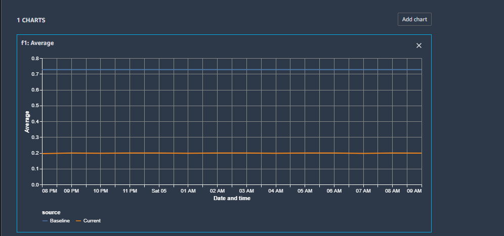

# Visualize results for

real-time endpoints in Amazon SageMaker Studio

If you are monitoring a real-time endpoint, you can also visualize the results in
Amazon SageMaker Studio. You can view the details of any monitoring job run, and you can create
charts that show the baseline and captured values for any metric that the monitoring job
calculates.

###### To view the detailed results of a monitoring job

1. Sign in to Studio. For more information, see [Amazon SageMaker AI domain overview](gs-studio-onboard.md "gs-studio-onboard.md").
2. In the left navigation pane, choose the **Components and
   registries** icon (
   
   ).
3. Choose **Endpoints** in the drop-down menu.

 4. On the endpoint tab, choose the monitoring type for which you want to see job
details.

 5. Choose the name of the monitoring job run for which you want to view details
from the list of monitoring jobs.

 6. The **MONITORING JOB DETAILS** tab opens with a detailed
report of the monitoring job.

You can create a chart that displays the baseline and captured metrics for a time
period.

###### To create a chart in SageMaker Studio to visualize monitoring results

1. Sign in to Studio. For more information, see [Amazon SageMaker AI domain overview](gs-studio-onboard.md "gs-studio-onboard.md").
2. In the left navigation pane, choose the **Components and
   registries** icon (
   
   ).
3. Choose **Endpoints** in the drop-down menu.

 4. On the **Endpoint** tab, choose the monitoring type you want
to create a chart for. This example shows a chart for the
**Model
quality** monitoring type.

 5. Choose **Add chart**.

 6. On the **CHART PROPERTIES** tab, choose the time period,
statistic, and metric that you want to chart. This example shows a chart for a
**Timeline** of **1 week**, the
**Average**
**Statistic** of, and the **F1**
**Metric**.

 7. The chart that shows the baseline and current metric statistic you chose in
the previous step shows up in the **Endpoint** tab.

