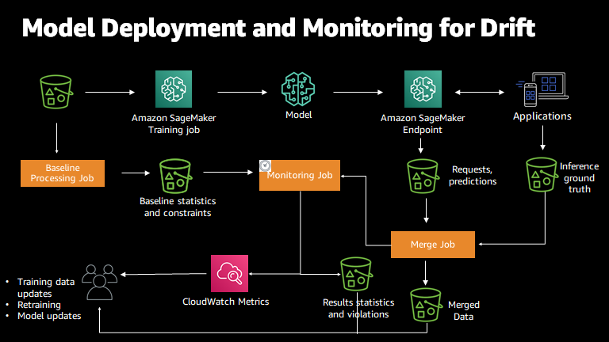
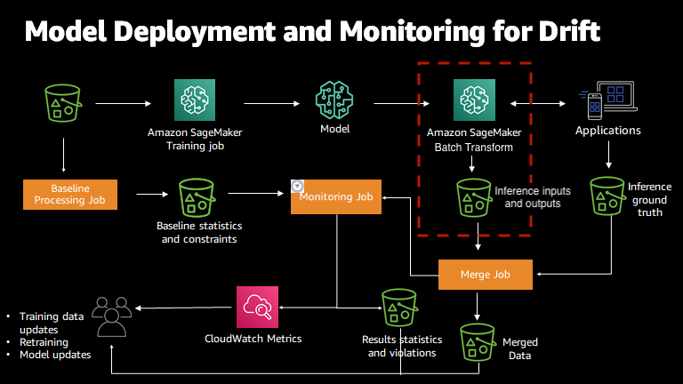

# Data and model quality monitoring with Amazon SageMaker Model Monitor

Amazon SageMaker Model Monitor monitors the quality of Amazon SageMaker AI machine learning models in production. With Model Monitor,
you can set up:

- Continuous monitoring with a real-time endpoint.
- Continuous monitoring with a batch transform job that runs regularly.
- On-schedule monitoring for asynchronous batch transform jobs.
  With Model Monitor, you can set alerts that notify you when there are deviations in the model
  quality. Early and proactive detection of these deviations lets you to take corrective
  actions. You can take actions like retraining models, auditing upstream systems, or fixing
  quality issues without having to monitor models manually or build additional tooling. You
  can use Model Monitor prebuilt monitoring capabilities that do not require coding. You also have the
  flexibility to monitor models by coding to provide custom analysis.

Model Monitor provides the following types of monitoring:

- [Data quality](model-monitor-data-quality.md "model-monitor-data-quality.md") - Monitor drift in data
  quality.
- [Model quality](model-monitor-model-quality.md "model-monitor-model-quality.md") - Monitor drift in model quality
  metrics, such as accuracy.
- [Bias drift for models in
  production](clarify-model-monitor-bias-drift.md "clarify-model-monitor-bias-drift.md") - Monitor bias in your
  model's predictions.
- [Feature
  attribution drift for models in production](clarify-model-monitor-feature-attribution-drift.md "clarify-model-monitor-feature-attribution-drift.md") - Monitor
  drift in feature attribution.

###### Topics

- [Monitoring a Model in Production](how-it-works-model-monitor.md "how-it-works-model-monitor.md")
- [How Amazon SageMaker Model Monitor works](#model-monitor-how-it-works "#model-monitor-how-it-works")
- [Data capture](model-monitor-data-capture.md "model-monitor-data-capture.md")
- [Data quality](model-monitor-data-quality.md "model-monitor-data-quality.md")
- [Model quality](model-monitor-model-quality.md "model-monitor-model-quality.md")
- [Bias drift for models in
  production](clarify-model-monitor-bias-drift.md "clarify-model-monitor-bias-drift.md")
- [Feature
  attribution drift for models in production](clarify-model-monitor-feature-attribution-drift.md "clarify-model-monitor-feature-attribution-drift.md")
- [Schedule monitoring jobs](model-monitor-scheduling.md "model-monitor-scheduling.md")
- [Amazon SageMaker Model Monitor prebuilt container](model-monitor-pre-built-container.md "model-monitor-pre-built-container.md")
- [Interpret results](model-monitor-interpreting-results.md "model-monitor-interpreting-results.md")
- [Visualize results for
  real-time endpoints in Amazon SageMaker Studio](model-monitor-interpreting-visualize-results.md "model-monitor-interpreting-visualize-results.md")
- [Advanced topics](model-monitor-advanced-topics.md "model-monitor-advanced-topics.md")
- [Model Monitor FAQs](model-monitor-faqs.md "model-monitor-faqs.md")

## How Amazon SageMaker Model Monitor works

Amazon SageMaker Model Monitor automatically monitors machine learning (ML) models in production and notifies
you when quality issues happen. Model Monitor uses rules to detect drift in your models and alerts
you when it happens. The following figure shows how this process works in the case that your
model is deployed to a real-time endpoint.

You can also use Model Monitor to monitor a batch transform job instead of a real-time
endpoint. In this case, instead of receiving requests to an endpoint and tracking the
predictions, Model Monitor monitors inference inputs and outputs. The following figure diagrams the
process of monitoring a batch transform job.

To enable model monitoring, take the following steps. These steps follow the path of
the data through the various data collection, monitoring, and analysis processes.

- For a real-time endpoint, enable the endpoint to capture data from incoming
  requests to a trained ML model and the resulting model predictions.
- For a batch transform job, enable data capture of the batch transform inputs
  and outputs.
- Create a baseline from the dataset that was used to train the model. The
  baseline computes metrics and suggests constraints for the metrics. Real-time or
  batch predictions from your model are compared to the constraints. They are reported
  as violations if they are outside the constrained values.
- Create a monitoring schedule specifying what data to collect, how often to
  collect it, how to analyze it, and which reports to produce.
- Inspect the reports, which compare the latest data with the baseline. Watch
  for any violations reported, metrics, and notifications from Amazon CloudWatch.

###### Notes

- Model Monitor computes model metrics and statistics on tabular data only. For
  example, an image classification model that takes images as input and
  outputs a label based on that image can still be monitored. Model Monitor would be
  able to calculate metrics and statistics for the output, not the
  input.
- Model Monitor currently supports only endpoints that host a single model and does
  not support monitoring multi-model endpoints. For information on using
  multi-model endpoints, see [Multi-model endpoints](multi-model-endpoints.md "multi-model-endpoints.md").
- Model Monitor supports monitoring inference pipelines. However, capturing and
  analyzing data is done for the entire pipeline, not for individual containers in
  the pipeline.
- To prevent impact to inference requests, Data Capture stops capturing
  requests at high levels of disk usage. We recommended that you keep your disk
  utilization below 75% to ensure data capture continues capturing
  requests.
- If you launch SageMaker Studio in a custom Amazon VPC, you must create VPC endpoints
  to let Model Monitor communicate with Amazon S3 and CloudWatch. For information about VPC
  endpoints, see [VPC endpoints](../../../vpc/latest/privatelink/concepts.md "../../../vpc/latest/privatelink/concepts.md") in the
  _Amazon Virtual Private Cloud User Guide_. For information about launching
  SageMaker Studio in a custom VPC, see [Connect Studio notebooks in
  a VPC to external resources](studio-notebooks-and-internet-access.md "studio-notebooks-and-internet-access.md").

### Model Monitor sample notebooks

For a sample notebook that takes you through the end-to-end workflow using Model Monitor
with your real-time endpoint, see [Introduction to Amazon SageMaker Model Monitor](https://sagemaker-examples.readthedocs.io/en/latest/sagemaker_model_monitor/introduction/SageMaker-ModelMonitoring.html "https://sagemaker-examples.readthedocs.io/en/latest/sagemaker_model_monitor/introduction/SageMaker-ModelMonitoring.html").

For a sample notebook that visualizes the statistics.json file for a selected
execution in a monitoring schedule, see the [Model Monitor Visualization](https://sagemaker-examples.readthedocs.io/en/latest/sagemaker_model_monitor/visualization/SageMaker-Model-Monitor-Visualize.html "https://sagemaker-examples.readthedocs.io/en/latest/sagemaker_model_monitor/visualization/SageMaker-Model-Monitor-Visualize.html").

For instructions about how to create and access Jupyter notebook instances that
you can use to run the example in SageMaker AI, see [Amazon SageMaker notebook instances](nbi.md "nbi.md").
After you have created a notebook instance and opened it, choose the **SageMaker AI Examples** tab to see a list of all the SageMaker AI samples. To
open a notebook, choose the notebook's **Use** tab and
choose **Create copy**.
