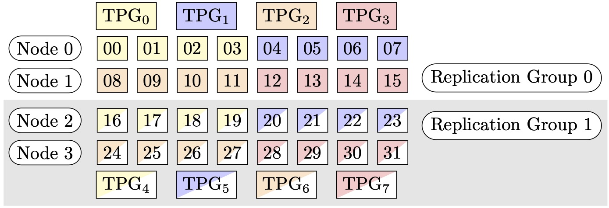
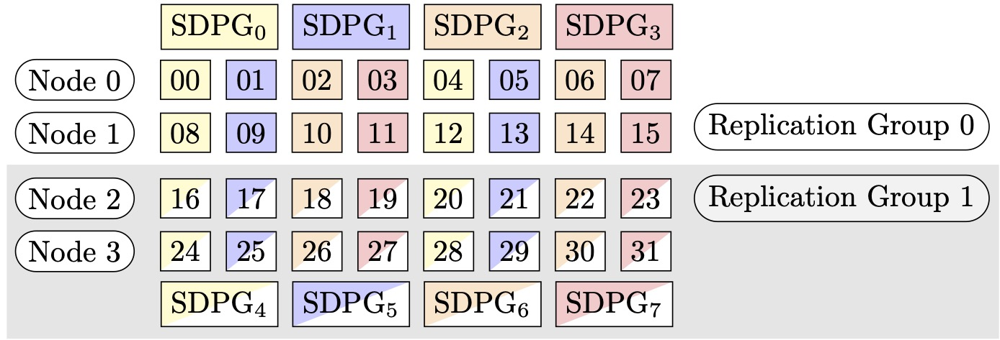

# Sharded Data Parallelism

_Sharded data parallelism_ is a memory-saving
distributed training technique that splits the state of a model (model parameters,
gradients, and optimizer states) across GPUs in a data parallel group.

###### Note

Sharded data parallelism is available for PyTorch in the SageMaker model parallelism
library v1.11.0 and later.

When scaling up your training job to a large GPU cluster, you can reduce the per-GPU
memory footprint of the model by sharding the training state of the model over multiple
GPUs. This returns two benefits: you can fit larger models, which would otherwise run
out of memory with standard data parallelism, or you can increase the batch size using
the freed-up GPU memory.

The standard data parallelism technique replicates the training states across the GPUs
in the data parallel group, and performs gradient aggregation based on the
`AllReduce` operation. Sharded data parallelism modifies the standard
data-parallel distributed training procedure to account for the sharded nature of the
optimizer states. A group of ranks over which the model and optimizer states are sharded
is called a _sharding group_. The sharded data
parallelism technique shards the trainable parameters of a model and corresponding
gradients and optimizer states across the GPUs in the _sharding
group_.

SageMaker AI achieves sharded data parallelism through the implementation of MiCS, which is
discussed in the AWS blog post [Near-linear scaling of gigantic-model training on AWS](https://www.amazon.science/blog/near-linear-scaling-of-gigantic-model-training-on-aws "https://www.amazon.science/blog/near-linear-scaling-of-gigantic-model-training-on-aws"). In this
implementation, you can set the sharding degree as a configurable parameter, which must
be less than the data parallelism degree. During each forward and backward pass, MiCS
temporarily recombines the model parameters in all GPUs through the
`AllGather` operation. After the forward or backward pass of each layer,
MiCS shards the parameters again to save GPU memory. During the backward pass, MiCS
reduces gradients and simultaneously shards them across GPUs through the
`ReduceScatter` operation. Finally, MiCS applies the local reduced and
sharded gradients to their corresponding local parameter shards, using the local shards
of optimizer states. To bring down communication overhead, the SageMaker model parallelism
library prefetches the upcoming layers in the forward or backward pass, and overlaps the
network communication with the computation.

The training state of the model is replicated across the sharding groups. This means
that before gradients are applied to the parameters, the `AllReduce`
operation must take place across the sharding groups, in addition to the
`ReduceScatter` operation that takes place within the sharding
group.

In effect, sharded data parallelism introduces a tradeoff between the communication
overhead and GPU memory efficiency. Using sharded data parallelism increases the
communication cost, but the memory footprint per GPU (excluding the memory usage due to
activations) is divided by the sharded data parallelism degree, thus larger models can
be fit in the GPU cluster.

**Selecting the degree of sharded data
parallelism**

When you select a value for the degree of sharded data parallelism, the value must
evenly divide the degree of data parallelism. For example, for an 8-way data parallelism
job, choose 2, 4, or 8 for the sharded data parallelism degree. While choosing the
sharded data parallelism degree, we recommend that you start with a small number, and
gradually increase it until the model fits in the memory together with the desired batch
size.

**Selecting the batch size**

After setting up sharded data parallelism, make sure you find the most optimal
training configuration that can successfully run on the GPU cluster. For training large
language models (LLM), start from the batch size 1, and gradually increase it until you
reach the point to receive the out-of-memory (OOM) error. If you encounter the OOM error
even with the smallest batch size, apply a higher degree of sharded data parallelism or
a combination of sharded data parallelism and tensor parallelism.

###### Topics

- [How to apply sharded data parallelism to your training job](#model-parallel-extended-features-pytorch-sharded-data-parallelism-how-to-use "#model-parallel-extended-features-pytorch-sharded-data-parallelism-how-to-use")
- [Reference configurations](#model-parallel-extended-features-pytorch-sharded-data-parallelism-how-to-use-config-sample "#model-parallel-extended-features-pytorch-sharded-data-parallelism-how-to-use-config-sample")
- [Sharded data parallelism with SMDDP Collectives](#model-parallel-extended-features-pytorch-sharded-data-parallelism-smddp-collectives "#model-parallel-extended-features-pytorch-sharded-data-parallelism-smddp-collectives")
- [Mixed precision training with sharded data parallelism](#model-parallel-extended-features-pytorch-sharded-data-parallelism-16bits-training "#model-parallel-extended-features-pytorch-sharded-data-parallelism-16bits-training")
- [Sharded data parallelism with tensor parallelism](#model-parallel-extended-features-pytorch-sharded-data-parallelism-with-tensor-parallelism "#model-parallel-extended-features-pytorch-sharded-data-parallelism-with-tensor-parallelism")
- [Tips and considerations for using sharded data parallelism](#model-parallel-extended-features-pytorch-sharded-data-parallelism-considerations "#model-parallel-extended-features-pytorch-sharded-data-parallelism-considerations")

## How to apply sharded data parallelism to your training job

To get started with sharded data parallelism, apply required modifications to your
training script, and set up the SageMaker PyTorch estimator with the
sharded-data-parallelism-specific parameters. Also consider to take reference values
and example notebooks as a starting point.

### Adapt your PyTorch training script

Follow the instructions at [Step 1: Modify a
PyTorch Training Script](model-parallel-customize-training-script-pt.md "model-parallel-customize-training-script-pt.md") to wrap the model and optimizer objects with
the `smdistributed.modelparallel.torch` wrappers of the
`torch.nn.parallel` and `torch.distributed`
modules.

**(Optional) Additional modification to register external
model parameters**

If your model is built with `torch.nn.Module` and uses parameters
that is not defined within the module class, you should register them to the
module manually for SMP to gather the full parameters while . To register
parameters to a module, use
`smp.register_parameter(module,
 parameter)`.

```
class Module(torch.nn.Module):
    def __init__(self, *args):
        super().__init__(self, *args)
        self.layer1 = Layer1()
        self.layer2 = Layer2()
        **smp.register\_parameter(self, self.layer1.weight)**

    def forward(self, input):
        x = self.layer1(input)
        # self.layer1.weight is required by self.layer2.forward
        y = self.layer2(x, self.layer1.weight)
        return y
```

### Set up the SageMaker PyTorch estimator

When configuring a SageMaker PyTorch estimator in [Step 2: Launch a Training Job Using the SageMaker
Python SDK](model-parallel-sm-sdk.md "model-parallel-sm-sdk.md"), add the parameters for sharded data
parallelism.

To turn on sharded data parallelism, add the
`sharded_data_parallel_degree` parameter to the SageMaker PyTorch
Estimator. This parameter specifies the number of GPUs over which the training
state is sharded. The value for `sharded_data_parallel_degree` must
be an integer between one and the data parallelism degree and must evenly divide
the data parallelism degree. Note that the library automatically detects the
number of GPUs so thus the data parallel degree. The following additional
parameters are available for configuring sharded data parallelism.

- `"sdp_reduce_bucket_size"`
  _(int, default: 5e8)_ –
  Specifies the size of [PyTorch DDP gradient buckets](https://pytorch.org/docs/stable/notes/ddp.html#internal-design "https://pytorch.org/docs/stable/notes/ddp.html#internal-design") in number of elements of the
  default dtype.
- `"sdp_param_persistence_threshold"`
  _(int, default: 1e6)_ –
  Specifies the size of a parameter tensor in number of elements that can
  persist at each GPU. Sharded data parallelism splits each parameter
  tensor across GPUs of a data parallel group. If the number of elements
  in the parameter tensor is smaller than this threshold, the parameter
  tensor is not split; this helps reduce communication overhead because
  the parameter tensor is replicated across data-parallel GPUs.
- `"sdp_max_live_parameters"`
  _(int, default: 1e9)_ –
  Specifies the maximum number of parameters that can simultaneously be in
  a recombined training state during the forward and backward pass.
  Parameter fetching with the `AllGather` operation pauses when
  the number of active parameters reaches the given threshold. Note that
  increasing this parameter increases the memory footprint.
- `"sdp_hierarchical_allgather"`
  _(bool, default: True)_ – If set
  to `True`, the `AllGather` operation runs
  hierarchically: it runs within each node first, and then runs across
  nodes. For multi-node distributed training jobs, the hierarchical
  `AllGather` operation is automatically activated.
- `"sdp_gradient_clipping"`
  _(float, default: 1.0)_ –
  Specifies a threshold for gradient clipping the L2 norm of the gradients
  before propagating them backward through the model parameters. When
  sharded data parallelism is activated, gradient clipping is also
  activated. The default threshold is `1.0`. Adjust this
  parameter if you have the exploding gradients problem.

The following code shows an example of how to configure sharded data
parallelism.

```
import sagemaker
from sagemaker.pytorch import PyTorch

smp_options = {
    "enabled": True,
    "parameters": {
        # "pipeline_parallel_degree": 1,    # Optional, default is 1
        # "tensor_parallel_degree": 1,      # Optional, default is 1
        "ddp": True,
        # parameters for sharded data parallelism
        "sharded_data_parallel_degree": `2`,              # Add this to activate sharded data parallelism
        "sdp_reduce_bucket_size": int(`5e8`),             # Optional
        "sdp_param_persistence_threshold": int(`1e6`),    # Optional
        "sdp_max_live_parameters": int(`1e9`),            # Optional
        "sdp_hierarchical_allgather": `True`,             # Optional
        "sdp_gradient_clipping": `1.0`                    # Optional
    }
}

mpi_options = {
    "enabled" : True,                      # Required
    "processes_per_host" : `8`               # Required
}

smp_estimator = PyTorch(
    entry_point="`your_training_script.py`", # Specify your train script
    role=sagemaker.get_execution_role(),
    instance_count=`1`,
    instance_type='`ml.p3.16xlarge`',
    framework_version='`1.13.1`',
    py_version='py3',
    distribution={
        "smdistributed": {"modelparallel": smp_options},
        "mpi": mpi_options
    },
    base_job_name="`sharded-data-parallel-job`"
)

smp_estimator.fit('`s3://my_bucket/my_training_data/`')
```

## Reference configurations

The SageMaker distributed training team provides the following reference configurations
that you can use as a starting point. You can extrapolate from the following
configurations to experiment and estimate the GPU memory usage for your model
configuration.

Sharded data parallelism with SMDDP Collectives

| Model/the number of parameters | Num instances | Instance type   | Sequence length | Global batch size | Mini batch size | Sharded data parallel degree |
| ------------------------------ | ------------- | --------------- | --------------- | ----------------- | --------------- | ---------------------------- |
| GPT-NEOX-20B                   | 2             | ml.p4d.24xlarge | 2048            | 64                | 4               | 16                           |
| GPT-NEOX-20B                   | 8             | ml.p4d.24xlarge | 2048            | 768               | 12              | 32                           |

For example, if you increase the sequence length for a 20-billion-parameter model
or increase the size of the model to 65 billion parameters, you need to try reducing
the batch size first. If the model still doesn’t fit with the smallest batch size
(the batch size of 1), try increasing the degree of model parallelism.

Sharded data parallelism with tensor parallelism and NCCL Collectives

| Model/the number of parameters | Num instances | Instance type   | Sequence length | Global batch size | Mini batch size | Sharded data parallel degree | Tensor parallel degree | Activation offloading |
| ------------------------------ | ------------- | --------------- | --------------- | ----------------- | --------------- | ---------------------------- | ---------------------- | --------------------- |
| GPT-NEOX-65B                   | 64            | ml.p4d.24xlarge | 2048            | 512               | 8               | 16                           | 8                      | Y                     |
| GPT-NEOX-65B                   | 64            | ml.p4d.24xlarge | 4096            | 512               | 2               | 64                           | 2                      | Y                     |

The combined usage of sharded data parallelism and tensor parallelism is useful
when you want to fit a large language model (LLM) into a large-scale cluster while
using text data with a longer sequence length, which leads to use a smaller batch
size, and consequently handling the GPU memory usage to train LLMs against longer
text sequences. To learn more, see [Sharded data parallelism with tensor parallelism](#model-parallel-extended-features-pytorch-sharded-data-parallelism-with-tensor-parallelism "#model-parallel-extended-features-pytorch-sharded-data-parallelism-with-tensor-parallelism").

For case studies, benchmarks, and more configuration examples, see the blog post
[New performance improvements in Amazon SageMaker AI model parallel
library](https://aws.amazon.com/blogs/machine-learning/new-performance-improvements-in-amazon-sagemaker-model-parallel-library/ "https://aws.amazon.com/blogs/machine-learning/new-performance-improvements-in-amazon-sagemaker-model-parallel-library/").

## Sharded data parallelism with SMDDP Collectives

The SageMaker data parallelism library offers collective communication primitives
(SMDDP collectives) optimized for the AWS infrastructure. It achieves optimization
by adopting an all-to-all-type communication pattern by making use of [Elastic Fabric Adapter (EFA)](https://aws.amazon.com/hpc/efa/ "https://aws.amazon.com/hpc/efa/"),
resulting in high-throughput and less latency-sensitive collectives, offloading the
communication-related processing to the CPU, and freeing up GPU cycles for
computation. On large clusters, SMDDP Collectives can offer improvements in
distributed training performance by up to 40% compared to NCCL. For case studies and
benchmark results, see the blog [New performance improvements in the Amazon SageMaker AI model parallelism
library](https://aws.amazon.com/blogs/machine-learning/new-performance-improvements-in-amazon-sagemaker-model-parallel-library/ "https://aws.amazon.com/blogs/machine-learning/new-performance-improvements-in-amazon-sagemaker-model-parallel-library/").

###### Note

Sharded data parallelism with SMDDP Collectives is available in the SageMaker model
parallelism library v1.13.0 and later, and the SageMaker data parallelism library
v1.6.0 and later. See also [Supported configurations](#sharded-data-parallelism-smddp-collectives-supported-config "#sharded-data-parallelism-smddp-collectives-supported-config") to
use sharded data parallelism with SMDDP Collectives.

In sharded data parallelism, which is a commonly used technique in large-scale
distributed training, the `AllGather` collective is used to reconstitute
the sharded layer parameters for forward and backward pass computations, in parallel
with GPU computation. For large models, performing the `AllGather`
operation efficiently is critical to avoid GPU bottleneck problems and slowing down
training speed. When sharded data parallelism is activated, SMDDP Collectives drops
into these performance-critical `AllGather` collectives, improving
training throughput.

**Train with SMDDP Collectives**

When your training job has sharded data parallelism activated and meets the [Supported configurations](#sharded-data-parallelism-smddp-collectives-supported-config "#sharded-data-parallelism-smddp-collectives-supported-config"), SMDDP
Collectives are automatically activated. Internally, SMDDP Collectives optimize the
`AllGather` collective to be performant on the AWS infrastructure
and falls back to NCCL for all other collectives. Furthermore, under unsupported
configurations, all collectives, including `AllGather`, automatically use
the NCCL backend.

Since the SageMaker model parallelism library version 1.13.0, the
`"ddp_dist_backend"` parameter is added to the
`modelparallel` options. The default value for this configuration
parameter is `"auto"`, which uses SMDDP Collectives whenever possible,
and falls back to NCCL otherwise. To force the library to always use NCCL, specify
`"nccl"` to the `"ddp_dist_backend"` configuration
parameter.

The following code example shows how to set up a PyTorch estimator using the
sharded data parallelism with the `"ddp_dist_backend"` parameter, which
is set to `"auto"` by default and, therefore, optional to add.

```
import sagemaker
from sagemaker.pytorch import PyTorch

smp_options = {
    "enabled":True,
    "parameters": {
        "partitions": 1,
        "ddp": True,
        "sharded_data_parallel_degree": `64`
        "bf16": True,
        **"ddp\_dist\_backend": "`auto`" # Specify "nccl" to force to use NCCL.**
    }
}

mpi_options = {
    "enabled" : True,                      # Required
    "processes_per_host" : 8               # Required
}

smd_mp_estimator = PyTorch(
    entry_point="`your_training_script.py`", # Specify your train script
    source_dir="`location_to_your_script`",
    role=sagemaker.get_execution_role(),
    instance_count=`8`,
    instance_type='`ml.p4d.24xlarge`',
    framework_version='`1.13.1`',
    py_version='py3',
    distribution={
        "smdistributed": {"modelparallel": smp_options},
        "mpi": mpi_options
    },
    base_job_name="`sharded-data-parallel-demo`",
)

smd_mp_estimator.fit('s3://my_bucket/my_training_data/')
```

**Supported
configurations**

The `AllGather` operation with SMDDP Collectives are activated in
training jobs when all the following configuration requirements are met.

- The sharded data parallelism degree greater than 1
- `Instance_count` greater than 1
- `Instance_type` equal to `ml.p4d.24xlarge`
- SageMaker training container for PyTorch v1.12.1 or later
- The SageMaker data parallelism library v1.6.0 or later
- The SageMaker model parallelism library v1.13.0 or later

**Performance and memory tuning**

SMDDP Collectives utilize additional GPU memory. There are two environment
variables to configure the GPU memory usage depending on different model training
use cases.

- `SMDDP_AG_SCRATCH_BUFFER_SIZE_BYTES` – During the SMDDP
  `AllGather` operation, the `AllGather` input
  buffer is copied into a temporary buffer for inter-node communication. The
  `SMDDP_AG_SCRATCH_BUFFER_SIZE_BYTES` variable controls the
  size (in bytes) of this temporary buffer. If the size of the temporary
  buffer is smaller than the `AllGather` input buffer size, the
  `AllGather` collective falls back to use NCCL.
  - Default value: 16 \* 1024 \* 1024 (16 MB)
  - Acceptable values: any multiple of 8192

- `SMDDP_AG_SORT_BUFFER_SIZE_BYTES` – The
  `SMDDP_AG_SORT_BUFFER_SIZE_BYTES` variable is to size the
  temporary buffer (in bytes) to hold data gathered from inter-node
  communication. If the size of this temporary buffer is smaller than
  `1/8 * sharded_data_parallel_degree * AllGather input size`,
  the `AllGather` collective falls back to use NCCL.
  - Default value: 128 \* 1024 \* 1024 (128 MB)
  - Acceptable values: any multiple of 8192

**Tuning guidance on the buffer size
variables**

The default values for the environment variables should work well for most use
cases. We recommend tuning these variables only if training runs into the
out-of-memory (OOM) error.

The following list discusses some tuning tips to reduce the GPU memory footprint
of SMDDP Collectives while retaining the performance gain from them.

- Tuning `SMDDP_AG_SCRATCH_BUFFER_SIZE_BYTES`
  - The `AllGather` input buffer size is smaller for
    smaller models. Hence, the required size for
    `SMDDP_AG_SCRATCH_BUFFER_SIZE_BYTES` can be smaller
    for models with fewer parameters.
  - The `AllGather` input buffer size decreases as
    `sharded_data_parallel_degree` increases, because the
    model gets sharded across more GPUs. Hence, the required size for
    `SMDDP_AG_SCRATCH_BUFFER_SIZE_BYTES` can be smaller
    for training jobs with large values for
    `sharded_data_parallel_degree`.

- Tuning `SMDDP_AG_SORT_BUFFER_SIZE_BYTES`
  - The amount of data gathered from inter-node communication is less
    for models with fewer parameters. Hence, the required size for
    `SMDDP_AG_SORT_BUFFER_SIZE_BYTES` can be smaller for
    such models with fewer number of parameters.

Some collectives might fall back to use NCCL; hence, you might not get the
performance gain from the optimized SMDDP collectives. If additional GPU memory is
available for use, you can consider increasing the values of
`SMDDP_AG_SCRATCH_BUFFER_SIZE_BYTES` and
`SMDDP_AG_SORT_BUFFER_SIZE_BYTES` to benefit from the performance
gain.

The following code shows how you can configure the environment variables by
appending them to `mpi_options` in the distribution parameter for the
PyTorch estimator.

```
import sagemaker
from sagemaker.pytorch import PyTorch

smp_options = {
    .... # All modelparallel configuration options go here
}

mpi_options = {
    "enabled" : True,                      # Required
    "processes_per_host" : 8               # Required
}

**# Use the following two lines to tune values of the environment variables for buffer
mpioptions += " -x SMDDP\_AG\_SCRATCH\_BUFFER\_SIZE\_BYTES=`8192`"
mpioptions += " -x SMDDP\_AG\_SORT\_BUFFER\_SIZE\_BYTES=`8192`"**

smd_mp_estimator = PyTorch(
    entry_point="`your_training_script.py`", # Specify your train script
    source_dir="`location_to_your_script`",
    role=sagemaker.get_execution_role(),
    instance_count=`8`,
    instance_type='`ml.p4d.24xlarge`',
    framework_version='`1.13.1`',
    py_version='py3',
    distribution={
        "smdistributed": {"modelparallel": smp_options},
        "mpi": mpi_options
    },
    base_job_name="`sharded-data-parallel-demo-with-tuning`",
)

smd_mp_estimator.fit('`s3://my_bucket/my_training_data/`')
```

## Mixed precision training with sharded data parallelism

To further save GPU memory with half-precision floating point numbers and sharded
data parallelism, you can activate 16-bit floating point format (FP16) or [Brain floating
point format](https://en.wikichip.org/wiki/brain_floating-point_format "https://en.wikichip.org/wiki/brain_floating-point_format") (BF16) by adding one additional parameter to the
distributed training configuration.

###### Note

Mixed precision training with sharded data parallelism is available in the
SageMaker model parallelism library v1.11.0 and later.

**For FP16 Training with Sharded Data
Parallelism**

To run FP16 training with sharded data parallelism, add `"fp16": True"`
to the `smp_options` configuration dictionary. In your training script,
you can choose between the static and dynamic loss scaling options through the
`smp.DistributedOptimizer` module. For more information, see [FP16 Training with Model
Parallelism](model-parallel-extended-features-pytorch-fp16.md "model-parallel-extended-features-pytorch-fp16.md").

```
smp_options = {
    "enabled": `True`,
    "parameters": {
        "ddp": `True`,
        "sharded_data_parallel_degree": `2`,
        **"fp16": `True`**
    }
}
```

**For BF16 Training with Sharded Data
Parallelism**

The sharded data parallelism feature of SageMaker AI supports training in BF16 data type.
The BF16 data type uses 8 bits to represent the exponent of a floating point number,
while the FP16 data type uses 5 bits. Preserving the 8 bits for the exponent allows
to keep the same representation of the exponent of a 32-bit single precision
floating point (FP32) number. This makes the conversion between FP32 and BF16
simpler and significantly less prone to cause overflow and underflow issues that
arise often in FP16 training, especially when training larger models. While both
data types use 16 bits in total, this increased representation range for the
exponent in the BF16 format comes at the expense of reduced precision. For training
large models, this reduced precision is often considered an acceptable trade-off for
the range and training stability.

###### Note

Currently, BF16 training works only when sharded data parallelism is
activated.

To run BF16 training with sharded data parallelism, add `"bf16": True`
to the `smp_options` configuration dictionary.

```
smp_options = {
    "enabled": `True`,
    "parameters": {
        "ddp": `True`,
        "sharded_data_parallel_degree": `2`,
        **"bf16": `True`**
    }
}
```

## Sharded data parallelism with tensor parallelism

If you use sharded data parallelism and also need to reduce the global batch size,
consider using [tensor parallelism](model-parallel-extended-features-pytorch-tensor-parallelism.md "model-parallel-extended-features-pytorch-tensor-parallelism.md") with sharded data parallelism. When training a large
model with sharded data parallelism on a very large compute cluster (typically 128
nodes or beyond), even a small batch size per GPU results in a very large global
batch size. It might lead to convergence issues or low computational performance
issues. Reducing the batch size per GPU sometimes is not possible with sharded data
parallelism alone when a single batch is already large and cannot be reduced
further. In such cases, using sharded data parallelism in combination with tensor
parallelism helps reduce the global batch size.

Choosing the optimal sharded data parallel and tensor parallel degrees depends on
the scale of the model, the instance type, and the global batch size that is
reasonable for the model to converge. We recommend that you start from a low tensor
parallel degree to fit the global batch size into the compute cluster to resolve
CUDA out-of-memory errors and achieve the best performance. See the following two
example cases to learn how the combination of tensor parallelism and sharded data
parallelism helps you adjust the global batch size by grouping GPUs for model
parallelism, resulting in a lower number of model replicas and a smaller global
batch size.

###### Note

This feature is available from the SageMaker model parallelism library v1.15, and
supports PyTorch v1.13.1.

###### Note

This feature is available for the supported models by the tensor parallelism
functionality of the library. To find the list of the supported models, see
[Support for Hugging Face Transformer Models](model-parallel-extended-features-pytorch-hugging-face.md "model-parallel-extended-features-pytorch-hugging-face.md"). Also note that you
need to pass `tensor_parallelism=True` to the
`smp.model_creation` argument while modifying your training
script. To learn more, see the training script [`train_gpt_simple.py`](https://github.com/aws/amazon-sagemaker-examples/blob/main/training/distributed_training/pytorch/model_parallel/gpt2/train_gpt_simple.py#L793 "https://github.com/aws/amazon-sagemaker-examples/blob/main/training/distributed_training/pytorch/model_parallel/gpt2/train_gpt_simple.py#L793") in the _SageMaker AI Examples
GitHub repository_.

### Example 1

Assume that we want to train a model over a cluster of 1536 GPUs (192 nodes
with 8 GPUs in each), setting the degree of sharded data parallelism to 32
(`sharded_data_parallel_degree=32`) and the batch size per GPU to
1, where each batch has a sequence length of 4096 tokens. In this case, there
are 1536 model replicas, the global batch size becomes 1536, and each global
batch contains about 6 million tokens.

```
(1536 GPUs) * (1 batch per GPU) = (1536 global batches)
(1536 batches) * (4096 tokens per batch) = (6,291,456 tokens)
```

Adding tensor parallelism to it can lower the global batch size. One
configuration example can be setting the tensor parallel degree to 8 and the
batch size per GPU to 4. This forms 192 tensor parallel groups or 192 model
replicas, where each model replica is distributed across 8 GPUs. The batch size
of 4 is the amount of training data per iteration and per tensor parallel group;
that is, each model replica consumes 4 batches per iteration. In this case, the
global batch size becomes 768, and each global batch contains about 3 million
tokens. Hence, the global batch size is reduced by half compared to the previous
case with sharded data parallelism only.

```
(1536 GPUs) / (8 tensor parallel degree) = (192 tensor parallelism groups)
(192 tensor parallelism groups) * (4 batches per tensor parallelism group) = (768 global batches)
(768 batches) * (4096 tokens per batch) = (3,145,728 tokens)
```

### Example 2

When both sharded data parallelism and tensor parallelism are activated, the
library first applies tensor parallelism and shards the model across this
dimension. For each tensor parallel rank, the data parallelism is applied as per
`sharded_data_parallel_degree`.

For example, assume that we want to set 32 GPUs with a tensor parallel degree
of 4 (forming groups of 4 GPUs), a sharded data parallel degree of 4, ending up
with a replication degree of 2. The assignment creates eight GPU groups based on
the tensor parallel degree as follows: `(0,1,2,3)`,
`(4,5,6,7)`, `(8,9,10,11)`,
`(12,13,14,15)`, `(16,17,18,19)`,
`(20,21,22,23)`, `(24,25,26,27)`,
`(28,29,30,31)`. That is, four GPUs form one tensor parallel
group. In this case, the reduced data parallel group for the 0th rank GPUs of
the tensor parallel groups would be `(0,4,8,12,16,20,24,28)`. The
reduced data parallel group is sharded based on the sharded data parallel degree
of 4, resulting in two replication groups for data parallelism. GPUs
`(0,4,8,12)` form one sharding group, which collectively hold a
complete copy of all parameters for the 0th tensor parallel rank, and GPUs
`(16,20,24,28)` form another such group. Other tensor parallel
ranks also have similar sharding and replication groups.



Figure 1: Tensor parallelism groups for (nodes, sharded data parallel
degree, tensor parallel degree) = (4, 4, 4), where each rectangle represents
a GPU with indices from 0 to 31. The GPUs form tensor parallelism groups
from TPG0 to TPG7. Replication
groups are ({TPG0, TPG4},
{TPG1, TPG5},
{TPG2, TPG6} and
{TPG3, TPG7}); each
replication group pair shares the same color but filled
differently.



Figure 2: Sharded data parallelism groups for (nodes, sharded data
parallel degree, tensor parallel degree) = (4, 4, 4), where each rectangle
represents a GPU with indices from 0 to 31. The GPUs form sharded data
parallelism groups from SDPG0 to
SDPG7. Replication groups are
({SDPG0, SDPG4},
{SDPG1, SDPG5},
{SDPG2, SDPG6} and
{SDPG3, SDPG7}); each
replication group pair shares the same color but filled
differently.

### How to activate sharded data parallelism with tensor parallelism

To use sharded data parallelism with tensor parallelism, you need to set both
`sharded_data_parallel_degree` and
`tensor_parallel_degree` in the configuration for
`distribution` while creating an object of the SageMaker PyTorch
estimator class.

You also need to activate `prescaled_batch`. This means that,
instead of each GPU reading its own batch of data, each tensor parallel group
collectively reads a combined batch of the chosen batch size. Effectively,
instead of dividing the dataset into parts equal to the number of GPUs (or data
parallel size, `smp.dp_size()`), it divides into parts equal to the
number of GPUs divided by `tensor_parallel_degree` (also called
reduced data parallel size, `smp.rdp_size()`). For more details on
prescaled batch, see [Prescaled Batch](https://sagemaker.readthedocs.io/en/v2.199.0/api/training/smd_model_parallel_general.html#prescaled-batch "https://sagemaker.readthedocs.io/en/v2.199.0/api/training/smd_model_parallel_general.html#prescaled-batch") in the _SageMaker Python SDK
documentation_. See also the example training script [`train_gpt_simple.py`](https://github.com/aws/amazon-sagemaker-examples/blob/main/training/distributed_training/pytorch/model_parallel/gpt2/train_gpt_simple.py#L164 "https://github.com/aws/amazon-sagemaker-examples/blob/main/training/distributed_training/pytorch/model_parallel/gpt2/train_gpt_simple.py#L164") for GPT-2 in the
_SageMaker AI Examples GitHub repository_.

The following code snippet shows an example of creating a PyTorch estimator
object based on the aforementioned scenario in [Example 2](#model-parallel-extended-features-pytorch-sharded-data-parallelism-with-tensor-parallelism-ex2 "#model-parallel-extended-features-pytorch-sharded-data-parallelism-with-tensor-parallelism-ex2").

```
mpi_options = "-verbose --mca orte_base_help_aggregate 0 "
smp_parameters = {
    "ddp": True,
    "fp16": True,
    "prescaled_batch": True,
    "sharded_data_parallel_degree": `4`,
    "tensor_parallel_degree": `4`
}

pytorch_estimator = PyTorch(
    entry_point="`your_training_script.py`",
    role=`role`,
    instance_type="`ml.p4d.24xlarge`",
    volume_size=200,
    instance_count=`4`,
    sagemaker_session=sagemaker_session,
    py_version="py3",
    framework_version="`1.13.1`",
    distribution={
        "smdistributed": {
            "modelparallel": {
                "enabled": True,
                "parameters": smp_parameters,
            }
        },
        "mpi": {
            "enabled": True,
            "processes_per_host": 8,
            "custom_mpi_options": mpi_options,
        },
    },
    source_dir="`source_directory_of_your_code`",
    output_path=`s3_output_location`
)
```

## Tips and considerations for using sharded data parallelism

Consider the following when using the SageMaker model parallelism library's sharded
data parallelism.

- Sharded data parallelism is compatible with FP16 training. To run FP16
  training, see the [FP16 Training with Model
  Parallelism](model-parallel-extended-features-pytorch-fp16.md "model-parallel-extended-features-pytorch-fp16.md")
  section.
- Sharded data parallelism is compatible with tensor parallelism. The
  following items are what you might need to consider for using sharded data
  parallelism with tensor parallelism.

      + When using sharded data parallelism with tensor parallelism, the
       embedding layers are also automatically distributed across the
       tensor parallel group. In other words, the
       `distribute_embedding` parameter is automatically set
       to `True`. For more information about tensor parallelism,
       see [Tensor
       Parallelism](model-parallel-extended-features-pytorch-tensor-parallelism.md "model-parallel-extended-features-pytorch-tensor-parallelism.md").
      + Note that sharded data parallelism with tensor parallelism
       currently uses the NCCL collectives as the backend of the
       distributed training strategy.

  To learn more, see the [Sharded data parallelism with tensor parallelism](#model-parallel-extended-features-pytorch-sharded-data-parallelism-with-tensor-parallelism "#model-parallel-extended-features-pytorch-sharded-data-parallelism-with-tensor-parallelism") section.

- Sharded data parallelism currently is not compatible with [pipeline parallelism](model-parallel-intro.md#model-parallel-intro-pp "model-parallel-intro.md#model-parallel-intro-pp") or [optimizer state sharding](model-parallel-extended-features-pytorch-optimizer-state-sharding.md "model-parallel-extended-features-pytorch-optimizer-state-sharding.md"). To activate sharded data parallelism,
  turn off optimizer state sharding and set the pipeline parallel degree to

1.

- The [activation checkpointing](model-parallel-extended-features-pytorch-activation-checkpointing.md "model-parallel-extended-features-pytorch-activation-checkpointing.md") and [activation offloading](model-parallel-extended-features-pytorch-activation-offloading.md "model-parallel-extended-features-pytorch-activation-offloading.md") features are compatible with sharded data
  parallelism.
- To use sharded data parallelism with gradient accumulation, set the
  `backward_passes_per_step` argument to the number of
  accumulation steps while wrapping your model with the [`smdistributed.modelparallel.torch.DistributedModel`](https://sagemaker.readthedocs.io/en/v2.199.0/api/training/smp_versions/latest/smd_model_parallel_pytorch.html#smdistributed.modelparallel.torch.DistributedModel "https://sagemaker.readthedocs.io/en/v2.199.0/api/training/smp_versions/latest/smd_model_parallel_pytorch.html#smdistributed.modelparallel.torch.DistributedModel")
  module. This ensures that the gradient `AllReduce` operation
  across the model replication groups (sharding groups) takes place at the
  boundary of gradient accumulation.
- You can checkpoint your models trained with sharded data parallelism using
  the library's checkpointing APIs, `smp.save_checkpoint` and
  `smp.resume_from_checkpoint`. For more information, see [Checkpointing
  a distributed PyTorch model (for the SageMaker model parallelism library v1.10.0
  and later)](distributed-model-parallel-checkpointing-and-finetuning.md#model-parallel-extended-features-pytorch-checkpoint "distributed-model-parallel-checkpointing-and-finetuning.md#model-parallel-extended-features-pytorch-checkpoint").
- The behavior of the [`delayed_parameter_initialization`](https://sagemaker.readthedocs.io/en/v2.199.0/api/training/smp_versions/latest/smd_model_parallel_pytorch.html#smdistributed.modelparallel.torch.delay_param_initialization "https://sagemaker.readthedocs.io/en/v2.199.0/api/training/smp_versions/latest/smd_model_parallel_pytorch.html#smdistributed.modelparallel.torch.delay_param_initialization") configuration
  parameter changes under sharded data parallelism. When these two features
  are simultaneously turned on, parameters are immediately initialized upon
  model creation in a sharded manner instead of delaying the parameter
  initialization, so that each rank initializes and stores its own shard of
  parameters.
- When sharded data parallelism is activated, the library performs gradient
  clipping internally when the `optimizer.step()` call runs. You
  don't need to use utility APIs for gradient clipping, such as [`torch.nn.utils.clip_grad_norm_()`](https://pytorch.org/docs/stable/generated/torch.nn.utils.clip_grad_norm_.html "https://pytorch.org/docs/stable/generated/torch.nn.utils.clip_grad_norm_.html"). To adjust
  the threshold value for gradient clipping, you can set it through the
  `sdp_gradient_clipping` parameter for the distribution
  parameter configuration when you construct the SageMaker PyTorch estimator, as
  shown in the [How to apply sharded data parallelism to your training job](#model-parallel-extended-features-pytorch-sharded-data-parallelism-how-to-use "#model-parallel-extended-features-pytorch-sharded-data-parallelism-how-to-use") section.
