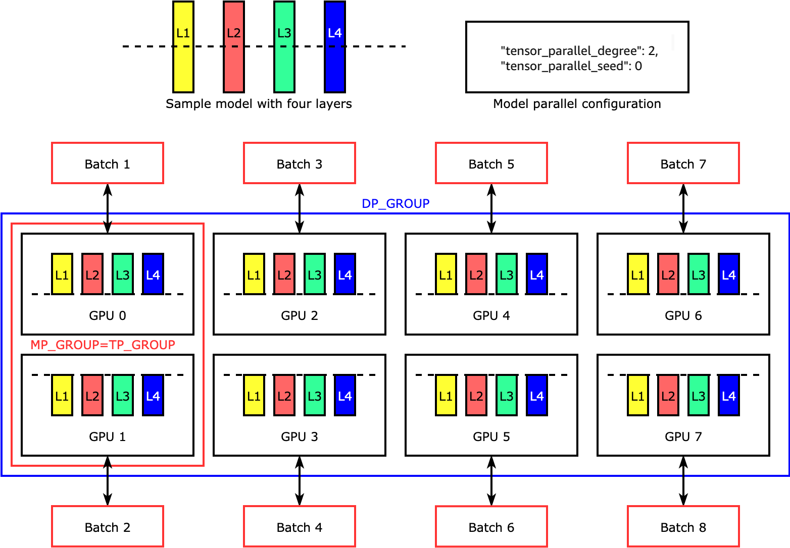

# Model parallelism concepts

Model parallelism is a distributed training method in which the deep learning (DL) model
is partitioned across multiple GPUs and instances. The SageMaker model parallel library v2 (SMP
v2) is compatible with the native PyTorch APIs and capabilities. This makes it convenient
for you to adapt your PyTorch Fully Sharded Data Parallel (FSDP) training script to the SageMaker
Training platform and take advantage of the performance improvement that SMP v2
provides. This introduction page provides a high-level overview about model parallelism and a
description of how it can help overcome issues that arise when training deep learning (DL)
models that are typically very large in size. It also provides examples of what the SageMaker
model parallel library offers to help manage model parallel strategies and memory
consumption.

## What is model parallelism?

Increasing the size of deep learning models (layers and parameters) yields better
accuracy for complex tasks such as computer vision and natural language processing.
However, there is a limit to the maximum model size you can fit in the memory of a
single GPU. When training DL models, GPU memory limitations can be bottlenecks in the
following ways:

- They limit the size of the model that you can train, because the memory
  footprint of a model scales proportionally to the number of parameters.
- They limit the per-GPU batch size during training, driving down GPU
  utilization and training efficiency.

To overcome the limitations associated with training a model on a single GPU, SageMaker AI
provides the model parallel library to help distribute and train DL models efficiently
on multiple compute nodes. Furthermore, with the library, you can achieve optimized
distributed training using EFA-supported devices, which enhance the performance of
inter-node communication with low latency, high throughput, and OS bypass.

## Estimate memory

requirements before using model parallelism

Before you use the SageMaker model parallel library, consider the following to get a
sense of the memory requirements of training large DL models.

For a training job that uses automatic mixed precision such as `float16` (FP16) or
`bfloat16` (BF16) and Adam optimizers, the required GPU memory per parameter is
about 20 bytes, which we can break down as follows:

- An FP16 or BF16 parameter ~ 2 bytes
- An FP16 or BF16 gradient ~ 2 bytes
- An FP32 optimizer state ~ 8 bytes based on the Adam optimizers
- An FP32 copy of parameter ~ 4 bytes (needed for the `optimizer
apply` (OA) operation)
- An FP32 copy of gradient ~ 4 bytes (needed for the OA operation)

Even for a relatively small DL model with 10 billion parameters, it can require at
least 200GB of memory, which is much larger than the typical GPU memory (for example,
NVIDIA A100 with 40GB/80GB memory) available on a single GPU. On top of the memory
requirements for model and optimizer states, there are other memory consumers such as
activations generated in the forward pass. The memory required can be a lot greater than
200GB.

For distributed training, we recommend that you use Amazon EC2 P4 and P5 instances that
have NVIDIA A100 and H100 Tensor Core GPUs respectively. For more details about
specifications such as CPU cores, RAM, attached storage volume, and network bandwidth,
see the _Accelerated Computing_ section in the [Amazon EC2 Instance Types](https://aws.amazon.com/ec2/instance-types/ "https://aws.amazon.com/ec2/instance-types/") page.
For instance types that SMP v2 supports, see [Supported
instance types](distributed-model-parallel-support-v2.md#distributed-model-parallel-supported-instance-types-v2 "distributed-model-parallel-support-v2.md#distributed-model-parallel-supported-instance-types-v2").

Even with the accelerated computing instances, models with about 10 billion parameters
such as Megatron-LM and T5, and even larger models with hundreds of billions of
parameters such as GPT-3, cannot fit model replicas in each GPU device.

## How the library employs model

parallelism and memory saving techniques

The library consists of various types of model parallelism features and memory-saving
features such as optimizer state sharding, activation checkpointing, and activation
offloading. All these techniques can be combined to efficiently train large models that
consist of hundreds of billions of parameters.

###### Topics

- [Sharded data parallelism](#model-parallel-intro-sdp-v2 "#model-parallel-intro-sdp-v2")
- [Expert parallelism](#model-parallel-intro-expert-parallelism-v2 "#model-parallel-intro-expert-parallelism-v2")
- [Tensor parallelism](#model-parallel-intro-tp-v2 "#model-parallel-intro-tp-v2")
- [Activation checkpointing and offloading](#model-parallel-intro-activation-offloading-checkpointing-v2 "#model-parallel-intro-activation-offloading-checkpointing-v2")
- [Choosing the right techniques for your model](#model-parallel-intro-choosing-techniques-v2 "#model-parallel-intro-choosing-techniques-v2")

### Sharded data parallelism

_Sharded data parallelism_ is a memory-saving
distributed training technique that splits the state of a model (model parameters,
gradients, and optimizer states) across GPUs within a data-parallel group.

SMP v2 implements sharded data parallelism through FSDP, and extends it to
implement the scale aware hybrid sharding strategy discussed in the blog post [Near-linear scaling of gigantic-model training on AWS](https://www.amazon.science/blog/near-linear-scaling-of-gigantic-model-training-on-aws "https://www.amazon.science/blog/near-linear-scaling-of-gigantic-model-training-on-aws").

You can apply sharded data parallelism to your model as a standalone strategy.
Furthermore, if you are using the most performant GPU instances equipped with NVIDIA
A100 Tensor Core GPUs, `ml.p4d.24xlarge` and
`ml.p4de.24xlarge`, you can take the advantage of improved training
speed from the `AllGather` operation offered by the [SageMaker data parallelism (SMDDP) library](data-parallel.md "data-parallel.md").

To dive deep into sharded data parallelism and learn how to set it up or use a
combination of sharded data parallelism with other techniques like tensor
parallelism and mixed precision training, see [Hybrid
sharded data parallelism](model-parallel-core-features-v2-sharded-data-parallelism.md "model-parallel-core-features-v2-sharded-data-parallelism.md").

### Expert parallelism

SMP v2 integrates with [NVIDIA
Megatron](https://github.com/NVIDIA/Megatron-LM "https://github.com/NVIDIA/Megatron-LM") for implementing _expert parallelism_ on top
of its support for the native PyTorch FSDP APIs. You can keep your PyTorch FSDP
training code as is and apply SMP expert parallelism for training _Mixture of Experts_ (MoE) models within SageMaker AI.

An MoE model is a type of transformer model that consists of multiple _experts_, each consisting of a neural network, typically
a feed-forward network (FFN). A gate network called _router_ determines which tokens are sent to which expert. These
experts specialize in processing specific aspects of the input data, enabling the
model to train faster, reduce compute cost, while achieving the same performance
quality as its counterpart dense model. And _expert
parallelism_ is a parallelism technique that handles splitting experts
of an MoE model across GPU devices.

To learn how to train MoE models with SMP v2, see [Expert
parallelism](model-parallel-core-features-v2-expert-parallelism.md "model-parallel-core-features-v2-expert-parallelism.md").

### Tensor parallelism

_Tensor parallelism_ splits individual layers, or
`nn.Modules`, across devices to run in parallel. The following figure
shows the simplest example of how the SMP library splits a model with four layers to
achieve two-way tensor parallelism (`"tensor_parallel_degree": 2`). In
the following figure, the notations for model parallel group, tensor parallel group,
and data parallel group are `MP_GROUP`, `TP_GROUP`, and
`DP_GROUP` respectively. The layers of each model replica are
bisected and distributed into two GPUs. The library manages communication across the
tensor-distributed model replicas.

To dive deep into tensor parallelism and other memory-saving features for PyTorch,
and to learn how to set a combination of the core features, see [Tensor
parallelism](model-parallel-core-features-v2-tensor-parallelism.md "model-parallel-core-features-v2-tensor-parallelism.md").

### Activation checkpointing and offloading

To save GPU memory, the library supports activation checkpointing to avoid storing
internal activations in the GPU memory for user-specified modules during the forward
pass. The library recomputes these activations during the backward pass. In
addition, with activation offloading, it offloads the stored activations to CPU
memory and fetches them back to GPU during the backward pass to further reduce the
activation memory footprint. For more information about how to use these features,
see [Activation checkpointing](model-parallel-core-features-v2-pytorch-activation-checkpointing.md "model-parallel-core-features-v2-pytorch-activation-checkpointing.md") and [Activation
offloading](model-parallel-core-features-v2-pytorch-activation-offloading.md "model-parallel-core-features-v2-pytorch-activation-offloading.md").

### Choosing the right techniques for your model

For more information about choosing the right techniques and configurations, see
[SageMaker distributed model parallelism best
practices](model-parallel-best-practices-v2.md "model-parallel-best-practices-v2.md").
