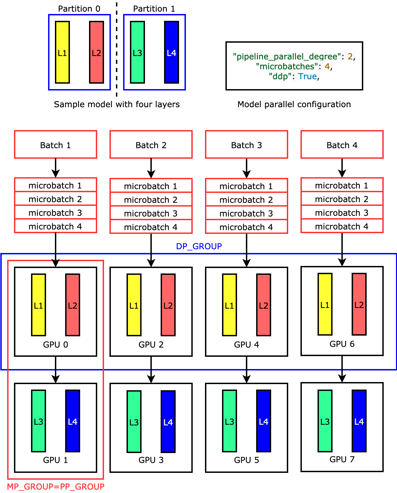
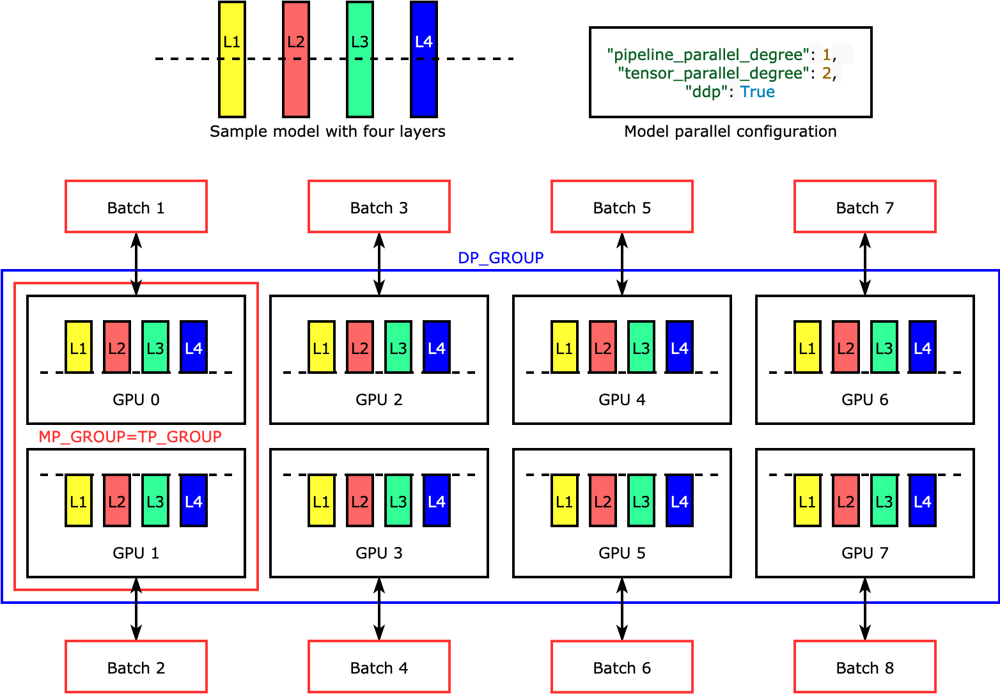
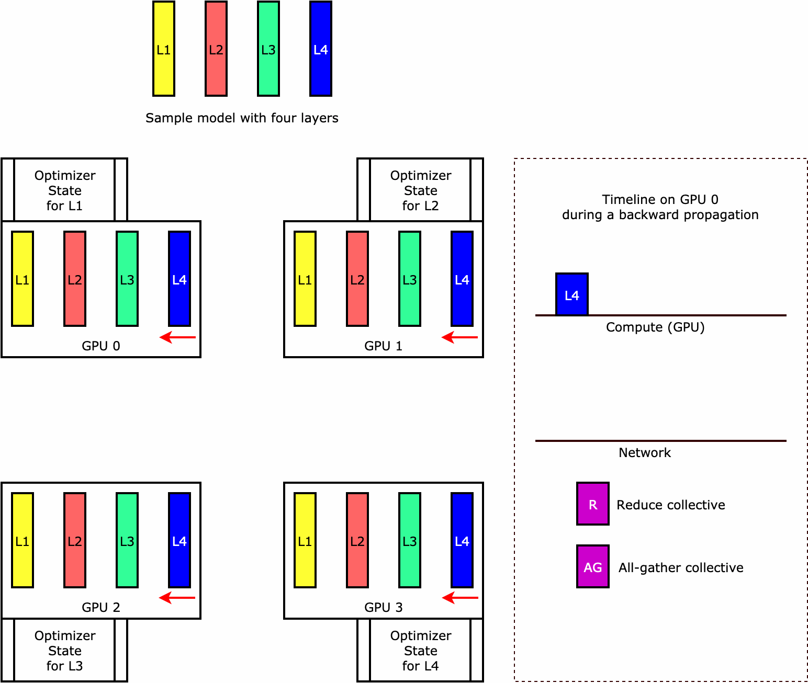

# Introduction to Model Parallelism

Model parallelism is a distributed training method in which the deep learning model is
partitioned across multiple devices, within or across instances. This introduction page
provides a high-level overview about model parallelism, a description of how it can help
overcome issues that arise when training DL models that are typically very large in size,
and examples of what the SageMaker model parallel library offers to help manage model parallel
strategies as well as memory consumption.

## What is Model Parallelism?

Increasing the size of deep learning models (layers and parameters) yields better
accuracy for complex tasks such as computer vision and natural language processing.
However, there is a limit to the maximum model size you can fit in the memory of a
single GPU. When training DL models, GPU memory limitations can be bottlenecks in the
following ways:

- They limit the size of the model you can train, since the memory footprint of
  a model scales proportionally to the number of parameters.
- They limit the per-GPU batch size during training, driving down GPU
  utilization and training efficiency.

To overcome the limitations associated with training a model on a single GPU,
SageMaker provides the model parallel library to help distribute and train DL models
efficiently on multiple compute nodes. Furthermore, with the library, you can achieve
most optimized distributed training using EFA-supported devices, which enhance the
performance of inter-node communication with low latency, high throughput, and OS
bypass.

## Estimate Memory Requirements Before Using Model Parallelism

Before you use the SageMaker model parallel library, consider the following to get a
sense of the memory requirements of training large DL models.

For a training job that uses AMP (FP16) and Adam optimizers, the required GPU memory
per parameter is about 20 bytes, which we can break down as follows:

- An FP16 parameter ~ 2 bytes
- An FP16 gradient ~ 2 bytes
- An FP32 optimizer state ~ 8 bytes based on the Adam optimizers
- An FP32 copy of parameter ~ 4 bytes (needed for the `optimizer
apply` (OA) operation)
- An FP32 copy of gradient ~ 4 bytes (needed for the OA operation)

Even for a relatively small DL model with 10 billion parameters, it can require at
least 200GB of memory, which is much larger than the typical GPU memory (for example,
NVIDIA A100 with 40GB/80GB memory and V100 with 16/32 GB) available on a single GPU.
Note that on top of the memory requirements for model and optimizer states, there are
other memory consumers such as activations generated in the forward pass. The memory
required can be a lot greater than 200GB.

For distributed training, we recommend that you use Amazon EC2 P3 and P4 instances that
have NVIDIA V100 and A100 Tensor Core GPUs respectively. For more details about
specifications such as CPU cores, RAM, attached storage volume, and network bandwidth,
see the _Accelerated Computing_ section in the [Amazon EC2 Instance Types](https://aws.amazon.com/ec2/instance-types/ "https://aws.amazon.com/ec2/instance-types/")
page.

Even with the accelerated computing instances, it is obvious that models with about 10
billion parameters such as Megatron-LM and T5 and even larger models with hundreds of
billions of parameters such as GPT-3 cannot fit model replicas in each GPU device.

## How the Library Employs Model Parallelism and Memory Saving Techniques

The library consists of various types of model parallelism features and memory-saving
features such as optimizer state sharding, activation checkpointing, and activation
offloading. All these techniques can be combined to efficiently train large models that
consist of hundreds of billions of parameters.

###### Topics

- [Sharded data parallelism (available for
  PyTorch)](#model-parallel-intro-sdp "#model-parallel-intro-sdp")
- [Pipeline parallelism (available for
  PyTorch and TensorFlow)](#model-parallel-intro-pp "#model-parallel-intro-pp")
- [Tensor parallelism (available for PyTorch)](#model-parallel-intro-tp "#model-parallel-intro-tp")
- [Optimizer state sharding (available for
  PyTorch)](#model-parallel-intro-oss "#model-parallel-intro-oss")
- [Activation offloading and checkpointing (available for PyTorch)](#model-parallel-intro-activation-offloading-checkpointing "#model-parallel-intro-activation-offloading-checkpointing")
- [Choosing the right techniques for your model](#model-parallel-intro-choosing-techniques "#model-parallel-intro-choosing-techniques")

### Sharded data parallelism (available for

PyTorch)

_Sharded data parallelism_ is a memory-saving
distributed training technique that splits the state of a model (model parameters,
gradients, and optimizer states) across GPUs within a data-parallel
group.

SageMaker AI implements sharded data parallelism through the implementation of MiCS, which
is a library that **mi**nimizes **c**ommunication **s**cale and discussed
in the blog post [Near-linear scaling of gigantic-model training on AWS](https://www.amazon.science/blog/near-linear-scaling-of-gigantic-model-training-on-aws "https://www.amazon.science/blog/near-linear-scaling-of-gigantic-model-training-on-aws").

You can apply sharded data parallelism to your model as a stand-alone strategy.
Furthermore, if you are using the most performant GPU instances equipped with NVIDIA
A100 Tensor Core GPUs, `ml.p4d.24xlarge`, you can take the advantage of
improved training speed from the `AllGather` operation offered by SMDDP
Collectives.

To dive deep into sharded data parallelism and learn how to set it up or use a
combination of sharded data parallelism with other techniques like tensor
parallelism and FP16 training, see [Sharded Data Parallelism](model-parallel-extended-features-pytorch-sharded-data-parallelism.md "model-parallel-extended-features-pytorch-sharded-data-parallelism.md").

### Pipeline parallelism (available for

PyTorch and TensorFlow)

_Pipeline parallelism_ partitions the set of layers or
operations across the set of devices, leaving each operation intact. When you
specify a value for the number of model partitions
(`pipeline_parallel_degree`), the total number of GPUs
(`processes_per_host`) must be divisible by the number of the model
partitions. To set this up properly, you have to specify the correct values for the
`pipeline_parallel_degree` and `processes_per_host`
parameters. The simple math is as follows:

```
(pipeline_parallel_degree) x (data_parallel_degree) = processes_per_host
```

The library takes care of calculating the number of model replicas (also called
`data_parallel_degree`) given the two input parameters you provide.

For example, if you set `"pipeline_parallel_degree": 2` and
`"processes_per_host": 8` to use an ML instance with eight GPU
workers such as `ml.p3.16xlarge`, the library automatically sets up the
distributed model across the GPUs and four-way data parallelism. The following image
illustrates how a model is distributed across the eight GPUs achieving four-way data
parallelism and two-way pipeline parallelism. Each model replica, where we define it
as a _pipeline parallel group_ and label it as
`PP_GROUP`, is partitioned across two GPUs. Each partition of the
model is assigned to four GPUs, where the four partition replicas are in a _data parallel group_ and labeled as
`DP_GROUP`. Without tensor parallelism, the pipeline parallel group
is essentially the model parallel group.



To dive deep into pipeline parallelism, see [Core Features of the SageMaker Model Parallelism
Library](model-parallel-core-features.md "model-parallel-core-features.md").

To get started with running your model using pipeline parallelism, see [Run a SageMaker Distributed Training Job with the SageMaker Model Parallel
Library](model-parallel-use-api.md "model-parallel-use-api.md").

### Tensor parallelism (available for PyTorch)

_Tensor parallelism_ splits individual layers, or
`nn.Modules`, across devices, to be run in parallel. The following
figure shows the simplest example of how the library splits a model with four layers
to achieve two-way tensor parallelism (`"tensor_parallel_degree": 2`).
The layers of each model replica are bisected and distributed into two GPUs. In this
example case, the model parallel configuration also includes
`"pipeline_parallel_degree": 1` and `"ddp": True` (uses
PyTorch DistributedDataParallel package in the background), so the degree of data
parallelism becomes eight. The library manages communication across the
tensor-distributed model replicas.



The usefulness of this feature is in the fact that you can select specific layers or a
subset of layers to apply tensor parallelism. To dive deep into tensor parallelism and
other memory-saving features for PyTorch, and to learn how to set a combination of
pipeline and tensor parallelism, see [Tensor
Parallelism](model-parallel-extended-features-pytorch-tensor-parallelism.md "model-parallel-extended-features-pytorch-tensor-parallelism.md").

### Optimizer state sharding (available for

PyTorch)

To understand how the library performs _optimizer state
sharding_, consider a simple example model with four layers. The key
idea in optimizing state sharding is you don't need to replicate your optimizer
state in all of your GPUs. Instead, a single replica of the optimizer state is
sharded across data-parallel ranks, with no redundancy across devices. For example,
GPU 0 holds the optimizer state for layer one, the next GPU 1 holds the optimizer
state for L2, and so on. The following animated figure shows a backward propagation
with the optimizer state sharding technique. At the end of the backward propagation,
there's compute and network time for the `optimizer apply` (OA) operation
to update optimizer states and the `all-gather` (AG) operation to update
the model parameters for the next iteration. Most importantly, the
`reduce` operation can overlap with the compute on GPU 0, resulting
in a more memory-efficient and faster backward propagation. In the current
implementation, AG and OA operations do not overlap with `compute`. It
can result in an extended computation during the AG operation, so there might be a
tradeoff.



For more information about how to use this feature, see [Optimizer State Sharding](model-parallel-extended-features-pytorch-optimizer-state-sharding.md "model-parallel-extended-features-pytorch-optimizer-state-sharding.md").

### Activation offloading and checkpointing (available for PyTorch)

To save GPU memory, the library supports activation checkpointing to avoid storing
internal activations in the GPU memory for user-specified modules during the forward
pass. The library recomputes these activations during the backward pass. In
addition, the activation offloading feature offloads the stored activations to CPU
memory and fetches back to GPU during the backward pass to further reduce activation
memory footprint. For more information about how to use these features, see [Activation Checkpointing](model-parallel-extended-features-pytorch-activation-checkpointing.md "model-parallel-extended-features-pytorch-activation-checkpointing.md") and [Activation Offloading](model-parallel-extended-features-pytorch-activation-offloading.md "model-parallel-extended-features-pytorch-activation-offloading.md").

### Choosing the right techniques for your model

For more information about choosing the right techniques and configurations, see
[SageMaker Distributed Model Parallel Best Practices](model-parallel-best-practices.md "model-parallel-best-practices.md") and [Configuration Tips and Pitfalls](model-parallel-customize-tips-pitfalls.md "model-parallel-customize-tips-pitfalls.md").
