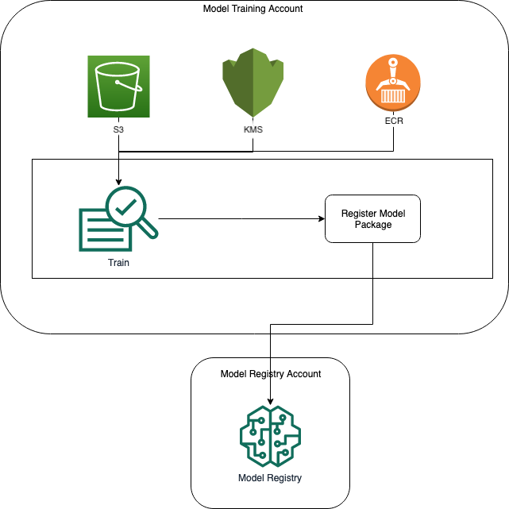

# Register a Model Version

You can register an Amazon SageMaker AI model by creating a model version that specifies the
model group to which it belongs. A model version must include a model artifacts (the
trained weights of a model) and optionally the inference code for the model.

An _inference pipeline_ is a SageMaker AI model composed of a linear
sequence of two to fifteen containers that process inference requests. You register
an inference pipeline by specifying the containers and the associated environment
variables. For more information on inference pipelines, see [Inference pipelines in Amazon SageMaker AI](inference-pipelines.md "inference-pipelines.md").

You can register a model with an inference pipeline, by specifying the containers
and the associated environment variables. To create a model version with an
inference pipeline by using either the AWS SDK for Python (Boto3), the Amazon SageMaker Studio console,
or by creating a step in a SageMaker AI model building pipeline, use the following steps.

###### Topics

- [Register a Model Version (SageMaker AI
  Pipelines)](#model-registry-pipeline "#model-registry-pipeline")
- [Register a Model Version
  (Boto3)](#model-registry-version-api "#model-registry-version-api")
- [Register a Model Version (Studio or
  Studio Classic)](#model-registry-studio "#model-registry-studio")
- [Register a Model Version from
  a Different Account](#model-registry-version-xaccount "#model-registry-version-xaccount")

## Register a Model Version (SageMaker AI

Pipelines)

To register a model version by using a SageMaker AI model building pipeline, create a
`RegisterModel` step in your pipeline. For information about
creating a `RegisterModel` step as part of a pipeline, see [Step 8: Define a RegisterModel step to create
a model package](define-pipeline.md#define-pipeline-register "define-pipeline.md#define-pipeline-register").

## Register a Model Version

(Boto3)

To register a model version by using Boto3, call the
`create_model_package` API operation.

First, you set up the parameter dictionary to pass to the
`create_model_package` API operation.

```
# Specify the model source
model_url = "s3://`your-bucket-name/model.tar.gz`"

modelpackage_inference_specification =  {
    "InferenceSpecification": {
      "Containers": [
         {
            "Image": `image_uri`,
	    "ModelDataUrl": `model_url`
         }
      ],
      "SupportedContentTypes": [ "text/csv" ],
      "SupportedResponseMIMETypes": [ "text/csv" ],
   }
 }

# Alternatively, you can specify the model source like this:
# modelpackage_inference_specification["InferenceSpecification"]["Containers"][0]["ModelDataUrl"]=model_url

create_model_package_input_dict = {
    "ModelPackageGroupName" : model_package_group_name,
    "ModelPackageDescription" : "Model to detect 3 different types of irises (Setosa, Versicolour, and Virginica)",
    "ModelApprovalStatus" : "PendingManualApproval"
}
create_model_package_input_dict.update(modelpackage_inference_specification)
```

Then you call the `create_model_package` API operation, passing in
the parameter dictionary that you just set up.

```
create_model_package_response = sm_client.create_model_package(**create_model_package_input_dict)
model_package_arn = create_model_package_response["ModelPackageArn"]
print('ModelPackage Version ARN : {}'.format(model_package_arn))
```

## Register a Model Version (Studio or

Studio Classic)

To register a model version in the Amazon SageMaker Studio console, complete the
following steps based on whether you use Studio or Studio Classic.

Studio

1. Open the SageMaker Studio console by following the
   instructions in [Launch Amazon SageMaker Studio](studio-updated-launch.md "studio-updated-launch.md").
2. In the left navigation pane, choose
   **Models** from the menu.
3. Choose the **Registered models** tab, if
   not selected already.
4. Immediately below the **Registered
   models** tab label, choose **Model
   Groups** and **My models**, if
   not selected already.
5. Choose **Register**. This will open the
   **Register model** page.
6. Follow the instructions provided in the **Register
   model** page.
7. Once you have reviewed your choices, choose
   **Register**. Once completed, you will
   be taken to the model version **Overview**
   page.

Studio Classic

1. Sign in to Amazon SageMaker Studio Classic. For more information, see
   [Launch
   Amazon SageMaker Studio Classic](studio-launch.md "studio-launch.md").
2. In the left navigation pane, choose the
   **Home** icon (
   
   ).
3. Choose **Models**, and then
   **Model registry**.
4. Open the **Register Version** form. You
   can do this in one of two ways:
   - Choose **Actions**, and then
     choose **Create model
     version**.
   - Select the name of the model group for which you
     want to create a model version, then choose
     **Create model version**.

5. In the **Register model version** form,
   enter the following information:
   - In the **Model package group
     name** dropdown, select the model group
     name.
   - (Optional) Enter a description for your model
     version.
   - In the **Model Approval Status**
     dropdown, select the version approval status.
   - (Optional) In the **Custom
     metadata** field, add custom tags as
     key-value pairs.

6. Choose **Next**.
7. In the **Inference Specification** form,
   enter the following information:
   - Enter your inference image location.
   - Enter your model data artifacts location.
   - (Optional) Enter information about images to use
     for transform and real-time inference jobs, and
     supported input and output MIME types.

8. Choose **Next**.
9. (Optional) Provide details to aid endpoint
   recommendations.
10. Choose **Next**.
11. (Optional) Choose model metrics you want to
    include.
12. Choose **Next**.
13. Ensure the displayed settings are correct, and choose
    **Register model version**. If you
    subsequently see a modal window with an error message,
    choose **View** (next to the message) to
    view the source of the error.
14. Confirm your new model version appears in the parent model
    group page.

## Register a Model Version from

a Different Account

To register model versions with a Model Group created by a different AWS
account, you must add a cross-account AWS Identity and Access Management resource policy to enable that
account. For example, one AWS account in your organization is responsible for
training models, and a different account is responsible for managing, deploying,
and updating models. You create IAM resource policies and apply the policies
to the specific account resource to which you want to grant access for this
case. For more information about cross-account resource policies in AWS, see
[Cross-account policy evaluation logic](../../../IAM/latest/UserGuide/reference_policies_evaluation-logic-cross-account.md "../../../IAM/latest/UserGuide/reference_policies_evaluation-logic-cross-account.md") in the _AWS Identity and Access Management
User Guide_.

To enable cross-account discoverability, which allows other accounts to view
model package groups from the resource owner account, see [Cross-account discoverability](model-registry-ram.md "model-registry-ram.md").

###### Note

You must also use a KMS key to encrypt the [output
data config](../APIReference/API_OutputDataConfig.md "../APIReference/API_OutputDataConfig.md") action during training for cross-account model
deployment.

To enable cross-account model registry in SageMaker AI, you have to provide a
cross-account resource policy for the Model Group that contains the model
versions. The following is an example that creates cross-account policies for
the Model Group and applies these policies to that specific resource.

The following configuration must be set in the source account which registers
models cross-account in a Model Group. In this example, the source account is
the model training account which will train and then register the model
cross-account into the Model Registry of the Model Registry account.

The example assumes that you previously defined the following
variables:

- `sm_client` – A SageMaker AI Boto3 client.
- `model_package_group_name` – The Model Group to
  which you want to grant access.
- `model_package_group_arn` – The Model Group ARN to
  which you want to grant cross-account access.
- `bucket` – The Amazon S3 bucket where the model training
  artifacts are stored.

To be able to deploy a model created in a different account, the user must
have a role that has access to SageMaker AI actions, such as a role with the
`AmazonSageMakerFullAccess` managed policy. For information about
SageMaker AI managed policies, see [AWS managed policies for Amazon SageMaker AI](security-iam-awsmanpol.md "security-iam-awsmanpol.md").

### Required IAM

resource policies

The following diagram captures the policies required to allow
cross-account model registration. As shown, these policies need to be active
during model training to properly register the model into the Model Registry
account.



Amazon ECR, Amazon S3, and AWS KMS policies are demonstrated in the following code
samples.

**Sample Amazon ECR policy**

JSON

```
`{
 "Version":"2012-10-17",
 "Statement": [
 {
 "Sid": "AddPerm",
 "Effect": "Allow",
 "Principal": {
 "AWS": "arn:aws:iam::`111122223333`:root"
 },
 "Action": [
 "ecr:BatchGetImage",
 "ecr:Describe*"
 ]
 }
 ]
}`

```

**Sample Amazon S3 policy**

JSON

```
`{
 "Version":"2012-10-17",
 "Statement": [
 {
 "Sid": "AddPerm",
 "Effect": "Allow",
 "Principal": {
 "AWS": "arn:aws:iam::`111122223333`:root"
 },
 "Action": [
 "s3:GetObject",
 "s3:GetBucketAcl",
 "s3:GetObjectAcl"
 ],
 "Resource": "arn:aws:s3:::`amzn-s3-demo-bucket`/*"
 }
 ]
}`

```

**Sample AWS KMS policy**

JSON

```
`{
 "Version":"2012-10-17",
 "Statement": [
 {
 "Sid": "AddPerm",
 "Effect": "Allow",
 "Principal": {
 "AWS": "arn:aws:iam::`111122223333`:root"
 },
 "Action": [
 "kms:Decrypt",
 "kms:GenerateDataKey*"
 ],
 "Resource": "*"
 }
 ]
}`

```

### Apply

resource policies to accounts

The following policy configuration applies the policies discussed in the
previous section and must be put in the model training account.

```
import json

# The Model Registry account id of the Model Group
model_registry_account = "`111111111111`"

# The model training account id where training happens
model_training_account = "`222222222222`"

# 1. Create a policy for access to the ECR repository
# in the model training account for the Model Registry account Model Group
ecr_repository_policy = {"Version": "2012-10-17",
    "Statement": [{"Sid": "AddPerm",
        "Effect": "Allow",
        "Principal": {
          "AWS": f"arn:aws:iam::{model_registry_account}:root"
        },
        "Action": [
          "ecr:BatchGetImage",
          "ecr:Describe*"
        ]
    }]
}

# Convert the ECR policy from JSON dict to string
ecr_repository_policy = json.dumps(ecr_repository_policy)

# Set the new ECR policy
ecr = boto3.client('ecr')
response = ecr.set_repository_policy(
    registryId = model_training_account,
    repositoryName = "decision-trees-sample",
    policyText = ecr_repository_policy
)

# 2. Create a policy in the model training account for access to the S3 bucket
# where the model is present in the Model Registry account Model Group
bucket_policy = {"Version": "2012-10-17",
    "Statement": [{"Sid": "AddPerm",
        "Effect": "Allow",
        "Principal": {"AWS": f"arn:aws:iam::{model_registry_account}:root"
        },
        "Action": [
          "s3:GetObject",
          "s3:GetBucketAcl",
          "s3:GetObjectAcl"
        ],
        "Resource": [
          "arn:aws:s3:::{`bucket`}/*",
	  "Resource: arn:aws:s3:::{`bucket`}"
        ]
    }]
}

# Convert the S3 policy from JSON dict to string
bucket_policy = json.dumps(bucket_policy)

# Set the new bucket policy
s3 = boto3.client("s3")
response = s3.put_bucket_policy(
    Bucket = `bucket`,
    Policy = bucket_policy)

# 3. Create the KMS grant for the key used during training for encryption
# in the model training account to the Model Registry account Model Group
client = boto3.client("kms")

response = client.create_grant(
    GranteePrincipal=model_registry_account,
    KeyId=kms_key_id
    Operations=[
        "Decrypt",
        "GenerateDataKey",
    ],
)
```

The following configuration needs to be put in the Model Registry account where the
Model Group exists.

```

# The Model Registry account id of the Model Group
model_registry_account = "`111111111111`"

# 1. Create policy to allow the model training account to access the ModelPackageGroup
model_package_group_policy = {"Version": "2012-10-17",
    "Statement": [
        {
            "Sid": "AddPermModelPackageVersion",
            "Effect": "Allow",
            "Principal": {"AWS": f"arn:aws:iam::{`model_training_account`}:root"},
            "Action": ["sagemaker:CreateModelPackage"],
            "Resource": f"arn:aws:sagemaker:{region}:{model_registry_account}:model-package/{`model_package_group_name`}/*"
        }
    ]
}

# Convert the policy from JSON dict to string
model_package_group_policy = json.dumps(model_package_group_policy)

# Set the new policy
response = sm_client.put_model_package_group_policy(
    ModelPackageGroupName = `model_package_group_name`,
    ResourcePolicy = model_package_group_policy)


```

Finally, use the `create_model_package` action from the model
training account to register the model package in the cross-account.

```
# Specify the model source
model_url = "s3://{`bucket`}/model.tar.gz"

#Set up the parameter dictionary to pass to the create_model_package API operation
modelpackage_inference_specification =  {
    "InferenceSpecification": {
        "Containers": [
            {
                "Image": f"{`model_training_account`}.dkr.ecr.us-east-2.amazonaws.com/decision-trees-sample:latest",
                "ModelDataUrl": model_url
            }
        ],
        "SupportedContentTypes": [ "text/csv" ],
        "SupportedResponseMIMETypes": [ "text/csv" ],
    }
}

# Alternatively, you can specify the model source like this:
# modelpackage_inference_specification["InferenceSpecification"]["Containers"][0]["ModelDataUrl"]=model_url

create_model_package_input_dict = {
    "ModelPackageGroupName" : `model_package_group_arn`,
    "ModelPackageDescription" : "Model to detect 3 different types of irises (Setosa, Versicolour, and Virginica)",
    "ModelApprovalStatus" : "PendingManualApproval"
}
create_model_package_input_dict.update(modelpackage_inference_specification)

# Create the model package in the Model Registry account
create_model_package_response = sm_client.create_model_package(**create_model_package_input_dict)
model_package_arn = create_model_package_response["ModelPackageArn"]
print('ModelPackage Version ARN : {}'.format(model_package_arn))
```
