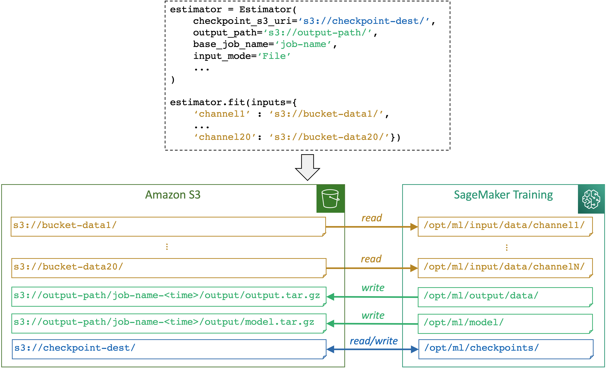

# Mapping of training storage paths managed by

Amazon SageMaker AI

This page provides a high-level summary of how the SageMaker training platform manages storage
paths for training datasets, model artifacts, checkpoints, and outputs between AWS cloud
storage and training jobs in SageMaker AI. Throughout this guide, you learn to identify the default
paths set by the SageMaker AI platform and how the data channels can be streamlined with your data
sources in Amazon Simple Storage Service (Amazon S3), FSx for Lustre, and Amazon EFS. For more information about various data
channel input modes and storage options, see [Setting up training jobs to access datasets](model-access-training-data.md "model-access-training-data.md").

## Overview of how SageMaker AI maps storage paths

The following diagram shows an example of how SageMaker AI maps input and output paths when you
run a training job using the SageMaker Python SDK [Estimator](https://sagemaker.readthedocs.io/en/stable/api/training/estimators.html#sagemaker.estimator.Estimator "https://sagemaker.readthedocs.io/en/stable/api/training/estimators.html#sagemaker.estimator.Estimator") class.

SageMaker AI maps storage paths between a storage (such as Amazon S3, Amazon FSx, and Amazon EFS) and the SageMaker training
container based on the paths and input mode specified through a SageMaker AI estimator object. More
information about how SageMaker AI reads from or writes to the paths and the purpose of the paths, see
[SageMaker AI environment variables and the
default paths for training storage locations](model-train-storage-env-var-summary.md "model-train-storage-env-var-summary.md").

You can use `OutputDataConfig` in the [CreateTrainingJob](../APIReference/API_CreateTrainingJob.md "../APIReference/API_CreateTrainingJob.md") API
to save the results of model training to an S3 bucket. Use the [ModelArtifacts](../APIReference/API_ModelArtifacts.md "../APIReference/API_ModelArtifacts.md") API to
find the S3 bucket that contains your model artifacts. See the [abalone_build_train_deploy](https://github.com/aws/amazon-sagemaker-examples/blob/main/sagemaker-pipelines/tabular/abalone_build_train_deploy/sagemaker-pipelines-preprocess-train-evaluate-batch-transform.ipynb "https://github.com/aws/amazon-sagemaker-examples/blob/main/sagemaker-pipelines/tabular/abalone_build_train_deploy/sagemaker-pipelines-preprocess-train-evaluate-batch-transform.ipynb") notebook for an example of output paths and how they are
used in API calls.

For more information and examples of how SageMaker AI manages data source, input modes, and local
paths in SageMaker training instances, see [Access Training
Data](model-access-training-data.md "model-access-training-data.md").

###### Topics

- [Uncompressed model output](model-train-storage-uncompressed.md "model-train-storage-uncompressed.md")
- [Managing storage paths for different
  types of instance local storage](model-train-storage-tips-considerations.md "model-train-storage-tips-considerations.md")
- [SageMaker AI environment variables and the
  default paths for training storage locations](model-train-storage-env-var-summary.md "model-train-storage-env-var-summary.md")
