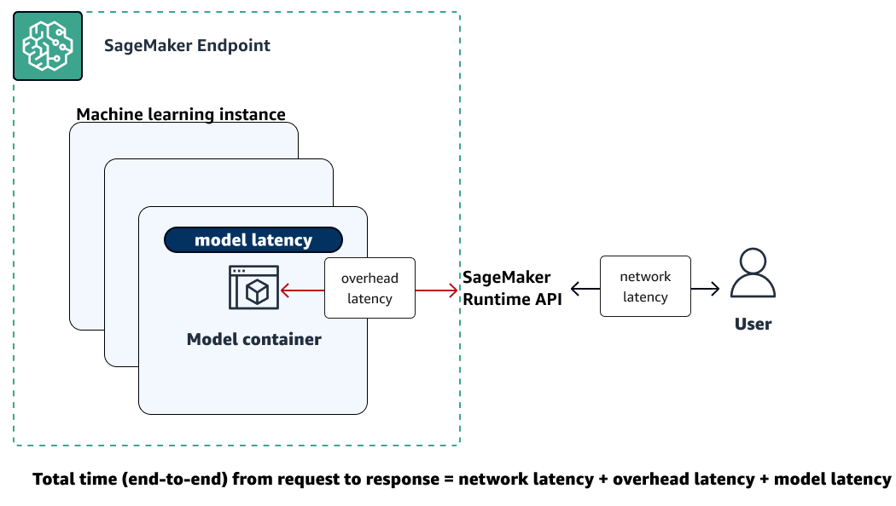

# Amazon SageMaker AI metrics in Amazon CloudWatch

You can monitor Amazon SageMaker AI using Amazon CloudWatch, which collects raw data and processes it into
readable, near real-time metrics. These statistics are kept for 15 months. With them, you can
access historical information and gain a better perspective on how your web application or
service is performing. However, the Amazon CloudWatch console limits the search to metrics that were
updated in the last 2 weeks. This limitation ensures that the most current jobs are shown in
your namespace.

To graph metrics without using a search, specify its exact name in the source view. You
can also set alarms that watch for certain thresholds, and send notifications or take actions
when those thresholds are met. For more information, see the [Amazon CloudWatch User Guide](../../../AmazonCloudWatch/latest/monitoring.md "../../../AmazonCloudWatch/latest/monitoring.md").

###### SageMaker AI Metrics and Dimensions

- [SageMaker AI endpoint metrics](#cloudwatch-metrics-endpoints "#cloudwatch-metrics-endpoints")
- [SageMaker AI endpoint invocation
  metrics](#cloudwatch-metrics-endpoint-invocation "#cloudwatch-metrics-endpoint-invocation")
- [SageMaker AI inference component
  metrics](#cloudwatch-metrics-inference-component "#cloudwatch-metrics-inference-component")
- [SageMaker AI multi-model endpoint
  metrics](#cloudwatch-metrics-multimodel-endpoints "#cloudwatch-metrics-multimodel-endpoints")
- [SageMaker AI job metrics](#cloudwatch-metrics-jobs "#cloudwatch-metrics-jobs")
- [SageMaker Inference Recommender jobs metrics](#cloudwatch-metrics-inference-recommender "#cloudwatch-metrics-inference-recommender")
- [SageMaker Ground Truth metrics](#cloudwatch-metrics-ground-truth "#cloudwatch-metrics-ground-truth")
- [Amazon SageMaker Feature Store metrics](#cloudwatch-metrics-feature-store "#cloudwatch-metrics-feature-store")
- [SageMaker pipelines metrics](#cloudwatch-metrics-pipelines "#cloudwatch-metrics-pipelines")

## SageMaker AI endpoint metrics

The `/aws/sagemaker/Endpoints` namespace includes the following metrics for
endpoint instances.

Metrics are available at a 1-minute frequency.

###### Note

Amazon CloudWatch supports [high-resolution custom
metrics](../../../AmazonCloudWatch/latest/monitoring/publishingMetrics.md "../../../AmazonCloudWatch/latest/monitoring/publishingMetrics.md") and its finest resolution is 1 second. However, the finer the
resolution, the shorter the lifespan of the CloudWatch metrics. For the 1-second frequency
resolution, the CloudWatch metrics are available for 3 hours. For more information about the
resolution and the lifespan of the CloudWatch metrics, see [GetMetricStatistics](../../../AmazonCloudWatch/latest/APIReference/API_GetMetricStatistics.md "../../../AmazonCloudWatch/latest/APIReference/API_GetMetricStatistics.md") in the _Amazon CloudWatch API
Reference_.

| Endpoint metrics                    | Metric                                                                                                                                                                                                                                                                                                                                                                                                                                                                                                                                                                                                                                                                                                                                                                                                                                                                                                                         | Description                                                                                                                                                                                                                                                                                                                                                                                                                                                                                                                                                                                                                                                                                                                                                                                                                                                                                                                                                                                                                                                                                                                                                                                                                                                                                                                                                                                                                                                                                                                                                                                                                                                                                                                                                                                                                                                                                                                                                                                                                                                                                                                                                           |
| ----------------------------------- | ------------------------------------------------------------------------------------------------------------------------------------------------------------------------------------------------------------------------------------------------------------------------------------------------------------------------------------------------------------------------------------------------------------------------------------------------------------------------------------------------------------------------------------------------------------------------------------------------------------------------------------------------------------------------------------------------------------------------------------------------------------------------------------------------------------------------------------------------------------------------------------------------------------------------------ | --------------------------------------------------------------------------------------------------------------------------------------------------------------------------------------------------------------------------------------------------------------------------------------------------------------------------------------------------------------------------------------------------------------------------------------------------------------------------------------------------------------------------------------------------------------------------------------------------------------------------------------------------------------------------------------------------------------------------------------------------------------------------------------------------------------------------------------------------------------------------------------------------------------------------------------------------------------------------------------------------------------------------------------------------------------------------------------------------------------------------------------------------------------------------------------------------------------------------------------------------------------------------------------------------------------------------------------------------------------------------------------------------------------------------------------------------------------------------------------------------------------------------------------------------------------------------------------------------------------------------------------------------------------------------------------------------------------------------------------------------------------------------------------------------------------------------------------------------------------------------------------------------------------------------------------------------------------------------------------------------------------------------------------------------------------------------------------------------------------------------------------------------------------------- | --------- | ----------- |
| `CPUReservation`                    | The sum of CPUs reserved by containers on an instance. This metric is provided only for endpoints that host active inference components. The value ranges between 0%–100%. In the settings for an inference component, you set the CPU reservation with the `NumberOfCpuCoresRequired` parameter. For example, if there 4 CPUs, and 2 are reserved, the `CPUReservation` metric is 50%.                                                                                                                                                                                                                                                                                                                                                                                                                                                                                                                                        |
| `CPUUtilization`                    | The sum of each individual CPU core's utilization. The CPU utilization of each core range is 0–100. For example, if there are four CPUs, the `CPUUtilization` range is 0%–400%. For endpoint variants, the value is the sum of the CPU utilization of the primary and supplementary containers on the instance. Units: Percent                                                                                                                                                                                                                                                                                                                                                                                                                                                                                                                                                                                                 |
| `CPUUtilizationNormalized`          | The normalized sum of the utilization of each individual CPU core. This metric is provided only for endpoints that host active inference components. The value ranges between 0%–100%. For example, if there are four CPUs, and the `CPUUtilization` metric is 200%, then the `CPUUtilizationNormalized` metric is 50%.                                                                                                                                                                                                                                                                                                                                                                                                                                                                                                                                                                                                        |
| `DiskUtilization`                   | The percentage of disk space used by the containers on an instance. This value range is 0%–100%.For endpoint variants, the value is the sum of the disk space utilization of the primary and supplementary containers on the instance.Units: Percent                                                                                                                                                                                                                                                                                                                                                                                                                                                                                                                                                                                                                                                                           |
| `GPUMemoryUtilization`              | The percentage of GPU memory used by the containers on an instance. The value range is 0–100 and is multiplied by the number of GPUs. For example, if there are four GPUs, the `GPUMemoryUtilization` range is 0%–400%. For endpoint variants, the value is the sum of the GPU memory utilization of the primary and supplementary containers on the instance. Units: Percent                                                                                                                                                                                                                                                                                                                                                                                                                                                                                                                                                  |
| `GPUMemoryUtilizationNormalized`    | The normalized percentage of GPU memory used by the containers on an instance. This metric is provided only for endpoints that host active inference components. The value ranges between 0%–100%. For example, if there are four GPUs, and the `GPUMemoryUtilization` metric is 200%, then the `GPUMemoryUtilizationNormalized` metric is 50%.                                                                                                                                                                                                                                                                                                                                                                                                                                                                                                                                                                                |
| `GPUReservation`                    | The sum of GPUs reserved by containers on an instance. This metric is provided only for endpoints that host active inference components. The value ranges between 0%–100%. In the settings for an inference component, you set the GPU reservation by `NumberOfAcceleratorDevicesRequired`. For example, if there are 4 GPUs and 2 are reserved, the `GPUReservation` metric is 50%.                                                                                                                                                                                                                                                                                                                                                                                                                                                                                                                                           |
| `GPUUtilization`                    | The percentage of GPU units that are used by the containers on an instance. The value can range between 0–100 and is multiplied by the number of GPUs. For example, if there are four GPUs, the `GPUUtilization` range is 0%–400%. For endpoint variants, the value is the sum of the GPU utilization of the primary and supplementary containers on the instance. Units: Percent                                                                                                                                                                                                                                                                                                                                                                                                                                                                                                                                              |
| `GPUUtilizationNormalized`          | The normalized percentage of GPU units that are used by the containers on an instance. This metric is provided only for endpoints that host active inference components. The value ranges between 0%–100%. For example, if there are four GPUs, and the `GPUUtilization` metric is 200%, then the `GPUUtilizationNormalized` metric is 50%.                                                                                                                                                                                                                                                                                                                                                                                                                                                                                                                                                                                    |
| `MemoryReservation`                 | The sum of memory reserved by containers on an instance. This metric is provided only for endpoints that host active inference components. The value ranges between 0%–100%. In the settings for an inference component, you set the memory reservation with the `MinMemoryRequiredInMb` parameter. For example, if a 32 GiB instance reserved 1024 MB, the `MemoryReservation` metric would be 3.125%.                                                                                                                                                                                                                                                                                                                                                                                                                                                                                                                        |
| `MemoryUtilization`                 | The percentage of memory that is used by the containers on an instance. This value range is 0%–100%. For endpoint variants, the value is the sum of the memory utilization of the primary and supplementary containers on the instance. Units: Percent                                                                                                                                                                                                                                                                                                                                                                                                                                                                                                                                                                                                                                                                         | Dimensions for endpoint metrics                                                                                                                                                                                                                                                                                                                                                                                                                                                                                                                                                                                                                                                                                                                                                                                                                                                                                                                                                                                                                                                                                                                                                                                                                                                                                                                                                                                                                                                                                                                                                                                                                                                                                                                                                                                                                                                                                                                                                                                                                                                                                                                                       | Dimension | Description |
| ---                                 | ---                                                                                                                                                                                                                                                                                                                                                                                                                                                                                                                                                                                                                                                                                                                                                                                                                                                                                                                            |
| `EndpointName, VariantName`         | Filters endpoint metrics for a `ProductionVariant` of the specified endpoint and variant.                                                                                                                                                                                                                                                                                                                                                                                                                                                                                                                                                                                                                                                                                                                                                                                                                                      | ## SageMaker AI endpoint invocation metrics The `AWS/SageMaker` namespace includes the following request metrics from calls to [InvokeEndpoint](../APIReference/API_runtime_InvokeEndpoint.md "../APIReference/API_runtime_InvokeEndpoint.md"). Metrics are available at a 1-minute frequency. The following illustration shows how a SageMaker AI endpoint interacts with the Amazon SageMaker Runtime API. The overall time between sending a request to an endpoint and receiving a response depends on the following three components.  • Network latency – the time that it takes between making a request to and receiving a response back from the SageMaker Runtime Runtime API.  • Overhead latency – the time that it takes to transport a request to the model container from and transport the response back to the SageMaker Runtime Runtime API.  • Model latency – the time that it takes the model container to process the request and return a response.  For more information about total latency, see [Best practices for load testing Amazon SageMaker AI real-time inference endpoints](https://aws.amazon.com/blogs/machine-learning/best-practices-for-load-testing-amazon-sagemaker-real-time-inference-endpoints/ "https://aws.amazon.com/blogs/machine-learning/best-practices-for-load-testing-amazon-sagemaker-real-time-inference-endpoints/"). For information about how long CloudWatch metrics are retained for, see [GetMetricStatistics](../../../AmazonCloudWatch/latest/APIReference/API_GetMetricStatistics.md "../../../AmazonCloudWatch/latest/APIReference/API_GetMetricStatistics.md") in the _Amazon CloudWatch API Reference_. Endpoint invocation metrics                                                                                                                                                                                                                                                                                                                | Metric    | Description |
| ---                                 | ---                                                                                                                                                                                                                                                                                                                                                                                                                                                                                                                                                                                                                                                                                                                                                                                                                                                                                                                            |
| `ConcurrentRequestsPerCopy`         | The number of concurrent requests being received by the inference component, normalized by each copy of an inference component. Valid statistics: Min, Max                                                                                                                                                                                                                                                                                                                                                                                                                                                                                                                                                                                                                                                                                                                                                                     |
| `ConcurrentRequestsPerModel`        | The number of concurrent requests being received by the model. Valid statistics: Min, Max                                                                                                                                                                                                                                                                                                                                                                                                                                                                                                                                                                                                                                                                                                                                                                                                                                      |
| `Invocation4XXErrors`               | The number of `InvokeEndpoint` requests where the model returned a 4xx HTTP response code. For each 4xx response, 1 is sent; otherwise, 0 is sent. Units: None Valid statistics: Average, Sum                                                                                                                                                                                                                                                                                                                                                                                                                                                                                                                                                                                                                                                                                                                                  |
| `Invocation5XXErrors`               | The number of `InvokeEndpoint` requests where the model returned a 5xx HTTP response code. For each 5xx response, 1 is sent; otherwise, 0 is sent. Units: None Valid statistics: Average, Sum                                                                                                                                                                                                                                                                                                                                                                                                                                                                                                                                                                                                                                                                                                                                  |
| `InvocationModelErrors`             | The number of model invocation requests that did not result in 2XX HTTP response. This includes 4XX/5XX status codes, low-level socket errors, malformed HTTP responses, and request timeouts. For each error response, 1 is sent; otherwise, 0 is sent. Units: None Valid statistics: Average, Sum                                                                                                                                                                                                                                                                                                                                                                                                                                                                                                                                                                                                                            |
| `Invocations`                       | The number of `InvokeEndpoint` requests sent to a model endpoint. To get the total number of requests sent to a model endpoint, use the Sum statistic. Units: None Valid statistics: Sum                                                                                                                                                                                                                                                                                                                                                                                                                                                                                                                                                                                                                                                                                                                                       |
| `InvocationsPerCopy`                | The number of invocations normalized by each copy of an inference component. Valid statistics: Sum                                                                                                                                                                                                                                                                                                                                                                                                                                                                                                                                                                                                                                                                                                                                                                                                                             |
| `InvocationsPerInstance`            | The number of invocations sent to a model, normalized by `InstanceCount` in each ProductionVariant. 1/`numberOfInstances` is sent as the value on each request. `numberOfInstances` is the number of active instances for the ProductionVariant behind the endpoint at the time of the request. Units: None Valid statistics: Sum                                                                                                                                                                                                                                                                                                                                                                                                                                                                                                                                                                                              |
| `ModelLatency`                      | The interval of time taken by a model to respond to a SageMaker Runtime API request. This interval includes the local communication times taken to send the request and to fetch the response from the model container. It also includes the time taken to complete the inference in the container. Units: Microseconds Valid statistics: Average, Sum, Min, Max, Sample Count, Percentiles                                                                                                                                                                                                                                                                                                                                                                                                                                                                                                                                    |
| `ModelSetupTime`                    | The time it takes to launch new compute resources for a serverless endpoint. The time can vary depending on the model size, how long it takes to download the model, and the start-up time of the container. Units: Microseconds Valid statistics: Average, Min, Max, Sample Count, Percentiles                                                                                                                                                                                                                                                                                                                                                                                                                                                                                                                                                                                                                                |
| `OverheadLatency`                   | The interval of time added to the time taken to respond to a client request by SageMaker AI overheads. This interval is measured from the time SageMaker AI receives the request until it returns a response to the client, minus the `ModelLatency`. Overhead latency can vary depending on multiple factors, including request and response payload sizes, request frequency, and authentication/authorization of the request. Units: Microseconds Valid statistics: Average, Sum, Min, Max, Sample Count                                                                                                                                                                                                                                                                                                                                                                                                                    | Dimensions for endpoint invocation metrics                                                                                                                                                                                                                                                                                                                                                                                                                                                                                                                                                                                                                                                                                                                                                                                                                                                                                                                                                                                                                                                                                                                                                                                                                                                                                                                                                                                                                                                                                                                                                                                                                                                                                                                                                                                                                                                                                                                                                                                                                                                                                                                            | Dimension | Description |
| ---                                 | ---                                                                                                                                                                                                                                                                                                                                                                                                                                                                                                                                                                                                                                                                                                                                                                                                                                                                                                                            |
| `EndpointName, VariantName`         | Filters endpoint invocation metrics for a `ProductionVariant` of the specified endpoint and variant.                                                                                                                                                                                                                                                                                                                                                                                                                                                                                                                                                                                                                                                                                                                                                                                                                           |
| `InferenceComponentName`            | Filters inference component invocation metrics.                                                                                                                                                                                                                                                                                                                                                                                                                                                                                                                                                                                                                                                                                                                                                                                                                                                                                | ## SageMaker AI inference component metrics The `/aws/sagemaker/InferenceComponents` namespace includes the following metrics from calls to [InvokeEndpoint](../APIReference/API_runtime_InvokeEndpoint.md "../APIReference/API_runtime_InvokeEndpoint.md") for endpoints that host inference components. Metrics are available at a 1-minute frequency. Inference component metrics                                                                                                                                                                                                                                                                                                                                                                                                                                                                                                                                                                                                                                                                                                                                                                                                                                                                                                                                                                                                                                                                                                                                                                                                                                                                                                                                                                                                                                                                                                                                                                                                                                                                                                                                                                                  | Metric    | Description |
| ---                                 | ---                                                                                                                                                                                                                                                                                                                                                                                                                                                                                                                                                                                                                                                                                                                                                                                                                                                                                                                            |
| `CPUUtilizationNormalized`          | The value of the `CPUUtilizationNormalized` metric reported by each copy of the inference component. The value ranges between 0%–100%. If you set the `NumberOfCpuCoresRequired` parameter in the settings for the inference component copy, the metric presents the utilization over the reservation. Otherwise, the metric presents the utilization over the limit.                                                                                                                                                                                                                                                                                                                                                                                                                                                                                                                                                          |
| `GPUMemoryUtilizationNormalized`    | The value of the `GPUMemoryUtilizationNormalized` metric reported by each copy of the inference component.                                                                                                                                                                                                                                                                                                                                                                                                                                                                                                                                                                                                                                                                                                                                                                                                                     |
| `GPUUtilizationNormalized`          | The value of the `GPUUtilizationNormalized` metric reported by each copy of the inference component. If you set the `NumberOfAcceleratorDevicesRequired` parameter in the settings for the inference component copy, the metric presents the utilization over the reservation. Otherwise, the metric presents the utilization over the limit.                                                                                                                                                                                                                                                                                                                                                                                                                                                                                                                                                                                  |
| `MemoryUtilizationNormalized`       | The value of `MemoryUtilizationNormalized` reported by each copy of the inference component. If you set the `MinMemoryRequiredInMb` parameter in the settings for the inference component copy, the metrics present the utilization over the reservation. Otherwise, the metrics present the utilization over the limit.                                                                                                                                                                                                                                                                                                                                                                                                                                                                                                                                                                                                       | Dimensions for inference component metrics                                                                                                                                                                                                                                                                                                                                                                                                                                                                                                                                                                                                                                                                                                                                                                                                                                                                                                                                                                                                                                                                                                                                                                                                                                                                                                                                                                                                                                                                                                                                                                                                                                                                                                                                                                                                                                                                                                                                                                                                                                                                                                                            | Dimension | Description |
| ---                                 | ---                                                                                                                                                                                                                                                                                                                                                                                                                                                                                                                                                                                                                                                                                                                                                                                                                                                                                                                            |
| `InferenceComponentName`            | Filters inference component metrics.                                                                                                                                                                                                                                                                                                                                                                                                                                                                                                                                                                                                                                                                                                                                                                                                                                                                                           | ## SageMaker AI multi-model endpoint metrics The `AWS/SageMaker` namespace includes the following model loading metrics from calls to [InvokeEndpoint](../APIReference/API_runtime_InvokeEndpoint.md "../APIReference/API_runtime_InvokeEndpoint.md"). Metrics are available at a 1-minute frequency. For information about how long CloudWatch metrics are retained for, see [GetMetricStatistics](../../../AmazonCloudWatch/latest/APIReference/API_GetMetricStatistics.md "../../../AmazonCloudWatch/latest/APIReference/API_GetMetricStatistics.md") in the _Amazon CloudWatch API Reference_. Multi-model endpoint model loading metrics                                                                                                                                                                                                                                                                                                                                                                                                                                                                                                                                                                                                                                                                                                                                                                                                                                                                                                                                                                                                                                                                                                                                                                                                                                                                                                                                                                                                                                                                                                                         | Metric    | Description |
| ---                                 | ---                                                                                                                                                                                                                                                                                                                                                                                                                                                                                                                                                                                                                                                                                                                                                                                                                                                                                                                            |
| `ModelLoadingWaitTime`              | The interval of time that an invocation request has waited for the target model to be downloaded, loaded, or both in order to run inference. Units: Microseconds Valid statistics: Average, Sum, Min, Max, Sample Count                                                                                                                                                                                                                                                                                                                                                                                                                                                                                                                                                                                                                                                                                                        |
| `ModelUnloadingTime`                | The interval of time that it took to unload the model through the container's `UnloadModel` API call. Units: Microseconds Valid statistics: Average, Sum, Min, Max, Sample Count                                                                                                                                                                                                                                                                                                                                                                                                                                                                                                                                                                                                                                                                                                                                               |
| `ModelDownloadingTime`              | The interval of time that it took to download the model from Amazon Simple Storage Service (Amazon S3). Units: Microseconds Valid statistics: Average, Sum, Min, Max, Sample Count                                                                                                                                                                                                                                                                                                                                                                                                                                                                                                                                                                                                                                                                                                                                             |
| `ModelLoadingTime`                  | The interval of time that it took to load the model through the container's `LoadModel` API call. Units: Microseconds Valid statistics: Average, Sum, Min, Max, Sample Count                                                                                                                                                                                                                                                                                                                                                                                                                                                                                                                                                                                                                                                                                                                                                   |
| `ModelCacheHit`                     | The number of `InvokeEndpoint` requests sent to the multi-model endpoint for which the model was already loaded. The Average statistic shows the ratio of requests for which the model was already loaded. Units: None Valid statistics: Average, Sum, Sample Count                                                                                                                                                                                                                                                                                                                                                                                                                                                                                                                                                                                                                                                            | Dimensions for multi-model endpoint model loading metrics                                                                                                                                                                                                                                                                                                                                                                                                                                                                                                                                                                                                                                                                                                                                                                                                                                                                                                                                                                                                                                                                                                                                                                                                                                                                                                                                                                                                                                                                                                                                                                                                                                                                                                                                                                                                                                                                                                                                                                                                                                                                                                             | Dimension | Description |
| ---                                 | ---                                                                                                                                                                                                                                                                                                                                                                                                                                                                                                                                                                                                                                                                                                                                                                                                                                                                                                                            |
| `EndpointName, VariantName`         | Filters endpoint invocation metrics for a `ProductionVariant` of the specified endpoint and variant.                                                                                                                                                                                                                                                                                                                                                                                                                                                                                                                                                                                                                                                                                                                                                                                                                           | The `/aws/sagemaker/Endpoints` namespaces include the following instance metrics from calls to [InvokeEndpoint](../APIReference/API_runtime_InvokeEndpoint.md "../APIReference/API_runtime_InvokeEndpoint.md"). Metrics are available at a 1-minute frequency. For information about how long CloudWatch metrics are retained for, see [GetMetricStatistics](../../../AmazonCloudWatch/latest/APIReference/API_GetMetricStatistics.md "../../../AmazonCloudWatch/latest/APIReference/API_GetMetricStatistics.md") in the _Amazon CloudWatch API Reference_. Multi-model endpoint model instance metrics                                                                                                                                                                                                                                                                                                                                                                                                                                                                                                                                                                                                                                                                                                                                                                                                                                                                                                                                                                                                                                                                                                                                                                                                                                                                                                                                                                                                                                                                                                                                                               | Metric    | Description |
| ---                                 | ---                                                                                                                                                                                                                                                                                                                                                                                                                                                                                                                                                                                                                                                                                                                                                                                                                                                                                                                            |
| `LoadedModelCount`                  | The number of models loaded in the containers of the multi-model endpoint. This metric is emitted per instance. The Average statistic with a period of 1 minute tells you the average number of models loaded per instance. The Sum statistic tells you the total number of models loaded across all instances in the endpoint. The models that this metric tracks are not necessarily unique because a model might be loaded in multiple containers at the endpoint. Units: None Valid statistics: Average, Sum, Min, Max, Sample Count                                                                                                                                                                                                                                                                                                                                                                                       | Dimensions for multi-model endpoint model loading metrics                                                                                                                                                                                                                                                                                                                                                                                                                                                                                                                                                                                                                                                                                                                                                                                                                                                                                                                                                                                                                                                                                                                                                                                                                                                                                                                                                                                                                                                                                                                                                                                                                                                                                                                                                                                                                                                                                                                                                                                                                                                                                                             | Dimension | Description |
| ---                                 | ---                                                                                                                                                                                                                                                                                                                                                                                                                                                                                                                                                                                                                                                                                                                                                                                                                                                                                                                            |
| `EndpointName, VariantName`         | Filters endpoint invocation metrics for a `ProductionVariant` of the specified endpoint and variant.                                                                                                                                                                                                                                                                                                                                                                                                                                                                                                                                                                                                                                                                                                                                                                                                                           | ## SageMaker AI job metrics The `/aws/sagemaker/ProcessingJobs`, `/aws/sagemaker/TrainingJobs`, and `/aws/sagemaker/TransformJobs` namespaces include the following metrics for processing jobs, training jobs, and batch transform jobs. Metrics are available at a 1-minute frequency. ###### Note Amazon CloudWatch supports [high-resolution custom metrics](../../../AmazonCloudWatch/latest/monitoring/publishingMetrics.md "../../../AmazonCloudWatch/latest/monitoring/publishingMetrics.md") and its finest resolution is 1 second. However, the finer the resolution, the shorter the lifespan of the CloudWatch metrics. For the 1-second frequency resolution, the CloudWatch metrics are available for 3 hours. For more information about the resolution and the lifespan of the CloudWatch metrics, see [GetMetricStatistics](../../../AmazonCloudWatch/latest/APIReference/API_GetMetricStatistics.md "../../../AmazonCloudWatch/latest/APIReference/API_GetMetricStatistics.md") in the _Amazon CloudWatch API Reference_. ###### Tip To profile your training job with a finer resolution down to 100-millisecond (0.1 second) granularity and store the training metrics indefinitely in Amazon S3 for custom analysis at any time, consider using [Amazon SageMaker Debugger](train-debugger.md "train-debugger.md"). SageMaker Debugger provides built-in rules to automatically detect common training issues. It detects hardware resource utilization issues (such as CPU, GPU, and I/O bottlenecks). It also detects non-converging model issues (such as overfit, vanishing gradients, and exploding tensors). SageMaker Debugger also provides visualizations through Studio Classic and its profiling report. To explore the Debugger visualizations, see [SageMaker Debugger Insights Dashboard Walkthrough](debugger-on-studio-insights.md "debugger-on-studio-insights.md"), [Debugger Profiling Report Walkthrough](debugger-report.md "debugger-report.md"), and [Analyze Data Using the SMDebug Client Library](debugger-analyze-data.md "debugger-analyze-data.md"). Processing job, training job, and batch transform job metrics | Metric    | Description |
| ---                                 | ---                                                                                                                                                                                                                                                                                                                                                                                                                                                                                                                                                                                                                                                                                                                                                                                                                                                                                                                            |
| `CPUUtilization`                    | The sum of each individual CPU core's utilization. The CPU utilization of each core range is 0–100. For example, if there are four CPUs, the `CPUUtilization` range is 0%–400%. For processing jobs, the value is the CPU utilization of the processing container on the instance.For training jobs, the value is the CPU utilization of the algorithm container on the instance.For batch transform jobs, the value is the CPU utilization of the transform container on the instance.NoteFor multi-instance jobs, each instance reports CPU utilization metrics. However, the default view in CloudWatch shows the average CPU utilization across all instances.Units: Percent                                                                                                                                                                                                                                               |
| `DiskUtilization`                   | The percentage of disk space used by the containers on an instance. This value range is 0%–100%. This metric is not supported for batch transform jobs.For processing jobs, the value is the disk space utilization of the processing container on the instance.For training jobs, the value is the disk space utilization of the algorithm container on the instance.Units: PercentNoteFor multi-instance jobs, each instance reports disk utilization metrics. However, the default view in CloudWatch shows the average disk utilization across all instances.                                                                                                                                                                                                                                                                                                                                                              |
| `GPUMemoryUtilization`              | The percentage of GPU memory used by the containers on an instance. The value range is 0–100 and is multiplied by the number of GPUs. For example, if there are four GPUs, the `GPUMemoryUtilization` range is 0%–400%.For processing jobs, the value is the GPU memory utilization of the processing container on the instance.For training jobs, the value is the GPU memory utilization of the algorithm container on the instance.For batch transform jobs, the value is the GPU memory utilization of the transform container on the instance.NoteFor multi-instance jobs, each instance reports GPU memory utilization metrics. However, the default view in CloudWatch shows the average GPU memory utilization across all instances.Units: Percent                                                                                                                                                                     |
| `GPUUtilization`                    | The percentage of GPU units that are used by the containers on an instance. The value can range between 0–100 and is multiplied by the number of GPUs. For example, if there are four GPUs, the `GPUUtilization` range is 0%–400%.For processing jobs, the value is the GPU utilization of the processing container on the instance.For training jobs, the value is the GPU utilization of the algorithm container on the instance.For batch transform jobs, the value is the GPU utilization of the transform container on the instance.NoteFor multi-instance jobs, each instance reports GPU utilization metrics. However, the default view in CloudWatch shows the average GPU utilization across all instances.Units: Percent                                                                                                                                                                                             |
| `MemoryUtilization`                 | The percentage of memory that is used by the containers on an instance. This value range is 0%–100%.For processing jobs, the value is the memory utilization of the processing container on the instance.For training jobs, the value is the memory utilization of the algorithm container on the instance.For batch transform jobs, the value is the memory utilization of the transform container on the instance.Units: PercentNoteFor multi-instance jobs, each instance reports memory utilization metrics. However, the default view in CloudWatch shows the average memory utilization across all instances.                                                                                                                                                                                                                                                                                                            | Dimensions for job metrics                                                                                                                                                                                                                                                                                                                                                                                                                                                                                                                                                                                                                                                                                                                                                                                                                                                                                                                                                                                                                                                                                                                                                                                                                                                                                                                                                                                                                                                                                                                                                                                                                                                                                                                                                                                                                                                                                                                                                                                                                                                                                                                                            | Dimension | Description |
| ---                                 | ---                                                                                                                                                                                                                                                                                                                                                                                                                                                                                                                                                                                                                                                                                                                                                                                                                                                                                                                            |
| `Host`                              | For processing jobs, the value for this dimension has the format `[processing-job-name]/algo-[instance-number-in-cluster]`. Use this dimension to filter instance metrics for the specified processing job and instance. This dimension format is present only in the `/aws/sagemaker/ProcessingJobs` namespace. For training jobs, the value for this dimension has the format `[training-job-name]/algo-[instance-number-in-cluster]`. Use this dimension to filter instance metrics for the specified training job and instance. This dimension format is present only in the `/aws/sagemaker/TrainingJobs` namespace. For batch transform jobs, the value for this dimension has the format `[transform-job-name]/[instance-id]`. Use this dimension to filter instance metrics for the specified batch transform job and instance. This dimension format is present only in the `/aws/sagemaker/TransformJobs` namespace. | ## SageMaker Inference Recommender jobs metrics The `/aws/sagemaker/InferenceRecommendationsJobs` namespace includes the following metrics for inference recommendation jobs. Inference Recommender metrics                                                                                                                                                                                                                                                                                                                                                                                                                                                                                                                                                                                                                                                                                                                                                                                                                                                                                                                                                                                                                                                                                                                                                                                                                                                                                                                                                                                                                                                                                                                                                                                                                                                                                                                                                                                                                                                                                                                                                           | Metric    | Description |
| ---                                 | ---                                                                                                                                                                                                                                                                                                                                                                                                                                                                                                                                                                                                                                                                                                                                                                                                                                                                                                                            |
| `ClientInvocations`                 | The number of `InvokeEndpoint` requests sent to a model endpoint, as observed by Inference Recommender. Units: None Valid statistics: Sum                                                                                                                                                                                                                                                                                                                                                                                                                                                                                                                                                                                                                                                                                                                                                                                      |
| `ClientInvocationErrors`            | The number of `InvokeEndpoint` requests that failed, as observed by Inference Recommender. Units: None Valid statistics: Sum                                                                                                                                                                                                                                                                                                                                                                                                                                                                                                                                                                                                                                                                                                                                                                                                   |
| `ClientLatency`                     | The interval of time taken between sending an `InvokeEndpoint` call and receiving a response as observed by Inference Recommender. Note that the time is in milliseconds, whereas the `ModelLatency` endpoint invocation metric is in microseconds. Units: Milliseconds Valid statistics: Average, Sum, Min, Max, Sample Count, Percentiles                                                                                                                                                                                                                                                                                                                                                                                                                                                                                                                                                                                    |
| `NumberOfUsers`                     | The number of concurrent users sending `InvokeEndpoint` requests to the model endpoint. Units: None Valid statistics: Max, Min, Average                                                                                                                                                                                                                                                                                                                                                                                                                                                                                                                                                                                                                                                                                                                                                                                        | Dimensions for Inference Recommender job metrics                                                                                                                                                                                                                                                                                                                                                                                                                                                                                                                                                                                                                                                                                                                                                                                                                                                                                                                                                                                                                                                                                                                                                                                                                                                                                                                                                                                                                                                                                                                                                                                                                                                                                                                                                                                                                                                                                                                                                                                                                                                                                                                      | Dimension | Description |
| ---                                 | ---                                                                                                                                                                                                                                                                                                                                                                                                                                                                                                                                                                                                                                                                                                                                                                                                                                                                                                                            |
| `JobName`                           | Filters Inference Recommender job metrics for the specified Inference Recommender job.                                                                                                                                                                                                                                                                                                                                                                                                                                                                                                                                                                                                                                                                                                                                                                                                                                         |
| `EndpointName`                      | Filters Inference Recommender job metrics for the specified endpoint.                                                                                                                                                                                                                                                                                                                                                                                                                                                                                                                                                                                                                                                                                                                                                                                                                                                          | ## SageMaker Ground Truth metrics Ground Truth metrics                                                                                                                                                                                                                                                                                                                                                                                                                                                                                                                                                                                                                                                                                                                                                                                                                                                                                                                                                                                                                                                                                                                                                                                                                                                                                                                                                                                                                                                                                                                                                                                                                                                                                                                                                                                                                                                                                                                                                                                                                                                                                                                | Metric    | Description |
| ---                                 | ---                                                                                                                                                                                                                                                                                                                                                                                                                                                                                                                                                                                                                                                                                                                                                                                                                                                                                                                            |
| `ActiveWorkers`                     | A single active worker on a private work team submitted, released, or declined a task. To get the total number of active workers, use the Sum statistic. Ground Truth tries to deliver each individual `ActiveWorkers` event once. If this delivery is unsuccessful, this metric may not report the total number of active workers. Units: None Valid statistics: Sum, Sample Count                                                                                                                                                                                                                                                                                                                                                                                                                                                                                                                                            |
| `DatasetObjectsAutoAnnotated`       | The number of dataset objects auto-annotated in a labeling job. This metric is only emitted when automated labeling is enabled. To view the labeling job progress, use the Max metric. Units: None Valid statistics: Max                                                                                                                                                                                                                                                                                                                                                                                                                                                                                                                                                                                                                                                                                                       |
| `DatasetObjectsHumanAnnotated`      | The number of dataset objects annotated by a human in a labeling job. To view the labeling job progress, use the Max metric. Units: None Valid statistics: Max                                                                                                                                                                                                                                                                                                                                                                                                                                                                                                                                                                                                                                                                                                                                                                 |
| `DatasetObjectsLabelingFailed`      | The number of dataset objects that failed labeling in a labeling job. To view the labeling job progress, use the Max metric. Units: None Valid statistics: Max                                                                                                                                                                                                                                                                                                                                                                                                                                                                                                                                                                                                                                                                                                                                                                 |
| `JobsFailed`                        | A single labeling job failed. To get the total number of labeling jobs that failed, use the Sum statistic. Units: None Valid statistics: Sum, Sample Count                                                                                                                                                                                                                                                                                                                                                                                                                                                                                                                                                                                                                                                                                                                                                                     |
| `JobsSucceeded`                     | A single labeling job succeeded. To get the total number of labeling jobs that succeeded, use the Sum statistic. Units: None Valid statistics: Sum, Sample Count                                                                                                                                                                                                                                                                                                                                                                                                                                                                                                                                                                                                                                                                                                                                                               |
| `JobsStopped`                       | A single labeling jobs was stopped. To get the total number of labeling jobs that were stopped, use the Sum statistic. Units: None Valid statistics: Sum, Sample Count                                                                                                                                                                                                                                                                                                                                                                                                                                                                                                                                                                                                                                                                                                                                                         |
| `TasksAccepted`                     | A single task was accepted by a worker. To get the total number of tasks accepted by workers, use the Sum statistic. Ground Truth attempts to deliver each individual `TaskAccepted` event once. If this delivery is unsuccessful, this metric may not report the total number of tasks accepted. Units: None Valid statistics: Sum, Sample Count                                                                                                                                                                                                                                                                                                                                                                                                                                                                                                                                                                              |
| `TasksDeclined`                     | A single task was declined by a worker. To get the total number of tasks declined by workers, use the Sum statistic. Ground Truth attempts to deliver each individual `TasksDeclined` event once. If this delivery is unsuccessful, this metric may not report the total number of tasks declined. Units: None Valid Statistics: Sum, Sample Count                                                                                                                                                                                                                                                                                                                                                                                                                                                                                                                                                                             |
| `TasksReturned`                     | A single task was returned. To get the total number of tasks returned, use the Sum statistic. Ground Truth attempts to deliver each individual `TasksReturned` event once. If this delivery is unsuccessful, this metric may not report the total number of tasks returned. Units: None Valid statistics: Sum, Sample Count                                                                                                                                                                                                                                                                                                                                                                                                                                                                                                                                                                                                    |
| `TasksSubmitted`                    | A single task was submitted/completed by a private worker. To get the total number of tasks submitted by workers, use the Sum statistic. Ground Truth attempts to deliver each individual `TasksSubmitted` event once. If this delivery is unsuccessful, this metric may not report the total number of tasks submitted. Units: None Valid statistics: Sum, Sample Count                                                                                                                                                                                                                                                                                                                                                                                                                                                                                                                                                       |
| `TimeSpent`                         | Time spent on a task completed by a private worker. This metric does not include time when a worker paused or took a break. Ground Truth attempts to deliver each `TimeSpent` event once. If this delivery is unsuccessful, this metric may not report the total amount of time spent. Units: Seconds Valid statistics: Sum, Sample Count                                                                                                                                                                                                                                                                                                                                                                                                                                                                                                                                                                                      |
| `TotalDatasetObjectsLabeled`        | The number of dataset objects labeled successfully in a labeling job. To view the labeling job progress, use the Max metric. Units: None Valid statistics: Max                                                                                                                                                                                                                                                                                                                                                                                                                                                                                                                                                                                                                                                                                                                                                                 | Dimensions for dataset object metrics                                                                                                                                                                                                                                                                                                                                                                                                                                                                                                                                                                                                                                                                                                                                                                                                                                                                                                                                                                                                                                                                                                                                                                                                                                                                                                                                                                                                                                                                                                                                                                                                                                                                                                                                                                                                                                                                                                                                                                                                                                                                                                                                 | Dimension | Description |
| ---                                 | ---                                                                                                                                                                                                                                                                                                                                                                                                                                                                                                                                                                                                                                                                                                                                                                                                                                                                                                                            |
| `LabelingJobName`                   | Filters dataset object count metrics for a labeling job.                                                                                                                                                                                                                                                                                                                                                                                                                                                                                                                                                                                                                                                                                                                                                                                                                                                                       | ## Amazon SageMaker Feature Store metrics Feature Store consumption metrics                                                                                                                                                                                                                                                                                                                                                                                                                                                                                                                                                                                                                                                                                                                                                                                                                                                                                                                                                                                                                                                                                                                                                                                                                                                                                                                                                                                                                                                                                                                                                                                                                                                                                                                                                                                                                                                                                                                                                                                                                                                                                           | Metric    | Description |
| ---                                 | ---                                                                                                                                                                                                                                                                                                                                                                                                                                                                                                                                                                                                                                                                                                                                                                                                                                                                                                                            |
| `ConsumedReadRequestsUnits`         | The number of consumed read units over the specified time period. You can retrieve the consumed read units for a feature store runtime operation and its corresponding feature group. Units: None Valid statistics: All                                                                                                                                                                                                                                                                                                                                                                                                                                                                                                                                                                                                                                                                                                        |
| `ConsumedWriteRequestsUnits`        | The number of consumed write units over the specified time period. You can retrieve the consumed write units for a feature store runtime operation and its corresponding feature group. Units: None Valid statistics: All                                                                                                                                                                                                                                                                                                                                                                                                                                                                                                                                                                                                                                                                                                      |
| `ConsumedReadCapacityUnits`         | The number of provisioned read capacity units consumed over the specified time period. You can retrieve the consumed read capacity units for a feature store runtime operation and its corresponding feature group. Units: None Valid statistics: All                                                                                                                                                                                                                                                                                                                                                                                                                                                                                                                                                                                                                                                                          |
| `ConsumedWriteCapacityUnits`        | The number of provisioned write capacity units consumed over the specified time period. You can retrieve the consumed write capacity units for a feature store runtime operation and its corresponding feature group. Units: None Valid statistics: All                                                                                                                                                                                                                                                                                                                                                                                                                                                                                                                                                                                                                                                                        | Dimensions for Feature Store consumption metrics                                                                                                                                                                                                                                                                                                                                                                                                                                                                                                                                                                                                                                                                                                                                                                                                                                                                                                                                                                                                                                                                                                                                                                                                                                                                                                                                                                                                                                                                                                                                                                                                                                                                                                                                                                                                                                                                                                                                                                                                                                                                                                                      | Dimension | Description |
| ---                                 | ---                                                                                                                                                                                                                                                                                                                                                                                                                                                                                                                                                                                                                                                                                                                                                                                                                                                                                                                            |
| `FeatureGroupName`, `OperationName` | Filters feature store runtime consumption metrics of the feature group and the operation that you've specified.                                                                                                                                                                                                                                                                                                                                                                                                                                                                                                                                                                                                                                                                                                                                                                                                                | Feature Store operational metrics                                                                                                                                                                                                                                                                                                                                                                                                                                                                                                                                                                                                                                                                                                                                                                                                                                                                                                                                                                                                                                                                                                                                                                                                                                                                                                                                                                                                                                                                                                                                                                                                                                                                                                                                                                                                                                                                                                                                                                                                                                                                                                                                     | Metric    | Description |
| ---                                 | ---                                                                                                                                                                                                                                                                                                                                                                                                                                                                                                                                                                                                                                                                                                                                                                                                                                                                                                                            |
| `Invocations`                       | The number of requests made to the feature store runtime operations over the specified time period. Units: None Valid statistics: Sum                                                                                                                                                                                                                                                                                                                                                                                                                                                                                                                                                                                                                                                                                                                                                                                          |
| `Operation4XXErrors`                | The number of requests made to the Feature Store runtime operations where the operation returned a 4xx HTTP response code. For each 4xx response, 1 is sent; else, 0 is sent. Units: None Valid statistics: Average, Sum                                                                                                                                                                                                                                                                                                                                                                                                                                                                                                                                                                                                                                                                                                       |
| `Operation5XXErrors`                | The number of requests made to the feature store runtime operations where the operation returned a 5xx HTTP response code. For each 5xx response, 1 is sent; else, 0 is sent. Units: None Valid statistics: Average, Sum                                                                                                                                                                                                                                                                                                                                                                                                                                                                                                                                                                                                                                                                                                       |
| `ThrottledRequests`                 | The number of requests made to the feature store runtime operations where the request got throttled. For each throttled request, 1 is sent; else, 0 is sent. Units: None Valid statistics: Average, Sum                                                                                                                                                                                                                                                                                                                                                                                                                                                                                                                                                                                                                                                                                                                        |
| `Latency`                           | The time interval to process requests made to the Feature Store runtime operations. This interval is measured from the time SageMaker AI receives the request until it returns a response to the client. Units: Microseconds Valid statistics: Average, Sum, Min, Max, Sample Count, Percentiles                                                                                                                                                                                                                                                                                                                                                                                                                                                                                                                                                                                                                               | Dimensions for Feature Store operational metrics                                                                                                                                                                                                                                                                                                                                                                                                                                                                                                                                                                                                                                                                                                                                                                                                                                                                                                                                                                                                                                                                                                                                                                                                                                                                                                                                                                                                                                                                                                                                                                                                                                                                                                                                                                                                                                                                                                                                                                                                                                                                                                                      | Dimension | Description |
| ---                                 | ---                                                                                                                                                                                                                                                                                                                                                                                                                                                                                                                                                                                                                                                                                                                                                                                                                                                                                                                            |
| `FeatureGroupName`, `OperationName` | Filters feature store runtime operational metrics of the feature group and the operation that you've specified. You can use these dimensions for non batch operations, such as GetRecord, PutRecord, and DeleteRecord.                                                                                                                                                                                                                                                                                                                                                                                                                                                                                                                                                                                                                                                                                                         |
| `OperationName`                     | Filters feature store runtime operational metrics for the operation that you've specified. You can use this dimension for batch operations such as BatchGetRecord.                                                                                                                                                                                                                                                                                                                                                                                                                                                                                                                                                                                                                                                                                                                                                             | ## SageMaker pipelines metrics The `AWS/Sagemaker/ModelBuildingPipeline` namespace includes the following metrics for pipeline executions. Two categories of pipeline execution metrics are available:  • **Execution Metrics across All Pipelines** – Account level pipeline execution metrics (for all pipelines in the current account)  • **Execution Metrics by Pipeline** – Pipeline execution metrics per pipeline Metrics are available at a 1-minute frequency. Pipeline execution metrics                                                                                                                                                                                                                                                                                                                                                                                                                                                                                                                                                                                                                                                                                                                                                                                                                                                                                                                                                                                                                                                                                                                                                                                                                                                                                                                                                                                                                                                                                                                                                                                                                                                             | Metric    | Description |
| ---                                 | ---                                                                                                                                                                                                                                                                                                                                                                                                                                                                                                                                                                                                                                                                                                                                                                                                                                                                                                                            |
| `ExecutionStarted`                  | The number of pipeline executions that started. Units: Count Valid statistics: Average, Sum                                                                                                                                                                                                                                                                                                                                                                                                                                                                                                                                                                                                                                                                                                                                                                                                                                    |
| `ExecutionFailed`                   | The number of pipeline executions that failed. Units: Count Valid statistics: Average, Sum                                                                                                                                                                                                                                                                                                                                                                                                                                                                                                                                                                                                                                                                                                                                                                                                                                     |
| `ExecutionSucceeded`                | The number of pipeline executions that succeeded. Units: Count Valid statistics: Average, Sum                                                                                                                                                                                                                                                                                                                                                                                                                                                                                                                                                                                                                                                                                                                                                                                                                                  |
| `ExecutionStopped`                  | The number of pipeline executions that stopped. Units: Count Valid statistics: Average, Sum                                                                                                                                                                                                                                                                                                                                                                                                                                                                                                                                                                                                                                                                                                                                                                                                                                    |
| `ExecutionDuration`                 | The duration in milliseconds that the pipeline execution ran. Units: Milliseconds Valid statistics: Average, Sum, Min, Max, Sample Count                                                                                                                                                                                                                                                                                                                                                                                                                                                                                                                                                                                                                                                                                                                                                                                       | Dimensions for pipeline execution metrics                                                                                                                                                                                                                                                                                                                                                                                                                                                                                                                                                                                                                                                                                                                                                                                                                                                                                                                                                                                                                                                                                                                                                                                                                                                                                                                                                                                                                                                                                                                                                                                                                                                                                                                                                                                                                                                                                                                                                                                                                                                                                                                             | Dimension | Description |
| ---                                 | ---                                                                                                                                                                                                                                                                                                                                                                                                                                                                                                                                                                                                                                                                                                                                                                                                                                                                                                                            |
| `PipelineName`                      | Filters pipeline execution metrics for a specified pipeline.                                                                                                                                                                                                                                                                                                                                                                                                                                                                                                                                                                                                                                                                                                                                                                                                                                                                   | The `AWS/Sagemaker/ModelBuildingPipeline` namespace includes the following metrics for pipeline steps. Metrics are available at a 1-minute frequency. Pipeline step metrics                                                                                                                                                                                                                                                                                                                                                                                                                                                                                                                                                                                                                                                                                                                                                                                                                                                                                                                                                                                                                                                                                                                                                                                                                                                                                                                                                                                                                                                                                                                                                                                                                                                                                                                                                                                                                                                                                                                                                                                           | Metric    | Description |
| ---                                 | ---                                                                                                                                                                                                                                                                                                                                                                                                                                                                                                                                                                                                                                                                                                                                                                                                                                                                                                                            |
| `StepStarted`                       | The number of steps that started. Units: Count Valid statistics: Average, Sum                                                                                                                                                                                                                                                                                                                                                                                                                                                                                                                                                                                                                                                                                                                                                                                                                                                  |
| `StepFailed`                        | The number of steps that failed. Units: Count Valid statistics: Average, Sum                                                                                                                                                                                                                                                                                                                                                                                                                                                                                                                                                                                                                                                                                                                                                                                                                                                   |
| `StepSucceeded`                     | The number of steps that succeeded. Units: Count Valid statistics: Average, Sum                                                                                                                                                                                                                                                                                                                                                                                                                                                                                                                                                                                                                                                                                                                                                                                                                                                |
| `StepStopped`                       | The number of steps that stopped. Units: Count Valid statistics: Average, Sum                                                                                                                                                                                                                                                                                                                                                                                                                                                                                                                                                                                                                                                                                                                                                                                                                                                  |
| `StepDuration`                      | The duration in milliseconds that the step ran. Units: Milliseconds Valid statistics: Average, Sum, Min, Max, Sample Count                                                                                                                                                                                                                                                                                                                                                                                                                                                                                                                                                                                                                                                                                                                                                                                                     | Dimensions for pipeline step metrics                                                                                                                                                                                                                                                                                                                                                                                                                                                                                                                                                                                                                                                                                                                                                                                                                                                                                                                                                                                                                                                                                                                                                                                                                                                                                                                                                                                                                                                                                                                                                                                                                                                                                                                                                                                                                                                                                                                                                                                                                                                                                                                                  | Dimension | Description |
| ---                                 | ---                                                                                                                                                                                                                                                                                                                                                                                                                                                                                                                                                                                                                                                                                                                                                                                                                                                                                                                            |
| `PipelineName`, `StepName`          | Filters step metrics for a specified pipeline and step.                                                                                                                                                                                                                                                                                                                                                                                                                                                                                                                                                                                                                                                                                                                                                                                                                                                                        |
