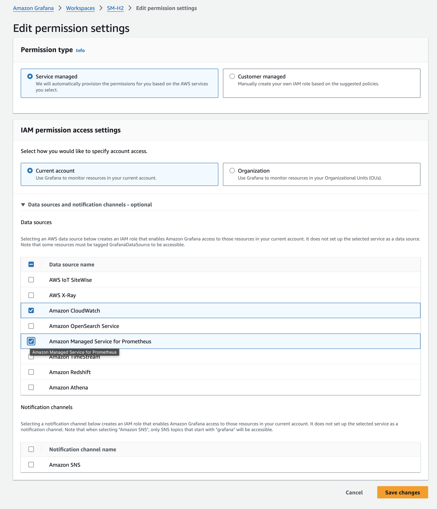
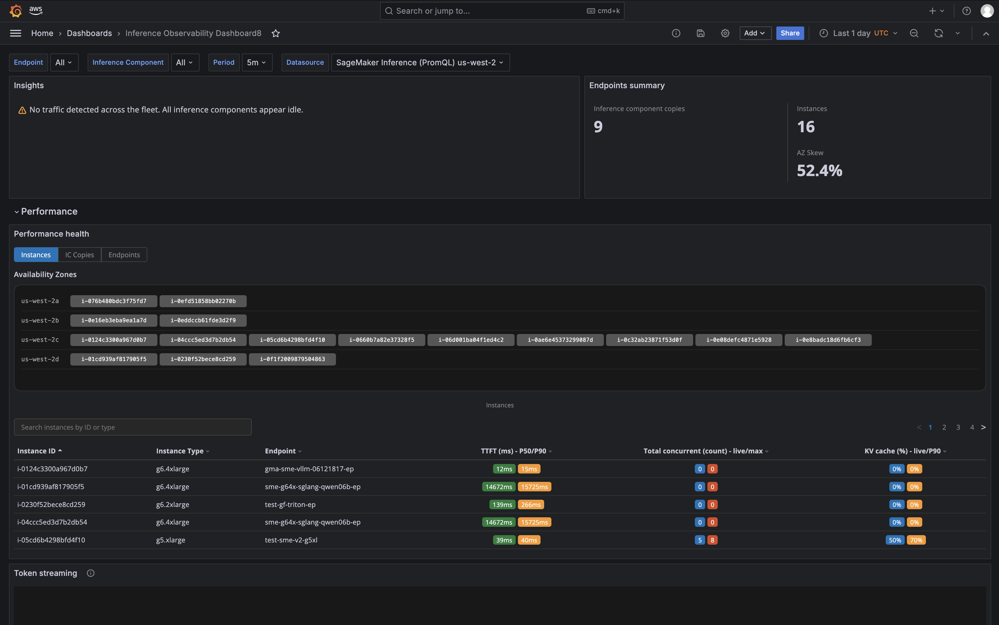

# Connect to your observability tool

To query detailed observability metrics from your existing observability tool instead of
using the SageMaker AI Insights dashboard in Amazon CloudWatch, SageMaker AI publishes metrics to Amazon CloudWatch through a
regional PromQL endpoint that is compatible with Prometheus-based tools, including Amazon Managed
Grafana, self-hosted Grafana, and other PromQL-compatible platforms. You authenticate using
AWS Signature Version 4 (SigV4). This section describes how to configure a Prometheus data
source, import the pre-configured dashboard template, and write PromQL queries for your
inference metrics.

## PromQL endpoint and authentication

| PromQL connection settings | Setting                                                                               | Value |
| -------------------------- | ------------------------------------------------------------------------------------- | ----- |
| Endpoint URL               | `https://monitoring.`region`.amazonaws.com`                                           |
| Auth                       | Signature Version 4 (SigV4)                                                           |
| Service                    | `monitoring`                                                                          |
| Required permissions       | `cloudwatch:QueryMetrics`,<br>`cloudwatch:GetMetricData`,<br>`cloudwatch:ListMetrics` |

## Setting up a Prometheus data source in Grafana

### Option 1: Amazon Managed Prometheus (recommended for AMG)

1. Open AMG workspace → **Data Sources** →
   **Add** → **Amazon Managed Service for
   Prometheus**
2. Name: `SageMaker Inference (PromQL) `region``
3. URL: `https://monitoring.`region`.amazonaws.com`
4. Default Region: `region`
5. Service: `monitoring`
6. Click **Save and test**



### Option 2: Standard Prometheus data source

```
{
    "name": "SageMaker Inference (PromQL)",
    "type": "prometheus",
    "url": "https://monitoring.`region`.amazonaws.com",
    "access": "proxy",
    "jsonData": {
        "sigV4Auth": true,
        "sigV4AuthType": "default",
        "sigV4Region": "`region`",
        "sigV4Service": "monitoring",
        "httpMethod": "POST"
    }
}
```

## IAM policy

```
{
    "Version": "2012-10-17",
    "Statement": [{
        "Effect": "Allow",
        "Action": [
            "cloudwatch:QueryMetrics",
            "cloudwatch:DescribeMetrics",
            "cloudwatch:GetMetricData",
            "cloudwatch:ListMetrics"
        ],
        "Resource": "*"
    }]
}
```

## Importing the dashboard template

1. SageMaker AI Console → Endpoints → "Connect to your observability tool" →
   **Dashboard template** tab
2. Click **Download Grafana Template** (JSON)
3. In Grafana: **Dashboards** → **Import**
   → **Upload JSON**
4. Select your data source → **Import**

The template has 3 sections (Performance, Capacity, Reliability) matching the SageMaker AI
Insights dashboard.



## OTel labels available in PromQL

In PromQL, labels with dots must be enclosed in single quotes:

| OTel labels                                | Label                    | Description |
| ------------------------------------------ | ------------------------ | ----------- |
| `'aws.sagemaker.endpoint.name'`            | Endpoint name            |
| `'aws.sagemaker.inference_component.name'` | IC name                  |
| `'aws.sagemaker.inference_framework'`      | Framework (vllm, sglang) |
| `'aws.sagemaker.variant.name'`             | Variant name             |
| `@resource.host.id`                        | Instance ID              |
| `@resource.cloud.availability_zone`        | Availability zone        |
| `@resource.host.type`                      | Instance type            |

## Example PromQL queries

```
# GPU utilization per IC
avg by ('aws.sagemaker.inference_component.name') (
    DCGM_FI_DEV_GPU_UTIL{'aws.sagemaker.endpoint.name'="$endpoint"})

# Token throughput (total TPS)
sum(rate(vllm_prompt_tokens_total{'aws.sagemaker.endpoint.name'="$endpoint"}[5m]))
    + sum(rate(vllm_generation_tokens_total{'aws.sagemaker.endpoint.name'="$endpoint"}[5m]))

# TTFT P99
histogram_quantile(0.99, sum by (le) (
    rate(vllm_time_to_first_token_seconds_bucket{'aws.sagemaker.endpoint.name'="$endpoint"}[5m])))

# KV cache utilization
avg(vllm_kv_cache_usage_perc{'aws.sagemaker.endpoint.name'="$endpoint"})

# Queue depth per IC
sum by ('aws.sagemaker.inference_component.name') (
    vllm_num_requests_waiting{'aws.sagemaker.endpoint.name'="$endpoint"})

# CPU utilization (computed)
100 * (1 - avg by ('aws.sagemaker.endpoint.name') (
    rate(node_cpu_seconds_total{mode="idle",'aws.sagemaker.endpoint.name'="$endpoint"}[5m])))

# Error rate (5XX)
sum(rate(Response_5XX_total{'aws.sagemaker.endpoint.name'="$endpoint"}[5m]))
```
