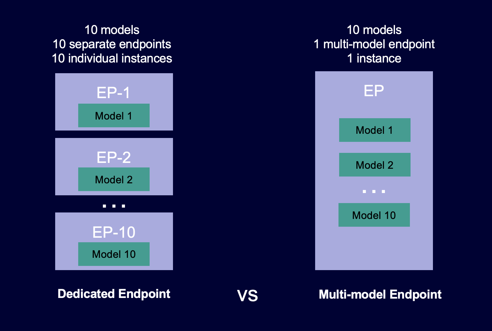

# Multi-model endpoints

Multi-model endpoints provide a scalable and cost-effective solution to deploying large
numbers of models. They use the same fleet of resources and a shared serving container to host
all of your models. This reduces hosting costs by improving endpoint utilization compared with
using single-model endpoints. It also reduces deployment overhead because Amazon SageMaker AI manages
loading models in memory and scaling them based on the traffic patterns to your endpoint.

The following diagram shows how multi-model endpoints work compared to single-model
endpoints.

Multi-model endpoints are ideal for hosting a large number of models that use the same ML
framework on a shared serving container. If you have a mix of frequently and infrequently
accessed models, a multi-model endpoint can efficiently serve this traffic with fewer resources
and higher cost savings. Your application should be tolerant of occasional cold start-related
latency penalties that occur when invoking infrequently used models.

Multi-model endpoints support hosting both CPU and GPU backed models. By using GPU backed
models, you can lower your model deployment costs through increased usage of the endpoint and
its underlying accelerated compute instances.

Multi-model endpoints also enable time-sharing of memory resources across your models. This
works best when the models are fairly similar in size and invocation latency. When this is the
case, multi-model endpoints can effectively use instances across all models. If you have models
that have significantly higher transactions per second (TPS) or latency requirements, we
recommend hosting them on dedicated endpoints.

You can use multi-model endpoints with the following features:

- [AWS PrivateLink](../../../vpc/latest/userguide/endpoint-services-overview.md "../../../vpc/latest/userguide/endpoint-services-overview.md") and VPCs
- [Auto scaling](multi-model-endpoints-autoscaling.md "multi-model-endpoints-autoscaling.md")
- [Serial
  inference pipelines](inference-pipelines.md "inference-pipelines.md") (but only one multi-model enabled container can be included in
  an inference pipeline)
- A/B testing
  You can use the AWS SDK for Python (Boto) or the SageMaker AI console to create a multi-model endpoint. For CPU
  backed multi-model endpoints, you can create your endpoint with custom-built containers by
  integrating the [Multi Model
  Server](https://github.com/awslabs/multi-model-server "https://github.com/awslabs/multi-model-server") library.

###### Topics

- [How multi-model endpoints work](#how-multi-model-endpoints-work "#how-multi-model-endpoints-work")
- [Sample notebooks for multi-model
  endpoints](#multi-model-endpoint-sample-notebooks "#multi-model-endpoint-sample-notebooks")
- [Supported algorithms, frameworks, and instances for multi-model endpoints](multi-model-support.md "multi-model-support.md")
- [Instance recommendations for multi-model
  endpoint deployments](multi-model-endpoint-instance.md "multi-model-endpoint-instance.md")
- [Create
  a Multi-Model Endpoint](create-multi-model-endpoint.md "create-multi-model-endpoint.md")
- [Invoke a Multi-Model Endpoint](invoke-multi-model-endpoint.md "invoke-multi-model-endpoint.md")
- [Add or Remove Models](add-models-to-endpoint.md "add-models-to-endpoint.md")
- [Build Your Own Container for SageMaker AI
  Multi-Model Endpoints](build-multi-model-build-container.md "build-multi-model-build-container.md")
- [Multi-Model Endpoint Security](multi-model-endpoint-security.md "multi-model-endpoint-security.md")
- [CloudWatch Metrics for Multi-Model
  Endpoint Deployments](multi-model-endpoint-cloudwatch-metrics.md "multi-model-endpoint-cloudwatch-metrics.md")
- [Set SageMaker AI multi-model endpoint model caching
  behavior](multi-model-caching.md "multi-model-caching.md")
- [Set Auto Scaling Policies for Multi-Model
  Endpoint Deployments](multi-model-endpoints-autoscaling.md "multi-model-endpoints-autoscaling.md")

## How multi-model endpoints work

SageMaker AI manages the lifecycle of models hosted on multi-model endpoints in the container's
memory. Instead of downloading all of the models from an Amazon S3 bucket to the container when you
create the endpoint, SageMaker AI dynamically loads and caches them when you invoke them. When SageMaker AI
receives an invocation request for a particular model, it does the following:

1. Routes the request to an instance behind the endpoint.
2. Downloads the model from the S3 bucket to that instance's storage volume.
3. Loads the model to the container's memory (CPU or GPU, depending on whether you have
   CPU or GPU backed instances) on that accelerated compute instance. If the model is already
   loaded in the container's memory, invocation is faster because SageMaker AI doesn't need to
   download and load it.

SageMaker AI continues to route requests for a model to the instance where the model is already
loaded. However, if the model receives many invocation requests, and there are additional
instances for the multi-model endpoint, SageMaker AI routes some requests to another instance to
accommodate the traffic. If the model isn't already loaded on the second instance, the model
is downloaded to that instance's storage volume and loaded into the container's memory.

When an instance's memory utilization is high and SageMaker AI needs to load another model into
memory, it unloads unused models from that instance's container to ensure that there is enough
memory to load the model. Models that are unloaded remain on the instance's storage volume and
can be loaded into the container's memory later without being downloaded again from the S3
bucket. If the instance's storage volume reaches its capacity, SageMaker AI deletes any unused models
from the storage volume.

To delete a model, stop sending requests and delete it from the S3 bucket. SageMaker AI provides
multi-model endpoint capability in a serving container. Adding models to, and deleting them
from, a multi-model endpoint doesn't require updating the endpoint itself. To add a model, you
upload it to the S3 bucket and invoke it. You don’t need code changes to use it.

###### Note

When you update a multi-model endpoint, initial invocation requests on the endpoint
might experience higher latencies as Smart Routing in multi-model endpoints adapt to your
traffic pattern. However, once it learns your traffic pattern, you can experience low
latencies for most frequently used models. Less frequently used models may incur some cold
start latencies since the models are dynamically loaded to an instance.

## Sample notebooks for multi-model

endpoints

To learn more about how to use multi-model endpoints, you can try the following sample
notebooks:

- Examples for multi-model endpoints using CPU backed instances:
  - [Multi-Model Endpoint XGBoost Sample Notebook](https://sagemaker-examples.readthedocs.io/en/latest/advanced_functionality/multi_model_xgboost_home_value/xgboost_multi_model_endpoint_home_value.html "https://sagemaker-examples.readthedocs.io/en/latest/advanced_functionality/multi_model_xgboost_home_value/xgboost_multi_model_endpoint_home_value.html") – This notebook shows
    how to deploy multiple XGBoost models to an endpoint.
  - [Multi-Model Endpoints BYOC Sample Notebook](https://sagemaker-examples.readthedocs.io/en/latest/advanced_functionality/multi_model_bring_your_own/multi_model_endpoint_bring_your_own.html "https://sagemaker-examples.readthedocs.io/en/latest/advanced_functionality/multi_model_bring_your_own/multi_model_endpoint_bring_your_own.html") – This notebook shows how
    to set up and deploy a customer container that supports multi-model endpoints in
    SageMaker AI.

- Example for multi-model endpoints using GPU backed instances:
  - [Run multiple deep learning models on GPUs with Amazon SageMaker AI Multi-model endpoints
    (MME)](https://github.com/aws/amazon-sagemaker-examples/blob/main/multi-model-endpoints/mme-on-gpu/cv/resnet50_mme_with_gpu.ipynb "https://github.com/aws/amazon-sagemaker-examples/blob/main/multi-model-endpoints/mme-on-gpu/cv/resnet50_mme_with_gpu.ipynb") – This notebook shows how to use an NVIDIA Triton Inference
    container to deploy ResNet-50 models to a multi-model endpoint.

For instructions on how to create and access Jupyter notebook instances that you can use to
run the previous examples in SageMaker AI, see [Amazon SageMaker notebook instances](nbi.md "nbi.md"). After you've
created a notebook instance and opened it, choose the **SageMaker AI Examples** tab
to see a list of all the SageMaker AI samples. The multi-model endpoint notebooks are located in the
**ADVANCED FUNCTIONALITY** section. To open a notebook, choose its
**Use** tab and choose **Create copy**.

For more information about use cases for multi-model endpoints, see the following blogs
and resources:

- Video: [Hosting
  thousands of models on SageMaker AI](https://www.youtube.com/watch?v=XqCNTWmHsLc&t=751s "https://www.youtube.com/watch?v=XqCNTWmHsLc&t=751s")
- Video: [SageMaker AI ML for
  SaaS](https://www.youtube.com/watch?v=BytpYlJ3vsQ "https://www.youtube.com/watch?v=BytpYlJ3vsQ")
- Blog: [How to scale machine learning inference for multi-tenant SaaS use cases](https://aws.amazon.com/blogs/machine-learning/how-to-scale-machine-learning-inference-for-multi-tenant-saas-use-cases/ "https://aws.amazon.com/blogs/machine-learning/how-to-scale-machine-learning-inference-for-multi-tenant-saas-use-cases/")
- Case study: [Veeva Systems](https://aws.amazon.com/partners/success/advanced-clinical-veeva/ "https://aws.amazon.com/partners/success/advanced-clinical-veeva/")
