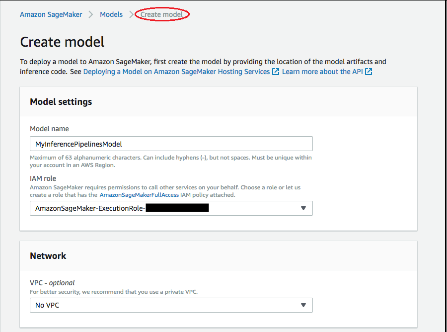
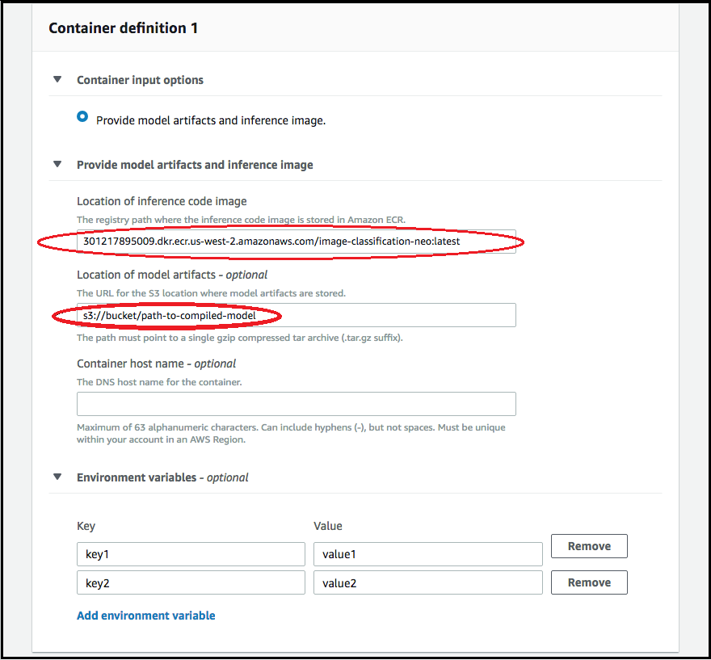
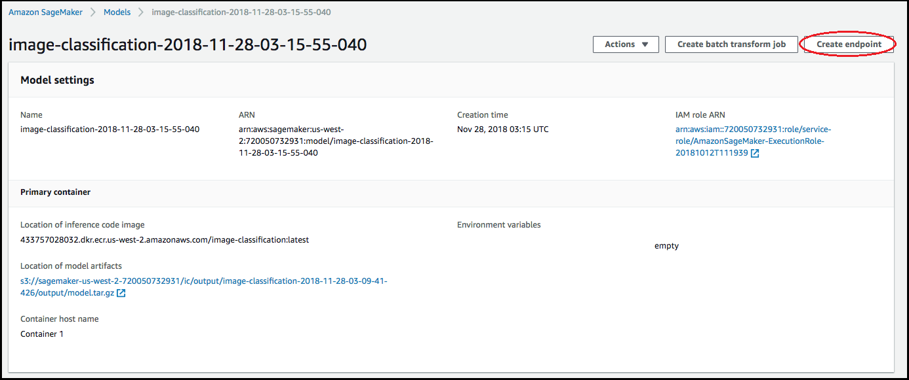
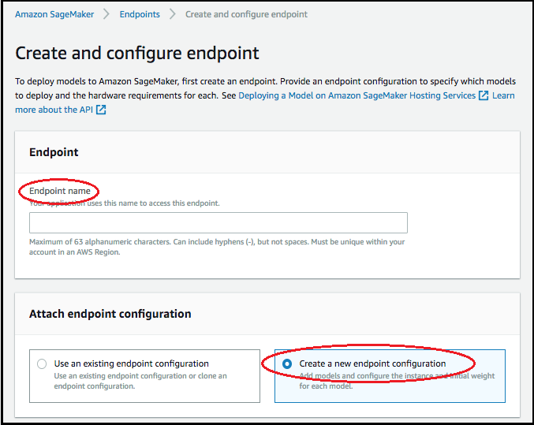
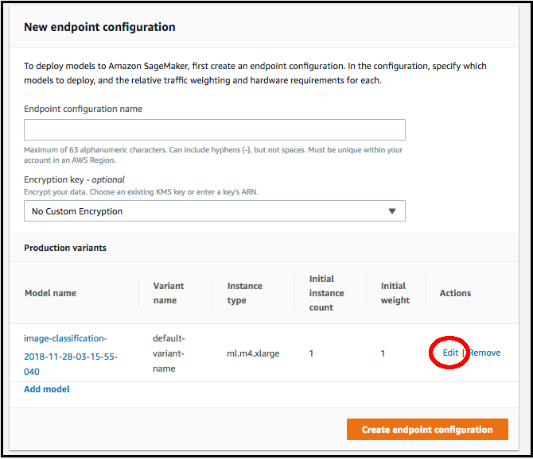
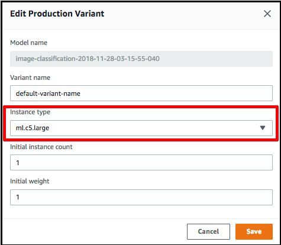

# Deploy a Compiled Model

Using the Console

You must satisfy the [prerequisites](neo-deployment-hosting-services-prerequisites.md "neo-deployment-hosting-services-prerequisites.md") section if the model was compiled using AWS SDK for Python (Boto3), the
AWS CLI, or the Amazon SageMaker AI console. Follow the steps below to create and deploy a SageMaker AI
Neo-compiled model using the SageMaker AI
console[https://console.aws.amazon.com/ SageMaker AI](https://console.aws.amazon.com/sagemaker/ "https://console.aws.amazon.com/sagemaker/").

###### Topics

- [Deploy the Model](#deploy-the-model-console-steps "#deploy-the-model-console-steps")

## Deploy the Model

After you have satisfied the [prerequisites](neo-deployment-hosting-services-prerequisites.md "neo-deployment-hosting-services-prerequisites.md"), use the following steps to deploy a model compiled with
Neo:

1. Choose **Models**, and then choose **Create
   models** from the **Inference** group. On
   the **Create model** page, complete the **Model
   name**, **IAM role**, and
   **VPC** fields (optional), if needed.

 2. To add information about the container used to deploy your model, choose
**Add container** container, then choose
**Next**. Complete the **Container input
options**, **Location of inference code
image**, and **Location of model artifacts**,
and optionally, **Container host name**, and
**Environmental variables** fields.

 3. To deploy Neo-compiled models, choose the following:

    * **Container input options**: Choose **Provide
     model artifacts and inference image**.
    * **Location of inference code image**: Choose the
     inference image URI from [Neo Inference Container Images](neo-deployment-hosting-services-container-images.md "neo-deployment-hosting-services-container-images.md"), depending on the AWS
     Region and kind of application.
    * **Location of model artifact**: Enter the Amazon S3 bucket URI
     of the compiled model artifact generated by the Neo compilation
     API.
    * **Environment variables**:

    	+ Leave this field blank for **SageMaker
    	 XGBoost**.
    	+ If you trained your model using SageMaker AI, specify the environment
    	 variable `SAGEMAKER_SUBMIT_DIRECTORY` as the Amazon S3
    	 bucket URI that contains the training script.
    	+ If you did not train your model using SageMaker AI, specify the following
    	 environment variables:

    	| Key | Values for MXNet and PyTorch | Values TensorFlow |
    	| --- | --- | --- |
    	| SAGEMAKER\_PROGRAM | inference.py | inference.py |
    	| SAGEMAKER\_SUBMIT\_DIRECTORY | /opt/ml/model/code | /opt/ml/model/code |
    	| SAGEMAKER\_CONTAINER\_LOG\_LEVEL | 20 | 20 |
    	| SAGEMAKER\_REGION | <your region> | <your region> |
    	| MMS\_DEFAULT\_RESPONSE\_TIMEOUT | 500 | Leave this field blank for TF |

4. Confirm that the information for the containers is accurate, and then
   choose **Create model**. On the **Create model
   landing page**, choose **Create
   endpoint**.

 5. In **Create and configure endpoint** diagram, specify
the **Endpoint name**. For **Attach endpoint
configuration**, choose **Create a new endpoint
configuration**.

 6. In **New endpoint configuration** page, specify the
**Endpoint configuration name**.

 7. Choose **Edit** next to the name of the model and specify
the correct **Instance type** on the **Edit
Production Variant** page. It is imperative that the
**Instance type** value match the one specified in your
compilation job.

 8. Choose **Save**. 9. On the **New endpoint configuration** page, choose
**Create endpoint configuration**, and then choose
**Create endpoint**.
