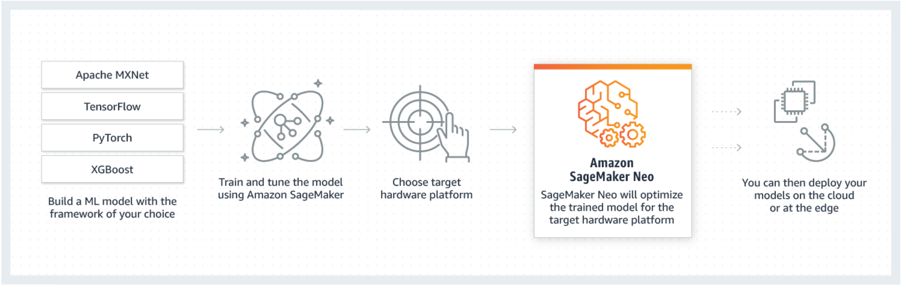

# Model performance optimization with SageMaker Neo

Neo is a capability of Amazon SageMaker AI that enables machine learning models to train once and run
anywhere in the cloud and at the edge.

If you are a first time user of SageMaker Neo, we recommend you check out the [Getting
Started with Edge Devices](neo-getting-started-edge.md "neo-getting-started-edge.md") section to get step-by-step instructions on how to
compile and deploy to an edge device.

## What is SageMaker Neo?

Generally, optimizing machine learning models for inference on multiple platforms is
difficult because you need to hand-tune models for the specific hardware and software
configuration of each platform. If you want to get optimal performance for a given
workload, you need to know the hardware architecture, instruction set, memory access
patterns, and input data shapes, among other factors. For traditional software
development, tools such as compilers and profilers simplify the process. For machine
learning, most tools are specific to the framework or to the hardware. This forces you
into a manual trial-and-error process that is unreliable and unproductive.

Neo automatically optimizes Gluon, Keras, MXNet, PyTorch, TensorFlow, TensorFlow-Lite,
and ONNX models for inference on Android, Linux, and Windows machines based on
processors from Ambarella, ARM, Intel, Nvidia, NXP, Qualcomm, Texas Instruments, and
Xilinx. Neo is tested with computer vision models available in the model zoos across the
frameworks. SageMaker Neo supports compilation and deployment for two main platforms:
cloud instances (including Inferentia) and edge devices.

For more information about supported frameworks and cloud instance types you can deploy to,
see [Supported Instance Types and Frameworks](neo-supported-cloud.md "neo-supported-cloud.md") for cloud
instances.

For more information about supported frameworks, edge devices,
operating systems, chip architectures, and common machine learning models tested by SageMaker AI
Neo for edge devices, see
[Supported Frameworks, Devices, Systems, and Architectures](neo-supported-devices-edge.md "neo-supported-devices-edge.md")
for edge devices.

## How it Works

Neo consists of a compiler and a runtime. First, the Neo compilation API reads models
exported from various frameworks. It converts the framework-specific functions and
operations into a framework-agnostic intermediate representation. Next, it performs a
series of optimizations. Then it generates binary code for the optimized operations,
writes them to a shared object library, and saves the model definition and parameters
into separate files. Neo also provides a runtime for each target platform that loads and
executes the compiled model.

You can create a Neo compilation job from either the SageMaker AI console, the AWS Command Line Interface
(AWS CLI), a Python notebook, or the SageMaker AI SDK.For information on how to compile a model, see
[Model Compilation with Neo](neo-job-compilation.md "neo-job-compilation.md"). With a few
CLI commands, an API invocation, or a few clicks, you can convert a model for your chosen
platform. You can deploy the model to a SageMaker AI endpoint or on an AWS IoT Greengrass device quickly.

Neo can optimize models with parameters either in FP32 or quantized to INT8 or FP16
bit-width.

###### Topics

- [Model Compilation with Neo](neo-job-compilation.md "neo-job-compilation.md")
- [Cloud Instances](neo-cloud-instances.md "neo-cloud-instances.md")
- [Edge Devices](neo-edge-devices.md "neo-edge-devices.md")
- [Troubleshoot Errors](neo-troubleshooting.md "neo-troubleshooting.md")
