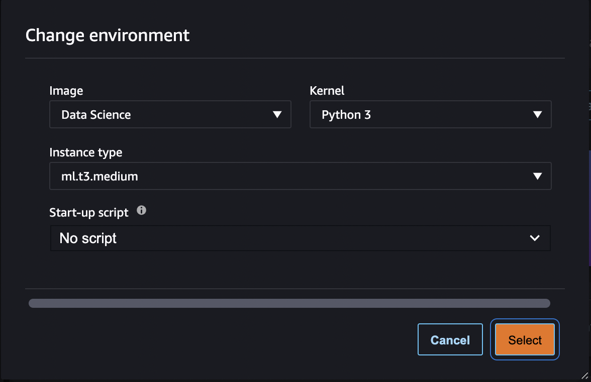
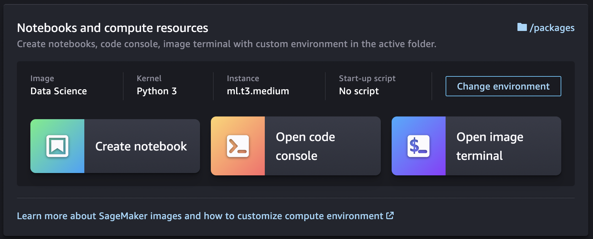

# Create or Open an Amazon SageMaker Studio Classic Notebook

###### Important

Custom IAM policies that allow Amazon SageMaker Studio or Amazon SageMaker Studio Classic to create Amazon SageMaker
resources must also grant permissions to add tags to those resources. The permission to
add tags to resources is required because Studio and Studio Classic automatically tag
any resources they create. If an IAM policy allows Studio and Studio Classic to
create resources but does not allow tagging, "AccessDenied" errors can occur when
trying to create resources. For more information, see [Provide permissions for tagging SageMaker AI
resources](security_iam_id-based-policy-examples.md#grant-tagging-permissions "security_iam_id-based-policy-examples.md#grant-tagging-permissions").

[AWS managed policies for Amazon SageMaker AI](security-iam-awsmanpol.md "security-iam-awsmanpol.md")
that give permissions to create SageMaker resources already include permissions to add tags
while creating those resources.

###### Important

As of November 30, 2023, the previous Amazon SageMaker Studio experience is now named
Amazon SageMaker Studio Classic. The following section is specific to using the Studio Classic application. For
information about using the updated Studio experience, see [Amazon SageMaker Studio](studio-updated.md "studio-updated.md").

Studio Classic is still maintained for existing
workloads but is no longer available for onboarding. You can only stop or delete existing Studio Classic
applications and cannot create new ones. We recommend that you [migrate your workload to the new Studio experience](studio-updated-migrate.md "studio-updated-migrate.md").

When you [Create a Notebook from the File Menu](#notebooks-create-file-menu "#notebooks-create-file-menu") in Amazon SageMaker Studio Classic or [Open a notebook in Studio Classic](#notebooks-open "#notebooks-open") for the first time, you are
prompted to set up your environment by choosing a SageMaker image, a kernel, an instance type, and,
optionally, a lifecycle configuration script that runs on image start-up. SageMaker AI launches the
notebook on an instance of the chosen type. By default, the instance type is set to
`ml.t3.medium` (available as part of the [AWS
Free Tier](https://aws.amazon.com/free "https://aws.amazon.com/free")) for CPU-based images. For GPU-based images, the default instance type is
`ml.g4dn.xlarge`.

If you create or open additional notebooks that use the same instance type, whether or not
the notebooks use the same kernel, the notebooks run on the same instance of that instance
type.

After you launch a notebook, you can change its instance type, SageMaker image, and kernel from
within the notebook. For more information, see [Change the Instance
Type for an Amazon SageMaker Studio Classic Notebook](notebooks-run-and-manage-switch-instance-type.md "notebooks-run-and-manage-switch-instance-type.md") and [Change the Image or a Kernel for an Amazon SageMaker Studio Classic Notebook](notebooks-run-and-manage-change-image.md "notebooks-run-and-manage-change-image.md").

###### Note

You can have only one instance of each instance type. Each instance can have multiple
SageMaker images running on it. Each SageMaker image can run multiple kernels or terminal instances.

Billing occurs per instance and starts when the first instance of a given instance type is
launched. If you want to create or open a notebook without the risk of incurring charges, open
the notebook from the **File** menu and choose **No Kernel**
from the **Select Kernel** dialog box. You can read and edit a notebook
without a running kernel but you can't run cells.

Billing ends when the SageMaker image for the instance is shut down. For more information, see
[Usage Metering for Amazon SageMaker Studio Classic Notebooks](notebooks-usage-metering.md "notebooks-usage-metering.md").

For information about shutting down the notebook, see [Shut down resources](notebooks-run-and-manage-shut-down.md#notebooks-run-and-manage-shut-down-sessions "notebooks-run-and-manage-shut-down.md#notebooks-run-and-manage-shut-down-sessions").

###### Topics

- [Open a notebook in Studio Classic](#notebooks-open "#notebooks-open")
- [Create a Notebook from the File Menu](#notebooks-create-file-menu "#notebooks-create-file-menu")
- [Create a Notebook from the Launcher](#notebooks-create-launcher "#notebooks-create-launcher")
- [List of the available instance types,
  images, and kernels](#notebooks-instance-image-kernels "#notebooks-instance-image-kernels")

## Open a notebook in Studio Classic

Amazon SageMaker Studio Classic can only open notebooks listed in the Studio Classic file browser. For
instructions on uploading a notebook to the file browser, see [Upload Files to Amazon SageMaker Studio Classic](studio-tasks-files.md "studio-tasks-files.md") or [Clone a Git Repository in Amazon SageMaker Studio Classic](studio-tasks-git.md "studio-tasks-git.md").

###### To open a notebook

1. In the left sidebar, choose the **File Browser** icon (
   
   ) to display the file browser.
2. Browse to a notebook file and double-click it to open the notebook in a new
   tab.

## Create a Notebook from the File Menu

###### To create a notebook from the File menu

1. From the Studio Classic menu, choose **File**, choose
   **New**, and then choose **Notebook**.
2. In the **Change environment** dialog box, use the dropdown menus to
   select your **Image**, **Kernel**, **Instance
   type**, and **Start-up script**, then choose
   **Select**. Your notebook launches and opens in a new Studio Classic
   tab.

## Create a Notebook from the Launcher

###### To create a notebook from the Launcher

1. To open the Launcher, choose **Amazon SageMaker Studio Classic** at the top left of
   the Studio Classic interface or use the keyboard shortcut `Ctrl + Shift +
L`.

To learn about all the available ways to open the Launcher, see [Use the Amazon SageMaker Studio Classic Launcher](studio-launcher.md "studio-launcher.md") 2. In the Launcher, in the **Notebooks and compute resources**
section, choose **Change environment**.

 3. In the **Change environment** dialog box, use the dropdown menus to
select your **Image**, **Kernel**, **Instance
type**, and **Start-up script**, then choose
**Select**. 4. In the Launcher, choose **Create notebook**. Your notebook launches
and opens in a new Studio Classic tab.

To view the notebook's kernel session, in the left sidebar, choose the **Running
Terminals and Kernels** icon (

). You can stop the notebook's kernel session from this view.

## List of the available instance types,

images, and kernels

For a list of all available resources, see:

- [Instance Types Available for Use With
  Amazon SageMaker Studio Classic Notebooks](notebooks-available-instance-types.md "notebooks-available-instance-types.md")
- [Amazon SageMaker Images Available for Use With
  Studio Classic Notebooks](notebooks-available-images.md "notebooks-available-images.md")
