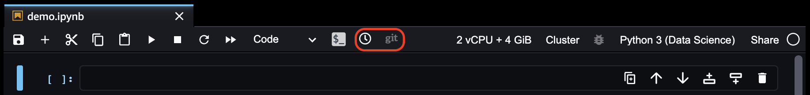
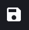
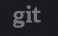

# Get Notebook Differences in Amazon SageMaker Studio Classic

###### Important

Custom IAM policies that allow Amazon SageMaker Studio or Amazon SageMaker Studio Classic to create Amazon SageMaker
resources must also grant permissions to add tags to those resources. The permission to
add tags to resources is required because Studio and Studio Classic automatically tag
any resources they create. If an IAM policy allows Studio and Studio Classic to
create resources but does not allow tagging, "AccessDenied" errors can occur when
trying to create resources. For more information, see [Provide permissions for tagging SageMaker AI
resources](security_iam_id-based-policy-examples.md#grant-tagging-permissions "security_iam_id-based-policy-examples.md#grant-tagging-permissions").

[AWS managed policies for Amazon SageMaker AI](security-iam-awsmanpol.md "security-iam-awsmanpol.md")
that give permissions to create SageMaker resources already include permissions to add tags
while creating those resources.

###### Important

As of November 30, 2023, the previous Amazon SageMaker Studio experience is now named
Amazon SageMaker Studio Classic. The following section is specific to using the Studio Classic application. For
information about using the updated Studio experience, see [Amazon SageMaker Studio](studio-updated.md "studio-updated.md").

Studio Classic is still maintained for existing
workloads but is no longer available for onboarding. You can only stop or delete existing Studio Classic
applications and cannot create new ones. We recommend that you [migrate your workload to the new Studio experience](studio-updated-migrate.md "studio-updated-migrate.md").

You can display the difference between the current notebook and the last checkpoint or the
last Git commit using the Amazon SageMaker AI UI.

The following screenshot shows the menu from a Studio Classic notebook.

###### Topics

- [Get the Difference Between the Last
  Checkpoint](#notebooks-diff-checkpoint "#notebooks-diff-checkpoint")
- [Get the Difference Between the Last Commit](#notebooks-diff-git "#notebooks-diff-git")

## Get the Difference Between the Last

Checkpoint

When you create a notebook, a hidden checkpoint file that matches the notebook is
created. You can view changes between the notebook and the checkpoint file or revert the
notebook to match the checkpoint file.

By default, a notebook is auto-saved every 120 seconds and also when you close the
notebook. However, the checkpoint file isn't updated to match the notebook. To save the
notebook and update the checkpoint file to match, you must choose the **Save
notebook and create checkpoint** icon (

) on the left of the notebook menu or use the `Ctrl + S`
keyboard shortcut.

To view the changes between the notebook and the checkpoint file, choose the
**Checkpoint diff** icon (

) in the center of the notebook menu.

To revert the notebook to the checkpoint file, from the main Studio Classic menu, choose
**File** then **Revert Notebook to Checkpoint**.

## Get the Difference Between the Last Commit

If a notebook is opened from a Git repository, you can view the difference between the
notebook and the last Git commit.

To view the changes in the notebook from the last Git commit, choose the **Git
diff** icon (

) in the center of the notebook menu.
