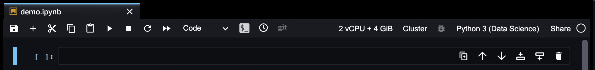

# Use the Studio Classic Notebook Toolbar

###### Important

As of November 30, 2023, the previous Amazon SageMaker Studio experience is now named
Amazon SageMaker Studio Classic. The following section is specific to using the Studio Classic application. For
information about using the updated Studio experience, see [Amazon SageMaker Studio](studio-updated.md "studio-updated.md").

Studio Classic is still maintained for existing
workloads but is no longer available for onboarding. You can only stop or delete existing Studio Classic
applications and cannot create new ones. We recommend that you [migrate your workload to the new Studio experience](studio-updated-migrate.md "studio-updated-migrate.md").

Amazon SageMaker Studio Classic notebooks extend the JupyterLab interface. For an overview of the original JupyterLab
interface, see [The JupyterLab
Interface](https://jupyterlab.readthedocs.io/en/latest/user/interface.html "https://jupyterlab.readthedocs.io/en/latest/user/interface.html").

The following image shows the toolbar and an empty cell from a Studio Classic notebook.

When you pause on a toolbar icon, a tooltip displays the icon function. Additional
notebook commands are found in the Studio Classic main menu. The toolbar includes the following
icons:

| Icon                                       | Description                                                                                                                                                                                                                                                                                                                                                                                                                                                                                                                                                                                                                                                                                                                                                                                                                          |
| ------------------------------------------ | ------------------------------------------------------------------------------------------------------------------------------------------------------------------------------------------------------------------------------------------------------------------------------------------------------------------------------------------------------------------------------------------------------------------------------------------------------------------------------------------------------------------------------------------------------------------------------------------------------------------------------------------------------------------------------------------------------------------------------------------------------------------------------------------------------------------------------------ |
| The Save and checkpoint icon.              | **Save and checkpoint** Saves the notebook and updates the checkpoint file. For more information, see [Get the Difference Between the Last Checkpoint](notebooks-diff.md#notebooks-diff-checkpoint "notebooks-diff.md#notebooks-diff-checkpoint").                                                                                                                                                                                                                                                                                                                                                                                                                                                                                                                                                                          |
| The Insert cell icon.                      | **Insert cell** Inserts a code cell below the current cell. The current cell is noted by the blue vertical marker in the left margin.                                                                                                                                                                                                                                                                                                                                                                                                                                                                                                                                                                                                                                                                                          |
| The Cut, copy, and paste cells icons.      | **Cut, copy, and paste cells** Cuts, copies, and pastes the selected cells.                                                                                                                                                                                                                                                                                                                                                                                                                                                                                                                                                                                                                                                                                                                                                       |
| The Run cells icon.                        | **Run cells** Runs the selected cells and then makes the cell that follows the last selected cell the new selected cell.                                                                                                                                                                                                                                                                                                                                                                                                                                                                                                                                                                                                                                                                                                       |
| The Interrupt kernel icon.                 | **Interrupt kernel** Interrupts the kernel, which cancels the currently running operation. The kernel remains active.                                                                                                                                                                                                                                                                                                                                                                                                                                                                                                                                                                                                                                                                                                          |
| The Restart kernel icon.                   | **Restart kernel** Restarts the kernel. Variables are reset. Unsaved information is not affected.                                                                                                                                                                                                                                                                                                                                                                                                                                                                                                                                                                                                                                                                                                                                 |
| The Restart kernel and run all cells icon. | **Restart kernel and run all cells** Restarts the kernel, then run all the cells of the notebook.                                                                                                                                                                                                                                                                                                                                                                                                                                                                                                                                                                                                                                                                                                                                 |
| The Cell type icon.                        | **Cell type** Displays or changes the current cell type. The cell types are: • Code – Code that the kernel runs. • Markdown – Text rendered as markdown. • Raw – Content, including Markdown markup, that's displayed as text.                                                                                                                                                                                                                                                                                                                                                                                                                                                                                                                                                                                           |
| The Launch terminal icon.                  | **Launch terminal** Launches a terminal in the SageMaker image hosting the notebook. For an example, see [Get App Metadata](notebooks-run-and-manage-metadata.md#notebooks-run-and-manage-metadata-app "notebooks-run-and-manage-metadata.md#notebooks-run-and-manage-metadata-app").                                                                                                                                                                                                                                                                                                                                                                                                                                                                                                                                       |
| The Checkpoint diff icon.                  | **Checkpoint diff** Opens a new tab that displays the difference between the notebook and the checkpoint file. For more information, see [Get the Difference Between the Last Checkpoint](notebooks-diff.md#notebooks-diff-checkpoint "notebooks-diff.md#notebooks-diff-checkpoint").                                                                                                                                                                                                                                                                                                                                                                                                                                                                                                                                    |
| The Git diff icon.                         | **Git diff** Only enabled if the notebook is opened from a Git repository. Opens a new tab that displays the difference between the notebook and the last Git commit. For more information, see [Get the Difference Between the Last Commit](notebooks-diff.md#notebooks-diff-git "notebooks-diff.md#notebooks-diff-git").                                                                                                                                                                                                                                                                                                                                                                                                                                                                                               |
| **2 vCPU + 4 GiB**                         | **Instance type** Displays or changes the instance type the notebook runs in. The format is as follows: `number of vCPUs + amount of memory + number of GPUs` `Unknown` indicates the notebook was opened without specifying a kernel. The notebook runs on the SageMaker Studio instance and doesn't accrue runtime charges. You can't assign the notebook to an instance type. You must specify a kernel and then Studio assigns the notebook to a default type. For more information, see [Create or Open an Amazon SageMaker Studio Classic Notebook](notebooks-create-open.md "notebooks-create-open.md") and [Change the Instance Type for an Amazon SageMaker Studio Classic Notebook](notebooks-run-and-manage-switch-instance-type.md "notebooks-run-and-manage-switch-instance-type.md"). |
| The Cluster icon.                          | **Cluster** Connect your notebook to an Amazon EMR cluster and scale your ETL jobs or run large-scale model training using Apache Spark, Hive, or Presto. For more information, see [Data preparation using Amazon EMR](studio-notebooks-emr-cluster.md "studio-notebooks-emr-cluster.md").                                                                                                                                                                                                                                                                                                                                                                                                                                                                                                                                 |
| **Python 3 (Data Science)**                | **Kernel and SageMaker Image** Displays or changes the kernel that processes the cells in the notebook. The format is as follows: `Kernel (SageMaker Image)` `No Kernel` indicates the notebook was opened without specifying a kernel. You can edit the notebook but you can't run any cells. For more information, see [Change the Image or a Kernel for an Amazon SageMaker Studio Classic Notebook](notebooks-run-and-manage-change-image.md "notebooks-run-and-manage-change-image.md").                                                                                                                                                                                                                                                                                                                   |
| The Kernel busy status icon.               | **Kernel busy status** Displays the busy status of the kernel. When the edge of the circle and its interior are the same color, the kernel is busy. The kernel is busy when it is starting and when it is processing cells. Additional kernel states are displayed in the status bar at the bottom-left corner of SageMaker Studio.                                                                                                                                                                                                                                                                                                                                                                                                                                                                                      |
| The Share notebook icon.                   | **Share notebook** Shares the notebook. For more information, see [Share and Use an Amazon SageMaker Studio Classic Notebook](notebooks-sharing.md "notebooks-sharing.md").                                                                                                                                                                                                                                                                                                                                                                                                                                                                                                                                                                                                                                                    |

To select multiple cells, click in the left margin outside of a cell. Hold down the
`Shift` key and use `K` or the `Up` key to select previous
cells, or use `J` or the `Down` key to select following cells.
