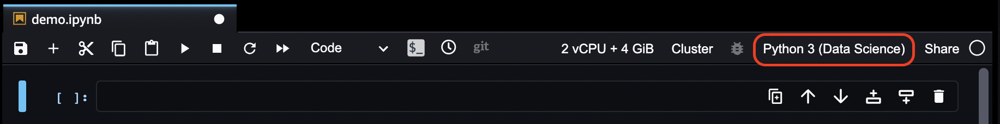

# Change the Image or a Kernel for an Amazon SageMaker Studio Classic Notebook

###### Important

As of November 30, 2023, the previous Amazon SageMaker Studio experience is now named
Amazon SageMaker Studio Classic. The following section is specific to using the Studio Classic application. For
information about using the updated Studio experience, see [Amazon SageMaker Studio](studio-updated.md "studio-updated.md").

Studio Classic is still maintained for existing
workloads but is no longer available for onboarding. You can only stop or delete existing Studio Classic
applications and cannot create new ones. We recommend that you [migrate your workload to the new Studio experience](studio-updated-migrate.md "studio-updated-migrate.md").

With Amazon SageMaker Studio Classic notebooks, you can change the notebook's image or kernel from within
the notebook.

The following screenshot shows the menu from a Studio Classic notebook. The current SageMaker AI
kernel and image are displayed as **Python 3 (Data Science)**, where
`Python 3` denotes the kernel and `Data Science` denotes the SageMaker AI
image that contains the kernel. The color of the circle to the right indicates the kernel is
idle or busy. The kernel is busy when the center and the edge of the circle are the same
color.

###### To change a notebook's image or kernel

1. Choose the image/kernel name in the notebook menu.
2. From the **Set up notebook environment** pop up window, select the
   **Image** or **Kernel** dropdown menu.
3. From the dropdown menu, choose one of the images or kernels that are listed.
4. After choosing an image or kernel, choose **Select**.
5. Wait for the kernel's status to show as idle, which indicates the kernel has
   started.
   For a list of available SageMaker images and kernels, see [Amazon SageMaker Images Available for Use With
   Studio Classic Notebooks](notebooks-available-images.md "notebooks-available-images.md").
