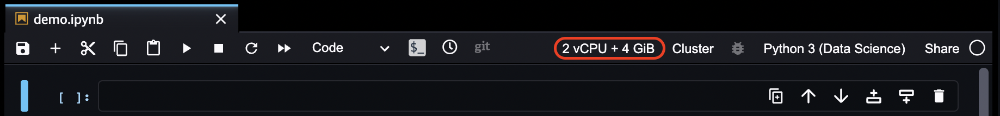

# Change the Instance

Type for an Amazon SageMaker Studio Classic Notebook

When you open a new Studio Classic notebook for the first time, you are assigned a default
Amazon Elastic Compute Cloud (Amazon EC2) instance type to run the notebook. When you open additional notebooks on
the same instance type, the notebooks run on the same instance as the first notebook, even
if the notebooks use different kernels.

You can change the instance type that your Studio Classic notebook runs on from within the
notebook.

The following information only applies to Studio Classic notebooks. For information about
how to change the instance type of a Amazon SageMaker notebook instance, see [Update a Notebook Instance](nbi-update.md "nbi-update.md").

###### Important

If you change the instance type, unsaved information and existing settings for the
notebook are lost, and installed packages must be re-installed.

The previous instance type continues to run even if no kernel sessions or apps are
active. You must explicitly stop the instance to stop accruing charges. To stop the
instance, see [Shut down resources](notebooks-run-and-manage-shut-down.md#notebooks-run-and-manage-shut-down-sessions "notebooks-run-and-manage-shut-down.md#notebooks-run-and-manage-shut-down-sessions").

The following screenshot shows the menu from a Studio Classic notebook. The processor and
memory of the instance type powering the notebook are displayed as **2 vCPU + 4
GiB**.

###### To change the instance type

1. Choose the processor and memory of the instance type powering the notebook. This
   opens a pop up window.
2. From the **Set up notebook environment** pop up window, select the
   **Instance type** dropdown menu.
3. From the **Instance type** dropdown, choose one of the instance
   types that are listed.
4. After choosing a type, choose **Select**.
5. Wait for the new instance to become enabled, and then the new instance type
   information is displayed.
   For a list of the available instance types, see [Instance Types Available for Use With
   Amazon SageMaker Studio Classic Notebooks](notebooks-available-instance-types.md "notebooks-available-instance-types.md").
