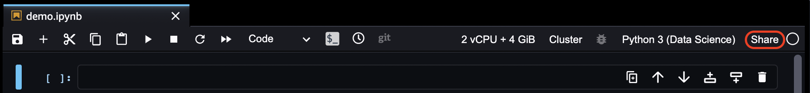

# Share and Use an Amazon SageMaker Studio Classic Notebook

###### Important

Custom IAM policies that allow Amazon SageMaker Studio or Amazon SageMaker Studio Classic to create Amazon SageMaker
resources must also grant permissions to add tags to those resources. The permission to
add tags to resources is required because Studio and Studio Classic automatically tag
any resources they create. If an IAM policy allows Studio and Studio Classic to
create resources but does not allow tagging, "AccessDenied" errors can occur when
trying to create resources. For more information, see [Provide permissions for tagging SageMaker AI
resources](security_iam_id-based-policy-examples.md#grant-tagging-permissions "security_iam_id-based-policy-examples.md#grant-tagging-permissions").

[AWS managed policies for Amazon SageMaker AI](security-iam-awsmanpol.md "security-iam-awsmanpol.md")
that give permissions to create SageMaker resources already include permissions to add tags
while creating those resources.

###### Important

As of November 30, 2023, the previous Amazon SageMaker Studio experience is now named
Amazon SageMaker Studio Classic. The following section is specific to using the Studio Classic application. For
information about using the updated Studio experience, see [Amazon SageMaker Studio](studio-updated.md "studio-updated.md").

Studio Classic is still maintained for existing
workloads but is no longer available for onboarding. You can only stop or delete existing Studio Classic
applications and cannot create new ones. We recommend that you [migrate your workload to the new Studio experience](studio-updated-migrate.md "studio-updated-migrate.md").

You can share your Amazon SageMaker Studio Classic notebooks with your colleagues. The shared notebook is a
copy. After you share your notebook, any changes you make to your original notebook aren't
reflected in the shared notebook and any changes your colleague's make in their shared copies
of the notebook aren't reflected in your original notebook. If you want to share your latest
version, you must create a new snapshot and then share it.

###### Topics

- [Share a Notebook](#notebooks-sharing-share "#notebooks-sharing-share")
- [Use a Shared Notebook](#notebooks-sharing-using "#notebooks-sharing-using")
- [Shared spaces and realtime collaboration](#notebooks-sharing-rtc "#notebooks-sharing-rtc")

## Share a Notebook

The following screenshot shows the menu from a Studio Classic notebook.

###### To share a notebook

1. In the upper-right corner of the notebook, choose **Share**.
2. (Optional) In **Create shareable snapshot**, choose any of the
   following items:
   - **Include Git repo information** – Includes a link to
     the Git repository that contains the notebook. This enables you and your colleague
     to collaborate and contribute to the same Git repository.
   - **Include output** – Includes all notebook output that
     has been saved.

###### Note

If you're an user in IAM Identity Center and you don't see these options, your IAM Identity Center
administrator probably disabled the feature. Contact your administrator. 3. Choose **Create**. 4. After the snapshot is created, choose **Copy link** and then choose
**Close**. 5. Share the link with your colleague.

After selecting your sharing options, you are provided with a URL. You can share this
link with users that have access to Amazon SageMaker Studio Classic. When the user opens the URL, they're
prompted to log in using IAM Identity Center or IAM authentication. This shared notebook becomes a copy,
so changes made by the recipient will not be reproduced in your original notebook.

## Use a Shared Notebook

You use a shared notebook in the same way you would with a notebook that you created
yourself. You must first login to your account, then open the shared link. If you don't have
an active session, you receive an error.

When you choose a link to a shared notebook for the first time, a read-only version of
the notebook opens. To edit the shared notebook, choose **Create a Copy**.
This copies the shared notebook to your personal storage.

The copied notebook launches on an instance of the instance type and SageMaker image that the
notebook was using when the sender shared it. If you aren't currently running an instance of
the instance type, a new instance is started. Customization to the SageMaker image isn't shared.
You can also inspect the notebook snapshot by choosing **Snapshot
Details**.

The following are some important considerations about sharing and authentication:

- If you have an active session, you see a read-only view of the notebook until you
  choose **Create a Copy**.
- If you don't have an active session, you need to log in.
- If you use IAM to login, after you login, select your user profile then choose
  **Open Studio Classic**. Then you need to choose the link you were
  sent.
- If you use IAM Identity Center to login, after you login the shared notebook is opened
  automatically in Studio.

## Shared spaces and realtime collaboration

A shared space consists of a shared JupyterServer application and a shared directory. A
key benefit of a shared space is that it facilitates collaboration between members of the
shared space in real time. Users collaborating in a workspace get access to a shared
Studio Classic application where they can access, read, and edit their notebooks in real time.
Real time collaboration is only supported for JupyterServer applications within a shared
space. Users with access to a shared space can simultaneously open, view, edit, and execute
Jupyter notebooks in the shared Studio Classic application in that space. For more information
about shared spaced and real time collaboration, see [Collaboration with shared spaces](domain-space.md "domain-space.md").
