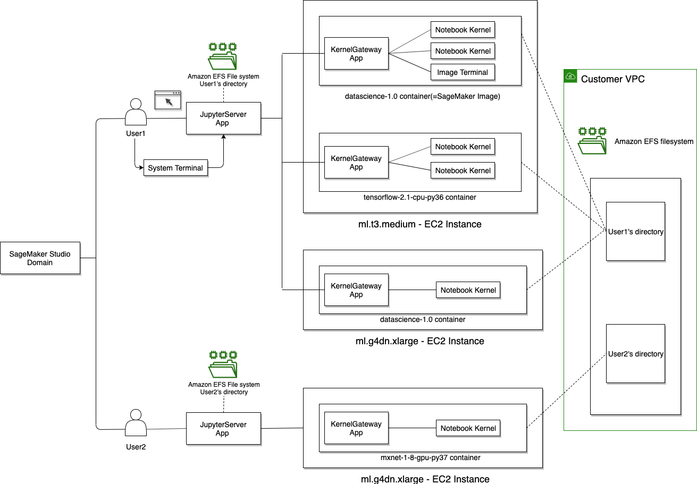

# Use Amazon SageMaker Studio Classic Notebooks

###### Important

As of November 30, 2023, the previous Amazon SageMaker Studio experience is now named
Amazon SageMaker Studio Classic. The following section is specific to using the Studio Classic application. For
information about using the updated Studio experience, see [Amazon SageMaker Studio](studio-updated.md "studio-updated.md").

Studio Classic is still maintained for existing
workloads but is no longer available for onboarding. You can only stop or delete existing Studio Classic
applications and cannot create new ones. We recommend that you [migrate your workload to the new Studio experience](studio-updated-migrate.md "studio-updated-migrate.md").

Amazon SageMaker Studio Classic notebooks are collaborative notebooks that you can launch quickly because you
don't need to set up compute instances and file storage beforehand. Studio Classic notebooks provide
persistent storage, which enables you to view and share notebooks even if the instances that the
notebooks run on are shut down.

You can share your notebooks with others, so that they can easily reproduce your results and
collaborate while building models and exploring your data. You provide access to a read-only
copy of the notebook through a secure URL. Dependencies for your notebook are included in the
notebook's metadata. When your colleagues copy the notebook, it opens in the same environment as
the original notebook.

A Studio Classic notebook runs in an environment defined by the following:

- Amazon EC2 instance type – The hardware configuration the notebook runs on. The
  configuration includes the number and type of processors (vCPU and GPU), and the amount and
  type of memory. The instance type determines the pricing rate.
- SageMaker image – A container image that is compatible with SageMaker Studio Classic. The image
  consists of the kernels, language packages, and other files required to run a notebook in
  Studio Classic. There can be multiple images in an instance. For more information, see [Custom Images in Amazon SageMaker Studio Classic](studio-byoi.md "studio-byoi.md").
- KernelGateway app – A SageMaker image runs as a KernelGateway app. The app provides
  access to the kernels in the image. There is a one-to-one correspondence between a SageMaker AI
  image and a KernelGateway app.
- Kernel – The process that inspects and runs the code contained in the notebook. A
  kernel is defined by a _kernel spec_ in the image. There can be multiple
  kernels in an image.
  You can change any of these resources from within the notebook.

The following diagram outlines how a notebook kernel runs in relation to the KernelGateway
App, User, and domain.

Sample SageMaker Studio Classic notebooks are available in the [aws_sagemaker_studio](https://github.com/awslabs/amazon-sagemaker-examples/tree/master/aws_sagemaker_studio "https://github.com/awslabs/amazon-sagemaker-examples/tree/master/aws_sagemaker_studio") folder of the [Amazon SageMaker example GitHub repository](https://github.com/awslabs/amazon-sagemaker-examples "https://github.com/awslabs/amazon-sagemaker-examples"). Each notebook comes with the
necessary SageMaker image that opens the notebook with the appropriate kernel.

We recommend that you familiarize yourself with the SageMaker Studio Classic interface and the
Studio Classic notebook toolbar before creating or using a Studio Classic notebook. For more
information, see [Amazon SageMaker Studio Classic UI Overview](studio-ui.md "studio-ui.md") and [Use the Studio Classic Notebook Toolbar](notebooks-menu.md "notebooks-menu.md").

###### Topics

- [How Are Amazon SageMaker Studio Classic Notebooks Different from
  Notebook Instances?](notebooks-comparison.md "notebooks-comparison.md")
- [Get Started with Amazon SageMaker Studio Classic Notebooks](notebooks-get-started.md "notebooks-get-started.md")
- [Amazon SageMaker Studio Classic Tour](gs-studio-end-to-end.md "gs-studio-end-to-end.md")
- [Create or Open an Amazon SageMaker Studio Classic Notebook](notebooks-create-open.md "notebooks-create-open.md")
- [Use the Studio Classic Notebook Toolbar](notebooks-menu.md "notebooks-menu.md")
- [Install External Libraries and Kernels in
  Amazon SageMaker Studio Classic](studio-notebooks-add-external.md "studio-notebooks-add-external.md")
- [Share and Use an Amazon SageMaker Studio Classic Notebook](notebooks-sharing.md "notebooks-sharing.md")
- [Get Amazon SageMaker Studio Classic Notebook and App
  Metadata](notebooks-run-and-manage-metadata.md "notebooks-run-and-manage-metadata.md")
- [Get Notebook Differences in Amazon SageMaker Studio Classic](notebooks-diff.md "notebooks-diff.md")
- [Manage Resources for Amazon SageMaker Studio Classic Notebooks](notebooks-run-and-manage.md "notebooks-run-and-manage.md")
- [Usage Metering for Amazon SageMaker Studio Classic Notebooks](notebooks-usage-metering.md "notebooks-usage-metering.md")
- [Available Resources for Amazon SageMaker Studio Classic Notebooks](notebooks-resources.md "notebooks-resources.md")
