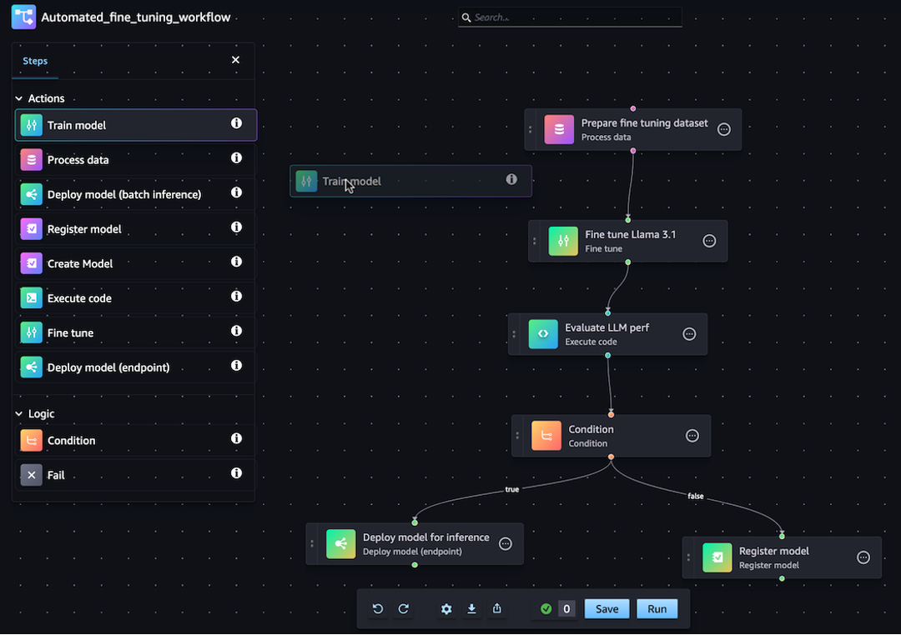

# Pipelines actions

You can use either the Amazon SageMaker Pipelines Python SDK or the drag-and-drop visual
designer in Amazon SageMaker Studio to author, view, edit, execute, and monitor your ML
workflows.

The following screenshot shows the visual designer that you can use to create
and manage your Amazon SageMaker Pipelines.

After your pipeline is deployed, you can view the directed acyclic graph (DAG) for your
pipeline and manage your executions using Amazon SageMaker Studio. Using SageMaker Studio, you can get
information about your current and historical pipelines, compare executions, see the DAG for
your executions, get metadata information, and more. To learn about how to view pipelines from Studio,
see [View the details of a pipeline](pipelines-studio-list.md "pipelines-studio-list.md").

###### Topics

- [Define a pipeline](define-pipeline.md "define-pipeline.md")
- [Edit a pipeline](edit-pipeline-before-execution.md "edit-pipeline-before-execution.md")
- [Run a pipeline](run-pipeline.md "run-pipeline.md")
- [Stop a pipeline](pipelines-studio-stop.md "pipelines-studio-stop.md")
- [View the details of a pipeline](pipelines-studio-list.md "pipelines-studio-list.md")
- [View the details of a pipeline run](pipelines-studio-view-execution.md "pipelines-studio-view-execution.md")
- [Download a pipeline definition file](pipelines-studio-download.md "pipelines-studio-download.md")
- [Access experiment data from a pipeline](pipelines-studio-experiments.md "pipelines-studio-experiments.md")
- [Track the lineage of a pipeline](pipelines-lineage-tracking.md "pipelines-lineage-tracking.md")
