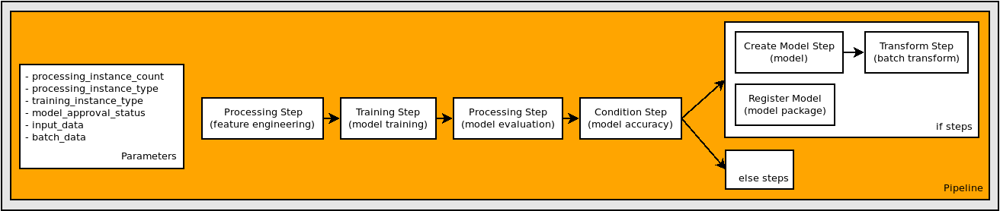
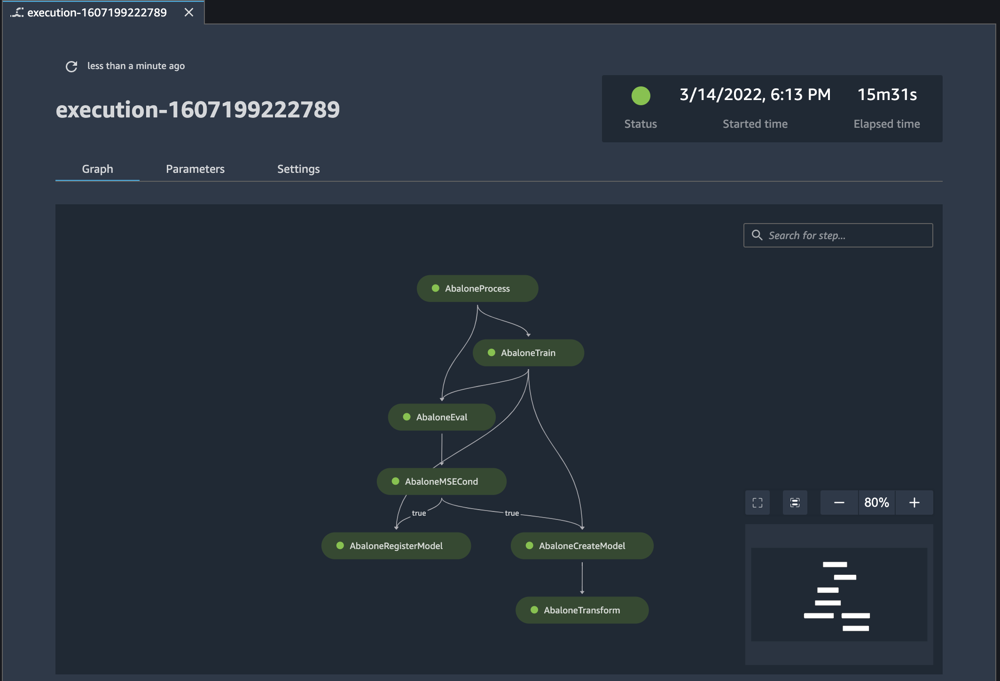

# Track the lineage of a pipeline

In this tutorial, you use Amazon SageMaker Studio to track the lineage of an Amazon SageMaker AI ML Pipeline.

The pipeline was created by the
[Orchestrating
Jobs with Amazon SageMaker Model Building Pipelines](https://sagemaker-examples.readthedocs.io/en/latest/sagemaker-pipelines/tabular/abalone_build_train_deploy/sagemaker-pipelines-preprocess-train-evaluate-batch-transform.html "https://sagemaker-examples.readthedocs.io/en/latest/sagemaker-pipelines/tabular/abalone_build_train_deploy/sagemaker-pipelines-preprocess-train-evaluate-batch-transform.html") notebook in the [Amazon SageMaker example GitHub repository](https://github.com/awslabs/amazon-sagemaker-examples "https://github.com/awslabs/amazon-sagemaker-examples").
For detailed information on how the pipeline was created, see
[Define a pipeline](define-pipeline.md "define-pipeline.md").

Lineage tracking in Studio is centered around a directed acyclic graph (DAG). The DAG
represents the steps in a pipeline. From the DAG you can track the lineage from any step to
any other step. The following diagram displays the steps in the pipeline. These steps appear
as a DAG in Studio.


To track the lineage of a pipeline in the Amazon SageMaker Studio console, complete the following steps
based on whether you use Studio or Studio Classic.

Studio

###### To track the lineage of a pipeline

1. Open the SageMaker Studio console by following the instructions in [Launch
   Amazon SageMaker Studio](studio-updated-launch.md "studio-updated-launch.md").
2. In the left navigation pane, select **Pipelines**.
3. (Optional) To filter the list of pipelines by name, enter a full or partial
   pipeline name in the search field.
4. In the **Name** column, select a pipeline name to view details about the pipeline.
5. Choose the **Executions** tab.
6. In the **Name** column of the **Executions** table,
   select the name of a pipeline execution to view.
7. At the top right of the **Executions** page, choose the vertical ellipsis
   and choose **Download pipeline definition (JSON)**.
   You can view the file to see how the pipeline graph
   was defined.
8. Choose **Edit** to open the Pipeline Designer.
9. Use the resizing and zoom controls at the top right corner of the canvas to zoom in and
   out of the graph, fit the graph to screen, or expand the graph to full screen.
10. To view your training, validation, and test datasets, complete the following steps:
    1. Choose the Processing step in your pipeline graph.
    2. In the right sidebar, choose the **Overview** tab.
    3. In the **Files** section,
       find the Amazon S3 paths to the training, validation, and test datasets.

11. To view your model artifacts, complete the following steps:
    1. Choose the Training step in your pipeline graph.
    2. In the right sidebar, choose the **Overview** tab.
    3. In the **Files** section,
       find the Amazon S3 paths to the model artifact.

12. To find the model package ARN, complete the following steps:
    1. Choose the Register model step.
    2. In the right sidebar, choose the **Overview** tab.
    3. In the **Files** section,
       find the ARN of the model package.

Studio Classic

###### To track the lineage of a pipeline

1. Sign in to Amazon SageMaker Studio Classic. For more information, see [Launch
   Amazon SageMaker Studio Classic](studio-launch.md "studio-launch.md").
2. In the left sidebar of Studio, choose the
   **Home** icon (


). 3. In the menu, select **Pipelines**. 4. Use the **Search** box to filter the pipelines list. 5. Choose the `AbalonePipeline` pipeline to view the execution list and
other details about the pipeline. 6. Choose the **Property Inspector**
icon (

) in the right sidebar to open the **TABLE PROPERTIES** pane,
where you can choose which properties to view. 7. Choose the **Settings** tab and then choose **Download
pipeline definition file**. You can view the file to see how the pipeline graph
was defined. 8. On the **Execution** tab, select the first row in the execution
list to view its execution graph and other details about the execution. Note that the
graph matches the diagram displayed at the beginning of the tutorial.

Use the resizing icons on the lower-right side of the graph to zoom in and out of the
graph, fit the graph to screen, or expand the graph to full screen. To focus on a
specific part of the graph, you can select a blank area of the graph and drag the graph
to center on that area. The inset on the lower-right side of the graph displays your
location in the graph.

 9. On the **Graph** tab, choose the `AbaloneProcess`
step to view details about the step. 10. Find the Amazon S3 paths to the training, validation, and test datasets in the
**Output** tab, under **Files**.

###### Note

To get the full paths, right-click the path and then choose **Copy cell
contents**.

```
s3://sagemaker-eu-west-1-acct-id/sklearn-abalone-process-2020-12-05-17-28-28-509/output/train
s3://sagemaker-eu-west-1-acct-id/sklearn-abalone-process-2020-12-05-17-28-28-509/output/validation
s3://sagemaker-eu-west-1-acct-id/sklearn-abalone-process-2020-12-05-17-28-28-509/output/test
```

11. Choose the `AbaloneTrain` step.
12. Find the Amazon S3 path to the model artifact in the **Output** tab, under
    **Files**:

```
s3://sagemaker-eu-west-1-acct-id/AbaloneTrain/pipelines-6locnsqz4bfu-AbaloneTrain-NtfEpI0Ahu/output/model.tar.gz
```

13. Choose the `AbaloneRegisterModel` step.
14. Find the ARN of the model package in the **Output** tab, under
    **Files**:

```
arn:aws:sagemaker:eu-west-1:acct-id:model-package/abalonemodelpackagegroupname/2
```
