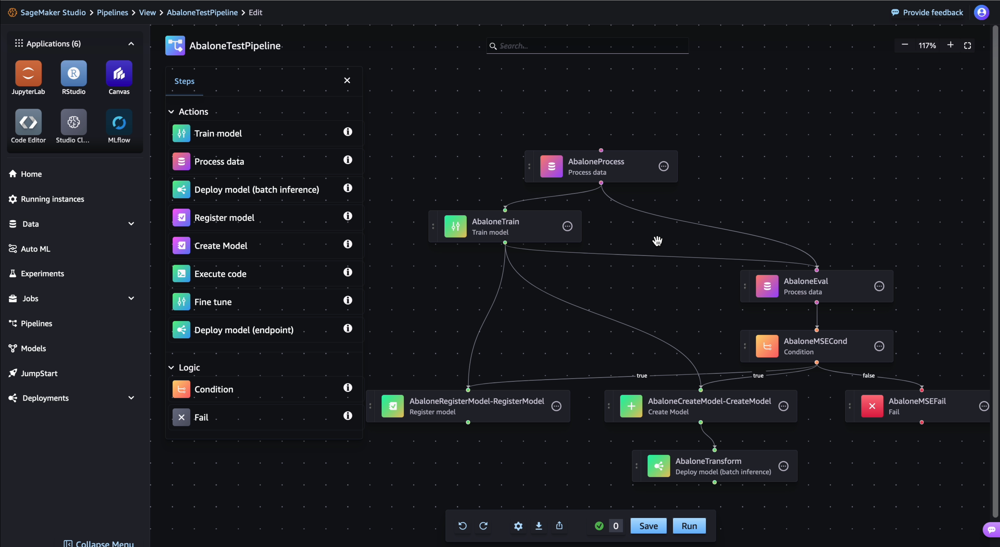

# Pipelines overview

An Amazon SageMaker AI pipeline is a series of interconnected steps in directed acyclic graph (DAG)
that are defined using the drag-and-drop UI or [Pipelines SDK](https://sagemaker.readthedocs.io/en/stable/workflows/pipelines/sagemaker.workflow.pipelines.html "https://sagemaker.readthedocs.io/en/stable/workflows/pipelines/sagemaker.workflow.pipelines.html"). You can also build your pipeline using the [pipeline definition JSON schema](https://aws-sagemaker-mlops.github.io/sagemaker-model-building-pipeline-definition-JSON-schema/ "https://aws-sagemaker-mlops.github.io/sagemaker-model-building-pipeline-definition-JSON-schema/"). This DAG JSON definition gives information on the
requirements and relationships between each step of your pipeline. The structure of a pipeline's
DAG is determined by the data dependencies between steps. These data dependencies are created
when the properties of a step's output are passed as the input to another step. The following
image is an example of a pipeline DAG:

###### The example DAG includes the following steps:

1.  `AbaloneProcess`, an instance of the [Processing](build-and-manage-steps.md#step-type-processing "build-and-manage-steps.md#step-type-processing") step, runs a preprocessing script on the data used for training. For
    example, the script could fill in missing values, normalize numerical data, or split data
    into the train, validation, and test datasets.
2.  `AbaloneTrain`, an instance of the [Training](build-and-manage-steps.md#step-type-training "build-and-manage-steps.md#step-type-training")
    step, configures hyperparameters and trains a model from the preprocessed input data.
3.  `AbaloneEval`, another instance of the [Processing](build-and-manage-steps.md#step-type-processing "build-and-manage-steps.md#step-type-processing") step, evaluates the model for accuracy. This step shows an example of
    a data dependency—this step uses the test dataset output of the
    `AbaloneProcess`.
4.  `AbaloneMSECond` is an instance of a [Condition](build-and-manage-steps.md#step-type-condition "build-and-manage-steps.md#step-type-condition") step which, in this example, checks to make sure the mean-square-error
    result of model evaluation is below a certain limit. If the model does not meet the
    criteria, the pipeline run stops.
5.  The pipeline run proceeds with the following steps:

        1. `AbaloneRegisterModel`, where SageMaker AI calls a [RegisterModel](build-and-manage-steps.md#step-type-register-model "build-and-manage-steps.md#step-type-register-model") step to register the model as a versioned model package group
         into the Amazon SageMaker Model Registry.
        2. `AbaloneCreateModel`, where SageMaker AI calls a [CreateModel](build-and-manage-steps.md#step-type-create-model "build-and-manage-steps.md#step-type-create-model") step to create the model in preparation for batch transform. In
         `AbaloneTransform`, SageMaker AI calls a [Transform](build-and-manage-steps.md#step-type-transform "build-and-manage-steps.md#step-type-transform") step to generate model predictions on a dataset you specify.

    The following topics describe fundamental Pipelines concepts. For a tutorial describing the
    implementation of these concepts, see [Pipelines actions](pipelines-build.md "pipelines-build.md").

###### Topics

- [Pipeline Structure and Execution](build-and-manage-pipeline.md "build-and-manage-pipeline.md")
- [IAM Access Management](build-and-manage-access.md "build-and-manage-access.md")
- [Set up cross-account support for Pipelines](build-and-manage-xaccount.md "build-and-manage-xaccount.md")
- [Pipeline parameters](build-and-manage-parameters.md "build-and-manage-parameters.md")
- [Pipelines steps](build-and-manage-steps.md "build-and-manage-steps.md")
- [Lift-and-shift Python code with the @step decorator](pipelines-step-decorator.md "pipelines-step-decorator.md")
- [Pass Data Between Steps](build-and-manage-propertyfile.md "build-and-manage-propertyfile.md")
- [Caching pipeline steps](pipelines-caching.md "pipelines-caching.md")
- [Retry Policy for Pipeline Steps](pipelines-retry-policy.md "pipelines-retry-policy.md")
- [Selective execution of pipeline steps](pipelines-selective-ex.md "pipelines-selective-ex.md")
- [Baseline calculation, drift
  detection and lifecycle with ClarifyCheck and QualityCheck steps in Amazon SageMaker Pipelines](pipelines-quality-clarify-baseline-lifecycle.md "pipelines-quality-clarify-baseline-lifecycle.md")
- [Schedule Pipeline Runs](pipeline-eventbridge.md "pipeline-eventbridge.md")
- [Amazon SageMaker Experiments Integration](pipelines-experiments.md "pipelines-experiments.md")
- [Run pipelines using local mode](pipelines-local-mode.md "pipelines-local-mode.md")
- [Troubleshooting Amazon SageMaker Pipelines](pipelines-troubleshooting.md "pipelines-troubleshooting.md")
