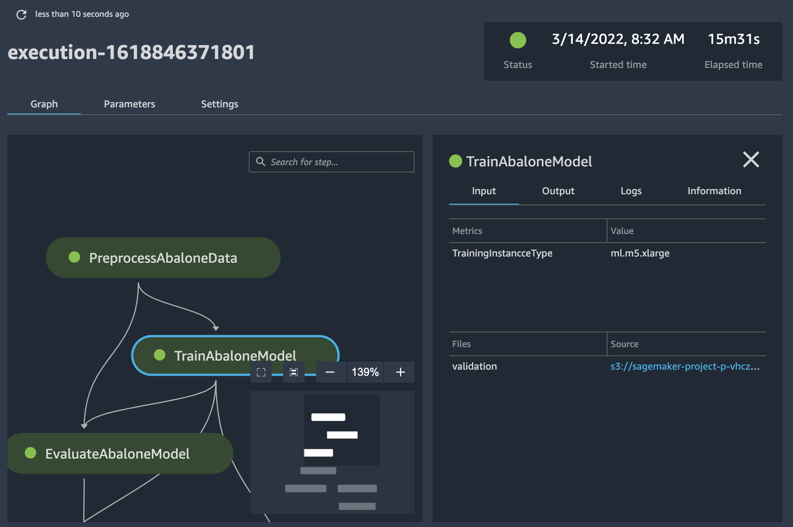
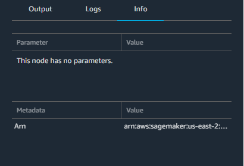

# View the details of a pipeline run

You can review the details of a particular SageMaker AI pipeline run. This can help you:

- Identify and resolve problems that may have occurred during the run, such as failed
  steps or unexpected errors.
- Compare the results of different pipeline executions to understand how changes in
  input data or parameters impact the overall workflow.
- Identify bottlenecks and opportunities for optimization.
  To view the details of a pipeline run, complete the following steps based on whether you
  use Studio or Studio Classic.

Studio

1. Open the SageMaker Studio console by following the instructions in [Launch
   Amazon SageMaker Studio](studio-updated-launch.md "studio-updated-launch.md").
2. In the left navigation pane, select **Pipelines**.
3. (Optional) To filter the list of pipelines by name, enter a full or partial
   pipeline name in the search field.
4. Select a pipeline name to view details about the pipeline.
5. Choose the **Executions** tab.
6. Select the name of a pipeline execution to view. The pipeline graph for that execution appears.
7. Choose any of the pipeline steps in the graph to see step settings in the right
   sidebar.
8. Choose one of the following tabs to view more pipeline details:
   - **Definition** — The pipeline graph, including all
     steps.
   - **Parameters** – Includes the model approval
     status.
   - **Details** – The metadata associated with the
     pipeline, such as tags, the pipeline Amazon Resource Name (ARN), and role ARN.
     You can also edit the pipeline description from this page.

Studio Classic

1. Sign in to Amazon SageMaker Studio Classic. For more information, see [Launch Amazon SageMaker Studio Classic](studio-launch.md "studio-launch.md").
2. In the Studio Classic sidebar, choose the **Home** icon (
   
   ).
3. Select **Pipelines** from the menu.
4. To narrow the list of pipelines by name, enter a full or partial pipeline name
   in the search field.
5. Select a pipeline name. The pipeline's **Executions** page
   opens.
6. In the **Executions** page, select an execution name to view
   details about the execution. The execution details tab opens and displays a graph of
   the steps in the pipeline.
7. To search for a step by name, type characters that match a step name in the
   search field. Use the resizing icons on the lower-right side of the graph to zoom in
   and out of the graph, fit the graph to screen, and expand the graph to full screen.
   To focus on a specific part of the graph, you can select a blank area of the graph
   and drag the graph to center on that area.

 8. Choose one of the pipeline steps in the graph to see details about the step. In
the preceding screenshot, a training step is chosen and displays the following
tabs:

    * **Input** – The training inputs. If an input source
     is from Amazon Simple Storage Service (Amazon S3), choose the link to view the file in the Amazon S3
     console.
    * **Output** – The training outputs, such as metrics,
     charts, files, and evaluation outcome. The graphs are produced using the [Tracker](https://sagemaker-experiments.readthedocs.io/en/latest/tracker.html#smexperiments.tracker.Tracker.log_precision_recall "https://sagemaker-experiments.readthedocs.io/en/latest/tracker.html#smexperiments.tracker.Tracker.log_precision_recall") APIs.
    * **Logs** – The Amazon CloudWatch logs produced by the
     step.
    * **Info** – The parameters and metadata associated
     with the step.

    
