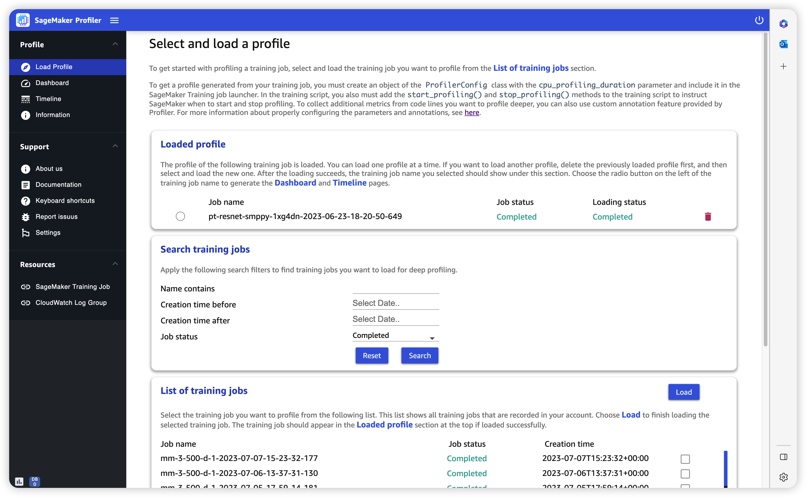
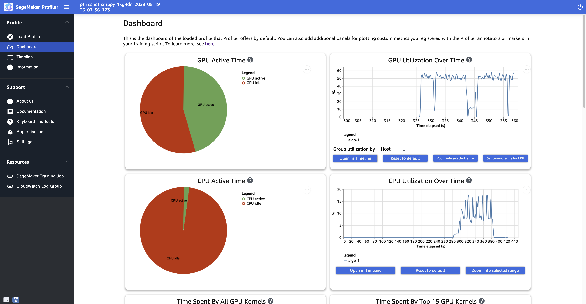
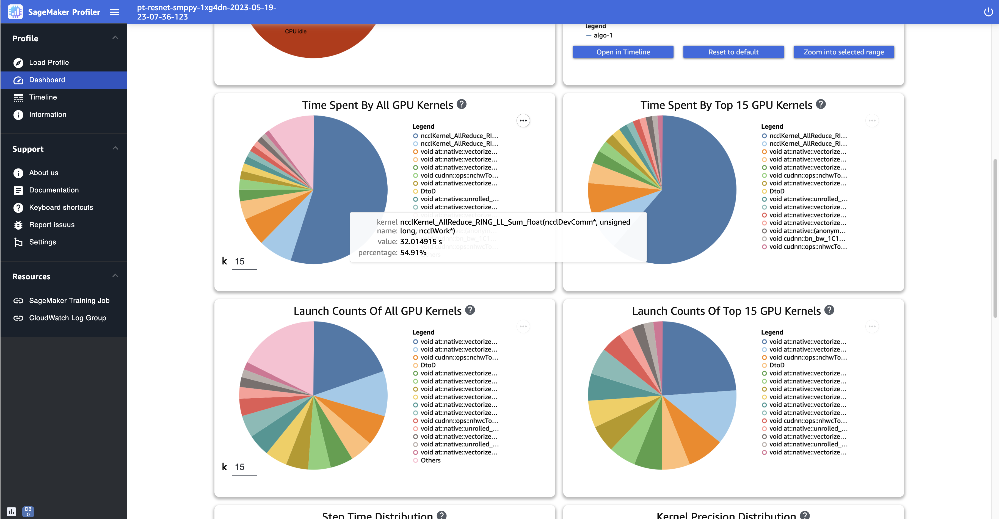
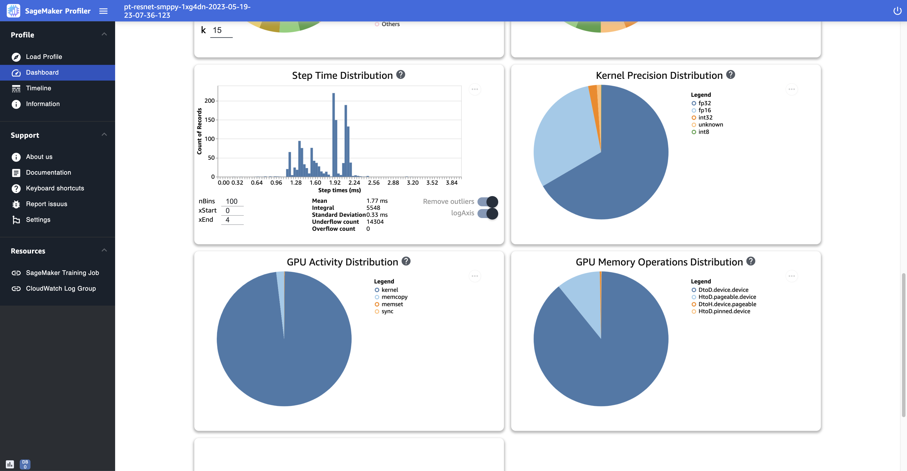
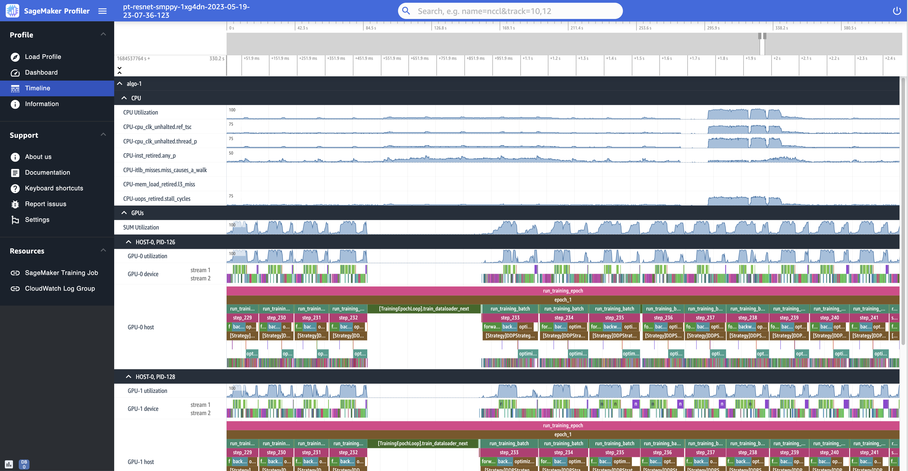
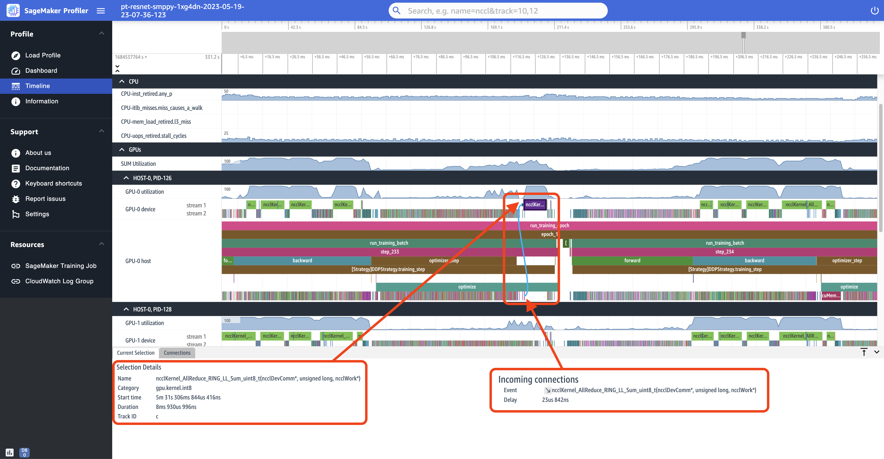
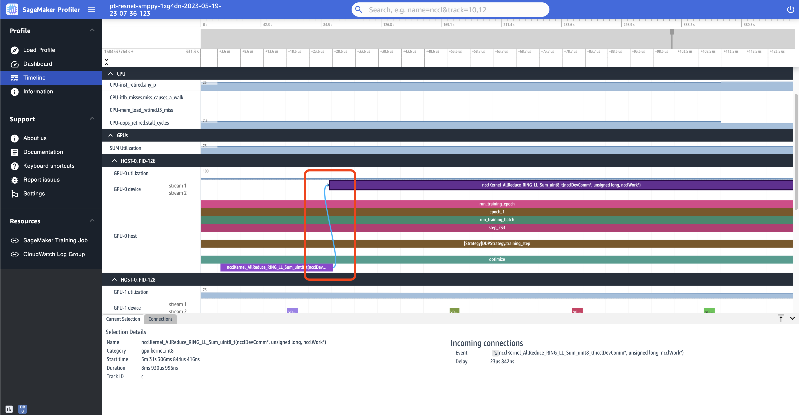

# Explore the profile output data visualized in the

SageMaker Profiler UI

This section walks through the SageMaker Profiler UI and provides tips for how to use and gain
insights from it.

## Load profile

When you open the SageMaker Profiler UI, the **Load profile** page opens
up. To load and generate the **Dashboard** and
**Timeline**, go through the following procedure.

###### To load the profile of a

training job

1. From the **List of training jobs** section, use the check
   box to choose the training job for which you want to load the
   profile.
2. Choose **Load**. The job name should appear in the
   **Loaded profile** section at the top.
3. Choose the radio button on the left of the **Job name**
   to generate the **Dashboard** and
   **Timeline**. Note that when you choose the radio
   button, the UI automatically opens the **Dashboard**. Note
   also that if you generate the visualizations while the job status and
   loading status still appear to be in progress, the SageMaker Profiler UI generates
   **Dashboard** plots and a **Timeline**
   up to the most recent profile data collected from the ongoing training job
   or the partially loaded profile data.

###### Tip

You can load and visualize one profile at a time. To load another profile, you
must first unload the previously loaded profile. To unload a profile, use the
trash bin icon on the right end of the profile in the **Loaded profile** section.

## Dashboard

After you finish loading and selecting the training job, the UI opens the
**Dashboard** page furnished with the following panels by
default.

- **GPU active time** – This pie chart
  shows the percentage of GPU active time versus GPU idle time. You can check
  if your GPUs are more active than idle throughout the entire training job.
  GPU active time is based on the profile data points with a utilization rate
  greater than 0%, whereas GPU idle time is the profiled data points with 0%
  utilization.
- **GPU utilization over time** – This
  timeline graph shows the average GPU utilization rate over time per node,
  aggregating all of the nodes in a single chart. You can check if the GPUs
  have an unbalanced workload, under-utilization issues, bottlenecks, or idle
  issues during certain time intervals. To track the utilization rate at the
  individual GPU level and related kernel runs, use the [Timeline interface](#profiler-explore-viz-timeline "#profiler-explore-viz-timeline"). Note that the GPU activity
  collection starts from where you added the profiler starter function
  `SMProf.start_profiling()` in your training script, and stops
  at `SMProf.stop_profiling()`.
- **CPU active time** – This pie chart
  shows the percentage of CPU active time versus CPU idle time. You can check
  if your CPUs are more active than idle throughout the entire training job.
  CPU active time is based on the profiled data points with a utilization rate
  greater than 0%, whereas CPU idle time is the profiled data points with 0%
  utilization.
- **CPU utilization over time** – This
  timeline graph shows the average CPU utilization rate over time per node,
  aggregating all of the nodes in a single chart. You can check if the CPUs
  are bottlenecked or underutilized during certain time intervals. To track
  the utilization rate of the CPUs aligned with the individual GPU utilization
  and kernel runs, use the [Timeline interface](#profiler-explore-viz-timeline "#profiler-explore-viz-timeline").
  Note that the utilization metrics start from the start from the job
  initialization.
- **Time spent by all GPU kernels** –
  This pie chart shows all GPU kernels operated throughout the training job.
  It shows the top 15 GPU kernels by default as individual sectors and all
  other kernels in one sector. Hover over the sectors to see more detailed
  information. The value shows the total time of the GPU kernels operated in
  seconds, and the percentage is based on the entire time of the profile.
- **Time spent by top 15 GPU kernels** –
  This pie chart shows all GPU kernels operated throughout the training job.
  It shows the top 15 GPU kernels as individual sectors. Hover over the
  sectors to see more detailed information. The value shows the total time of
  the GPU kernels operated in seconds, and the percentage is based on the
  entire time of the profile.
- **Launch counts of all GPU kernels** –
  This pie chart shows the number of counts for every GPU kernel launched
  throughout the training job. It shows the top 15 GPU kernels as individual
  sectors and all other kernels in one sector. Hover over the sectors to see
  more detailed information. The value shows the total count of the launched
  GPU kernels, and the percentage is based on the entire count of all kernels.
- **Launch counts of top 15 GPU kernels**
  – This pie chart shows the number of counts of every GPU kernel
  launched throughout the training job. It shows the top 15 GPU kernels. Hover
  over the sectors to see more detailed information. The value shows the total
  count of the launched GPU kernels, and the percentage is based on the entire
  count of all kernels.
- **Step time distribution** – This
  histogram shows the distribution of step durations on GPUs. This plot is
  generated only after you add the step annotator in your training
  script.
- **Kernel precision distribution** –
  This pie chart shows the percentage of time spent on running kernels in
  different data types such as FP32, FP16, INT32, and INT8.
- **GPU activity distribution** – This
  pie chart shows the percentage of time spent on GPU activities, such as
  running kernels, memory (`memcpy` and `memset`), and
  synchronization (`sync`).
- **GPU memory operations distribution**
  – This pie chart shows the percentage of time spent on GPU memory
  operations. This visualizes the `memcopy` activities and helps
  identify if your training job is spending excessive time on certain memory
  operations.
- **Create a new histogram** – Create a
  new diagram of a custom metric you annotated manually during [Step 1: Adapt your training
  script using the SageMaker Profiler Python modules](profiler-prepare.md#profiler-prepare-training-script "profiler-prepare.md#profiler-prepare-training-script"). When adding a custom
  annotation to a new histogram, select or type the name of the annotation you
  added in the training script. For example, in the demo training script in
  Step 1, `step`, `Forward`, `Backward`,
  `Optimize`, and `Loss` are the custom annotations.
  While creating a new histogram, these annotation names should appear in the
  drop-down menu for metric selection. If you choose `Backward`,
  the UI adds the histogram of the time spent on backward passes throughout
  the profiled time to the **Dashboard**. This type of
  histogram is useful for checking if there are outliers taking abnormally
  longer time and causing bottleneck problems.

The following screenshots show the GPU and CPU active time ratio and the average
GPU and CPU utilization rate with respect to time per compute node.

The following screenshot shows an example of pie charts for comparing how many
times the GPU kernels are launched and measuring the time spent on running them. In
the **Time spent by all GPU kernels** and **Launch counts of all GPU kernels** panels, you can also
specify an integer to the input field for _k_ to
adjust the number of legend to show in the plots. For example, if you specify 10,
the plots show the top 10 most run and launched kernels respectively.

The following screenshot shows an example of step time duration histogram, and pie
charts for the kernel precision distribution, GPU activity distribution, and GPU
memory operation distribution.

## Timeline interface

To gain a detailed view into the compute resources at the level of operations and
kernels scheduled on the CPUs and run on the GPUs, use the **Timeline** interface.

You can zoom in and out and pan left or right in the timeline interface using your
mouse, the `[w, a, s, d]` keys, or the four arrow keys on the
keyboard.

###### Tip

For more tips on the keyboard shortcuts to interact with the
**Timeline** interface, choose **Keyboard
shortcuts** in the left pane.

The timeline tracks are organized in a tree structure, giving you information from
the host level to the device level. For example, if you run `N` instances
with eight GPUs in each, the timeline structure of each instance would be as
follows.

- **algo-inode**
  – This is what SageMaker AI tags to assign jobs to provisioned
  instances. The digit inode is randomly assigned. For
  example, if you use 4 instances, this section expands from **algo-1** to **algo-4**.
  - **CPU** – In this section, you
    can check the average CPU utilization rate and performance
    counters.
  - **GPUs** – In this section,
    you can check the average GPU utilization rate, individual GPU
    utilization rate, and kernels.
    - **SUM Utilization** –
      The average GPU utilization rates per instance.
    - **HOST-0 PID-123** – A
      unique name assigned to each process track. The acronym PID
      is the process ID, and the number appended to it is the
      process ID number that's recorded during data capture from
      the process. This section shows the following information
      from the process.
      - **GPU-inum_gpu
        utilization** – The utilization
        rate of the inum_gpu-th GPU
        over time.
      - **GPU-inum_gpu
        device** – The kernel runs on the
        inum_gpu-th GPU
        device.
        - **stream
          icuda_stream**
          – CUDA streams showing kernel runs on the
          GPU device. To learn more about CUDA streams, see
          the slides in PDF at [CUDA C/C++ Streams and Concurrency](https://developer.download.nvidia.com/CUDA/training/StreamsAndConcurrencyWebinar.pdf "https://developer.download.nvidia.com/CUDA/training/StreamsAndConcurrencyWebinar.pdf")
          provided by NVIDIA.

      - **GPU-inum_gpu
        host** – The kernel launches on
        the inum_gpu-th GPU
        host.

The following several screenshots show the **Timeline** of the
profile of a training job run on `ml.p4d.24xlarge` instances, which are
equipped with 8 NVIDIA A100 Tensor Core GPUs in each.

The following is a zoomed-out view of the profile, printing a dozen of steps
including an intermittent data loader between `step_232` and
`step_233` for fetching the next data batch.

For each CPU, you can track the CPU utilization and performance counters, such as
`"clk_unhalted_ref.tsc"` and
`"itlb_misses.miss_causes_a_walk"`, which are indicative of
instructions run on the CPU.

For each GPU, you can see a host timeline and a device timeline. Kernel launches
are on the host timeline and kernel runs are on the device timeline. You can also
see annotations (such as forward, backward, and optimize) if you have added in
training script in the GPU host timeline.

In the timeline view, you can also track kernel launch-and-run pairs. This helps
you understand how a kernel launch scheduled on a host (CPU) is run on the
corresponding GPU device.

###### Tip

Press the `f` key to zoom into the selected kernel.

The following screenshot is a zoomed-in view into `step_233` and
`step_234` from the previous screenshot. The timeline interval
selected in the following screenshot is the `AllReduce` operation, an
essential communication and synchronization step in distributed training, run on the
GPU-0 device. In the screenshot, note that the kernel launch in the GPU-0 host
connects to the kernel run in the GPU-0 device stream 1, indicated with the arrow in
cyan color.

Also two information tabs appear in the bottom pane of the UI when you select a
timeline interval, as shown in the previous screenshot. The **Current
Selection** tab shows the details of the selected kernel and the
connected kernel launch from the host. The connection direction is always from host
(CPU) to device (GPU) since each GPU kernel is always called from a CPU. The
**Connections** tab shows the chosen kernel launch and run
pair. You can select either of them to move it to the center of the
**Timeline** view.

The following screenshot zooms in further into the `AllReduce`
operation launch and run pair.

## Information

In **Information**, you can access information about the loaded
training job, such as the instance type, Amazon Resource Names (ARNs) of compute
resources provisioned for the job, node names, and hyperparameters.

## Settings

The SageMaker AI Profiler UI application instance is configured to shut down after 2
hours of idle time by default. In **Settings**, use the following
settings to adjust the auto shutdown timer.

- **Enable app auto shutdown** – Choose
  and set to **Enabled** to let the application
  automatically shut down after the specified number of hours of idle time. To
  turn off the auto-shutdown functionality, choose
  **Disabled**.
- **Auto shutdown threshold in hours** –
  If you choose **Enabled** for **Enable app auto
  shutdown**, you can set the threshold time in hours for the
  application to shut down automatically. This is set to 2 by default.
