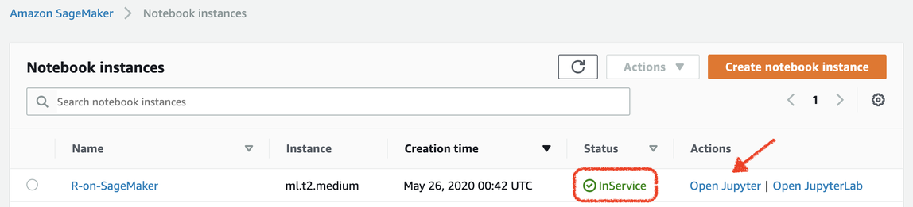
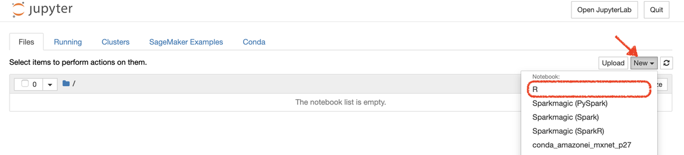
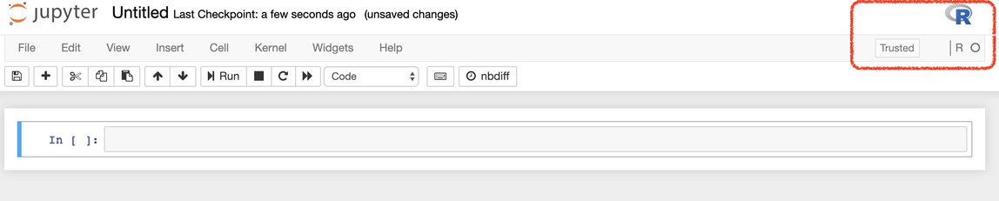
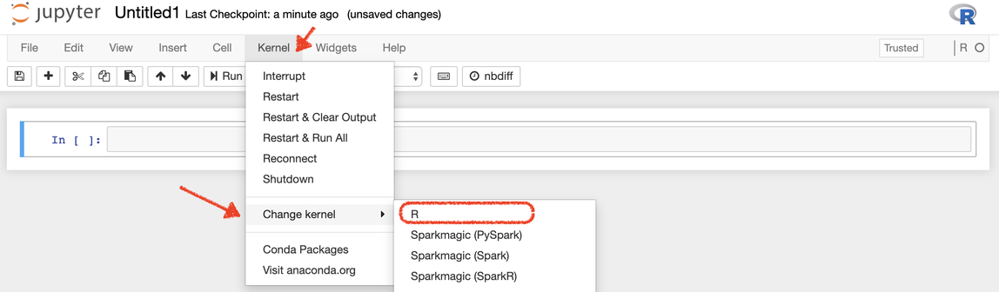

# Get started with R in SageMaker AI

This topic explains how to get started using the R software environment in SageMaker AI. For more
information about using R with SageMaker AI, see [Resources for using R with Amazon SageMaker AI](r-guide.md "r-guide.md").

###### To get started with R in the SageMaker AI console

1. [Create a notebook instance](howitworks-create-ws.md "howitworks-create-ws.md") using the t2.medium instance type and default storage
   size. You can pick a faster instance and more storage if you plan to continue using the
   instance for more advanced examples, or you can create a bigger instance later.
2. Wait until the status of the notebook is **In Service**, and then
   choose **Open Jupyter**.

 3. Create a new notebook with R kernel from the list of available environments.

 4. When the new notebook is created, you should see an R logo in the upper right corner
of the notebook environment, and also R as the kernel under that logo. This indicates that
SageMaker AI has successfully launched the R kernel for this notebook.

Alternatively, when you are in a Jupyter notebook, you can use the
**Kernel** menu, and then select **R** from the
**Change kernel** submenu.

