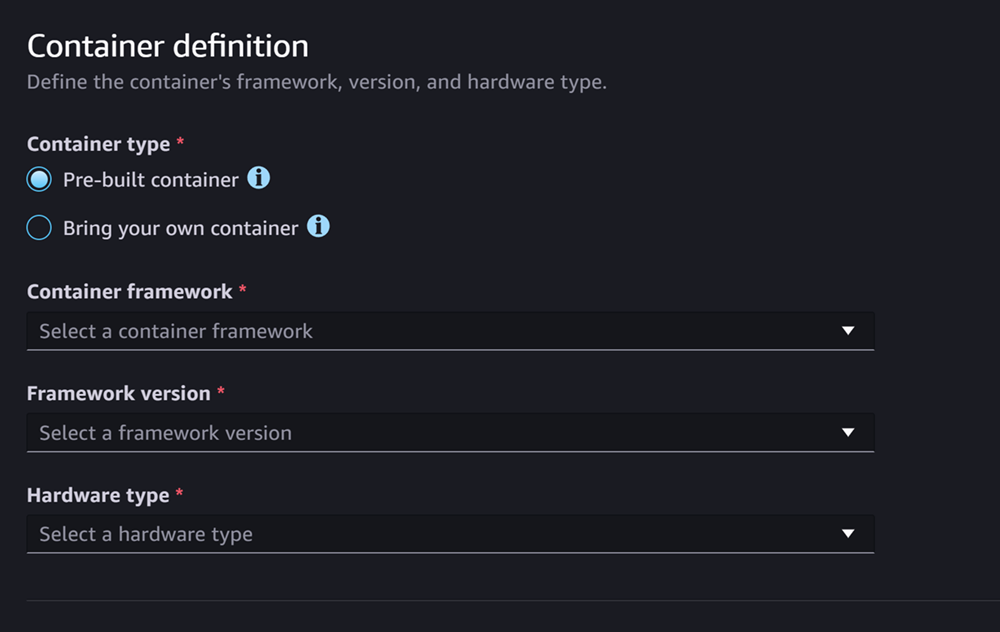
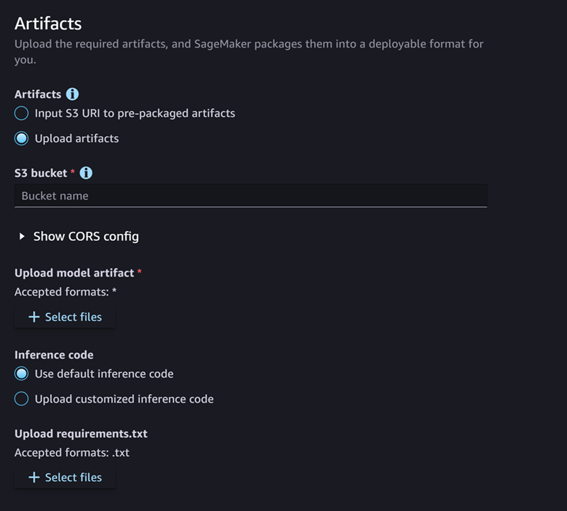
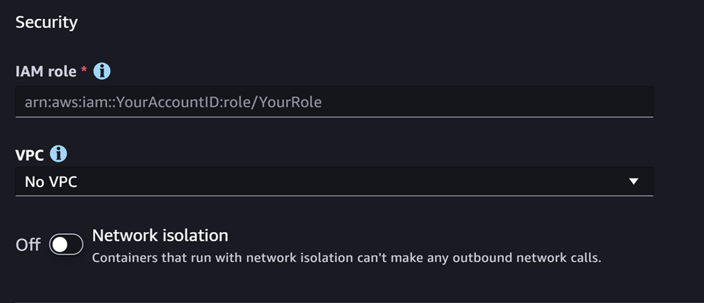
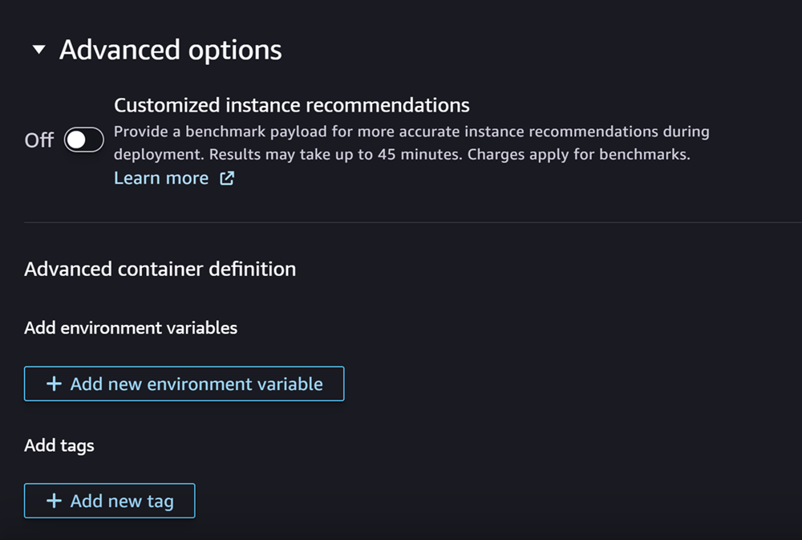
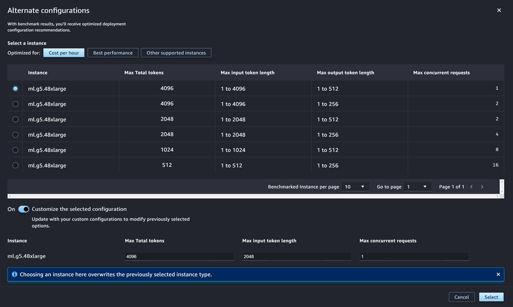
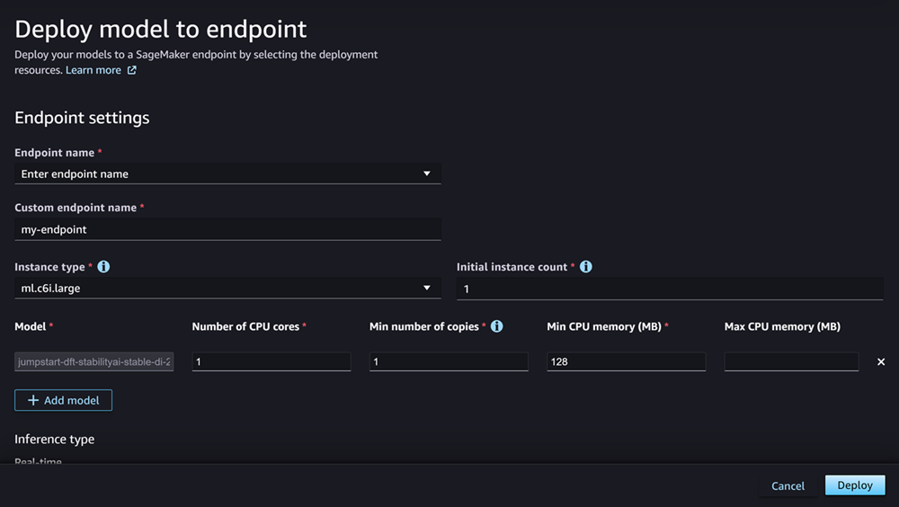

# Deploy

models for real-time inference

###### Important

Custom IAM policies that allow Amazon SageMaker Studio or Amazon SageMaker Studio Classic to create Amazon SageMaker
resources must also grant permissions to add tags to those resources. The permission to
add tags to resources is required because Studio and Studio Classic automatically tag
any resources they create. If an IAM policy allows Studio and Studio Classic to
create resources but does not allow tagging, "AccessDenied" errors can occur when
trying to create resources. For more information, see [Provide permissions for tagging SageMaker AI
resources](security_iam_id-based-policy-examples.md#grant-tagging-permissions "security_iam_id-based-policy-examples.md#grant-tagging-permissions").

[AWS managed policies for Amazon SageMaker AI](security-iam-awsmanpol.md "security-iam-awsmanpol.md")
that give permissions to create SageMaker resources already include permissions to add tags
while creating those resources.

There are several options to deploy a model using SageMaker AI hosting services. You can
interactively deploy a model with SageMaker Studio. Or, you can programmatically deploy a model
using an AWS SDK, such as the SageMaker Python SDK or the SDK for Python (Boto3). You can also deploy by
using the AWS CLI.

## Before you begin

Before you deploy a SageMaker AI model, locate and make note of the following:

- The AWS Region where your Amazon S3 bucket is located
- The Amazon S3 URI path where the model artifacts are stored
- The IAM role for SageMaker AI
- The Docker Amazon ECR URI registry path for the custom image that contains the
  inference code, or the framework and version of a built-in Docker image that is
  supported and by AWS

For a list of AWS services available in each AWS Region, see [Region Maps and Edge Networks](https://aws.amazon.com/about-aws/global-infrastructure/regional-product-services/ "https://aws.amazon.com/about-aws/global-infrastructure/regional-product-services/"). See [Creating IAM
roles](../../../IAM/latest/UserGuide/id_roles_create.md "../../../IAM/latest/UserGuide/id_roles_create.md") for information on how to create an IAM role.

###### Important

The Amazon S3 bucket where the model artifacts are stored must be in the same
AWS Region as the model that you are creating.

## Shared resource utilization with multiple

models

You can deploy one or more models to an endpoint with Amazon SageMaker AI. When multiple models
share an endpoint, they jointly utilize the resources that are hosted there, such as the
ML compute instances, CPUs, and accelerators. The most flexible way to deploy multiple
models to an endpoint is to define each model as an _inference
component_.

### Inference components

An inference component is a SageMaker AI hosting object that you can use to deploy a model
to an endpoint. In the inference component settings, you specify the model, the
endpoint, and how the model utilizes the resources that the endpoint hosts. To
specify the model, you can specify a SageMaker AI Model object, or you can directly specify
the model artifacts and image.

In the settings, you can optimize resource utilization by tailoring how the
required CPU cores, accelerators, and memory are allocated to the model. You can
deploy multiple inference components to an endpoint, where each inference component
contains one model and the resource utilization needs for that model.

After you deploy an inference component, you can directly invoke the associated
model when you use the InvokeEndpoint action in the SageMaker API.

Inference components provide the following benefits:

**Flexibility**

The inference component decouples the details of hosting the model
from the endpoint itself. This provides more flexibility and control
over how models are hosted and served with an endpoint. You can host
multiple models on the same infrastructure, and you can add or remove
models from an endpoint as needed. You can update each model
independently.

**Scalability**

You can specify how many copies of each model to host, and you can set
a minimum number of copies to ensure that the model loads in the
quantity that you require to serve requests. You can scale any inference
component copy down to zero, which makes room for another copy to scale
up.

SageMaker AI packages your models as inference components when you deploy them by
using:

- SageMaker Studio Classic.
- The SageMaker Python SDK to deploy a Model object (where you set the endpoint type
  to `EndpointType.INFERENCE_COMPONENT_BASED`).
- The AWS SDK for Python (Boto3) to define `InferenceComponent` objects that you
  deploy to an endpoint.

## Deploy models with SageMaker Studio

Complete the following steps to create and deploy your model interactively through
SageMaker Studio. For more information about Studio, see the [Studio](studio.md "studio.md")
documentation. For more walkthroughs of various deployment scenarios, see the blog [Package and deploy classical ML models and LLMs easily with Amazon SageMaker AI – Part 2](https://aws.amazon.com/blogs/machine-learning/package-and-deploy-classical-ml-and-llms-easily-with-amazon-sagemaker-part-2-interactive-user-experiences-in-sagemaker-studio/ "https://aws.amazon.com/blogs/machine-learning/package-and-deploy-classical-ml-and-llms-easily-with-amazon-sagemaker-part-2-interactive-user-experiences-in-sagemaker-studio/").

### Prepare your artifacts and permissions

Complete this section before creating a model in SageMaker Studio.

You have two options for bringing your artifacts and creating a model in
Studio:

1. You can bring a pre-packaged `tar.gz` archive, which should
   include your model artifacts, any custom inference code, and any
   dependencies listed in a `requirements.txt` file.
2. SageMaker AI can package your artifacts for you. You only have to bring your raw
   model artifacts and any dependencies in a `requirements.txt`
   file, and SageMaker AI can provide default inference code for you (or you can
   override the default code with your own custom inference code). SageMaker AI
   supports this option for the following frameworks: PyTorch, XGBoost.

In addition to bringing your model, your AWS Identity and Access Management (IAM) role, and a Docker
container (or desired framework and version for which SageMaker AI has a pre-built
container), you must also grant permissions to create and deploy models through SageMaker AI
Studio.

You should have the [AmazonSageMakerFullAccess](../../../aws-managed-policy/latest/reference/AmazonSageMakerFullAccess.md "../../../aws-managed-policy/latest/reference/AmazonSageMakerFullAccess.md") policy attached to your IAM role so that
you can access SageMaker AI and other relevant services. To see the prices of the instance
types in Studio, you also must attach the [AWSPriceListServiceFullAccess](../../../aws-managed-policy/latest/reference/AWSPriceListServiceFullAccess.md "../../../aws-managed-policy/latest/reference/AWSPriceListServiceFullAccess.md") policy (or if you don’t want to attach
the whole policy, more specifically, the `pricing:GetProducts`
action).

If you choose to upload your model artifacts when creating a model (or upload a
sample payload file for inference recommendations), then you must create an Amazon S3
bucket. The bucket name must be prefixed by the word `SageMaker AI`. Alternate
capitalizations of SageMaker AI are also acceptable: `Sagemaker` or
`sagemaker`.

We recommend that you use the bucket naming convention
`sagemaker-{`Region`}-{`accountID`}`.
This bucket is used to store the artifacts that you upload.

After creating the bucket, attach the following CORS (cross-origin resource
sharing) policy to the bucket:

```
[
    {
        "AllowedHeaders": ["*"],
        "ExposeHeaders": ["Etag"],
        "AllowedMethods": ["PUT", "POST"],
        "AllowedOrigins": ['https://*.sagemaker.aws'],
    }
]
```

You can attach a CORS policy to an Amazon S3 bucket by using any of the following
methods:

- Through the [Edit cross-origin resource sharing (CORS)](https://s3.console.aws.amazon.com/s3/bucket/bucket-name/property/cors/edit "https://s3.console.aws.amazon.com/s3/bucket/bucket-name/property/cors/edit") page in the Amazon S3
  console
- Using the Amazon S3 API [PutBucketCors](../../../AmazonS3/latest/API/API_PutBucketCors.md "../../../AmazonS3/latest/API/API_PutBucketCors.md")
- Using the put-bucket-cors AWS CLI command:

```
aws s3api put-bucket-cors --bucket="..." --cors-configuration="..."
```

### Create a deployable model

In this step, you create a deployable version of your model in SageMaker AI by providing
your artifacts along with additional specifications, such as your desired container
and framework, any custom inference code, and network settings.

Create a deployable model in SageMaker Studio by doing the following:

1. Open the SageMaker Studio application.
2. In the left navigation pane, choose **Models**.
3. Choose the **Deployable models** tab.
4. On the **Deployable models** page, choose
   **Create**.
5. On the **Create deployable model** page, for the
   **Model name** field, enter a name for the
   model.

There are several more sections for you to fill out on the **Create
deployable model** page.

The **Container definition** section looks like the following
screenshot:



###### For the **Container definition** section, do the

following:

1. For **Container type**, select **Pre-built
   container** if you'd like to use a SageMaker AI managed container, or
   select **Bring your own container** if you have your own
   container.
2. If you selected **Pre-built container**, select the
   **Container framework**, **Framework
   version**, and **Hardware type** that you'd
   like to use.
3. If you selected **Bring your own container**, enter an
   Amazon ECR path for **ECR path to container image**.

Then, fill out the **Artifacts** section, which looks like the
following screenshot:



###### For the **Artifacts** section, do the following:

1. If you're using one of the frameworks that SageMaker AI supports for packaging
   model artifacts (PyTorch or XGBoost), then for
   **Artifacts**, you can choose the **Upload
   artifacts** option. With this option, you can simply specify
   your raw model artifacts, any custom inference code you have, and your
   requirements.txt file, and SageMaker AI handles packaging the archive for you. Do
   the following:
   1. For **Artifacts**, select **Upload
      artifacts** to continue providing your files.
      Otherwise, if you already have a `tar.gz` archive that
      contains your model files, inference code, and
      `requirements.txt` file, then select **Input
      S3 URI to pre-packaged artifacts**.
   2. If you chose to upload your artifacts, then for **S3
      bucket**, enter the Amazon S3 path to a bucket where you'd
      like SageMaker AI to store your artifacts after packaging them for you.
      Then, complete the following steps.
   3. For **Upload model artifacts**, upload your model
      files.
   4. For **Inference code**, select **Use
      default inference code** if you'd like to use default
      code that SageMaker AI provides for serving inference. Otherwise, select
      **Upload customized inference code** to use
      your own inference code.
   5. For **Upload requirements.txt**, upload a text
      file that lists any dependencies that you want to install at
      runtime.

2. If you're not using a framework that SageMaker AI supports for packaging model
   artifacts, then Studio shows you the **Pre-packaged
   artifacts** option, and you must provide all of your artifacts
   already packaged as a `tar.gz` archive. Do the following:
   1. For **Pre-packaged artifacts**, select
      **Input S3 URI for pre-packaged model
      artifacts** if you have your `tar.gz`
      archive already uploaded to Amazon S3. Select **Upload
      pre-packaged model artifacts** if you want to directly
      upload your archive to SageMaker AI.
   2. If you selected **Input S3 URI for pre-packaged model
      artifacts**, enter the Amazon S3 path to your archive for
      **S3 URI**. Otherwise, select and upload the
      archive from your local machine.

The next section is **Security**, which looks like the following
screenshot:



###### For the **Security** section, do the following:

1. For **IAM role**, enter the ARN for an IAM
   role.
2. (Optional) For **Virtual Private Cloud (VPC)**, you can
   select an Amazon VPC for storing your model configuration and artifacts.
3. (Optional) Turn on the **Network isolation** toggle if
   you want to restrict your container's internet access.

Finally, you can optionally fill out the **Advanced options**
section, which looks like the following screenshot:



###### (Optional) For the **Advanced options** section, do the

following:

1. Turn on the **Customized instance recommendations**
   toggle if you want to run an Amazon SageMaker Inference Recommender job on your model after its
   creation. Inference Recommender is a feature that provides you with recommended instance
   types for optimizing inference performance and cost. You can view these
   instance recommendations when preparing to deploy your model.
2. For **Add environment variables**, enter an environment
   variables for your container as key-value pairs.
3. For **Tags**, enter any tags as key-value pairs.
4. After finishing your model and container configuration, choose
   **Create deployable model**.

You should now have a model in SageMaker Studio that is ready for
deployment.

### Deploy your model

Finally, you deploy the model you configured in the previous step to an HTTPS
endpoint. You can deploy either a single model or multiple models to the
endpoint.

###### Model and endpoint compatibility

Before you can deploy a model to an endpoint, the model and endpoint must be
compatible by having the same values for the following settings:

- The IAM role
- The Amazon VPC, including its subnets and security groups
- The network isolation (enabled or disabled)
  Studio prevents you from deploying models to incompatible endpoints in
  the following ways:

- If you attempt to deploy a model to a new endpoint, SageMaker AI configures
  the endpoint with initial settings that are compatible. If you break the
  compatibility by changing these settings, Studio shows an alert and
  prevents your deployment.
- If you attempt to deploy to an existing endpoint, and that endpoint is
  incompatible, Studio shows an alert and prevents your deployment.
- If you attempt to add multiple models to a deployment, Studio
  prevents you from deploying models that are incompatible with each
  other.
  When Studio shows the alert about model and endpoint incompatibility, you
  can choose **View details** in the alert to see which settings
  are incompatible.

One way to deploy a model is by doing the following in Studio:

1. Open the SageMaker Studio application.
2. In the left navigation pane, choose **Models**.
3. On the **Models** page, select one or more models from
   the list of SageMaker AI models.
4. Choose **Deploy**.
5. For **Endpoint name**, open the dropdown menu. You can
   either select an existing endpoint or you can create a new endpoint to which
   you deploy the model.
6. For **Instance type**, select the instance type that you
   want to use for the endpoint. If you previously ran an Inference Recommender job for the
   model, your recommended instance types appear in the list under the title
   **Recommended**. Otherwise, you'll see a few
   **Prospective instances** that might be suitable for
   your model.

###### Instance type compatibility for JumpStart

If you're deploying a JumpStart model, Studio only shows
instance types that the model supports. 7. For **Initial instance count**, enter the initial number
of instances that you'd like to provision for your endpoint. 8. For **Maximum instance count**, specify the maximum
number of instances that the endpoint can provision when it scales up to
accommodate an increase in traffic. 9. If the model you're deploying is one of the most used JumpStart LLMs
from the model hub, then the **Alternate configurations**
option appears after the instance type and instance count fields.

For the most popular JumpStart LLMs, AWS has pre-benchmarked
instance types to optimize for either cost or performance. This data can
help you decide which instance type to use for deploying your LLM. Choose
**Alternate configurations** to open a dialog box that
contains the pre-benchmarked data. The panel looks like the following
screenshot:



In the **Alternate configurations** box, do the
following:

    1. Select an instance type. You can choose **Cost per
     hour** or **Best performance** to see
     instance types that optimize either cost or performance for the
     specified model. You can also choose **Other supported
     instances** to see a list of other instance types that
     are compatible with the JumpStart model. Note that selecting an
     instance type here overwrites any previous instance selection
     specified in Step 6.
    2. (Optional) Turn on the **Customize the selected
     configuration** toggle to specify **Max total
     tokens** (the maximum number of tokens that you want to
     allow, which is the sum of your input tokens and the model's
     generated output), **Max input token length** (the
     maximum number of tokens you want to allow for the input of each
     request), and **Max concurrent requests** (the
     maximum number of requests that the model can process at a
     time).
    3. Choose **Select** to confirm your instance type
     and configuration settings.

10. The **Model** field should already be populated with the
    name of the model or models that you're deploying. You can choose
    **Add model** to add more models to the deployment. For
    each model that you add, fill out the following fields:
    1.  For **Number of CPU cores**, enter the CPU cores
        that you'd like to dedicate for the model's usage.
    2.  For **Min number of copies**, enter the minimum
        number of model copies that you want to have hosted on the endpoint
        at any given time.
    3.  For **Min CPU memory (MB)**, enter the minimum
        amount of memory (in MB) that the model requires.
    4.  For **Max CPU memory (MB)**, enter the maximum
        amount of memory (in MB) that you'd like to allow the model to
        use.

11. (Optional) For the **Advanced options**, do the
    following:
    1.  For **IAM role**, use either the default SageMaker AI
        IAM execution role, or specify your own role that has the
        permissions you need. Note that this IAM role must be the same as
        the role that you specified when creating the deployable
        model.
    2.  For **Virtual Private Cloud (VPC)**, you can
        specify a VPC in which you want to host your endpoint.
    3.  For **Encryption KMS key**, select an AWS KMS key
        to encrypt data on the storage volume attached to the ML compute
        instance that hosts the endpoint.
    4.  Turn on the **Enable network isolation** toggle
        to restrict your container's internet access.
    5.  For **Timeout configuration**, enter values for
        the **Model data download timeout (seconds)** and
        **Container startup health check timeout
        (seconds)** fields. These values determine the maximum
        amount of time that SageMaker AI allows for downloading the model to the
        container and starting up the container, respectively.
    6.  For **Tags**, enter any tags as key-value
        pairs.###### Note

SageMaker AI configures the IAM role, VPC, and network isolation settings
with initial values that are compatible with the model that you're
deploying. If you break the compatibility by changing these settings,
Studio shows an alert and prevents your deployment.

After configuring your options, the page should look like the following
screenshot.



After configuring your deployment, choose **Deploy** to create
the endpoint and deploy your model.

## Deploy models with the Python SDKs

Using the SageMaker Python SDK, you can build your model in two ways. The first is to
create a model object from the `Model` or `ModelBuilder` class. If
you use the `Model` class to create your `Model` object, you need
to specify the model package or inference code (depending on your model server), scripts
to handle serialization and deserialization of data between the client and server, and
any dependencies to be uploaded to Amazon S3 for consumption. The second way to build your
model is to use `ModelBuilder` for which you provide model artifacts or
inference code. `ModelBuilder` automatically captures your dependencies,
infers the needed serialization and deserialization functions, and packages your
dependencies to create your `Model` object. For more information about
`ModelBuilder`, see [Create a model in Amazon SageMaker AI with
ModelBuilder](how-it-works-modelbuilder-creation.md "how-it-works-modelbuilder-creation.md").

The following section describes both methods to create your model and deploy your model object.

### Set

up

The following examples prepare for the model deployment process. They import the
necessary libraries and define the S3 URL that locates the model artifacts.

SageMaker Python SDK

###### Example import statements

The following example imports modules from the SageMaker Python SDK, the
SDK for Python (Boto3), and the Python Standard Library. These modules provide
useful methods that help you deploy models, and they're used by the
remaining examples that follow.

```
import boto3
from datetime import datetime
from sagemaker.compute_resource_requirements.resource_requirements import ResourceRequirements
from sagemaker.predictor import Predictor
from sagemaker.enums import EndpointType
from sagemaker.model import Model
from sagemaker.session import Session
```

boto3 inference components

###### Example import statements

The following example imports modules from the SDK for Python (Boto3) and the
Python Standard Library. These modules provide useful methods that
help you deploy models, and they're used by the remaining examples
that follow.

```
import boto3
import botocore
import sys
import time
```

boto3 models (without inference components)

###### Example import statements

The following example imports modules from the SDK for Python (Boto3) and the
Python Standard Library. These modules provide useful methods that
help you deploy models, and they're used by the remaining examples
that follow.

```
import boto3
import botocore
import datetime
from time import gmtime, strftime
```

###### Example model artifact URL

The following code builds an example Amazon S3 URL. The URL locates the model
artifacts for a pre-trained model in an Amazon S3 bucket.

```
# Create a variable w/ the model S3 URL

# The name of your S3 bucket:
s3_bucket = "amzn-s3-demo-bucket"
# The directory within your S3 bucket your model is stored in:
bucket_prefix = "`sagemaker/model/path`"
# The file name of your model artifact:
model_filename = "`my-model-artifact.tar.gz`"
# Relative S3 path:
model_s3_key = f"{bucket_prefix}/"+model_filename
# Combine bucket name, model file name, and relate S3 path to create S3 model URL:
model_url = f"s3://{s3_bucket}/{model_s3_key}"
```

The full Amazon S3 URL is stored in the variable `model_url`, which is
used in the examples that follow.

### Overview

There are multiple ways that you can deploy models with the SageMaker Python SDK or the
SDK for Python (Boto3). The following sections summarize the steps that you complete for several
possible approaches. These steps are demonstrated by the examples that
follow.

SageMaker Python SDK
Using the SageMaker Python SDK, you can build your model in either of the
following ways:

- **Create a model object from the
  `Model` class** – You must
  specify the model package or inference code (depending on your
  model server), scripts to handle serialization and
  deserialization of data between the client and server, and any
  dependencies to be uploaded to Amazon S3 for consumption.
- **Create a model object from the
  `ModelBuilder` class** – You
  provide model artifacts or inference code, and
  `ModelBuilder` automatically captures your
  dependencies, infers the needed serialization and
  deserialization functions, and packages your dependencies to
  create your `Model` object.

For more information about `ModelBuilder`, see
[Create a model in Amazon SageMaker AI with
ModelBuilder](how-it-works-modelbuilder-creation.md "how-it-works-modelbuilder-creation.md"). You
can also see the blog [Package and deploy classical ML models and LLMs easily with SageMaker AI
– Part 1](https://aws.amazon.com/blogs/machine-learning/package-and-deploy-classical-ml-and-llms-easily-with-amazon-sagemaker-part-1-pysdk-improvements/ "https://aws.amazon.com/blogs/machine-learning/package-and-deploy-classical-ml-and-llms-easily-with-amazon-sagemaker-part-1-pysdk-improvements/") for more information.

The examples that follow describe both methods to create your model
and deploy your model object. To deploy a model in these ways, you
complete the following steps:

1. Define the endpoint resources to allocate to the model with a
   `ResourceRequirements` object.
2. Create a model object from the `Model` or
   `ModelBuilder` classes. The
   `ResourceRequirements` object is specified in the
   model settings.
3. Deploy the model to an endpoint by using the
   `deploy` method of the `Model`
   object.

boto3 inference components
The examples that follow demonstrate how to assign a model to an
inference component and then deploy the inference component to an
endpoint. To deploy a model in this way, you complete the following
steps:

1.  (Optional) Create a SageMaker AI model object by using the [`create_model`](https://boto3.amazonaws.com/v1/documentation/api/latest/reference/services/sagemaker/client/create_model.html "https://boto3.amazonaws.com/v1/documentation/api/latest/reference/services/sagemaker/client/create_model.html") method.
2.  Specify the settings for your endpoint by creating an endpoint
    configuration object. To create one, you use the [`create_endpoint_config`](https://boto3.amazonaws.com/v1/documentation/api/latest/reference/services/sagemaker/client/create_endpoint_config.html#create-endpoint-config "https://boto3.amazonaws.com/v1/documentation/api/latest/reference/services/sagemaker/client/create_endpoint_config.html#create-endpoint-config")
    method.
3.  Create your endpoint by using the [`create_endpoint`](https://boto3.amazonaws.com/v1/documentation/api/latest/reference/services/sagemaker/client/create_endpoint.html "https://boto3.amazonaws.com/v1/documentation/api/latest/reference/services/sagemaker/client/create_endpoint.html") method, and in
    your request, provide the endpoint configuration that you
    created.
4.  Create an inference component by using the
    `create_inference_component` method. In the
    settings, you specify a model by doing either of the
    following:

        * Specifying a SageMaker AI model object
        * Specifying the model image URI and S3 URL

    You also allocate endpoint resources to the model. By creating
    the inference component, you deploy the model to the endpoint.
    You can deploy multiple models to an endpoint by creating
    multiple inference components — one for each
    model.

boto3 models (without inference components)
The examples that follow demonstrate how to create a model object and
then deploy the model to an endpoint. To deploy a model in this way, you
complete the following steps:

1. Create a SageMaker AI model by using the [`create_model`](https://boto3.amazonaws.com/v1/documentation/api/latest/reference/services/sagemaker/client/create_model.html "https://boto3.amazonaws.com/v1/documentation/api/latest/reference/services/sagemaker/client/create_model.html") method.
2. Specify the settings for your endpoint by creating an endpoint
   configuration object. To create one, you use the [`create_endpoint_config`](https://boto3.amazonaws.com/v1/documentation/api/latest/reference/services/sagemaker/client/create_endpoint_config.html#create-endpoint-config "https://boto3.amazonaws.com/v1/documentation/api/latest/reference/services/sagemaker/client/create_endpoint_config.html#create-endpoint-config") method. In
   the endpoint configuration, you assign the model object to a
   production variant.
3. Create your endpoint by using the [`create_endpoint`](https://boto3.amazonaws.com/v1/documentation/api/latest/reference/services/sagemaker/client/create_endpoint.html "https://boto3.amazonaws.com/v1/documentation/api/latest/reference/services/sagemaker/client/create_endpoint.html") method. In your
   request, provide the endpoint configuration that you created.

When you create the endpoint, SageMaker AI provisions the endpoint
resources, and it deploys the model to the endpoint.

### Configure

The following examples configure the resources that you require to deploy a model
to an endpoint.

SageMaker Python SDK
The following example assigns endpoint resources to a model with a
`ResourceRequirements` object. These resources include
CPU cores, accelerators, and memory. Then, the example creates a model
object from the `Model` class. Alternatively you can create a
model object by instantiating the [ModelBuilder](how-it-works-modelbuilder-creation.md "how-it-works-modelbuilder-creation.md") class and running
`build`—this method is also shown in the example.
`ModelBuilder` provides a unified interface for model
packaging, and in this instance, prepares a model for a large model
deployment. The example utilizes `ModelBuilder` to construct
a Hugging Face model. (You can also pass a JumpStart model). Once you
build the model, you can specify resource requirements in the model
object. In the next step, you use this object to deploy the model to an
endpoint.

```
resources = ResourceRequirements(
    requests = {
        "num_cpus": `2`,  # Number of CPU cores required:
        "num_accelerators": `1`, # Number of accelerators required
        "memory": `8192`,  # Minimum memory required in Mb (required)
        "copies": `1`,
    },
    limits = {},
)

now = datetime.now()
dt_string = now.strftime("%d-%m-%Y-%H-%M-%S")
model_name = "`my-sm-model`"+dt_string

# build your model with Model class
model = Model(
    name = "`model-name`",
    image_uri = "`image-uri`",
    model_data = model_url,
    role = "arn:aws:iam::`111122223333`:role/service-role/`role-name`",
    resources = resources,
    predictor_cls = Predictor,
)

# Alternate mechanism using ModelBuilder
# uncomment the following section to use ModelBuilder
/*
model_builder = ModelBuilder(
    model="`<HuggingFace-ID>`", # like "meta-llama/Llama-2-7b-hf"
    schema_builder=SchemaBuilder(`sample_input`,`sample_output`),
    env_vars={ "HUGGING_FACE_HUB_TOKEN": "`<HuggingFace_token>`}" }
)

# build your Model object
model = model_builder.build()

# create a unique name from string 'mb-inference-component'
model.model_name = unique_name_from_base("mb-inference-component")

# assign resources to your model
model.resources = resources
*/
```

boto3 inference components
The following example configures an endpoint with the
`create_endpoint_config` method. You assign this
configuration to an endpoint when you create it. In the configuration,
you define one or more production variants. For each variant, you can choose the
instance type that you want Amazon SageMaker AI to provision, and you can enable
managed instance scaling.

```
endpoint_config_name = "`endpoint-config-name`"
endpoint_name = "`endpoint-name`"
inference_component_name = "`inference-component-name`"
variant_name = "`variant-name`"

sagemaker_client.create_endpoint_config(
    EndpointConfigName = endpoint_config_name,
    ExecutionRoleArn = "arn:aws:iam::`111122223333`:role/service-role/`role-name`",
    ProductionVariants = [
        {
            "VariantName": variant_name,
            "InstanceType": "`ml.p4d.24xlarge`",
            "InitialInstanceCount": `1`,
            "ManagedInstanceScaling": {
                "Status": "`ENABLED`",
                "MinInstanceCount": `1`,
                "MaxInstanceCount": `2`,
            },
        }
    ],
)
```

boto3 models (without inference components)

###### Example model definition

The following example defines a SageMaker AI model with the
`create_model` method in the AWS SDK for Python (Boto3).

```
model_name = "`model-name`"

create_model_response = sagemaker_client.create_model(
    ModelName = model_name,
    ExecutionRoleArn = "arn:aws:iam::`111122223333`:role/service-role/`role-name`",
    PrimaryContainer = {
        "Image": "`image-uri`",
        "ModelDataUrl": model_url,
    }
)
```

This example specifies the following:

- `ModelName`: A name for your model (in this
  example it is stored as a string variable called
  `model_name`).
- `ExecutionRoleArn`: The Amazon Resource Name
  (ARN) of the IAM role that Amazon SageMaker AI can assume to access
  model artifacts and Docker images for deployment on ML
  compute instances or for batch transform jobs.
- `PrimaryContainer`: The location of the primary
  Docker image containing inference code, associated
  artifacts, and custom environment maps that the inference
  code uses when the model is deployed for predictions.

###### Example endpoint configuration

The following example configures an endpoint with the
`create_endpoint_config` method. Amazon SageMaker AI uses this
configuration to deploy models. In the configuration, you identify
one or more models, created with the `create_model`
method, to deploy the resources that you want Amazon SageMaker AI to
provision.

```
endpoint_config_response = sagemaker_client.create_endpoint_config(
    EndpointConfigName = "`endpoint-config-name`",
    # List of ProductionVariant objects, one for each model that you want to host at this endpoint:
    ProductionVariants = [
        {
            "VariantName": "`variant-name`", # The name of the production variant.
            "ModelName": model_name,
            "InstanceType": "`ml.p4d.24xlarge`",
            "InitialInstanceCount": `1` # Number of instances to launch initially.
        }
    ]
)
```

This example specifies the following keys for the
`ProductionVariants` field:

- `VariantName`: The name of the production
  variant.
- `ModelName`: The name of the model that you
  want to host. This is the name that you specified when
  creating the model.
- `InstanceType`: The compute instance type. See
  the `InstanceType` field in [https://docs.aws.amazon.com/sagemaker/latest/APIReference/API_ProductionVariant.html](../APIReference/API_ProductionVariant.md "../APIReference/API_ProductionVariant.md") and [SageMaker AI
  Pricing](https://aws.amazon.com/sagemaker/pricing/ "https://aws.amazon.com/sagemaker/pricing/") for a list of supported compute instance
  types and pricing for each instance type.

### Deploy

The following examples deploy a model to an endpoint.

SageMaker Python SDK
The following example deploys the model to a real-time, HTTPS endpoint
with the `deploy` method of the model object. If you specify
a value for the `resources` argument for both model creation
and deployment, the resources you specify for deployment take
precedence.

```
predictor = model.deploy(
    initial_instance_count = `1`,
    instance_type = "`ml.p4d.24xlarge`",
    endpoint_type = EndpointType.INFERENCE_COMPONENT_BASED,
    resources = resources,
)
```

For the `instance_type` field, the example specifies the
name of the Amazon EC2 instance type for the model. For the
`initial_instance_count` field, it specifies the initial
number of instances to run the endpoint on.

The following code sample demonstrates another case where you deploy a
model to an endpoint and then deploy another model to the same endpoint.
In this case you must supply the same endpoint name to the
`deploy` methods of both models.

```
# Deploy the model to inference-component-based endpoint
falcon_predictor = falcon_model.deploy(
    initial_instance_count = 1,
    instance_type = "ml.p4d.24xlarge",
    endpoint_type = EndpointType.INFERENCE_COMPONENT_BASED,
    endpoint_name = "`<endpoint_name>`"
    resources = resources,
)

# Deploy another model to the same inference-component-based endpoint
llama2_predictor = llama2_model.deploy( # resources already set inside llama2_model
    endpoint_type = EndpointType.INFERENCE_COMPONENT_BASED,
    endpoint_name = "`<endpoint_name>`"  # same endpoint name as for falcon model
)
```

boto3 inference components
Once you have an endpoint configuration, use the [create_endpoint](https://boto3.amazonaws.com/v1/documentation/api/latest/reference/services/sagemaker/client/create_endpoint.html "https://boto3.amazonaws.com/v1/documentation/api/latest/reference/services/sagemaker/client/create_endpoint.html") method to create your endpoint. The
endpoint name must be unique within an AWS Region in your AWS
account.

The following example creates an endpoint using the endpoint
configuration specified in the request. Amazon SageMaker AI uses the endpoint to
provision resources.

```
sagemaker_client.create_endpoint(
    EndpointName = endpoint_name,
    EndpointConfigName = endpoint_config_name,
)
```

After you've created an endpoint, you can deploy one or models to it
by creating inference components. The following example creates one with
the `create_inference_component` method.

```
sagemaker_client.create_inference_component(
    InferenceComponentName = inference_component_name,
    EndpointName = endpoint_name,
    VariantName = variant_name,
    Specification = {
        "Container": {
            "Image": "`image-uri`",
            "ArtifactUrl": model_url,
        },
        "ComputeResourceRequirements": {
            "NumberOfCpuCoresRequired": `1`,
            "MinMemoryRequiredInMb": `1024`
        }
    },
    RuntimeConfig = {"CopyCount": `2`}
)
```

boto3 models (without inference components)

###### Example deployment

Provide the endpoint configuration to SageMaker AI. The service launches the
ML compute instances and deploys the model or models as specified in the
configuration.

Once you have your model and endpoint configuration, use the [create_endpoint](https://boto3.amazonaws.com/v1/documentation/api/latest/reference/services/sagemaker/client/create_endpoint.html "https://boto3.amazonaws.com/v1/documentation/api/latest/reference/services/sagemaker/client/create_endpoint.html") method to create your endpoint. The
endpoint name must be unique within an AWS Region in your AWS
account.

The following example creates an endpoint using the endpoint
configuration specified in the request. Amazon SageMaker AI uses the endpoint to
provision resources and deploy models.

```
create_endpoint_response = sagemaker_client.create_endpoint(
    # The endpoint name must be unique within an AWS Region in your AWS account:
    EndpointName = "`endpoint-name`"
    # The name of the endpoint configuration associated with this endpoint:
    EndpointConfigName = "`endpoint-config-name`")
```

## Deploy models with the AWS CLI

You can deploy a model to an endpoint by using the AWS CLI.

### Overview

When you deploy a model with the AWS CLI, you can deploy it with or without using an
inference component. The following sections summarize the commands that you run for
both approaches. These commands are demonstrated by the examples that follow.

With inference components
To deploy a model with an inference component, do the
following:

1.  (Optional) Create a model with the [`create-model`](../../../cli/latest/reference/sagemaker/create-model.md "../../../cli/latest/reference/sagemaker/create-model.md") command.
2.  Specify the settings for your endpoint by creating an endpoint
    configuration. To create one, you run the [`create-endpoint-config`](../../../cli/latest/reference/sagemaker/create-endpoint-config.md "../../../cli/latest/reference/sagemaker/create-endpoint-config.md")
    command.
3.  Create your endpoint by using the [`create-endpoint`](../../../cli/latest/reference/sagemaker/create-endpoint.md "../../../cli/latest/reference/sagemaker/create-endpoint.md") command. In the
    command body, specify the endpoint configuration that you
    created.
4.  Create an inference component by using the
    `create-inference-component` command. In the
    settings, you specify a model by doing either of the
    following:

        * Specifying a SageMaker AI model object
        * Specifying the model image URI and S3 URL

    You also allocate endpoint resources to the model. By creating
    the inference component, you deploy the model to the endpoint.
    You can deploy multiple models to an endpoint by creating
    multiple inference components — one for each
    model.

Without inference components
To deploy a model without using an inference component, do the
following:

1. Create a SageMaker AI model by using the [`create-model`](../../../cli/latest/reference/sagemaker/create-model.md "../../../cli/latest/reference/sagemaker/create-model.md") command.
2. Specify the settings for your endpoint by creating an endpoint
   configuration object. To create one, you use the [`create-endpoint-config`](../../../cli/latest/reference/sagemaker/create-endpoint-config.md "../../../cli/latest/reference/sagemaker/create-endpoint-config.md") command. In
   the endpoint configuration, you assign the model object to a
   production variant.
3. Create your endpoint by using the [`create-endpoint`](../../../cli/latest/reference/sagemaker/create-endpoint.md "../../../cli/latest/reference/sagemaker/create-endpoint.md") command. In your
   command body, specify the endpoint configuration that you
   created.

When you create the endpoint, SageMaker AI provisions the endpoint
resources, and it deploys the model to the endpoint.

### Configure

The following examples configure the resources that you require to deploy a model
to an endpoint.

With inference components

###### Example create-endpoint-config command

The following example creates an endpoint configuration with the
[create-endpoint-config](../../../cli/latest/reference/sagemaker/create-endpoint-config.md "../../../cli/latest/reference/sagemaker/create-endpoint-config.md") command.

```
aws sagemaker create-endpoint-config \
--endpoint-config-name `endpoint-config-name` \
--execution-role-arn arn:aws:iam::`111122223333`:role/service-role/`role-name`\
--production-variants file://production-variants.json
```

In this example, the file `production-variants.json`
defines a production variant with the following JSON:

```
[
    {
        "VariantName": "`variant-name`",
        "ModelName": "`model-name`",
        "InstanceType": "`ml.p4d.24xlarge`",
        "InitialInstanceCount": `1`
    }
]
```

If the command succeeds, the AWS CLI responds with the ARN for the
resource you created.

```
{
    "EndpointConfigArn": "arn:aws:sagemaker:us-west-2:111122223333:endpoint-config/endpoint-config-name"
}
```

Without inference components

###### Example create-model command

The following example creates a model with the [create-model](../../../cli/latest/reference/sagemaker/create-model.md "../../../cli/latest/reference/sagemaker/create-model.md") command.

```
aws sagemaker create-model \
--model-name `model-name` \
--execution-role-arn arn:aws:iam::`111122223333`:role/service-role/`role-name` \
--primary-container "{ \"Image\": \"`image-uri`\", \"ModelDataUrl\": \"`model-s3-url`\"}"
```

If the command succeeds, the AWS CLI responds with the ARN for the
resource you created.

```
{
    "ModelArn": "arn:aws:sagemaker:us-west-2:111122223333:model/model-name"
}
```

###### Example create-endpoint-config command

The following example creates an endpoint configuration with the
[create-endpoint-config](../../../cli/latest/reference/sagemaker/create-endpoint-config.md "../../../cli/latest/reference/sagemaker/create-endpoint-config.md") command.

```
aws sagemaker create-endpoint-config \
--endpoint-config-name `endpoint-config-name` \
--production-variants file://production-variants.json
```

In this example, the file `production-variants.json`
defines a production variant with the following JSON:

```
[
    {
        "VariantName": "`variant-name`",
        "ModelName": "`model-name`",
        "InstanceType": "`ml.p4d.24xlarge`",
        "InitialInstanceCount": `1`
    }
]
```

If the command succeeds, the AWS CLI responds with the ARN for the
resource you created.

```
{
    "EndpointConfigArn": "arn:aws:sagemaker:us-west-2:111122223333:endpoint-config/endpoint-config-name"
}
```

### Deploy

The following examples deploy a model to an endpoint.

With inference components

###### Example create-endpoint command

The following example creates an endpoint with the [create-endpoint](../../../cli/latest/reference/sagemaker/create-endpoint.md "../../../cli/latest/reference/sagemaker/create-endpoint.md") command.

```
aws sagemaker create-endpoint \
--endpoint-name `endpoint-name` \
--endpoint-config-name `endpoint-config-name`
```

If the command succeeds, the AWS CLI responds with the ARN for the
resource you created.

```
{
    "EndpointArn": "arn:aws:sagemaker:us-west-2:111122223333:endpoint/endpoint-name"
}
```

###### Example create-inference-component command

The following example creates an inference component with the
create-inference-component command.

```
aws sagemaker create-inference-component \
--inference-component-name `inference-component-name` \
--endpoint-name `endpoint-name` \
--variant-name `variant-name` \
--specification file://specification.json \
--runtime-config "`{\"CopyCount\": 2}`"
```

In this example, the file `specification.json` defines
the container and compute resources with the following JSON:

```
{
    "Container": {
        "Image": "`image-uri`",
        "ArtifactUrl": "`model-s3-url`"
    },
    "ComputeResourceRequirements": {
        "NumberOfCpuCoresRequired": 1,
        "MinMemoryRequiredInMb": 1024
    }
}
```

If the command succeeds, the AWS CLI responds with the ARN for the
resource you created.

```
{
    "InferenceComponentArn": "arn:aws:sagemaker:us-west-2:111122223333:inference-component/inference-component-name"
}
```

Without inference components

###### Example create-endpoint command

The following example creates an endpoint with the [create-endpoint](../../../cli/latest/reference/sagemaker/create-endpoint.md "../../../cli/latest/reference/sagemaker/create-endpoint.md") command.

```
aws sagemaker create-endpoint \
--endpoint-name `endpoint-name` \
--endpoint-config-name `endpoint-config-name`
```

If the command succeeds, the AWS CLI responds with the ARN for the
resource you created.

```
{
    "EndpointArn": "arn:aws:sagemaker:us-west-2:111122223333:endpoint/endpoint-name"
}
```
