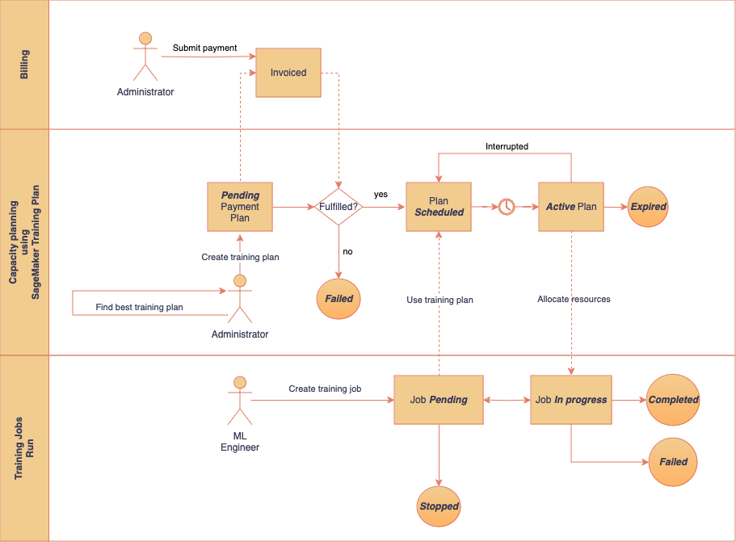
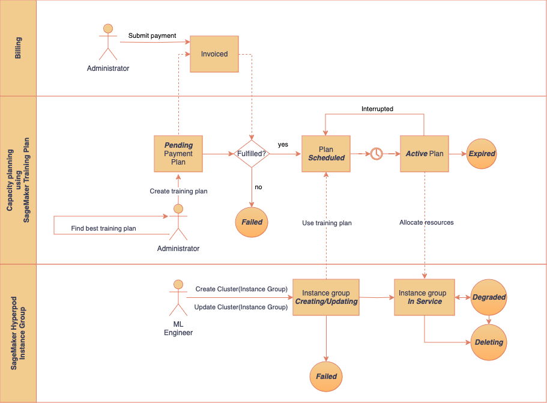

# Reserve training plans for your training

jobs or HyperPod clusters

Amazon SageMaker training plans is a capability that allows you to reserve and help maximize the use of
GPU capacity for large-scale AI model training workloads. This feature provides access to highly
sought-after instance types that cover a range of GPU-accelerated computing options, including
the latest NVIDIA GPU technologies and AWS trainium chips. With SageMaker training plans, you can
secure predictable access to these high-demand, high-performance computational resources within
your specified timelines and budgets, without the need to manage underlying infrastructure. This
flexibility is particularly valuable for organizations dealing with the challenges of acquiring
and scheduling these oversubscribed compute instances for their mission-critical AI
workloads.

## What are SageMaker training plans

SageMaker training plans allow you to reserve compute capacity tailored to your target resource
needs, such as SageMaker training jobs or SageMaker HyperPod clusters. The service automatically handles
the reservation, provisioning of accelerated compute resources, infrastructure setup, workload
execution, and recovery from infrastructure failures.

SageMaker training plans consist of one or more Reserved Capacity blocks, each defined by the
following parameters:

- Specific instance type
- Quantity of instances
- Availability Zone
- Duration
- Start and end times

###### Note

- Training
  plans are specific to their target resource (either SageMaker Training Job or SageMaker HyperPod)
  and cannot be interchanged.
- Multiple Reserved Capacity blocks in a single training plan may be discontinuous.
  This means there can be gaps between the Reserved Capacity blocks.

## Benefits of SageMaker training plans

SageMaker training plans offer the following benefits:

- **Predictable Access**: Reserve GPU capacity for your
  machine learning workloads within specified time frames.
- **Cost Management**: Plan and budget for large-scale
  training requirements in advance.
- **Automated Resource Management**: SageMaker training plans
  handle the provisioning and management of infrastructure.
- **Flexibility**: Create training plans for various
  resources, including SageMaker training jobs and SageMaker HyperPod clusters.
- **Fault Tolerance**: Benefit from automatic recovery
  from infrastructure failures and workload migration across Availability Zones for SageMaker AI
  training jobs.

## SageMaker training plans advance reservation and

flexible start times

SageMaker training plans allow you to reserve compute capacity in advance, with flexible start
times and durations.

- **Advance reservation**: You can reserve a training plan
  up to 8 weeks (56 days) in advance of the start date.
- **Minimum lead time**: SageMaker training plans offerings may be
  available to start within 30 minutes of reservation, subject to availability.

###### Note

You can search for and purchase a plan that will be accessible within 30 minutes. To
ensure timely activation, the payment transaction must successfully complete at least 5
minutes before the desired start time. For example, if you want a plan to start at 2:00
PM, you can make a last-minute search as late as 1:30 PM and complete your purchase by
1:55 PM to guarantee the plan is ready by 2:00 PM.

- **Reservation duration and instance quantity**:
  SageMaker training plans allow you to reserve instances with specific duration and quantity
  options. For available instance types in a given AWS Region, duration, and quantity
  options, see [Supported instance types,
  AWS Regions, and pricing](#training-plans-supported-instances-and-regions "#training-plans-supported-instances-and-regions").
- **End time**: Training Plans always end at 11:30 AM UTC
  on the final day of the reservation.
- **Training plan termination**: If you're using training jobs as a target resource and
  30 minutes remain in a Reserved Capacity, SageMaker training plans initiates the process of terminating any running
  instances within that block until the next Reserved Capacity becomes active. You retain
  full access to your training plan until 30 minutes before the final Reserved Capacity
  block's end time.

If your target resource is a SageMaker HyperPod cluster, this time limit is one hour.

## SageMaker training plans user workflow

SageMaker training plans work through the following steps:

Admin steps:

1. **Search and review**: Find available plan offerings that
   match your compute requirements, such as instance type, count, start time, and
   duration.
2. **Create a plan**: Reserve a training plan that meets
   your needs using the ID of your chosen plan offering.
3. **Payment and scheduling**: Upon successful upfront
   payment, the plan status becomes `Scheduled`.

Steps for plan users / ML engineers:

1. **Resource allocation**: Use your plan to queue SageMaker AI
   training jobs or allocate to a SageMaker HyperPod cluster instance group.
2. **Activation**: When the plan start date arrives, it
   becomes `Active`. Based on available reserved capacity, SageMaker training plans
   automatically launch training jobs or provision instance groups.

###### Note

The status of the training plan transitions from `Scheduled` to
`Active` when a Reserved Capacity period begins, and then back to
`Scheduled` when waiting for the next Reserved Capacity period to start.

The following diagrams provide a comprehensive overview of how SageMaker training plans interact
with different [target resources](#training-plans-target-resources "#training-plans-target-resources"),
illustrating a plan's lifecycle and its role in resource allocation for both SageMaker training
jobs and SageMaker HyperPod clusters.

- **Training plans for SageMaker Training
  Job**: The first diagram illustrates the end-to-end workflow of the interaction
  between a training plan and SageMaker Training Job.

- **Training plans for SageMaker HyperPod
  clusters**: The second diagram illustrates the end-to-end workflow of the
  interaction between a training plan and a SageMaker HyperPod instance group.

## Supported instance types,

AWS Regions, and pricing

Training plans support reservations for the following specific
high-performance instance types, each available in select AWS Regions:

- **ml.p4d.24xlarge**
- **ml.p5.48xlarge**
- **ml.p5e.48xlarge**
- **ml.p5en.48xlarge**
- **ml.trn1.32xlarge**
- **ml.trn2.48xlarge**
- **ml.p6-b200.48xlarge**
- **ml.c6i-32xlargesc**

**UltraServers**

- **ml.p6e-gb200.36xlarge**
- **ml.p6e-gb200.72xlarge**

###### Note

The availability of instance types may change over time. For the most up-to-date
information on available instance types according to Region, as well as their respective
prices, see [SageMaker Pricing](https://aws.amazon.com/sagemaker-ai/pricing/ "https://aws.amazon.com/sagemaker-ai/pricing/"). Scroll
down to the **Amazon SageMaker HyperPod flexible training plans** section under
**On-Demand Pricing**. Select a Region to view the list of available
instance types.

The availability across multiple regions allows to choose the most suitable location for
workloads, considering factors such as data residency requirements and proximity to other
AWS services.

###### Important

- You can use SageMaker training plans to reserve instances with the following reservation
  duration and instance quantity options.
  - Reservation durations are available in 1-day increments from 1 to 182 days.
  - The reservation instance quantity options are 1, 2, 4, 8, 16, 32 or 64
    instances.

- Make sure that your Training Jobs or HyperPod service quotas allow a
  maximum number of instances per instance type that exceeds the number of instances
  specified in your plan. To view your current quotas or request a quota increase, see
  [View SageMaker training plans quotas using the AWS management
  console](training-plan-quotas.md "training-plan-quotas.md").

## UltraServers in SageMaker AI

UltraServers in SageMaker AI offer a set of instances interconnected via a high bandwidth network domain. For example, the P6e-GB200 UltraServer
connects up to 18 `p6e-gb200.36xlarge` instances under one NVIDIA NVLink domain. With 4 NVIDIA Blackwell GPUs per instance, each P6e-GB200 UltraServer
supports 72 GPUs, so you can run your largest AI workloads with high performance on SageMaker AI.

When you use UltraServers with SageMaker AI, you get performance combined with SageMaker AI's managed
infrastructure, built-in fault resiliency features, integrated monitoring capabilities, and native
integration with other SageMaker AI and AWS services. This integration allows you to focus on model development and
deployment while SageMaker AI handles the undifferentiated heavy lifting of managing AI infrastructure.

###### Note

UltraServers are available only in the Dallas Local Zone (us-east-1-dfw-2a), which
is an extension of the US East (N. Virginia) Region. For more information, see
[Getting started with AWS Local Zones](../../../local-zones/latest/ug/getting-started.md "../../../local-zones/latest/ug/getting-started.md")

### Considerations

Consider the following when using UltraServers with SageMaker AI:

- You can use UltraServers for both [SageMaker HyperPod](sagemaker-hyperpod.md "sagemaker-hyperpod.md") and [SageMaker training jobs](train-model.md "train-model.md").
- You can only purchase UltraServers in full units. For more information about instance and pricing
  information, see Amazon SageMaker HyperPod flexible training plans in
  [Amazon SageMaker AI pricing](https://aws.amazon.com/sagemaker-ai/pricing/ "https://aws.amazon.com/sagemaker-ai/pricing/").
- If you're using UltraServers with HyperPod, HyperPod automatically adds topology labels
  to your resources to help you with resource allocation. For more information, see
  [Using topology-aware scheduling in Amazon SageMaker HyperPod](sagemaker-hyperpod-topology.md "sagemaker-hyperpod-topology.md").
- SageMaker AI and UltraServers offer various capabilities that enhance the resiliency
  of your workloads, including preemptive checks and automatic fault detection and mitigation.
  Depending on what the issue is, SageMaker AI can run actions to recover your workloads, such as
  restarting instances, replacing failed instances with spares, and replacing failed UltraServers.
- For added resilience, you can configure instances within an UltraServer to be used as spares. Keeping a spare
  instance within the UltraServer ensures that SageMaker AI can quickly respond to an instance failure while minimizing any impact to your jobs. We recommend
  that you keep one spare instance per UltraServer. You don't have to reserve any spare instances,
  but this might hinder support options and slow down failure recovery.
  You purchase UltraServers by wholes, so the number of spares that you reserve doesn't affect pricing.
- To see the status and instances within an UltraServer, use the [ListTrainingPlans](../APIReference/API_ListTrainingPlans.md "../APIReference/API_ListTrainingPlans.md") API operation
  or the AWS console to see training plans. Using these tools, you can see
  the total number of available instances, instances currently in use, unhealthy instances, the number
  of configured spares, and other information. Possible health statuses are
  `ok`, `impaired`, and `insufficient-data`.

## SageMaker training plans search behavior

When searching for a training plan offering, SageMaker training plans use the following approach
to maximize resource availability and flexibility for users, even when demand is high and
Reserved Capacity blocks are scarce:

- **Initial continuous search**: SageMaker training plans first
  attempt to find a single, continuous block of Reserved Capacity that matches the
  specified duration within the start and end dates, while meeting all other specified
  criteria, including target resource, requested instance type, and number of
  instances.
- **Two-block search**: SageMaker training plans don't return a "no
  capacity" result if a single continuous Reserved Capacity block meeting all criteria is
  unavailable. Instead, it automatically attempts to fulfill the request using two separate
  Reserved Capacity blocks, splitting the total duration across two time segments.

This two-block approach provides more flexibility in resource allocation, potentially
securing high-demand instances that would otherwise be unavailable.

###### Note

SageMaker training plans return up to three offerings of one or two segments. For example, for a
48-hour duration plan, SageMaker training plans might offer a plan with two 24-hour blocks, one
continuous 48-hour block, and two blocks with uneven duration.

## Considerations

###### Important

- Training plans cannot be modified once purchased.
- Training plans cannot be shared across AWS accounts or within your AWS
  Organization.

- When searching for training plan offerings, SageMaker training plans adapts its search
  strategy based on the [target resources](#training-plans-target-resources "#training-plans-target-resources"):

**For SageMaker HyperPod clusters**:

    + Offerings are limited to a single Availability Zone (AZ).
    + This ensures consistent network performance and data locality within the
     cluster.

**For SageMaker training jobs**:

    + Offerings can span multiple Availability Zones.
    + This is particularly relevant when the plan offering contains multiple
     discontinuous reserved capacities.
    + For example, a plan might include capacity in AZ-A for one Reserved Capacity block
     and AZ-B for another. SageMaker training plans can automatically move workloads across
     Availability Zones (AZs) based on resource availability.

    This multi-AZ approach for training jobs provides greater flexibility in resource
     allocation, increasing the chances of finding suitable capacity for your workload.
     However, you should be aware that your jobs may run in different AZs during different
     parts of your reservation period.

- When presented with a two-block offering, users should carefully consider if this
  split allocation meets their workload requirements. This may require adjusting job
  scheduling or workload distribution to accommodate the non-continuous nature of the
  reservation.
