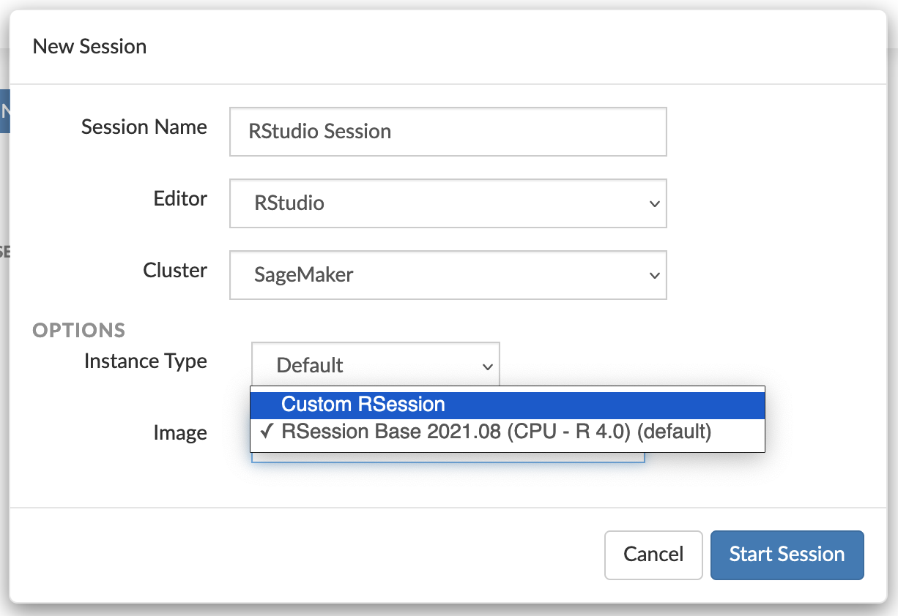

# Launch a custom SageMaker image in RStudio

You can use your custom image when launching an RStudio applicaton from the console. After
you create your custom SageMaker image and attach it to your domain, the image appears in the
image selector dialog box of the RStudio Launcher. To launch a new RStudio app, follow the
steps in [Launch RSessions from the RStudio Launcher](rstudio-launcher.md "rstudio-launcher.md") and select your
custom image as shown in the following image.

