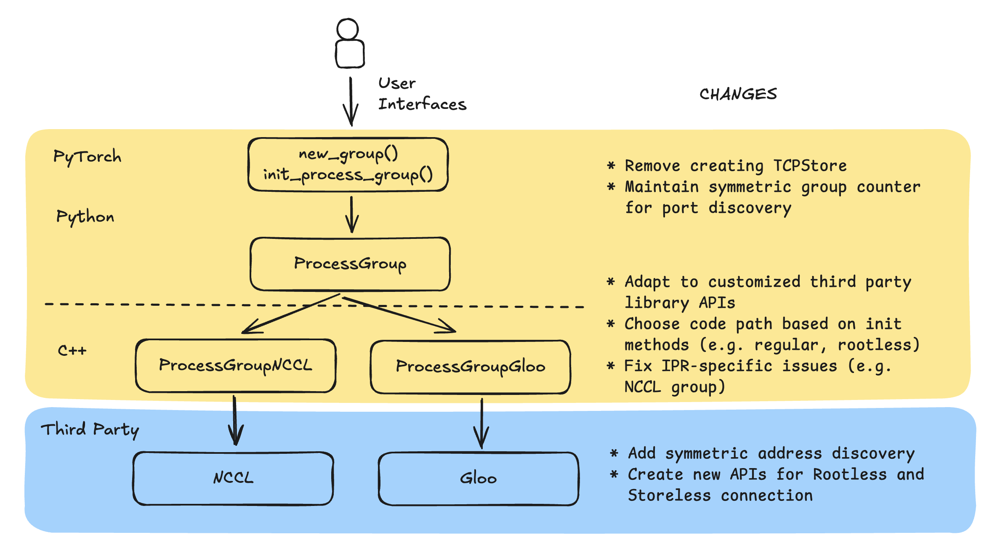

# Collective communication initialization improvements

NCCL and Gloo are fundamental communication libraries that enable collective operations (such as all-reduce and broadcast) across distributed training processes. However, traditional NCCL and Gloo initialization can create bottlenecks during fault recovery.

The standard recovery process requires all processes to connect to a centralized TCPStore and coordinate through a root process, introducing an expensive overhead that becomes particularly problematic during restarts. This centralized design creates three critical issues: coordination overhead from mandatory TCPStore connections, recovery delays as each restart must repeat the full initialization sequence, and a single point of failure in the root process itself. This imposes an expensive, centralized coordination steps every time training initializes or restarts.

HyperPod checkpointless training eliminates these coordination bottlenecks, enabling the faster recovery from faults by making initialization "rootless" and "TCPStoreless."

## Rootless configurations

To enable Rootless, one can simply expose the following environment variables.

```
export HPCT_USE_ROOTLESS=1 && \
sysctl -w net.ipv4.ip_local_port_range="20000 65535" && \
```

HPCT_USE_ROOTLESS: 0 or 1. Use to turn on and off rootless

sysctl -w net.ipv4.ip_local_port_range="20000 65535": Set the system port range

## Rootless

HyperPod checkpointless training offers novel initialization methods, Rootless and TCPStoreless, for NCCL and Gloo process groups.

The implementation of these optimizations involves modifying NCCL, Gloo, and PyTorch:

- Extending third-party library APIs to enable Rootless and Storeless NCCL and Gloo optimizations while maintaining backward compatibility
- Updating process group backends to conditionally use optimized paths and handle in-process recovery issues
- Bypassing expensive TCPStore creation at the PyTorch distributed layer while maintaining symmetric address patterns through global group counters

The following graph shows the architecture of the distributed training libraries and the changes made in checkpointless training.



### NCCL and Gloo

These are independent packages that perform the core functionality of collective communications. They provide key APIs, such as ncclCommInitRank, to initialize communication networks, manage the underlying resources, and perform collective communications. After making custom changes in NCCL and Gloo, the Rootless and Storeless optimizes (e.g., skip connecting to the TCPStore) initialization of the communication network. You can switch between using the the original code paths or optimized code paths flexibly.

### PyTorch process group backend

The process group backends, specifically ProcessGroupNCCL and ProcessGroupGloo, implement the ProcessGroup APIs by invoking the APIs of their corresponding underlying libraries. Since we extend the third-party libraries' APIs, we have to invoke them properly and make code path switches based on customers' configurations.

In addition to optimization code paths, we also change the process group backend to support in-process recovery.
