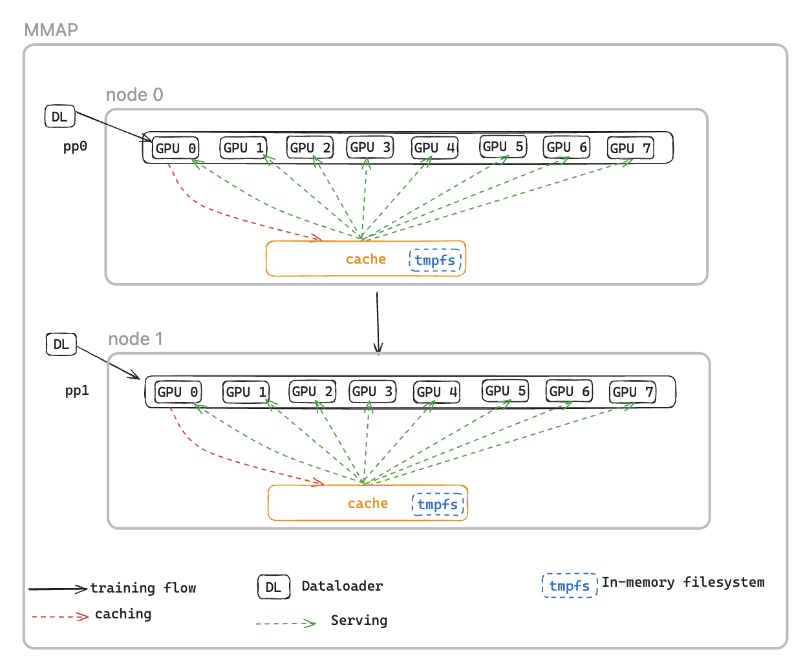

# MMAP

Another restart overhead stems from data loading: the training cluster remains idle
while the dataloader initializes, downloads data from remote file systems, and processes
it into batches.

To address this, we introduce the MMAP Dataloader, which caches prefetched batches in persistent
memory, ensuring they remain available even after a fault-induced restart. This approach eliminates
dataloader setup time and enables training to resume immediately using cached batches, while the
dataloader concurrently reinitializes and fetches subsequent data in the background. The data cache
resides on each rank that requires training data and maintains two types of batches: recently consumed
batches that have been used for training, and prefetched batches ready for immediate use.


MMAP dataloader offers two following features:

- **Data Prefetching** - Proactively fetches and caches data generated by the dataloader
- **Persistent Caching** - Stores both consumed and prefetched batches in a temporary filesystem that survives process restarts
  Using the cache, the training job will benefit from:

- Reduced Memory Footprint - Leverages memory-mapped I/O to maintain a single shared copy of data in host CPU memory, eliminating redundant copies across GPU processes (e.g., reduces from 8 copies to 1 on a p5 instance with 8 GPUs)
- Faster Recovery - Reduces Mean Time to Restart (MTTR) by enabling training to resume immediately from cached batches, eliminating the wait for dataloader reinitialization and first-batch generation

## MMAP configurations

To use MMAP, simply pass in the your original data module into `MMAPDataModule`

```
data_module=MMAPDataModule(
    data_module=MY_DATA_MODULE(...),
    mmap_config=CacheResumeMMAPConfig(
        cache_dir=self.cfg.mmap.cache_dir,
        checkpoint_frequency=self.cfg.mmap.checkpoint_frequency),
)
```

`CacheResumeMMAPConfig`: MMAP Dataloader parameters control cache directory location, size limits, and data fetching delegation. By default, only TP rank 0 per node fetches data from the source,
while other ranks in the same data replication group read from the shared cache, eliminating redundant transfers.

`MMAPDataModule`: It wraps the original data module and returns the mmap dataloader for both train and validation.

## API reference

### CacheResumeMMAPConfig

```
class hyperpod_checkpointless_training.dataloader.config.CacheResumeMMAPConfig(
  cache_dir='/dev/shm/pdl_cache',
  prefetch_length=10,
  val_prefetch_length=10,
  lookback_length=2,
  checkpoint_frequency=None,
  model_parallel_group=None,
  enable_batch_encryption=False)
```

Configuration class for cache-resume memory-mapped (MMAP) dataloader functionality in HyperPod checkpointless training.

This configuration enables efficient data loading with caching and prefetching capabilities, allowing
training to resume quickly after failures by maintaining cached data batches in memory-mapped files.

**Parameters**

- **cache_dir** (str, optional) – Directory path for storing cached data batches. Default: "/dev/shm/pdl_cache"
- **prefetch_length** (int, optional) – Number of batches to prefetch ahead during training. Default: 10
- **val_prefetch_length** (int, optional) – Number of batches to prefetch ahead during validation. Default: 10
- **lookback_length** (int, optional) – Number of previously used batches to keep in cache for potential reuse. Default: 2
- **checkpoint_frequency** (int, optional) – Frequency of model checkpointing steps. Used for cache performance optimization. Default: None
- **model_parallel_group** (object, optional) – Process group for model parallelism. If None, will be created automatically. Default: None
- **enable_batch_encryption** (bool, optional) – Whether to enable encryption for cached batch data. Default: False

**Methods**

```
create(dataloader_init_callable,
    parallel_state_util,
   step,
    is_data_loading_rank,
   create_model_parallel_group_callable,
    name='Train',
   is_val=False,
   cached_len=0)
```

Creates and returns a configured MMAP dataloader instance.

**Parameters**

- **dataloader_init_callable** (Callable) – Function to initialize the underlying dataloader
- **parallel_state_util** (object) – Utility for managing parallel state across processes
- **step** (int) – The data step to resume from during training
- **is_data_loading_rank** (Callable) – Function that returns True if current rank should load data
- **create_model_parallel_group_callable** (Callable) – Function to create model parallel process group
- **name** (str, optional) – Name identifier for the dataloader. Default: "Train"
- **is_val** (bool, optional) – Whether this is a validation dataloader. Default: False
- **cached_len** (int, optional) – Length of cached data if resuming from existing cache. Default: 0

Returns `CacheResumePrefetchedDataLoader` or `CacheResumeReadDataLoader` – Configured
MMAP dataloader instance

Raises `ValueError` if the step parameter is `None`.

**Example**

```
from hyperpod_checkpointless_training.dataloader.config import CacheResumeMMAPConfig

# Create configuration
config = CacheResumeMMAPConfig(
    cache_dir="/tmp/training_cache",
    prefetch_length=20,
    checkpoint_frequency=100,
    enable_batch_encryption=False
)

# Create dataloader
dataloader = config.create(
    dataloader_init_callable=my_dataloader_init,
    parallel_state_util=parallel_util,
    step=current_step,
    is_data_loading_rank=lambda: rank == 0,
    create_model_parallel_group_callable=create_mp_group,
    name="TrainingData"
)
```

**Notes**

- The cache directory should have sufficient space and fast I/O performance (e.g., /dev/shm for in-memory storage).
- Setting `checkpoint_frequency` improves cache performance by aligning cache management with model checkpointing
- For validation dataloaders (`is_val=True`), the step is reset to 0 and cold start is forced
- Different dataloader implementations are used based on whether the current rank is responsible for data loading

### MMAPDataModule

```

class hyperpod_checkpointless_training.dataloader.mmap_data_module.MMAPDataModule(
    data_module,
    mmap_config,
    parallel_state_util=MegatronParallelStateUtil(),
    is_data_loading_rank=None)

```

A PyTorch Lightning DataModule wrapper that applies memory-mapped (MMAP) data loading capabilities to existing DataModules for checkpointless training.

This class wraps an existing PyTorch Lightning DataModule and enhances it with MMAP functionality, enabling efficient data caching and fast recovery during training failures. It maintains compatibility with the original DataModule interface while adding checkpointless training capabilities.

Parameters

data_module (pl.LightningDataModule)
The underlying DataModule to wrap (e.g., LLMDataModule)

mmap_config (MMAPConfig)
The MMAP configuration object that defines caching behavior and parameters

`parallel_state_util` (MegatronParallelStateUtil, optional)
Utility for managing parallel state across distributed processes. Default: MegatronParallelStateUtil()

`is_data_loading_rank` (Callable, optional)
Function that returns True if the current rank should load data. If None, defaults to parallel_state_util.is_tp_0. Default: None

**Attributes**

`global_step` (int)
Current global training step, used for resuming from checkpoints

`cached_train_dl_len` (int)
Cached length of the training dataloader

`cached_val_dl_len` (int)
Cached length of the validation dataloader

**Methods**

```
setup(stage=None)
```

Setup the underlying data module for the specified training stage.

`stage` (str, optional)
Stage of training ('fit', 'validate', 'test', or 'predict'). Default: None

```
train_dataloader()
```

Create the training DataLoader with MMAP wrapping.

_Returns:_ DataLoader – MMAP-wrapped training DataLoader with caching and prefetching capabilities

```
val_dataloader()
```

Create the validation DataLoader with MMAP wrapping.

_Returns:_ DataLoader – MMAP-wrapped validation DataLoader with caching capabilities

```
test_dataloader()
```

Create the test DataLoader if the underlying data module supports it.

_Returns:_ DataLoader or None – Test DataLoader from the underlying data module, or None if not supported

```
predict_dataloader()
```

Create the predict DataLoader if the underlying data module supports it.

_Returns:_ DataLoader or None – Predict DataLoader from the underlying data module, or None if not supported

```
load_checkpoint(checkpoint)
```

Load checkpoint information to resume training from a specific step.

checkpoint (dict)
Checkpoint dictionary containing 'global_step' key

```
get_underlying_data_module()
```

Get the underlying wrapped data module.

_Returns:_ pl.LightningDataModule – The original data module that was wrapped

```
state_dict()
```

Get the state dictionary of the MMAP DataModule for checkpointing.

_Returns:_ dict – Dictionary containing cached dataloader lengths

```
load_state_dict(state_dict)
```

Load the state dictionary to restore MMAP DataModule state.

`state_dict` (dict)
State dictionary to load

**Properties**

```
data_sampler
```

Expose the underlying data module's data sampler to NeMo framework.

_Returns:_ object or None – The data sampler from the underlying data module

**Example**

```

from hyperpod_checkpointless_training.dataloader.mmap_data_module import MMAPDataModule
from hyperpod_checkpointless_training.dataloader.config import CacheResumeMMAPConfig
from my_project import MyLLMDataModule

# Create MMAP configuration
mmap_config = CacheResumeMMAPConfig(
    cache_dir="/tmp/training_cache",
    prefetch_length=20,
    checkpoint_frequency=100
)

# Create original data module
original_data_module = MyLLMDataModule(
    data_path="/path/to/data",
    batch_size=32
)

# Wrap with MMAP capabilities
mmap_data_module = MMAPDataModule(
    data_module=original_data_module,
    mmap_config=mmap_config
)

# Use in PyTorch Lightning Trainer
trainer = pl.Trainer()
trainer.fit(model, data=mmap_data_module)

# Resume from checkpoint
checkpoint = {"global_step": 1000}
mmap_data_module.load_checkpoint(checkpoint)

```

**Notes**

- The wrapper delegates most attribute access to the underlying data module using \_\_getattr\_\_
- Only data loading ranks actually initialize and use the underlying data module; other ranks use fake dataloaders
- Cached dataloader lengths are maintained to optimize performance during training resumption
