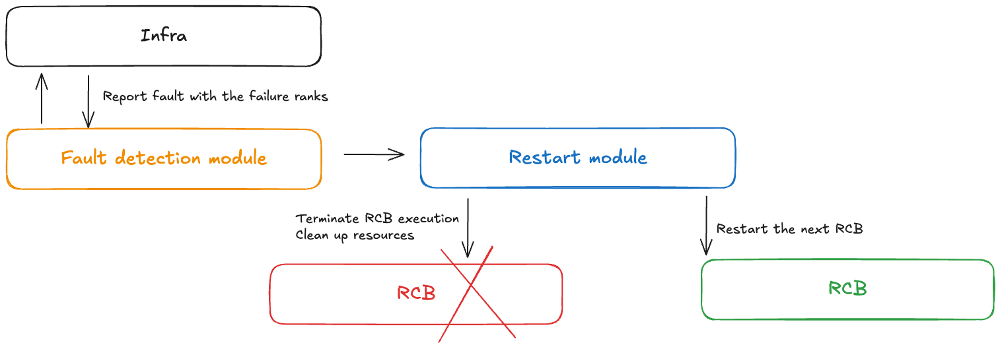
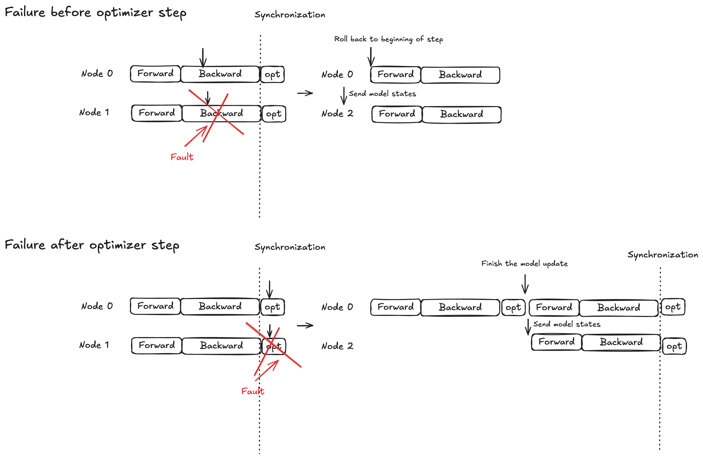
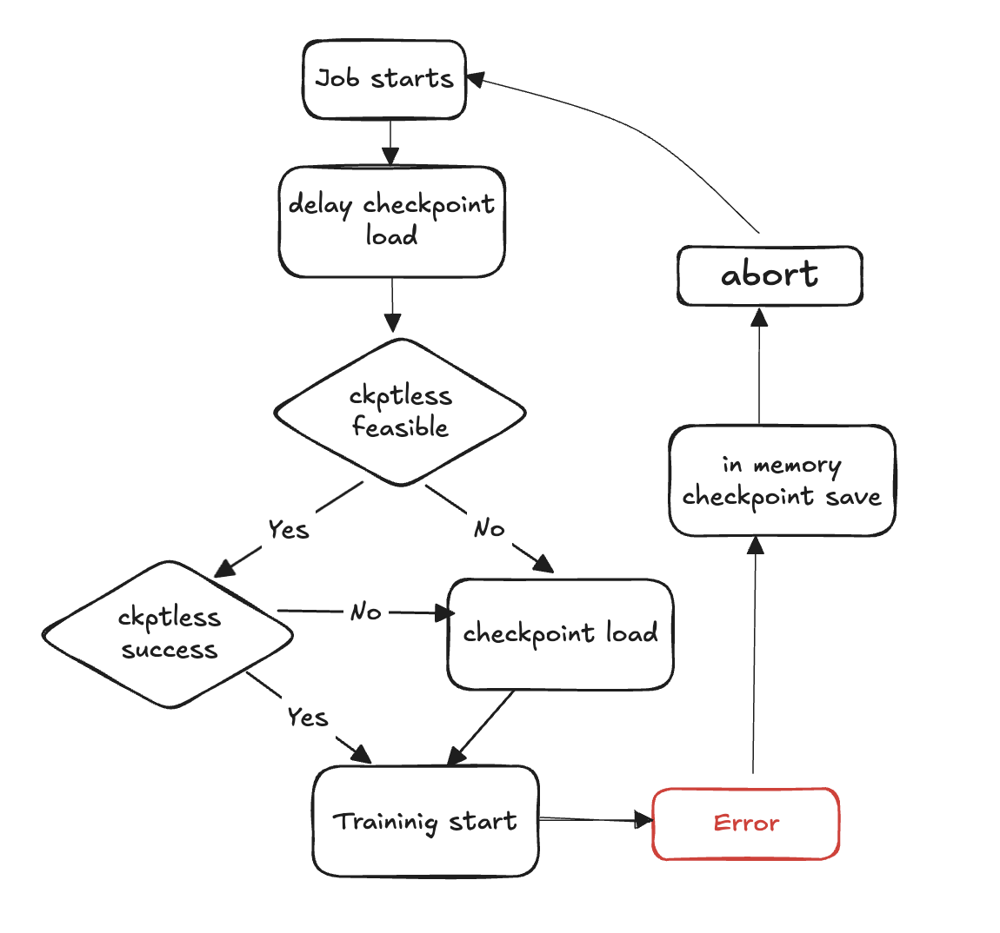

# In-process recovery and checkpointless training

HyperPod checkpointless training uses model redundancy to enable fault-tolerant training. The core principle is that model and optimizer states are fully replicated across multiple node groups, with weight updates and optimizer state changes synchronously replicated within each group. When a failure occurs, healthy replicas complete their optimizer steps and transmit the updated model/optimizer states to recovering replicas.

This model redundancy-based approach enables several fault handling mechanisms:

- **In-process recovery:** processes remain active despite faults, keeping all model and optimizer states in GPU memory with the latest values
- **Graceful abort handling:** controlled aborts and resource cleanup for affected operations
- **Code block re-execution:** re-running only the affected code segments within a Re-executable Code Block (RCB)
- **Checkpointless recovery with no lost training progress:** since processes persist and states remain in memory, no training progress is lost; when a fault occurs training resumes from the previous step, as opposed to resuming from the last saved checkpoint
  **Checkpointless Configurations**

Here is the core snippet of checkpointless training.

```
from hyperpod_checkpointless_training.inprocess.train_utils import wait_rank
    wait_rank()

def main():
    @HPWrapper(
        health_check=CudaHealthCheck(),
        hp_api_factory=HPAgentK8sAPIFactory(),
        abort_timeout=60.0,
        checkpoint_manager=PEFTCheckpointManager(enable_offload=True),
        abort=CheckpointlessAbortManager.get_default_checkpointless_abort(),
        finalize=CheckpointlessFinalizeCleanup(),
    )
    def run_main(cfg, caller: Optional[HPCallWrapper] = None):
        ...
        trainer = Trainer(
            strategy=CheckpointlessMegatronStrategy(...,
                num_distributed_optimizer_instances=2),
            callbacks=[..., CheckpointlessCallback(...)],
            )
        trainer.fresume = resume
        trainer._checkpoint_connector = CheckpointlessCompatibleConnector(trainer)
        trainer.wrapper = caller
```

- `wait_rank`: All ranks will wait for the rank information from the HyperpodTrainingOperator infrastructure.
- `HPWrapper`: Python function wrapper that enables restart capabilities for a Re-executable Code Block (RCB). The implementation uses a context manager rather than a Python decorator because decorators cannot determine the number of RCBs to monitor at runtime.
- `CudaHealthCheck`: Ensures the CUDA context for the current process is in a healthy state by synchronizing with the GPU. Uses the device specified by the LOCAL_RANK environment variable, or defaults to the main thread's CUDA device if LOCAL_RANK is not set.
- `HPAgentK8sAPIFactory`: This API enables checkpointless training to query the training status of other pods in the Kubernetes training cluster. It also provides an infrastructure-level barrier that ensures all ranks successfully complete abort and restart operations before proceeding.
- `CheckpointManager`: Manages in-memory checkpoints and peer-to-peer recovery for checkpointless fault tolerance. It has the following core responsibilities:
  - **In-Memory Checkpoint Management**: Saves and manages NeMo model checkpoints in memory for fast recovery without disk I/O during checkpointless recovery scenarios.
  - **Recovery Feasibility Validation**: Determines if checkpointless recovery is possible by validating global step consistency, rank health, and model state integrity.
  - **Peer-to-Peer Recovery Orchestration**: Coordinates checkpoint transfer between healthy and failed ranks using distributed communication for fast recovery.
  - **RNG State Management**: Preserves and restores random number generator states across Python, NumPy, PyTorch, and Megatron for deterministic recovery.
  - **[Optional] Checkpoint Offload**: Offload in memory checkpoint to CPU if GPU does not have enough memory capacity.

- `PEFTCheckpointManager`: It extends `CheckpointManager` by keeping the base model weights for PEFT finetuning.
- `CheckpointlessAbortManager`: Manages abort operations in a background thread when an error is encountered. By default, it aborts TransformerEngine, Checkpointing, TorchDistributed, and DataLoader. Users can register custom abort handlers as needed. After the abort completes, all communication must cease and all processes and threads must terminate to prevent resource leaks.
- `CheckpointlessFinalizeCleanup`: Handles final cleanup operations in the main thread for components that cannot be safely aborted or cleaned up in the background thread.
- `CheckpointlessMegatronStrategy`: This inherits from the `MegatronStrategy` from in Nemo. Note that checkpointless training requires `num_distributed_optimizer_instances` to be least 2 so that there will be optimizer replication. The strategy also takes care of essential attribute registration and process group initialization, e.g., rootless.
- `CheckpointlessCallback`: Lightning callback that integrates NeMo training with checkpointless training's fault tolerance system. It has the following core responsibilities:
  - **Training Step Lifecycle Management**: Tracks training progress and coordinates with ParameterUpdateLock to enable/disable checkpointless recovery based on training state (first step vs subsequent steps).
  - **Checkpoint State Coordination**: Manages in-memory PEFT base model checkpoint saving/restoring.

- `CheckpointlessCompatibleConnector`: A PTL `CheckpointConnector` that attempts to pre-load the checkpoint file to memory, with the source path determined in this priority:

      + try checkpointless recovery
      + if checkpointless return None, fallback to parent.resume\_start()

  See [the example](https://github.com/aws/sagemaker-hyperpod-checkpointless-training/blob/main/examples/gpt_oss/gpt_oss_120b_full_finetune.py "https://github.com/aws/sagemaker-hyperpod-checkpointless-training/blob/main/examples/gpt_oss/gpt_oss_120b_full_finetune.py") to add checkpointless training features to codes.

**Concepts**

This section introduces checkpointless training concepts. Checkpointless training on Amazon SageMaker HyperPod supports in-process recovery. This API interface follows a similar format as the NVRx APIs.

**Concept - Re-Executable Code Block (RCB)**

When a failure occurs, healthy processes remain alive, but a portion of the code must be re-executed to recover the training states and python stacks. A Re-executable Code Block (RCB) is a specific code segment that re-runs during failure recovery. In the following example, the RCB encompasses the entire training script (i.e., everything under main()), meaning that each failure recovery restarts the training script while preserving the in-memory model and optimizer states.

**Concept - Faults control**

A fault controller module receives notifications when failures occur during checkpointless training. This fault controller includes the following components:

- **Fault detection module:** Receives infrastructure fault notifications
- **RCB definition APIs:** Enables users to define the re-executable code block (RCB) in their code
- **Restart module:** Terminates the RCB, cleans up resources, and restarts the RCB


**Concept - Model redundancy**

Large model training usually requires a large enough data parallel size to train models efficiently. In traditional data parallelism like PyTorch DDP and Horovod, the model is fully replicated. More advanced sharded data parallelism techniques like DeepSpeed ZeRO optimizer and FSDP also support hybrid sharding mode, which allows sharding the model/optimizer states within the sharding group and fully replicating across replication groups. NeMo also has this hybrid sharding feature through an argument num_distributed_optimizer_instances, which allows redundancy.

However, adding redundancy indicates that the model will not be fully sharded across the entire cluster, resulting in higher device memory usage. The amount of redundant memory will vary depending on the specific model sharding techniques implemented by the user. The low-precision model weights, gradients, and activation memory will not be affected, since they are sharded through model parallelism. The high-precision master model weights/gradients and optimizer states will be affected. Adding one redundant model replica increases device memory usage by roughly the equivalent of one DCP checkpoint size.

Hybrid sharding breaks the collectives across the entire DP groups into relatively smaller collectives. Previously there was a reduce-scatter and an all-gather across the entire DP group. After the hybrid sharding, the reduce-scatter is only running inside each model replica, and there will be an all-reduce across model replica groups. The all-gather is also running inside each model replica. As a result, the entire communication volume remains roughly unchanged, but collectives are running with smaller groups, so we expect better latency.

**Concept - Failure and Restart Types**

The following table records different failure types and associated recovery mechanisms. Checkpointless training first attempts failure recovery via an in-process recovery, followed by a process-level restart. It falls back to a job-level restart only in the event of a catastrophic failure (e.g., multiple nodes fail at the same time).

| Failure Type                 | Cause                                      | Recovery Type                   | Recovery Mechanism                                                             |
| ---------------------------- | ------------------------------------------ | ------------------------------- | ------------------------------------------------------------------------------ |
| **In-process failure**       | Code-level errors, exceptions              | **In-Process Recovery (IPR)**   | Rerun RCB within existing process; healthy processes remain active             |
| **Process restart failure**  | Corrupted CUDA context, terminated process | **Process Level Restart (PLR)** | SageMaker HyperPod training operator restarts processes; skips K8s pod restart |
| **Node replacement failure** | Permanent node/GPU hardware failure        | **Job Level Restart (JLR)**     | Replace failed node; restart entire training job                               |

**Concept - Atomic lock protection for optimizer step**

Model execution is divided into three phases: forward propagation, backward propagation, and optimizer step. Recovery behavior varies based on the failure timing:

- **Forward/backward propagation:** Roll back to the beginning of the current training step and broadcast model states to replacement node(s)
- **Optimizer step:** Allow healthy replicas to complete the step under lock protection, then broadcast the updated model states to replacement node(s)
  This strategy ensures completed optimizer updates are never discarded, helping reduce fault recovery time.



## Checkpointless Training Flow Diagram



The following steps outline the failure detection and checkpointless recovery process:

1. Training loop starts
2. Fault occurs
3. Evaluate checkpointless resume feasibility
4. Check if it is feasible to do checkpointless resume
   - If feasible, Attempt checkpointless reusme
     - If resumes fails, fallback to checkpoint loading from storage
     - If resume succeeds, training continues from recovered state

   - If not feasible, fall back to checkpoint loading from storage

5. Clean up resources - abort all process groups and backends and free resources in preparation for restart.
6. Resume training loop - a new training loop begins, and the process returns to step 1.

## API reference

### wait_rank

```
hyperpod_checkpointless_training.inprocess.train_utils.wait_rank()
```

Waits for and retrieves rank information from HyperPod, then updates the current process environment with distributed training variables.

This function obtains the correct rank assignment and environment variables for distributed training. It ensures that each process gets the appropriate configuration for its role in the distributed training job.

**Parameters**

None

**Returns**

**None**

**Behavior**

- **Process Check**: Skips execution if called from a subprocess (only runs in MainProcess)
- **Environment Retrieval**: Gets current `RANK` and `WORLD_SIZE` from environment variables
- **HyperPod Communication**: Calls `hyperpod_wait_rank_info()` to retrieve rank information from HyperPod
- **Environment Update**: Updates the current process environment with worker-specific environment variables received from HyperPod

**Environment Variables**

The function reads the following environment variables:

- **RANK** (_int_) – Current process rank (default: -1 if not set)
- **WORLD_SIZE** (_int_) – Total number of processes in the distributed job (default: 0 if not set)

**Raises**

- **AssertionError** – If the response from HyperPod is not in the expected format or if required fields are missing

**Example**

```
from hyperpod_checkpointless_training.inprocess.train_utils import wait_rank

# Call before initializing distributed training
wait_rank()

# Now environment variables are properly set for this rank
import torch.distributed as dist
dist.init_process_group(backend='nccl')
```

**Notes**

- Only executes in the main process; subprocess calls are automatically skipped
- The function blocks until HyperPod provides the rank information

### HPWrapper

```
class hyperpod_checkpointless_training.inprocess.wrap.HPWrapper(
    *,
    abort=Compose(HPAbortTorchDistributed()),
    finalize=None,
    health_check=None,
    hp_api_factory=None,
    abort_timeout=None,
    enabled=True,
    trace_file_path=None,
    async_raise_before_abort=True,
    early_abort_communicator=False,
    checkpoint_manager=None,
    check_memory_status=True)
```

_Python function wrapper that enables restart capabilities for a Re-executable Code Block (RCB) in HyperPod checkpointless training._

_This wrapper provides fault tolerance and automatic recovery capabilities by monitoring training execution and coordinating restarts across distributed processes when failures occur. It uses a context manager approach rather than a decorator to maintain global resources throughout the training lifecycle._

**Parameters**

- **abort** (_Abort_, _optional_) – Asynchronously aborts execution when failures are detected. Default: `Compose(HPAbortTorchDistributed())`
- **finalize** (_Finalize_, _optional_) – Rank-local finalize handler executed during restart. Default: `None`
- **health_check** (_HealthCheck_, _optional_) – Rank-local health check executed during restart. Default: `None`
- **hp_api_factory** (_Callable_, _optional_) – Factory function for creating a HyperPod API to interact with HyperPod. Default: `None`
- **abort_timeout** (_float_, _optional_) – Timeout for abort call in fault controlling thread. Default: `None`
- **enabled** (_bool_, _optional_) – Enables the wrapper functionality. When `False`, the wrapper becomes a pass-through. Default: `True`
- **trace_file_path** (_str_, _optional_) – Path to the trace file for VizTracer profiling. Default: `None`
- **async_raise_before_abort** (_bool_, _optional_) – Enable raise before abort in fault controlling thread. Default: `True`
- **early_abort_communicator** (_bool_, _optional_) – Abort communicator (NCCL/Gloo) before aborting dataloader. Default: `False`
- **checkpoint_manager** (_Any_, _optional_) – Manager for handling checkpoints during recovery. Default: `None`
- **check_memory_status** (_bool_, _optional_) – Enable memory status checking and logging. Default: `True`

**Methods**

```
def __call__(self, fn)
```

_Wraps a function to enable restart capabilities._

**Parameters:**

- **fn** (_Callable_) – The function to wrap with restart capabilities

**Returns:**

- **Callable** – Wrapped function with restart capabilities, or original function if disabled

**Example**

```
from hyperpod_checkpointless_training.nemo_plugins.checkpoint_manager import CheckpointManager
from hyperpod_checkpointless_training.nemo_plugins.patches import patch_megatron_optimizer
from hyperpod_checkpointless_training.nemo_plugins.checkpoint_connector import CheckpointlessCompatibleConnector
from hyperpod_checkpointless_training.inprocess.train_utils import HPAgentK8sAPIFactory
from hyperpod_checkpointless_training.inprocess.abort import CheckpointlessFinalizeCleanup, CheckpointlessAbortManager

@HPWrapper(
    health_check=CudaHealthCheck(),
    hp_api_factory=HPAgentK8sAPIFactory(),
    abort_timeout=60.0,
    checkpoint_manager=CheckpointManager(enable_offload=False),
    abort=CheckpointlessAbortManager.get_default_checkpointless_abort(),
    finalize=CheckpointlessFinalizeCleanup(),
)def training_function():
    # Your training code here
    pass
```

**Notes**

- The wrapper requires `torch.distributed` to be available
- When `enabled=False`, the wrapper becomes a pass-through and returns the original function unchanged
- The wrapper maintains global resources like monitoring threads throughout the training lifecycle
- Supports VizTracer profiling when `trace_file_path` is provided
- Integrates with HyperPod for coordinated fault handling across distributed training

### HPCallWrapper

```
class hyperpod_checkpointless_training.inprocess.wrap.HPCallWrapper(wrapper)
```

Monitors and manages the state of a Restart Code Block (RCB) during execution.

This class handles the lifecycle of RCB execution, including failure detection, coordination with other ranks for restarts, and cleanup operations. It manages distributed synchronization and ensures consistent recovery across all training processes.

**Parameters**

- **wrapper** (_HPWrapper_) – The parent wrapper containing global in-process recovery settings

**Attributes**

- **step_upon_restart** (_int_) – Counter that tracks steps since the last restart, used for determining restart strategy

**Methods**

```
def initialize_barrier()
```

Wait for HyperPod barrier synchronization after encountering an exception from RCB.

```
def start_hp_fault_handling_thread()
```

Start the fault handling thread for monitoring and coordinating failures.

```
def handle_fn_exception(call_ex)
```

Process exceptions from the execution function or RCB.

**Parameters:**

- **call_ex** (_Exception_) – Exception from the monitoring function

```
def restart(term_ex)
```

Execute restart handler including finalization, garbage collection, and health checks.

**Parameters:**

- **term_ex** (_RankShouldRestart_) – Termination exception triggering the restart

```
def launch(fn, *a, **kw)
```

_Execute the RCB with proper exception handling._

**Parameters:**

- **fn** (_Callable_) – Function to be executed
- **a** – Function arguments
- **kw** – Function keyword arguments

```
def run(fn, a, kw)
```

Main execution loop that handles restarts and barrier synchronization.

**Parameters:**

- **fn** (_Callable_) – Function to be executed
- **a** – Function arguments
- **kw** – Function keyword arguments

```
def shutdown()
```

Shutdown fault handling and monitoring threads.

**Notes**

- Automatically handles `RankShouldRestart` exceptions for coordinated recovery
- Manages memory tracking and aborts, garbage collection during restarts
- Supports both in-process recovery and PLR (Process-Level Restart) strategies based on failure timing

### CudaHealthCheck

```
class hyperpod_checkpointless_training.inprocess.health_check.CudaHealthCheck(timeout=datetime.timedelta(seconds=30))
```

Ensures that the CUDA context for the current process is in a healthy state during checkpointless training recovery.

This health check synchronizes with the GPU to verify that the CUDA context is not corrupted after a training failure. It performs GPU synchronization operations to detect any issues that might prevent successful training resumption. The health check is executed after distributed groups are destroyed and finalization is complete.

**Parameters**

- **timeout** (_datetime.timedelta_, _optional_) – Timeout duration for GPU synchronization operations. Default: `datetime.timedelta(seconds=30)`

**Methods**

```
__call__(state, train_ex=None)
```

Execute the CUDA health check to verify GPU context integrity.

**Parameters:**

- **state** (_HPState_) – Current HyperPod state containing rank and distributed information
- **train_ex** (_Exception_, _optional_) – The original training exception that triggered the restart. Default: `None`

**Returns:**

- **tuple** – A tuple containing `(state, train_ex)` unchanged if health check passes

**Raises:**

- **TimeoutError** – If GPU synchronization times out, indicating a potentially corrupted CUDA context

**State Preservation**: Returns the original state and exception unchanged if all checks pass

**Example**

```
import datetime
from hyperpod_checkpointless_training.inprocess.health_check import CudaHealthCheck
from hyperpod_checkpointless_training.inprocess.wrap import HPWrapper

# Create CUDA health check with custom timeout
cuda_health_check = CudaHealthCheck(
    timeout=datetime.timedelta(seconds=60)
)

# Use with HPWrapper for fault-tolerant training
@HPWrapper(
    health_check=cuda_health_check,
    enabled=True
)
def training_function():
    # Your training code here
    pass
```

**Notes**

- Uses threading to implement timeout protection for GPU synchronization
- Designed to detect corrupted CUDA contexts that could prevent successful training resumption
- Should be used as part of the fault tolerance pipeline in distributed training scenarios

### HPAgentK8sAPIFactory

```
class hyperpod_checkpointless_training.inprocess.train_utils.HPAgentK8sAPIFactory()
```

Factory class for creating HPAgentK8sAPI instances that communicate with HyperPod infrastructure for distributed training coordination.

This factory provides a standardized way to create and configure HPAgentK8sAPI objects that handle communication between training processes and the HyperPod control plane. It encapsulates the creation of the underlying socket client and API instance, ensuring consistent configuration across different parts of the training system.

**Methods**

```
__call__()
```

Create and return an HPAgentK8sAPI instance configured for HyperPod communication.

**Returns:**

- **HPAgentK8sAPI** – Configured API instance for communicating with HyperPod infrastructure

**Example**

```
from hyperpod_checkpointless_training.inprocess.train_utils import HPAgentK8sAPIFactory
from hyperpod_checkpointless_training.inprocess.wrap import HPWrapper
from hyperpod_checkpointless_training.inprocess.health_check import CudaHealthCheck

# Create the factory
hp_api_factory = HPAgentK8sAPIFactory()

# Use with HPWrapper for fault-tolerant training
hp_wrapper = HPWrapper(
    hp_api_factory=hp_api_factory,
    health_check=CudaHealthCheck(),
    abort_timeout=60.0,
    enabled=True
)

@hp_wrapper
def training_function():
    # Your distributed training code here
    pass
```

**Notes**

- Designed to work seamlessly with HyperPod's Kubernetes-based infrastructure. It is essential for coordinated fault handling and recovery in distributed training scenarios

### CheckpointManager

```
class hyperpod_checkpointless_training.nemo_plugins.checkpoint_manager.CheckpointManager(
    enable_checksum=False,
    enable_offload=False)
```

Manages in-memory checkpoints and peer-to-peer recovery for checkpointless fault tolerance in distributed training.

This class provides the core functionality for HyperPod checkpointless training by managing NeMo model checkpoints in memory, validating recovery feasibility, and orchestrating peer-to-peer checkpoint transfer between healthy and failed ranks. It eliminates the need for disk I/O during recovery, significantly reducing mean time to recovery (MTTR).

**Parameters**

- **enable_checksum** (_bool_, _optional_) – Enable model state checksum validation for integrity checks during recovery. Default: `False`
- **enable_offload** (_bool_, _optional_) – Enable checkpoint offloading from GPU to CPU memory to reduce GPU memory usage. Default: `False`

**Attributes**

- **global_step** (_int_ or _None_) – Current training step associated with the saved checkpoint
- **rng_states** (_list_ or _None_) – Stored random number generator states for deterministic recovery
- **checksum_manager** (_MemoryChecksumManager_) – Manager for model state checksum validation
- **parameter_update_lock** (_ParameterUpdateLock_) – Lock for coordinating parameter updates during recovery

**Methods**

```
save_checkpoint(trainer)
```

Save NeMo model checkpoint in memory for potential checkpointless recovery.

**Parameters:**

- **trainer** (_pytorch_lightning.Trainer_) – PyTorch Lightning trainer instance

**Notes:**

- Called by CheckpointlessCallback at batch end or during exception handling
- Creates recovery points without disk I/O overhead
- Stores complete model, optimizer, and scheduler states

```
delete_checkpoint()
```

Delete the in-memory checkpoint and perform cleanup operations.

**Notes:**

- Clears checkpoint data, RNG states, and cached tensors
- Performs garbage collection and CUDA cache cleanup
- Called after successful recovery or when checkpoint is no longer needed

```
try_checkpointless_load(trainer)
```

Attempt checkpointless recovery by loading state from peer ranks.

**Parameters:**

- **trainer** (_pytorch_lightning.Trainer_) – PyTorch Lightning trainer instance

**Returns:**

- **dict** or **None** – Restored checkpoint if successful, None if fallback to disk needed

**Notes:**

- Main entry point for checkpointless recovery
- Validates recovery feasibility before attempting P2P transfer
- Always cleans up in-memory checkpoints after recovery attempt

```
checkpointless_recovery_feasible(trainer, include_checksum_verification=True)
```

Determine if checkpointless recovery is possible for the current failure scenario.

**Parameters:**

- **trainer** (_pytorch_lightning.Trainer_) – PyTorch Lightning trainer instance
- **include_checksum_verification** (_bool_, _optional_) – Whether to include checksum validation. Default: `True`

**Returns:**

- **bool** – True if checkpointless recovery is feasible, False otherwise

**Validation Criteria:**

- Global step consistency across healthy ranks
- Sufficient healthy replicas available for recovery
- Model state checksum integrity (if enabled)

```
store_rng_states()
```

Store all random number generator states for deterministic recovery.

**Notes:**

- Captures Python, NumPy, PyTorch CPU/GPU, and Megatron RNG states
- Essential for maintaining training determinism after recovery

```
load_rng_states()
```

Restore all RNG states for deterministic recovery continuation.

**Notes:**

- Restores all previously stored RNG states
- Ensures training continues with identical random sequences

```
maybe_offload_checkpoint()
```

Offload checkpoint from GPU to CPU memory if offload is enabled.

**Notes:**

- Reduces GPU memory usage for large models
- Only executes if `enable_offload=True`
- Maintains checkpoint accessibility for recovery

**Example**

```
from hyperpod_checkpointless_training.inprocess.wrap import HPWrapper
from hyperpod_checkpointless_training.nemo_plugins.checkpoint_manager import CheckpointManager
# Use with HPWrapper for complete fault tolerance
@HPWrapper(
    checkpoint_manager=CheckpointManager(),
    enabled=True
)
def training_function():
    # Training code with automatic checkpointless recovery
    pass
```

**Validation**: Verifies checkpoint integrity using checksums (if enabled)

**Notes**

- Uses distributed communication primitives for efficient P2P transfer
- Automatically handles tensor dtype conversions and device placement
- **MemoryChecksumManager** – Handles model state integrity validation

### PEFTCheckpointManager

```
class hyperpod_checkpointless_training.nemo_plugins.checkpoint_manager.PEFTCheckpointManager(
    *args,
    **kwargs)
```

Manages checkpoints for PEFT (Parameter-Efficient Fine-Tuning) with separate base and adapter handling for optimized checkpointless recovery.

This specialized checkpoint manager extends CheckpointManager to optimize PEFT workflows by separating base model weights from adapter parameters.

**Parameters**

Inherits all parameters from **CheckpointManager**:

- **enable_checksum** (_bool_, _optional_) – Enable model state checksum validation. Default: `False`
- **enable_offload** (_bool_, _optional_) – Enable checkpoint offloading to CPU memory. Default: `False`

**Additional Attributes**

- **params_to_save** (_set_) – Set of parameter names that should be saved as adapter parameters
- **base_model_weights** (_dict_ or _None_) – Cached base model weights, saved once and reused
- **base_model_keys_to_extract** (_list_ or _None_) – Keys for extracting base model tensors during P2P transfer

**Methods**

```
maybe_save_base_model(trainer)
```

Save base model weights once, filtering out adapter parameters.

**Parameters:**

- **trainer** (_pytorch_lightning.Trainer_) – PyTorch Lightning trainer instance

**Notes:**

- Only saves base model weights on first call; subsequent calls are no-ops
- Filters out adapter parameters to store only frozen base model weights
- Base model weights are preserved across multiple training sessions

```
save_checkpoint(trainer)
```

Save NeMo PEFT adapter model checkpoint in memory for potential checkpointless recovery.

**Parameters:**

- **trainer** (_pytorch_lightning.Trainer_) – PyTorch Lightning trainer instance

**Notes:**

- Automatically calls `maybe_save_base_model()` if base model not yet saved
- Filters checkpoint to include only adapter parameters and training state
- Significantly reduces checkpoint size compared to full model checkpoints

```
try_base_model_checkpointless_load(trainer)
```

Attempt PEFT base model weights checkpointless recovery by loading state from peer ranks.

**Parameters:**

- **trainer** (_pytorch_lightning.Trainer_) – PyTorch Lightning trainer instance

**Returns:**

- **dict** or **None** – Restored base model checkpoint if successful, None if fallback needed

**Notes:**

- Used during model initialization to recover base model weights
- Does not clean up base model weights after recovery (preserves for reuse)
- Optimized for model-weights-only recovery scenarios

```
try_checkpointless_load(trainer)
```

Attempt PEFT adapter weights checkpointless recovery by loading state from peer ranks.

**Parameters:**

- **trainer** (_pytorch_lightning.Trainer_) – PyTorch Lightning trainer instance

**Returns:**

- **dict** or **None** – Restored adapter checkpoint if successful, None if fallback needed

**Notes:**

- Recovers only adapter parameters, optimizer states, and schedulers
- Automatically loads optimizer and scheduler states after successful recovery
- Cleans up adapter checkpoints after recovery attempt

```
is_adapter_key(key)
```

Check if state dict key belongs to adapter parameters.

**Parameters:**

- **key** (_str_ or _tuple_) – State dict key to check

**Returns:**

- **bool** – True if key is adapter parameter, False if base model parameter

**Detection Logic:**

- Checks if key is in `params_to_save` set
- Identifies keys containing ".adapter." substring
- Identifies keys ending with ".adapters"
- For tuple keys, checks if parameter requires gradients

```
maybe_offload_checkpoint()
```

Offload base model weights from GPU to CPU memory.

**Notes:**

- Extends parent method to handle base model weight offloading
- Adapter weights are typically small and don't require offloading
- Sets internal flag to track offload state

**Notes**

- Designed specifically for Parameter-Efficient Fine-Tuning scenarios (LoRA, Adapters, etc.)
- Automatically handles separation of base model and adapter parameters

**Example**

```
from hyperpod_checkpointless_training.inprocess.wrap import HPWrapper
from hyperpod_checkpointless_training.nemo_plugins.checkpoint_manager import PEFTCheckpointManager
# Use with HPWrapper for complete fault tolerance
@HPWrapper(
    checkpoint_manager=PEFTCheckpointManager(),
    enabled=True
)
def training_function():
    # Training code with automatic checkpointless recovery
    pass
```

### CheckpointlessAbortManager

```
class hyperpod_checkpointless_training.inprocess.abort.CheckpointlessAbortManager()
```

Factory class for creating and managing abort component compositions for checkpointless fault tolerance.

This utility class provides static methods to create, customize, and manage abort component compositions used during fault handling in HyperPod checkpointless training. It simplifies the configuration of abort sequences that handle cleanup of distributed training components, data loaders, and framework-specific resources during failure recovery.

**Parameters**

None (all methods are static)

**Static Methods**

```
get_default_checkpointless_abort()
```

Get the default abort compose instance containing all standard abort components.

**Returns:**

- **Compose** – Default composed abort instance with all abort components

**Default Components:**

- **AbortTransformerEngine()** – Cleans up TransformerEngine resources
- **HPCheckpointingAbort()** – Handles checkpointing system cleanup
- **HPAbortTorchDistributed()** – Aborts PyTorch distributed operations
- **HPDataLoaderAbort()** – Stops and cleans up data loaders

```
create_custom_abort(abort_instances)
```

_Create a custom abort compose with only the specified abort instances._

**Parameters:**

- **abort_instances** (_Abort_) – Variable number of abort instances to include in the compose

**Returns:**

- **Compose** – New composed abort instance containing only the specified components

**Raises:**

- **ValueError** – If no abort instances are provided

```
override_abort(abort_compose, abort_type, new_abort)
```

Replace a specific abort component in a Compose instance with a new component.

**Parameters:**

- **abort_compose** (_Compose_) – The original Compose instance to modify
- **abort_type** (_type_) – The type of abort component to replace (e.g., `HPCheckpointingAbort`)
- **new_abort** (_Abort_) – The new abort instance to use as replacement

**Returns:**

- **Compose** – New Compose instance with the specified component replaced

**Raises:**

- **ValueError** – If abort_compose doesn't have 'instances' attribute

**Example**

```
from hyperpod_checkpointless_training.inprocess.wrap import HPWrapper
from hyperpod_checkpointless_training.nemo_plugins.callbacks import CheckpointlessCallback
from hyperpod_checkpointless_training.inprocess.abort import CheckpointlessFinalizeCleanup, CheckpointlessAbortManager

# The strategy automatically integrates with HPWrapper
@HPWrapper(
    abort=CheckpointlessAbortManager.get_default_checkpointless_abort(),
    health_check=CudaHealthCheck(),
    finalize=CheckpointlessFinalizeCleanup(),
    enabled=True
)
def training_function():
    trainer.fit(...)
```

**Notes**

- Custom configurations allow fine-tuned control over cleanup behavior
- Abort operations are critical for proper resource cleanup during fault recovery

### CheckpointlessFinalizeCleanup

```
class hyperpod_checkpointless_training.inprocess.abort.CheckpointlessFinalizeCleanup()
```

Performs comprehensive cleanup after fault detection to prepare for in-process recovery during checkpointless training.

This finalize handler executes framework-specific cleanup operations including Megatron/TransformerEngine abort, DDP cleanup, module reloading, and memory cleanup by destroying training component references. It ensures that the training environment is properly reset for successful in-process recovery without requiring full process termination.

**Parameters**

None

**Attributes**

- **trainer** (_pytorch_lightning.Trainer_ or _None_) – Reference to the PyTorch Lightning trainer instance

**Methods**

```
__call__(*a, **kw)
```

**Execute comprehensive cleanup operations for in-process recovery preparation.**

_Parameters:_

- **a** – Variable positional arguments (inherited from Finalize interface)
- **kw** – Variable keyword arguments (inherited from Finalize interface)

**Cleanup Operations:**

- **Megatron Framework Cleanup** – Calls `abort_megatron()` to clean up Megatron-specific resources
- **TransformerEngine Cleanup** – Calls `abort_te()` to clean up TransformerEngine resources
- **RoPE Cleanup** – Calls `cleanup_rope()` to clean up rotary position embedding resources
- **DDP Cleanup** – Calls `cleanup_ddp()` to clean up DistributedDataParallel resources
- **Module Reloading** – Calls `reload_megatron_and_te()` to reload framework modules
- **Lightning Module Cleanup** – Optionally clears Lightning module to reduce GPU memory
- **Memory Cleanup** – Destroys training component references to free memory

```
register_attributes(trainer)
```

_Register the trainer instance for use during cleanup operations._

**Parameters:**

- **trainer** (_pytorch_lightning.Trainer_) – PyTorch Lightning trainer instance to register

**Integration with CheckpointlessCallback**

```
from hyperpod_checkpointless_training.nemo_plugins.callbacks import CheckpointlessCallback
from hyperpod_checkpointless_training.inprocess.wrap import HPWrapper

# The strategy automatically integrates with HPWrapper
@HPWrapper(
    ...
    finalize=CheckpointlessFinalizeCleanup(),
)
def training_function():
    trainer.fit(...)
```

**Notes**

- Cleanup operations are executed in a specific order to avoid dependency issues
- Memory cleanup uses garbage collection introspection to find target objects
- All cleanup operations are designed to be idempotent and safe to retry

### CheckpointlessMegatronStrategy

```
class hyperpod_checkpointless_training.nemo_plugins.megatron_strategy.CheckpointlessMegatronStrategy(*args, **kwargs)
```

NeMo Megatron strategy with integrated checkpointless recovery capabilities for fault-tolerant distributed training.

Note that checkpointless training requires `num_distributed_optimizer_instances` to be least 2 so that there will be optimizer replication. The strategy also takes care of essential attribute registration and process group initialization.

**Parameters**

Inherits all parameters from **MegatronStrategy**:

- Standard NeMo MegatronStrategy initialization parameters
- Distributed training configuration options
- Model parallelism settings

**Attributes**

- **base_store** (_torch.distributed.TCPStore_ or _None_) – Distributed store for process group coordination

**Methods**

```
setup(trainer)
```

Initialize the strategy and register fault tolerance components with the trainer.

**Parameters:**

- **trainer** (_pytorch_lightning.Trainer_) – PyTorch Lightning trainer instance

**Setup Operations:**

- **Parent Setup** – Calls parent MegatronStrategy setup
- **Fault Injection Registration** – Registers HPFaultInjectionCallback hooks if present
- **Finalize Registration** – Registers trainer with finalize cleanup handlers
- **Abort Registration** – Registers trainer with abort handlers that support it

```
setup_distributed()
```

Initialize process group using either TCPStore with prefix or rootless connection.

```
load_model_state_dict(checkpoint, strict=True)
```

Load model state dict with checkpointless recovery compatibility.

**Parameters:**

- **checkpoint** (_Mapping[str, Any]_) – Checkpoint dictionary containing model state
- **strict** (_bool_, _optional_) – Whether to strictly enforce state dict key matching. Default: `True`

```
get_wrapper()
```

Get the HPCallWrapper instance for fault tolerance coordination.

**Returns:**

- **HPCallWrapper** – The wrapper instance attached to the trainer for fault tolerance

```
is_peft()
```

Check if PEFT (Parameter-Efficient Fine-Tuning) is enabled in the training configuration by checking for PEFT callbacks

**Returns:**

- **bool** – True if PEFT callback is present, False otherwise

```
teardown()
```

Override PyTorch Lightning native teardown to delegate cleanup to abort handlers.

**Example**

```
from hyperpod_checkpointless_training.inprocess.wrap import HPWrapper

# The strategy automatically integrates with HPWrapper
@HPWrapper(
    checkpoint_manager=checkpoint_manager,
    enabled=True
)
def training_function():
    trainer = pl.Trainer(strategy=CheckpointlessMegatronStrategy())
    trainer.fit(model, datamodule)
```

### CheckpointlessCallback

```
class hyperpod_checkpointless_training.nemo_plugins.callbacks.CheckpointlessCallback(
    enable_inprocess=False,
    enable_checkpointless=False,
    enable_checksum=False,
    clean_tensor_hook=False,
    clean_lightning_module=False)
```

Lightning callback that integrates NeMo training with checkpointless training's fault tolerance system.

This callback manages step tracking, checkpoint saving, and parameter update coordination for in-process recovery capabilities. It serves as the primary integration point between PyTorch Lightning training loops and HyperPod checkpointless training mechanisms, coordinating fault tolerance operations throughout the training lifecycle.

**Parameters**

- **enable_inprocess** (_bool_, _optional_) – Enable in-process recovery capabilities. Default: `False`
- **enable_checkpointless** (_bool_, _optional_) – Enable checkpointless recovery (requires `enable_inprocess=True`). Default: `False`
- **enable_checksum** (_bool_, _optional_) – Enable model state checksum validation (requires `enable_checkpointless=True`). Default: `False`
- **clean_tensor_hook** (_bool_, _optional_) – Clear tensor hooks from all GPU tensors during cleanup (expensive operation). Default: `False`
- **clean_lightning_module** (_bool_, _optional_) – Enable Lightning module cleanup to free GPU memory after each restart. Default: `False`

**Attributes**

- **tried_adapter_checkpointless** (_bool_) – Flag to track if adapter checkpointless restore has been attempted

**Methods**

```
get_wrapper_from_trainer(trainer)
```

Get the HPCallWrapper instance from the trainer for fault tolerance coordination.

**Parameters:**

- **trainer** (_pytorch_lightning.Trainer_) – PyTorch Lightning trainer instance

**Returns:**

- **HPCallWrapper** – The wrapper instance for fault tolerance operations

```
on_train_batch_start(trainer, pl_module, batch, batch_idx, *args, **kwargs)
```

Called at the start of each training batch to manage step tracking and recovery.

**Parameters:**

- **trainer** (_pytorch_lightning.Trainer_) – PyTorch Lightning trainer instance
- **pl_module** (_pytorch_lightning.LightningModule_) – Lightning module being trained
- **batch** – Current training batch data
- **batch_idx** (_int_) – Index of the current batch
- **args** – Additional positional arguments
- **kwargs** – Additional keyword arguments

```
on_train_batch_end(trainer, pl_module, outputs, batch, batch_idx)
```

_Release parameter update lock at the end of each training batch._

**Parameters:**

- **trainer** (_pytorch_lightning.Trainer_) – PyTorch Lightning trainer instance
- **pl_module** (_pytorch_lightning.LightningModule_) – Lightning module being trained
- **outputs** (_STEP_OUTPUT_) – Training step outputs
- **batch** (_Any_) – Current training batch data
- **batch_idx** (_int_) – Index of the current batch

**Notes:**

- Lock release timing ensures checkpointless recovery can proceed after parameter updates complete
- Only executes when both `enable_inprocess` and `enable_checkpointless` are True

```
get_peft_callback(trainer)
```

_Retrieve the PEFT callback from the trainer's callback list._

**Parameters:**

- **trainer** (_pytorch_lightning.Trainer_) – PyTorch Lightning trainer instance

**Returns:**

- **PEFT** or **None** – PEFT callback instance if found, None otherwise

```
_try_adapter_checkpointless_restore(trainer, params_to_save)
```

_Attempt checkpointless restore for PEFT adapter parameters._

**Parameters:**

- **trainer** (_pytorch_lightning.Trainer_) – PyTorch Lightning trainer instance
- **params_to_save** (_set_) – Set of parameter names to save as adapter parameters

**Notes:**

- Only executes once per training session (controlled by `tried_adapter_checkpointless` flag)
- Configures checkpoint manager with adapter parameter information

**Example**

```
from hyperpod_checkpointless_training.nemo_plugins.callbacks import CheckpointlessCallback
from hyperpod_checkpointless_training.nemo_plugins.checkpoint_manager import CheckpointManager
import pytorch_lightning as pl

# Create checkpoint manager
checkpoint_manager = CheckpointManager(
    enable_checksum=True,
    enable_offload=True
)

# Create checkpointless callback with full fault tolerance
checkpointless_callback = CheckpointlessCallback(
    enable_inprocess=True,
    enable_checkpointless=True,
    enable_checksum=True,
    clean_tensor_hook=True,
    clean_lightning_module=True
)

# Use with PyTorch Lightning trainer
trainer = pl.Trainer(
    callbacks=[checkpointless_callback],
    strategy=CheckpointlessMegatronStrategy()
)

# Training with fault tolerance
trainer.fit(model, datamodule=data_module)
```

**Memory Management**

- **clean_tensor_hook**: Removes tensor hooks during cleanup (expensive but thorough)
- **clean_lightning_module**: Frees Lightning module GPU memory during restarts
- Both options help reduce memory footprint during fault recovery
- Coordinates with ParameterUpdateLock for thread-safe parameter update tracking

### CheckpointlessCompatibleConnector

```
class hyperpod_checkpointless_training.nemo_plugins.checkpoint_connector.CheckpointlessCompatibleConnector()
```

PyTorch Lightning checkpoint connector that integrates checkpointless recovery with traditional disk-based checkpoint loading.

This connector extends PyTorch Lightning's `_CheckpointConnector` to provide seamless integration between checkpointless recovery and standard checkpoint restoration. It attempts checkpointless recovery first, then falls back to disk-based checkpoint loading if checkpointless recovery is not feasible or fails.

**Parameters**

Inherits all parameters from **\_CheckpointConnector**

**Methods**

```
resume_start(checkpoint_path=None)
```

Attempt to pre-load checkpoint with checkpointless recovery priority.

**Parameters:**

- **checkpoint_path** (_str_ or _None_, _optional_) – Path to disk checkpoint for fallback. Default: `None`

```
resume_end()
```

Complete the checkpoint loading process and perform post-load operations.

**Notes**

- Extends PyTorch Lightning's internal `_CheckpointConnector` class with checkpointless recovery support
- Maintains full compatibility with standard PyTorch Lightning checkpoint workflows

### CheckpointlessAutoResume

```
class hyperpod_checkpointless_training.nemo_plugins.resume.CheckpointlessAutoResume()
```

Extends NeMo's AutoResume with delayed setup to enable checkpointless recovery validation before checkpoint path resolution.

This class implements a two-phase initialization strategy that allows checkpointless recovery validation to occur before falling back to traditional disk-based checkpoint loading. It conditionally delays AutoResume setup to prevent premature checkpoint path resolution, enabling the CheckpointManager to first validate whether checkpointless peer-to-peer recovery is feasible.

**Parameters**

Inherits all parameters from **AutoResume**

**Methods**

```
setup(trainer, model=None, force_setup=False)
```

Conditionally delay AutoResume setup to enable checkpointless recovery validation.

**Parameters:**

- **trainer** (_pytorch_lightning.Trainer_ or _lightning.fabric.Fabric_) – PyTorch Lightning trainer or Fabric instance
- **model** (_optional_) – Model instance for setup. Default: `None`
- **force_setup** (_bool_, _optional_) – If True, bypass delay and execute AutoResume setup immediately. Default: `False`

**Example**

```
from hyperpod_checkpointless_training.nemo_plugins.resume import CheckpointlessAutoResume
from hyperpod_checkpointless_training.nemo_plugins.megatron_strategy import CheckpointlessMegatronStrategy
import pytorch_lightning as pl

# Create trainer with checkpointless auto-resume
trainer = pl.Trainer(
    strategy=CheckpointlessMegatronStrategy(),
    resume=CheckpointlessAutoResume()
)
```

**Notes**

- Extends NeMo's AutoResume class with delay mechanism for enabling checkpointless recovery
- Works in conjunction with `CheckpointlessCompatibleConnector` for complete recovery workflow
