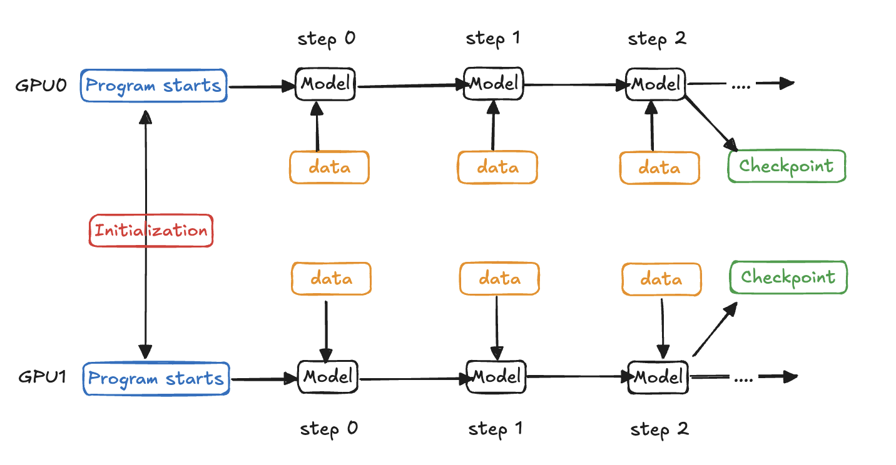

# Amazon SageMaker HyperPod checkpointless training repositories

HyperPod checkpointless training accelerates recovery from cluster faults in large-scale distributed training environments through framework-level optimizations. These optimizations are delivered via a base container image that includes enhanced NCCL initialization improvements,
data loading optimizations, and in-process and checkpointless recovery components.
The HyperPod checkpointless training package is built on this foundation.

Checkpointless training is enabled via three optimization tracks that run in concert:

- **Communication initilization improvements (NCCL and Gloo)** - Eliminate communication bottlenecks by decentralizing rank peer and ring information (red box below).
- **Data loading optimizations** - Reduce the time required to serve the first batch of data during restart operations (orange boxes below).
- **Program restart overhead reduction** - Minimize restart costs and enable checkpointless replenishment through process recovery on healthy nodes (blue and green boxes below).

