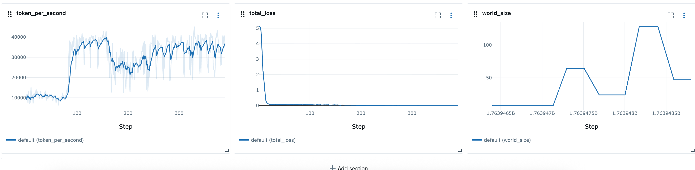
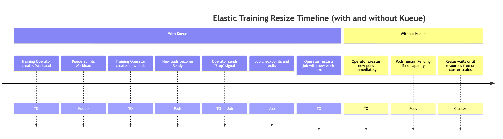
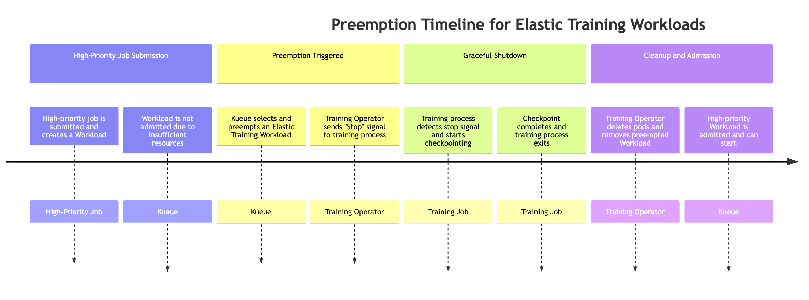

# Using elastic training in Amazon SageMaker HyperPod

Elastic training is a new Amazon SageMaker HyperPod capability that automatically scales training jobs based
on compute resource availability and workload priority. Elastic training jobs can start with minimum
compute resources required for model training and dynamically scale up or down through automatic
checkpointing and resumption across different node configurations (world size). Scaling is
achieved by automatically adjusting the number of data-parallel replicas. During high
cluster utilization periods, elastic training jobs can be configured to automatically
scale down in response to resource requests from higher-priority jobs, freeing up compute
for critical workloads. When resources free up during off-peak periods, elastic training
jobs automatically scale back up to accelerate training, then scale back down when
higher-priority workloads need resources again.

Elastic training is built on top of the HyperPod training operator and integrates
the following components:

- [Amazon EKS for Kubernetes orchestration](sagemaker-hyperpod-eks.md "sagemaker-hyperpod-eks.md")
- [Amazon SageMaker HyperPod Task Governance](sagemaker-hyperpod-eks-operate-console-ui-governance.md "sagemaker-hyperpod-eks-operate-console-ui-governance.md") for job queuing, prioritization, and scheduling
- [PyTorch Distributed Checkpoint (DCP)](https://docs.pytorch.org/docs/stable/distributed.checkpoint.html "https://docs.pytorch.org/docs/stable/distributed.checkpoint.html")
  for scalable state and checkpoint management, such as DCP
  **Supported frameworks**

- PyTorch with Distributed Data Parallel(DDP) and Fully Sharded Data Parallel(FSDP)
- PyTorch Distributed Checkpoint (DCP)

## Prerequisites

### SageMaker HyperPod EKS Cluster

You must have a running SageMaker HyperPod cluster with Amazon EKS orchestration. For information on creating a HyperPod EKS cluster, see:

- [Getting started with Amazon EKS in SageMaker HyperPod](sagemaker-hyperpod-eks-prerequisites.md "sagemaker-hyperpod-eks-prerequisites.md")
- [Creating a SageMaker HyperPod cluster with Amazon EKS orchestration](sagemaker-hyperpod-eks-operate-console-ui-create-cluster.md "sagemaker-hyperpod-eks-operate-console-ui-create-cluster.md")

### SageMaker HyperPod Training Operator

Elastic Training is supported in training operator v. 1.2 and above.

To install the training operator as EKS add-on, see: [https://docs.aws.amazon.com/sagemaker/latest/dg/sagemaker-eks-operator-install.html](sagemaker-eks-operator-install.md "sagemaker-eks-operator-install.md")

### (Recommended) Install and configure Task Governance and Kueue

We recommend installing and configuring Kueue via [HyperPod Task Governance](sagemaker-hyperpod-eks-operate-console-ui-governance.md "sagemaker-hyperpod-eks-operate-console-ui-governance.md") to specify workload priorities with elastic training. Kueue provides stronger workload management with queuing, prioritization, gang scheduling, resource tracking and graceful preemption which are essential for operating in multi-tenant training environments.

- Gang scheduling ensures that all required pods of a training job start together. This prevents situations where some pods start while others remain pending, which could cause wasted resources.
- Gentle preemption allows lower-priority elastic jobs to yield resources to higher-priority workloads. Elastic jobs can scale down gracefully without being forcibly evicted, improving overall cluster stability.

We recommend configuring the following Kueue components:

- PriorityClasses to define relative job importance
- ClusterQueues to manage global resource sharing and quotas across teams or workloads
- LocalQueues to route jobs from individual namespaces into the appropriate ClusterQueue

For more advanced setups, you can also incorporate:

- Fair-share policies to balance resource usage across multiple teams
- Custom preemption rules to enforce organizational SLAs or cost controls

Please refer to:

- [https://docs.aws.amazon.com/sagemaker/latest/dg/sagemaker-hyperpod-eks-operate-console-ui-governance.html](sagemaker-hyperpod-eks-operate-console-ui-governance.md "sagemaker-hyperpod-eks-operate-console-ui-governance.md")
- [Kueue Documentation](https://kueue.sigs.k8s.io/ "https://kueue.sigs.k8s.io/")

### (Recommended) Setup user namespaces and resource quotas

When deploying this feature on Amazon EKS, we recommend applying a set of foundational cluster-level configurations to ensure isolation, resource fairness, and operational consistency across teams.

#### Namespace and Access Configuration

Organize your workloads using separate namespaces for each team or project. This allows you to apply fine-grained isolation and governance. We also recommend configuring AWS IAM to Kubernetes RBAC mapping to associate individual IAM users or roles with their corresponding namespaces.

Key practices include:

- Map IAM roles to Kubernetes service accounts using IAM Roles for Service Accounts (IRSA) when workloads need AWS
  permissions. [https://docs.aws.amazon.com/eks/latest/userguide/access-entries.html](../../../eks/latest/userguide/access-entries.md "../../../eks/latest/userguide/access-entries.md")
- Apply RBAC policies to restrict users to only their designated namespaces (e.g., `Role`/`RoleBinding` rather than cluster-wide permissions).

#### Resource and Compute Constraints

To prevent resource contention and ensure fair scheduling across teams, apply quotas and limits at the namespace level:

- ResourceQuotas to cap aggregate CPU, memory, storage, and object counts (pods, PVCs, services, etc.).
- LimitRanges to enforce default and maximum per-pod or per-container CPU and memory limits.
- PodDisruptionBudgets (PDBs) as needed to define resiliency expectations.
- Optional: Namespace-level queueing constraints (e.g., via Task Governance or Kueue) to prevent users from over-submitting jobs.

These constraints help maintain cluster stability and support predictable scheduling for distributed training workloads.

#### Auto-scaling

SageMaker HyperPod on EKS supports cluster autoscaling through Karpenter. When Karpenter or similar resource provisioner is used together with elastic training, the cluster as well as the elastic training job may scale up automatically after an elastic training job is once submitted. This is because elastic training operator takes greedy approach, always asks more than the available compute resources until it reaches maximum limit set by the job. This occurs because the elastic training operator continuously requests additional resources as part of elastic job execution, which can trigger node provisioning. Continuous resource provisioners like Karpenter will serve the requests by scaling up the compute cluster.

To keep these scale-ups predictable and under control, we recommend configuring namespace-level ResourceQuotas in the namespaces where elastic training jobs are created. ResourceQuotas help limit the maximum resources that jobs can request, preventing unbounded cluster growth while still allowing elastic behavior within defined limits.

For example, a ResourceQuota for 8 ml.p5.48xlarge instances will have the following form:

```

apiVersion: v1
kind: ResourceQuota
metadata:
  name: <quota-name>
  namespace: <namespace-name>
spec:
  hard:
    nvidia.com/gpu: "64"
    vpc.amazonaws.com/efa: "256"
    requests.cpu: "1536"
    requests.memory: "5120Gi"
    limits.cpu: "1536"
    limits.memory: "5120Gi"

```

## Build Training Container

HyperPod training operator works with a custom PyTorch launcher provided via HyperPod Elastic Agent python package ([https://www.piwheels.org/project/hyperpod-elastic-agent/](https://www.piwheels.org/project/hyperpod-elastic-agent/ "https://www.piwheels.org/project/hyperpod-elastic-agent/")). Customers must install the elastic agent and replace the `torchrun` command with `hyperpodrun` to launch training. For more details, please see:

[https://docs.aws.amazon.com/sagemaker/latest/dg/sagemaker-eks-operator-install.html#sagemaker-eks-operator-elastic-agent](sagemaker-eks-operator-install.md#sagemaker-eks-operator-elastic-agent "sagemaker-eks-operator-install.md#sagemaker-eks-operator-elastic-agent")

An example training container:

```

FROM ...

...

RUN pip install hyperpod-elastic-agent
ENTRYPOINT ["entrypoint.sh"]

# entrypoint.sh ...
hyperpodrun --nnodes=node_count --nproc-per-node=proc_count \
  --rdzv-backend hyperpod \
 # Optional ...
 # Other torchrun args
 # pre-traing arg_group
 --pre-train-script pre.sh --pre-train-args "pre_1 pre_2 pre_3" \
 # post-train arg_group
 --post-train-script post.sh --post-train-args "post_1 post_2 post_3" \
 training.py --script-args

```

## Training code modification

SageMaker HyperPod provides a set of recipes that already configured to run with Elastic Policy.

To enable elastic training for custom PyTorch training scripts, you will need to make minor modifications to your training loop. This guide walks you through the necessary modifications needed to ensure your training job responds to elastic scaling events that occur when compute resource availability changes. During all elastic events (e.g., nodes are available, or nodes get preempted), the training job receives an elastic event signal that is used to coordinate a graceful shutdown by saving a checkpoint, and resuming training by restarting from that saved checkpoint with a new world configuration. To enable elastic training with custom training scripts, you need to:

### Detect Elastic Scaling Events

In your training loop, check for elastic events during each iteration:

```

from hyperpod_elastic_agent.elastic_event_handler import elastic_event_detected

def train_epoch(model, dataloader, optimizer, args):
    for batch_idx, batch_data in enumerate(dataloader):
        # Forward and backward pass
        loss = model(batch_data).loss
        loss.backward()
        optimizer.step()
        optimizer.zero_grad()

        # Handle checkpointing and elastic scaling
        should_checkpoint = (batch_idx + 1) % args.checkpoint_freq == 0
        elastic_event = elastic_event_detected()

        # Save checkpoint if scaling-up or scaling down job
        if should_checkpoint or elastic_event:
            save_checkpoint(model, optimizer, scheduler,
                            checkpoint_dir=args.checkpoint_dir,
                            step=global_step)

            if elastic_event:
                print("Elastic scaling event detected. Checkpoint saved.")
                return

```

### Implement Checkpoint Saving and Checkpoint Loading

Note: We recommend using PyTorch Distributed Checkpoint (DCP) for saving model and optimizer states, as DCP supports resuming from a checkpoint with different world sizes. Other checkpointing formats may not support checkpoint loading on different world sizes, in which case you'll need to implement custom logic to handle dynamic world size changes.

```

import torch.distributed.checkpoint as dcp
from torch.distributed.checkpoint.state_dict import get_state_dict, set_state_dict

def save_checkpoint(model, optimizer, lr_scheduler, user_content, checkpoint_path):
    """Save checkpoint using DCP for elastic training."""
    state_dict = {
        "model": model,
        "optimizer": optimizer,
        "lr_scheduler": lr_scheduler,
        **user_content
    }

    dcp.save(
        state_dict=state_dict,
        storage_writer=dcp.FileSystemWriter(checkpoint_path)
    )

def load_checkpoint(model, optimizer, lr_scheduler, checkpoint_path):
    """Load checkpoint using DCP with automatic resharding."""
    state_dict = {
        "model": model,
        "optimizer": optimizer,
        "lr_scheduler": lr_scheduler
    }

    dcp.load(
        state_dict=state_dict,
        storage_reader=dcp.FileSystemReader(checkpoint_path)
    )

    return model, optimizer, lr_scheduler

```

### (Optional) Use stateful dataloaders

If you're only training for a single-epoch (i.e., one single pass through the entire dataset), the model must see each data sample exactly once. If the training
job stops mid-epoch and resumes with a different world size, previously processed data samples will be repeated if the dataloader state is not persisted. A stateful
dataloader prevents this by saving and restoring the dataloader's position, ensuring that resumed runs continue from the elastic scaling event without reprocessing any samples.
We recommend using [StatefulDataLoader](https://meta-pytorch.org/data/main/torchdata.stateful_dataloader.html "https://meta-pytorch.org/data/main/torchdata.stateful_dataloader.html"), which is a drop‑in replacement
for `torch.utils.data.DataLoader` that adds `state_dict()` and `load_state_dict()` methods, enabling mid‑epoch checkpointing of the data loading process.

## Submitting elastic training jobs

[HyperPod training operator](sagemaker-eks-operator-usage.md "sagemaker-eks-operator-usage.md") defines a new resource type - `hyperpodpytorchjob`. Elastic training extends this resource type and add the highlighted fields below:

```

apiVersion: sagemaker.amazonaws.com/v1
kind: HyperPodPyTorchJob
metadata:
  name: elastic-training-job
spec:
  elasticPolicy:
    minReplicas: 1
    maxReplicas: 4
    # Increment amount of pods in fixed-size groups
    # Amount of pods will be equal to minReplicas + N * replicaIncrementStep
    replicaIncrementStep: 1
    # ... or Provide an exact amount of pods that required for training
    replicaDiscreteValues: [2,4,8]

    # How long traing operator wait job to save checkpoint and exit during
    # scaling events. Job will be force-stopped after this period of time
    gracefulShutdownTimeoutInSeconds: 600

    # When scaling event is detected:
    # how long job controller waits before initiate scale-up.
    # Some delay can prevent from frequent scale-ups and scale-downs
    scalingTimeoutInSeconds: 60

    # In case of faults, specify how long elastic training should wait for
    # recovery, before triggering a scale-down
    faultyScaleDownTimeoutInSeconds: 30
  ...
  replicaSpecs:
    - name: pods
      replicas: 4           # Initial replica count
      maxReplicas: 8        # Max for this replica spec (should match elasticPolicy.maxReplicas)
      ...

```

### Using kubectl

You can subsequently launch elastic training with the following command.

```
kubectl apply -f elastic-training-job.yaml
```

### Using SageMaker Recipes

Elastic training jobs can be launched through [SageMaker HyperPod recipes](https://github.com/aws/sagemaker-hyperpod-recipes "https://github.com/aws/sagemaker-hyperpod-recipes").

###### Note

We have included **46** elastic recipes for **SFO** and **DPO** jobs on Hyperpod Recipe. Users can launch those jobs with one line change on top of existing static launcher script:

`++recipes.elastic_policy.is_elastic=true`

In addition to static recipes, elastic recipes add the following fields to define the elastic behaviors:

#### Elastic Policy

The `elastic_policy` field defines the job level configuration for the elastic training job, it has the following configurations:

- `is_elastic` : `bool` - if this job is an elastic job
- `min_nodes` : `int` - the minimum number of nodes used for elastic training
- `max_nodes`: `int` - the maximum number of nodes used for elastic training
- `replica_increment_step` : `int` - increment amount of pods in fixed-size groups, this field is mutually exclusive to the `scale_config` we define later.
- `use_graceful_shutdown` : `bool` - if use graceful shutdown during scaling events, default to `true`.
- `scaling_timeout`: `int` - the waiting time in second during scaling event before timeout
- `graceful_shutdown_timeout`: `int` - the waiting time for graceful shutdown

The following is a sample definition of this field, you can also find in on Hyperpod Recipe repo in recipe: `recipes_collection/recipes/fine-tuning/llama/llmft_llama3_1_8b_instruct_seq4k_gpu_sft_lora.yaml`

```

<static recipe>
...
elastic_policy:
  is_elastic: true
  min_nodes: 1
  max_nodes: 16
  use_graceful_shutdown: true
  scaling_timeout: 600
  graceful_shutdown_timeout: 600

```

#### Scale Config

The `scale_config` field defines overriding configurations at each specific scale.
It's a key-value dictionary, where key is an integer representing the target scale and value is a
subset of base recipe. At `<key>` scale, we use the `<value>`
to update the specific configurations in the base/static recipe. The following show an example
of this field:

```

scale_config:
...
  2:
    trainer:
      num_nodes: 2
    training_config:
      training_args:
        train_batch_size: 128
        micro_train_batch_size: 8
        learning_rate: 0.0004
  3:
    trainer:
      num_nodes: 3
    training_config:
      training_args:
        train_batch_size: 128
        learning_rate: 0.0004
        uneven_batch:
          use_uneven_batch: true
          num_dp_groups_with_small_batch_size: 16
          small_local_batch_size: 5
          large_local_batch_size: 6
 ...

```

The above configuration defines the training configuration at scale 2 and 3. In both cases, we use learning rate `4e-4`, batch size of `128`. But at scale 2, we use a `micro_train_batch_size` of 8, while scale 3, we use an uneven batch size as the train batch size cannot be evenly divided across 3 nodes.

**Uneven Batch Size**

This is a field to define the batch distributing behavior when the global batch size cannot be evenly divided by number of ranks. It's not specific to elastic training, but it's an enabler for finer scaling granularity.

- `use_uneven_batch` : `bool` - if use uneven batch distribution
- `num_dp_groups_with_small_batch_size` : `int` - in uneven batch distribution, some ranks use smaller local batch size, where the others use larger batch size. The global batch size should equal to `small_local_batch_size * num_dp_groups_with_small_batch_size + (world_size-num_dp_groups_with_small_batch_size) * large_local_batch_size`
- `small_local_batch_size` : `int` - this value is the smaller local batch size
- `large_local_batch_size` : `int` - this value is the larger local batch size

**Monitor training on MLFlow**

Hyperpod recipe jobs support observability through MLFlow. Users can specify MLFlow configurations in recipe:

```

training_config:
  mlflow:
    tracking_uri: "<local_file_path or MLflow server URL>"
    run_id: "<MLflow run ID>"
    experiment_name: "<MLflow experiment name, e.g. llama_exps>"
    run_name: "<run name, e.g. llama3.1_8b>"


```

These configurations are mapped to corresponding [MLFlow setup](https://mlflow.org/docs/latest/ml/tracking/tracking-api/#setup--configuration "https://mlflow.org/docs/latest/ml/tracking/tracking-api/#setup--configuration").
The following is a sample MLflow dashboard for an elastic training job.



After defining the elastic recipes, we can use the launcher scripts, such as `launcher_scripts/llama/run_llmft_llama3_1_8b_instruct_seq4k_gpu_sft_lora.sh` to launch an elastic training job. This is similar to launching a static job using Hyperpod recipe.

###### Note

Elastic training job from recipe support automatically resume from latest checkpoints, however, by default, every restart creates a new training directory. To enable resuming from last checkpoint correctly, we need to make sure the same training directory is reused. This can be done by setting

`recipes.training_config.training_args.override_training_dir=true`

## Use-case examples and limitations

### Scale-up when more resources are available

When more resources become available on the cluster (e.g., other workloads complete). During this event, the training controller will automatically scale up the training job. This behavior is explained below.

To simulate a situation when more resources become available we can submit a high-priority job, and then release resources back by deleting the high-priority job.

```

# Submit a high-priority job on your cluster. As a result of this command
# resources will not be available for elastic training
kubectl apply -f high_prioriy_job.yaml

# Submit an elastic job with normal priority
kubectl apply -f hyperpod_job_with_elasticity.yaml

# Wait for training to start....

# Delete high priority job. This command will make additional resources available for
# elastic training
kubectl delete -f high_prioriy_job.yaml

# Observe the scale-up of elastic job

```

Expected behavior:

- The training operator creates a Kueue Workload
  When an elastic training job requests a change in world size, the training operator generates an additional Kueue Workload object representing the new resource requirements.
- Kueue admits the Workload
  Kueue evaluates the request based on available resources, priorities, and queue policies. Once approved, the Workload is admitted.
- The training operator creates the additional Pods
  Upon admission, the operator launches the additional pods required to reach the new world size.
- When the new pods become ready, the training operator sends a special elastic event signal to training script.
- The training job performs checkpointing, to prepare for a graceful shutdown
  The training process periodically checks for the elastic event signal by calling **elastic_event_detected()** function. Once detected, it initiates a checkpoint.
  After the checkpoint is successfully completed, the training process exits cleanly.
- The training operator restarts the job with the new world size
  The operator waits for all processes to exit, then restarts the training job using the updated world size and the latest checkpoint.

**Note:** When Kueue is not used, the training operator skips the first two steps. It immediately attempts to create the additional pods required for the new world size. If sufficient resources are not available in the cluster, these pods will
remain in a **Pending** state until capacity becomes available.



### Preemption by high priority job

Elastic jobs can be scaled down automatically when a high-priority job needs resources. To simulate this behavior you can submit an elastic training job, which uses the maximum number of available resources from the start of training, than submit a high priority job, and observe preemption behavior.

```

# Submit an elastic job with normal priority
kubectl apply -f hyperpod_job_with_elasticity.yaml

# Submit a high-priority job on your cluster. As a result of this command
# some amount of resources will be
kubectl apply -f high_prioriy_job.yaml

# Observe scale-down behaviour

```

When a high-priority job needs resources, Kueue can preempt lower-priority Elastic Training workloads (there could be more than 1 Workload object associated with Elastic Training job). The preemption process follows this sequence:

1. A high-priority job is submitted
   The job creates a new Kueue Workload, but the Workload cannot be admitted due to insufficient cluster resources.
2. Kueue preempts one of the Elastic Training job's Workloads
   Elastic jobs may have multiple active Workloads (one per world-size configuration).
   Kueue selects one to preempt based on priority and queue policies.
3. The training operator sends an elastic event signal. Once preemption is triggered, the training operator notifies the running training process to stop gracefully.
4. The training process performs checkpointing. The training job periodically checks for elastic event signals.
   When detected, it begins a coordinated checkpoint to preserve progress before shutting down.
5. training operator cleans up pods and workloads. The operator waits for checkpoint completion, then deletes the training pods that were part of the preempted Workload.
   It also removes the corresponding Workload object from Kueue.
6. The high-priority workload is admitted. With resources freed, Kueue admits the high-priority job, allowing it to start execution.



Preemption can cause the entire training job to pause, which may not be desirable for all workflows. To avoid full-job suspension while still allowing elastic scaling, customers can configure two different priority levels within the same training job by defining two `replicaSpec` sections:

- A primary (fixed) replicaSpec with normal or high priority
  - Contains the minimum required number of replicas needed to keep the training job running.
  - Uses a higher PriorityClass, ensuring these replicas are _never_ preempted.
  - Maintains baseline progress even when the cluster is under resource pressure.

- An elastic (scalable) replicaSpec with lower priority
  - Contains the additional optional replicas that provide extra compute during elastic scaling.
  - Uses a lower PriorityClass, allowing Kueue to preempt these replicas when higher-priority jobs need resources.
  - Ensures only the elastic portion is reclaimed, while the core training continues uninterrupted.

This configuration enables partial preemption, where only the elastic capacity is reclaimed—maintaining training continuity while still supporting fair resource sharing in multi-tenant environments. Example:

```

apiVersion: sagemaker.amazonaws.com/v1
kind: HyperPodPyTorchJob
metadata:
  name: elastic-training-job
spec:
  elasticPolicy:
    minReplicas: 2
    maxReplicas: 8
    replicaIncrementStep: 2
  ...
  replicaSpecs:
    - name: base
      replicas: 2
      template:
        spec:
          priorityClassName: high-priority # set high-priority to avoid evictions
           ...
    - name: elastic
      replicas: 0
      maxReplicas: 6
      template:
        spec:
          priorityClassName: low-priority. # Set low-priority for elastic part
           ...

```

### Handing pod eviction, pod crashes, and hardware degradation:

The HyperPod training operator includes built-in mechanisms to recover the training process when it is unexpectedly interrupted. Interruptions can occur for various reasons, such as training code failures, pod evictions, node failures, hardware degradation, and other runtime issues.

When this happens, the operator automatically attempts to recreate the affected pods and resume training from the latest checkpoint. If recovery is not immediately possible, for example, due to insufficient spare capacity, the operator can continue progress by temporarily reducing the world size and scale down the elastic training job.

When an elastic training job crashes or loses replicas, the system behaves as follows:

- Recovery Phase (using spare nodes)
  The Training Controller waits up to `faultyScaleDownTimeoutInSeconds` for resources to become available and attempts to recover the failed replicas by redeploying pods on spare capacity.
- Elastic scale-down
  If recovery is not possible within the timeout window, the training operator scales the job down to a smaller world size (if the job's elastic policy permits it). Training then resumes with fewer replicas.
- Elastic scale-up
  When additional resources become available again, the operator automatically scales the training job back up to the preferred world size.

This mechanism ensures that training can continue with minimal downtime, even under resource pressure or partial infrastructure failures, while still taking advantage of elastic scaling.

### Use elastic training with other HyperPod features

Elastic training does not currently support checkpointless training capabilities,
HyperPod managed tiered checkpointing, or Spot instances.

###### Note

We collect certain routine aggregated and anonymized operational metrics to
provide essential service availability. The creation of these metrics is fully
automated and does not involve human review of the underlying model training workload.
These metrics relate to a job and scaling operations, resource management, and essential
service functionality.
