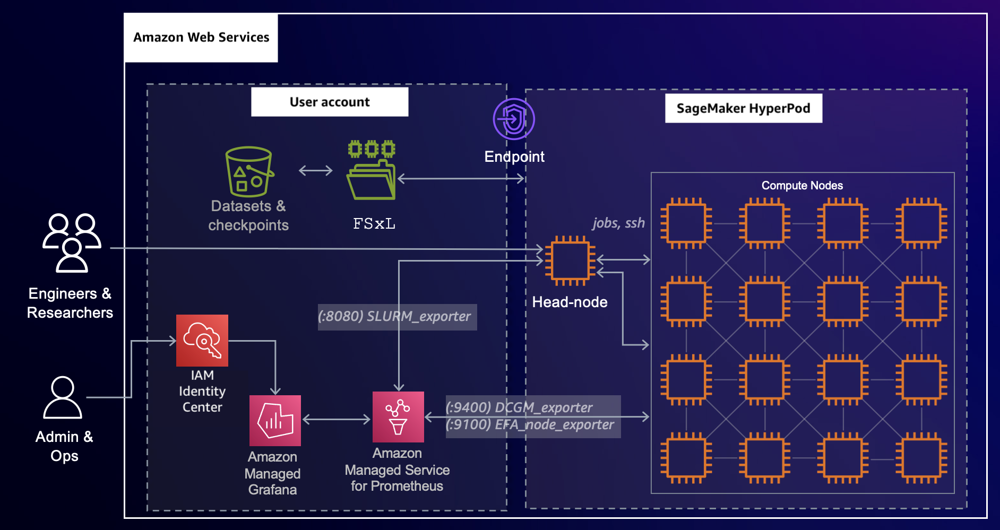

# SageMaker HyperPod cluster

resources monitoring

To achieve comprehensive observability into your SageMaker HyperPod cluster resources and
software components, integrate the cluster with [Amazon Managed Service for Prometheus](../../../prometheus/latest/userguide/what-is-Amazon-Managed-Service-Prometheus.md "../../../prometheus/latest/userguide/what-is-Amazon-Managed-Service-Prometheus.md") and [Amazon Managed Grafana](../../../grafana/latest/userguide/what-is-Amazon-Managed-Service-Grafana.md "../../../grafana/latest/userguide/what-is-Amazon-Managed-Service-Grafana.md"). The integration with Amazon Managed Service for Prometheus enables the export of metrics related to your
HyperPod cluster resources, providing insights into their performance, utilization,
and health. The integration with Amazon Managed Grafana enables the visualization of these metrics through
various Grafana dashboards that offer intuitive interface for monitoring and analyzing the
cluster's behavior. By leveraging these services, you gain a centralized and unified view of
your HyperPod cluster, facilitating proactive monitoring, troubleshooting, and
optimization of your distributed training workloads.

###### Tip

To find practical examples and solutions, see also the [SageMaker HyperPod
workshop](https://catalog.workshops.aws/sagemaker-hyperpod "https://catalog.workshops.aws/sagemaker-hyperpod").

Figure: This architecture diagram shows an overview of configuring SageMaker HyperPod with Amazon Managed Service for Prometheus
and Amazon Managed Grafana.

Proceed to the following topics to set up for SageMaker HyperPod cluster observability.

###### Topics

- [Prerequisites for SageMaker HyperPod cluster observability](sagemaker-hyperpod-cluster-observability-slurm-prerequisites.md "sagemaker-hyperpod-cluster-observability-slurm-prerequisites.md")
- [Installing metrics exporter packages on your HyperPod cluster](sagemaker-hyperpod-cluster-observability-slurm-install-exporters.md "sagemaker-hyperpod-cluster-observability-slurm-install-exporters.md")
- [Validating Prometheus setup on the head node of a HyperPod cluster](sagemaker-hyperpod-cluster-observability-slurm-validate-prometheus-setup.md "sagemaker-hyperpod-cluster-observability-slurm-validate-prometheus-setup.md")
- [Setting
  up an Amazon Managed Grafana workspace](sagemaker-hyperpod-cluster-observability-slurm-managed-grafana-ws.md "sagemaker-hyperpod-cluster-observability-slurm-managed-grafana-ws.md")
- [Exported metrics reference](sagemaker-hyperpod-cluster-observability-slurm-exported-metrics-reference.md "sagemaker-hyperpod-cluster-observability-slurm-exported-metrics-reference.md")
- [Amazon SageMaker HyperPod Slurm metrics](smcluster-slurm-metrics.md "smcluster-slurm-metrics.md")
