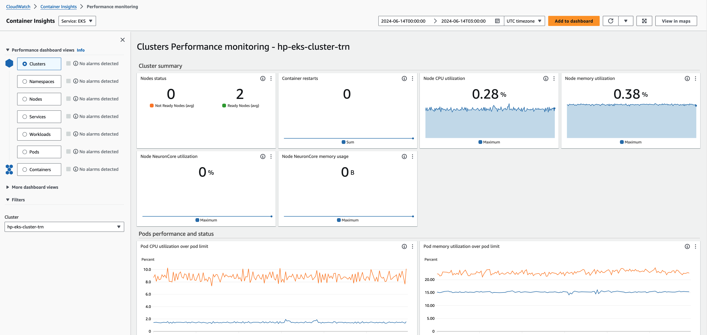

# Access CloudWatch container insights dashboard

1. Open the CloudWatch console at
   [https://console.aws.amazon.com/cloudwatch/](https://console.aws.amazon.com/cloudwatch/ "https://console.aws.amazon.com/cloudwatch/").
2. Choose **Insights**, and then choose
   **Container Insights**.
3. Select the EKS cluster set up with the HyperPod cluster
   you're using.
4. View the Pod/Cluster level metrics.

