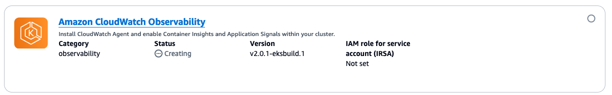

# Observability with Amazon CloudWatch

Use [Amazon CloudWatch
Container Insights](../../../AmazonCloudWatch/latest/monitoring/ContainerInsights.md "../../../AmazonCloudWatch/latest/monitoring/ContainerInsights.md") to collect, aggregate, and summarize metrics and logs
from the containerized applications and micro-services on the EKS cluster associated
with a HyperPod cluster.

Amazon CloudWatch Insights collects metrics for compute resources, such as CPU, memory,
disk, and network. Container Insights also provides diagnostic information, such as
container restart failures, to help you isolate issues and resolve them quickly. You
can also set CloudWatch alarms on metrics that Container Insights collects.

To find a complete list of metrics, see [Amazon EKS and Kubernetes Container Insights metrics](../../../AmazonCloudWatch/latest/monitoring/Container-Insights-metrics-EKS.md "../../../AmazonCloudWatch/latest/monitoring/Container-Insights-metrics-EKS.md") in the _Amazon EKS
User Guide_.

## Install CloudWatch Container Insights

Cluster admin users must set up CloudWatch Container Insights following the
instructions at [Install the CloudWatch agent by using the Amazon CloudWatch Observability EKS add-on or
the Helm chart](../../../AmazonCloudWatch/latest/monitoring/install-CloudWatch-Observability-EKS-addon.md "../../../AmazonCloudWatch/latest/monitoring/install-CloudWatch-Observability-EKS-addon.md") in the _CloudWatch User Guide_. For more
information about Amazon EKS add-on, see also [Install the Amazon CloudWatch Observability EKS add-on](../../../AmazonCloudWatch/latest/monitoring/Container-Insights-setup-EKS-addon.md "../../../AmazonCloudWatch/latest/monitoring/Container-Insights-setup-EKS-addon.md") in the
_Amazon EKS User Guide_.

After the installation has completed, verify that the CloudWatch Observability
add-on is visible in the EKS cluster add-on tab. It might take about a couple of
minutes until the dashboard loads.

###### Note

SageMaker HyperPod requires the CloudWatch Insight v2.0.1-eksbuild.1 or later.

## Access CloudWatch container insights logs

1. Open the CloudWatch console at
   [https://console.aws.amazon.com/cloudwatch/](https://console.aws.amazon.com/cloudwatch/ "https://console.aws.amazon.com/cloudwatch/").
2. Choose **Logs**, and then choose **Log
   groups**.

When you have the HyperPod clusters integrated with Amazon CloudWatch
Container Insights, you can access the relevant log groups in the following
format: `/aws/containerinsights /<eks-cluster-name>/*`. Within
this log group, you can find and explore various types of logs such as
Performance logs, Host logs, Application logs, and Data plane logs.
