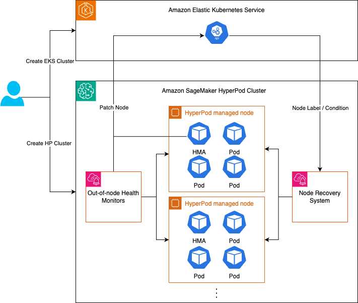
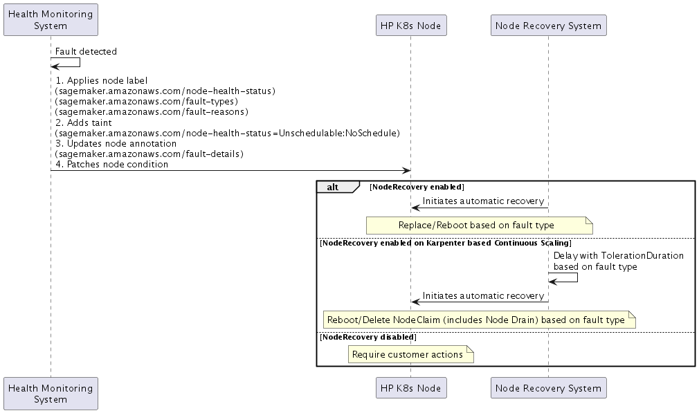

# Health Monitoring System

SageMaker HyperPod health monitoring system includes two components

1. Monitoring agents installed in your nodes, which include the Health Monitoring Agent (HMA) that serves as an on-host health monitor and a set of out-of-node health monitors.
2. Node Recovery System managed by SageMaker HyperPod. The health monitoring system will monitor the node health status continuously via monitoring agents and then take actions automatically when fault is detected using the Node Recovery System.



## Health checks done by the SageMaker HyperPod health-monitoring agent

The SageMaker HyperPod health-monitoring agent checks the following.

**NVIDIA GPUs**

- [DCGM policy violation notifications](https://docs.nvidia.com/datacenter/dcgm/3.0/user-guide/feature-overview.html#notifications "https://docs.nvidia.com/datacenter/dcgm/3.0/user-guide/feature-overview.html#notifications")
- Errors in the `nvidia-smi` output
- Various errors in the logs generated by the Amazon Elastic Compute Cloud (EC2)
  platform
- GPU Count validation — if there’s a mismatch between the expected number of
  GPUs in a particular instance type (for example: 8 GPUs in ml.p5.48xlarge instance
  type) and the count returned by `nvidia-smi`, then HMA reboots the node

**AWS Trainium**

- Errors in the output from the [AWS Neuron monitor](https://awsdocs-neuron.readthedocs-hosted.com/en/latest/tools/neuron-sys-tools/neuron-monitor-user-guide.html "https://awsdocs-neuron.readthedocs-hosted.com/en/latest/tools/neuron-sys-tools/neuron-monitor-user-guide.html")
- Outputs generated by the Neuron node problem detector (For more
  information about the AWS Neuron node problem detector, see [Node problem detection and recovery for AWS Neuron nodes within Amazon EKS
  clusters](https://aws.amazon.com/blogs/machine-learning/node-problem-detection-and-recovery-for-aws-neuron-nodes-within-amazon-eks-clusters/ "https://aws.amazon.com/blogs/machine-learning/node-problem-detection-and-recovery-for-aws-neuron-nodes-within-amazon-eks-clusters/").)
- Various errors in the logs generated by the Amazon EC2 platform
- Neuron Device Count validation — if there’s a mismatch between the actual
  number of neuron device count in a particular instance type and the count
  returned by `neuron-ls`, then HMA reboots the node

The above checks are passive, background health checks HyperPod runs continuously on your nodes. In addition to these checks, HyperPod also runs deep (or active) health checks during the creation and update of HyperPod clusters. Learn more about
[Deep health checks](sagemaker-hyperpod-eks-resiliency-deep-health-checks.md "sagemaker-hyperpod-eks-resiliency-deep-health-checks.md").

## Fault Detection

When SageMaker HyperPod detects a fault, it implements a four-part response:

1. **Node Labels**
   1. Health Status: `sagemaker.amazonaws.com/node-health-status`
   2. Fault Type: `sagemaker.amazonaws.com/fault-types` label for high-level categorization
   3. Fault Reason: `sagemaker.amazonaws.com/fault-reasons` label for detailed fault information

2. **Node Taint**
   1. `sagemaker.amazonaws.com/node-health-status=Unschedulable:NoSchedule`

3. **Node Annotation**
   1. Fault details: `sagemaker.amazonaws.com/fault-details`
   2. Records up to 20 faults with timestamps that occurred on the node

4. **Node Conditions**([Kubernetes Node Condition](https://kubernetes.io/docs/reference/node/node-status/#condition "https://kubernetes.io/docs/reference/node/node-status/#condition"))
   1. Reflects current health status in node conditions:
      - Type: Same as fault type
      - Status: `True`
      - Reason: Same as fault reason
      - LastTransitionTime: Fault occurrence time



## Logs generated by the SageMaker HyperPod health-monitoring agent

The SageMaker HyperPod health-monitoring agent is an out-of-the-box health check feature
and continuously runs on all HyperPod clusters. The health monitoring agent
publishes detected health events on GPU or Trn instances to CloudWatch under the Cluster
log group `/aws/sagemaker/Clusters/`.

The detection logs from the HyperPod health monitoring agent are created
as separate log streams named `SagemakerHealthMonitoringAgent` for each
node. You can query the detection logs using CloudWatch log insights as follows.

```
fields @timestamp, @message
| filter @message like /HealthMonitoringAgentDetectionEvent/
```

This should return an output similar to the following.

```
2024-08-21T11:35:35.532-07:00
    {"level":"info","ts":"2024-08-21T18:35:35Z","msg":"NPD caught event: %v","details: ":{"severity":"warn","timestamp":"2024-08-22T20:59:29Z","reason":"XidHardwareFailure","message":"Node condition NvidiaErrorReboot is now: True, reason: XidHardwareFailure, message: \"NVRM: Xid (PCI:0000:b9:00): 71, pid=<unknown>, name=<unknown>, NVLink: fatal error detected on link 6(0x10000, 0x0, 0x0, 0x0, 0x0, 0x0, 0x0)\""},"HealthMonitoringAgentDetectionEvent":"HealthEvent"}
2024-08-21T11:35:35.532-07:00
    {"level":"info","ts":"2024-08-21T18:35:35Z","msg":"NPD caught event: %v","details: ":{"severity":"warn","timestamp":"2024-08-22T20:59:29Z","reason":"XidHardwareFailure","message":"Node condition NvidiaErrorReboot is now: True, reason: XidHardwareFailure, message: \"NVRM: Xid (PCI:0000:b9:00): 71, pid=<unknown>, name=<unknown>, NVLink: fatal error detected on link 6(0x10000, 0x0, 0x0, 0x0, 0x0, 0x0, 0x0)\""},"HealthMonitoringAgentDetectionEvent":"HealthEvent"}
```
