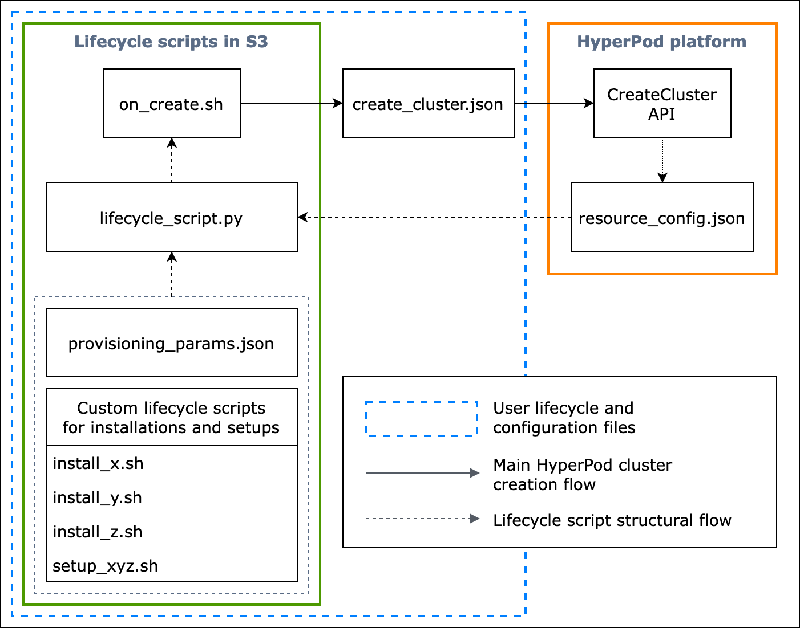
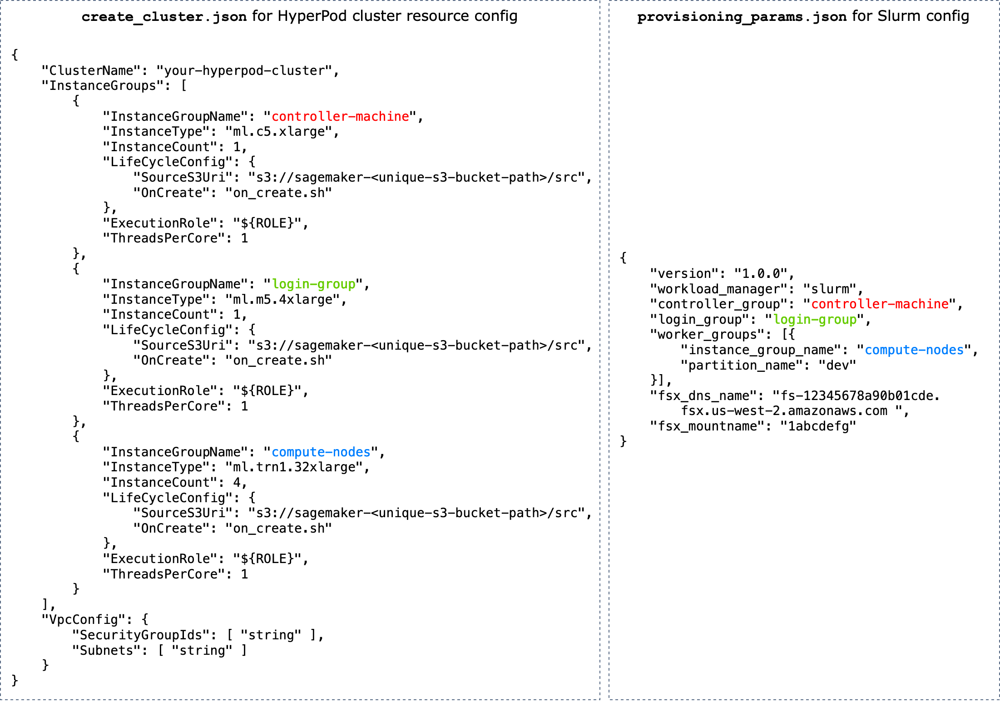

# Base lifecycle scripts provided by HyperPod

This section walks you through every component of the basic flow of setting up Slurm
on HyperPod in a **_top-down_**
approach. It starts from preparing a HyperPod cluster creation request to run
the `CreateCluster` API, and dives deep into the hierarchical structure down
to lifecycle scripts. Use the sample lifecycle scripts provided in the [Awsome Distributed
Training GitHub repository](https://github.com/aws-samples/awsome-distributed-training/ "https://github.com/aws-samples/awsome-distributed-training/"). Clone the repository by running the following
command.

```
git clone https://github.com/aws-samples/awsome-distributed-training/
```

The base lifecycle scripts for setting up a Slurm cluster on SageMaker HyperPod are
available at [`1.architectures/5.sagemaker_hyperpods/LifecycleScripts/base-config`](https://github.com/aws-samples/awsome-distributed-training/tree/main/1.architectures/5.sagemaker-hyperpod/LifecycleScripts/base-config "https://github.com/aws-samples/awsome-distributed-training/tree/main/1.architectures/5.sagemaker-hyperpod/LifecycleScripts/base-config").

```
cd awsome-distributed-training/1.architectures/5.sagemaker_hyperpods/LifecycleScripts/base-config
```

The following flowchart shows a detailed overview of how you should design the base
lifecycle scripts. The descriptions below the diagram and the procedural guide explain
how they work during the HyperPod `CreateCluster` API call.


**\*Figure:** A detailed flow chart of
HyperPod cluster creation and the structure of lifecycle scripts. (1) The
dashed arrows are directed to where the boxes are "called into" and shows the flow
of configuration files and lifecycle scripts preparation. It starts from preparing
`provisioning_parameters.json` and lifecycle scripts. These are then
coded in `lifecycle_script.py` for a collective execution in order. And
the execution of the `lifecycle_script.py` script is done by the
`on_create.sh` shell script, which to be run in the HyperPod
instance terminal. (2) The solid arrows show the main HyperPod cluster
creation flow and how the boxes are "called into" or "submitted to".
`on_create.sh` is required for cluster creation request, either in
`create_cluster.json` or the **Create a cluster**
request form in the console UI. After you submit the request, HyperPod runs
the `CreateCluster` API based on the given configuration information from
the request and the lifecycle scripts. (3) The dotted arrow indicates that the
HyperPod platform creates `resource_config.json` in the cluster
instances during cluster resource provisioning. `resource_config.json`
contains HyperPod cluster resource information such as the cluster ARN,
instance types, and IP addresses. It is important to note that you should prepare
the lifecycle scripts to expect the `resource_config.json` file during
cluster creation. For more information, see the procedural guide
below.\*

The following procedural guide explains what happens during HyperPod cluster
creation and how the base lifecycle scripts are designed.

1. `create_cluster.json` – To submit a HyperPod
   cluster creation request, you prepare a `CreateCluster` request file
   in JSON format. In this best practices example, we assume that the request file
   is named `create_cluster.json`. Write
   `create_cluster.json` to provision a HyperPod cluster
   with instance groups. The best practice is to add the same number of instance
   groups as the number of Slurm nodes you plan to configure on the
   HyperPod cluster. Make sure that you give distinctive names to the
   instance groups that you'll assign to Slurm nodes you plan to set up.

Also, you are required to specify an S3 bucket path to store your entire set
of configuration files and lifecycle scripts to the field name
`InstanceGroups.LifeCycleConfig.SourceS3Uri` in the
`CreateCluster` request form, and specify the file name of an
entrypoint shell script (assume that it's named `on_create.sh`) to
`InstanceGroups.LifeCycleConfig.OnCreate`.

###### Note

If you are using the **Create a cluster** submission form
in the HyperPod console UI, the console manages filling and
submitting the `CreateCluster` request on your behalf, and runs
the `CreateCluster` API in the backend. In this case, you don't
need to create `create_cluster.json`; instead, make sure that you
specify the correct cluster configuration information to the
**Create a cluster** submission form. 2. `on_create.sh` – For each instance group, you need to
provide an entrypoint shell script, `on_create.sh`, to run commands,
run scripts to install software packages, and set up the HyperPod
cluster environment with Slurm. The two things you need to prepare are a
`provisioning_parameters.json` required by HyperPod for
setting up Slurm and a set of lifecycle scripts for installing software
packages. This script should be written to find and run the following files as
shown in the sample script at [`on_create.sh`](https://github.com/aws-samples/awsome-distributed-training/blob/main/1.architectures/5.sagemaker-hyperpod/LifecycleScripts/base-config/on_create.sh "https://github.com/aws-samples/awsome-distributed-training/blob/main/1.architectures/5.sagemaker-hyperpod/LifecycleScripts/base-config/on_create.sh").

###### Note

Make sure that you upload the entire set of lifecycle scripts to the S3
location you specify in `create_cluster.json`. You should also
place your `provisioning_parameters.json` in the same
location.

    1. `provisioning_parameters.json` – This is a [Configuration form
     for provisioning Slurm nodes on HyperPod](sagemaker-hyperpod-ref.md#sagemaker-hyperpod-ref-provisioning-forms-slurm "sagemaker-hyperpod-ref.md#sagemaker-hyperpod-ref-provisioning-forms-slurm"). The
     `on_create.sh` script finds this JSON file and defines
     environment variable for identifying the path to it. Through this JSON
     file, you can configure Slurm nodes and storage options such as
     Amazon FSx for Lustre for Slurm to communicate with. In
     `provisioning_parameters.json`, make sure that you assign
     the HyperPod cluster instance groups using the names you
     specified in `create_cluster.json` to the Slurm nodes
     appropriately based on how you plan to set them up.


    The following diagram shows an example of how the two JSON
     configuration files `create_cluster.json` and
     `provisioning_parameters.json` should be written to
     assign HyperPod instance groups to Slurm nodes. In this
     example, we assume a case of setting up three Slurm nodes: controller
     (management) node, log-in node (which is optional), and compute (worker)
     node.


    ###### Tip

    To help you validate these two JSON files, the HyperPod
     service team provides a validation script, [`validate-config.py`](https://github.com/aws-samples/awsome-distributed-training/blob/main/1.architectures/5.sagemaker-hyperpod/validate-config.py "https://github.com/aws-samples/awsome-distributed-training/blob/main/1.architectures/5.sagemaker-hyperpod/validate-config.py"). To learn more, see
     [Validating the JSON configuration files before creating a Slurm cluster on
     HyperPod](sagemaker-hyperpod-lifecycle-best-practices-slurm-slurm-validate-json-files.md "sagemaker-hyperpod-lifecycle-best-practices-slurm-slurm-validate-json-files.md").


    

    ***Figure:** Direct comparison
     between `create_cluster.json` for HyperPod
     cluster creation and `provisiong_params.json` for Slurm
     configuration. The number of instance groups in
     `create_cluster.json` should match with the number of
     nodes you want to configure as Slurm nodes. In case of the example
     in the figure, three Slurm nodes will be configured on a
     HyperPod cluster of three instance groups. You should
     assign the HyperPod cluster instance groups to Slurm nodes
     by specifying the instance group names
     accordingly.*
    2. `resource_config.json` – During cluster creation,
     the `lifecycle_script.py` script is written to expect a
     `resource_config.json` file from HyperPod. This
     file contains information about the cluster, such as instance types and
     IP addresses.


    When you run the `CreateCluster` API, HyperPod
     creates a resource configuration file at
     `/opt/ml/config/resource_config.json` based on the
     `create_cluster.json` file. The file path is saved to the
     environment variable named `SAGEMAKER_RESOURCE_CONFIG_PATH`.


    ###### Important

    The `resource_config.json` file is auto-generated by
     the HyperPod platform, and you DO NOT need to create it.
     The following code is to show an example of
     `resource_config.json` that would be created from the
     cluster creation based on `create_cluster.json` in the
     previous step, and to help you understand what happens in the
     backend and how an auto-generated `resource_config.json`
     would look.


    ```
    {

        "ClusterConfig": {
            "ClusterArn": "arn:aws:sagemaker:us-west-2:111122223333:cluster/abcde01234yz",
            "ClusterName": "your-hyperpod-cluster"
        },
        "InstanceGroups": [
            {
                "Name": "controller-machine",
                "InstanceType": "ml.c5.xlarge",
                "Instances": [
                    {
                        "InstanceName": "controller-machine-1",
                        "AgentIpAddress": "111.222.333.444",
                        "CustomerIpAddress": "111.222.333.444",
                        "InstanceId": "i-12345abcedfg67890"
                    }
                ]
            },
            {
                "Name": "login-group",
                "InstanceType": "ml.m5.xlarge",
                "Instances": [
                    {
                        "InstanceName": "login-group-1",
                        "AgentIpAddress": "111.222.333.444",
                        "CustomerIpAddress": "111.222.333.444",
                        "InstanceId": "i-12345abcedfg67890"
                    }
                ]
            },
            {
                "Name": "compute-nodes",
                "InstanceType": "ml.trn1.32xlarge",
                "Instances": [
                    {
                        "InstanceName": "compute-nodes-1",
                        "AgentIpAddress": "111.222.333.444",
                        "CustomerIpAddress": "111.222.333.444",
                        "InstanceId": "i-12345abcedfg67890"
                    },
                    {
                        "InstanceName": "compute-nodes-2",
                        "AgentIpAddress": "111.222.333.444",
                        "CustomerIpAddress": "111.222.333.444",
                        "InstanceId": "i-12345abcedfg67890"
                    },
                    {
                        "InstanceName": "compute-nodes-3",
                        "AgentIpAddress": "111.222.333.444",
                        "CustomerIpAddress": "111.222.333.444",
                        "InstanceId": "i-12345abcedfg67890"
                    },
                    {
                        "InstanceName": "compute-nodes-4",
                        "AgentIpAddress": "111.222.333.444",
                        "CustomerIpAddress": "111.222.333.444",
                        "InstanceId": "i-12345abcedfg67890"
                    }
                ]
            }
        ]
    }
    ```
    3. `lifecycle_script.py` – This is the main Python
     script that collectively runs lifecycle scripts setting up Slurm on the
     HyperPod cluster while being provisioned. This script reads in
     `provisioning_parameters.json` and
     `resource_config.json` from the paths that are specified
     or identified in `on_create.sh`, passes the relevant
     information to each lifecycle script, and then runs the lifecycle
     scripts in order.


    Lifecycle scripts are a set of scripts that you have a complete
     flexibility to customize to install software packages and set up
     necessary or custom configurations during cluster creation, such as
     setting up Slurm, creating users, installing Conda or Docker. The sample
     [`lifecycle_script.py`](https://github.com/aws-samples/awsome-distributed-training/blob/main/1.architectures/5.sagemaker-hyperpod/LifecycleScripts/base-config/lifecycle_script.py "https://github.com/aws-samples/awsome-distributed-training/blob/main/1.architectures/5.sagemaker-hyperpod/LifecycleScripts/base-config/lifecycle_script.py") script is prepared to
     run other base lifecycle scripts in the repository, such as launching
     Slurm deamons ([`start_slurm.sh`](https://github.com/aws-samples/awsome-distributed-training/blob/main/1.architectures/5.sagemaker-hyperpod/LifecycleScripts/base-config/start_slurm.sh "https://github.com/aws-samples/awsome-distributed-training/blob/main/1.architectures/5.sagemaker-hyperpod/LifecycleScripts/base-config/start_slurm.sh")), mounting Amazon FSx for Lustre
     ([`mount_fsx.sh`](https://github.com/aws-samples/awsome-distributed-training/blob/main/1.architectures/5.sagemaker-hyperpod/LifecycleScripts/base-config/mount_fsx.sh "https://github.com/aws-samples/awsome-distributed-training/blob/main/1.architectures/5.sagemaker-hyperpod/LifecycleScripts/base-config/mount_fsx.sh")), and setting up MariaDB
     accounting ([`setup_mariadb_accounting.sh`](https://github.com/aws-samples/awsome-distributed-training/blob/main/1.architectures/5.sagemaker-hyperpod/LifecycleScripts/base-config/setup_mariadb_accounting.sh "https://github.com/aws-samples/awsome-distributed-training/blob/main/1.architectures/5.sagemaker-hyperpod/LifecycleScripts/base-config/setup_mariadb_accounting.sh")) and RDS
     accounting ([`setup_rds_accounting.sh`](https://github.com/aws-samples/awsome-distributed-training/blob/main/1.architectures/5.sagemaker-hyperpod/LifecycleScripts/base-config/setup_rds_accounting.sh "https://github.com/aws-samples/awsome-distributed-training/blob/main/1.architectures/5.sagemaker-hyperpod/LifecycleScripts/base-config/setup_rds_accounting.sh")). You can also add
     more scripts, package them under the same directory, and add code lines
     to `lifecycle_script.py` to let HyperPod run the
     scripts. For more information about the base lifecycle scripts, see also
     [3.1 Lifecycle scripts](https://github.com/aws-samples/awsome-distributed-training/tree/main/1.architectures/5.sagemaker-hyperpod#31-lifecycle-scripts "https://github.com/aws-samples/awsome-distributed-training/tree/main/1.architectures/5.sagemaker-hyperpod#31-lifecycle-scripts") in the *Awsome Distributed
     Training GitHub repository*.


    ###### Note

    HyperPod runs [SageMaker HyperPod DLAMI](sagemaker-hyperpod-ref.md#sagemaker-hyperpod-ref-hyperpod-ami "sagemaker-hyperpod-ref.md#sagemaker-hyperpod-ref-hyperpod-ami") on each instance
     of a cluster, and the AMI has pre-installed software packages
     complying compatibilities between them and HyperPod
     functionalities. Note that if you reinstall any of the pre-installed
     packages, you are responsible for installing compatible packages and
     note that some HyperPod functionalities might not work as
     expected.


    In addition to the default setups, more scripts for installing the
     following software are available under the [`utils`](https://github.com/aws-samples/awsome-distributed-training/tree/main/1.architectures/5.sagemaker-hyperpod/LifecycleScripts/base-config/utils "https://github.com/aws-samples/awsome-distributed-training/tree/main/1.architectures/5.sagemaker-hyperpod/LifecycleScripts/base-config/utils") folder. The
     `lifecycle_script.py` file is already prepared to include
     code lines for running the installation scripts, so see the following
     items to search those lines and uncomment to activate them.


    	1. The following code lines are for installing [Docker](https://www.docker.com/ "https://www.docker.com/"), [Enroot](https://github.com/NVIDIA/enroot "https://github.com/NVIDIA/enroot"), and
    	 [Pyxis](https://github.com/NVIDIA/pyxis "https://github.com/NVIDIA/pyxis").
    	 These packages are required to run Docker containers on a Slurm
    	 cluster.


    	To enable this installation step, set the
    	 `enable_docker_enroot_pyxis` parameter to
    	 `True` in the [`config.py`](https://github.com/aws-samples/awsome-distributed-training/blob/main/1.architectures/5.sagemaker-hyperpod/LifecycleScripts/base-config/config.py "https://github.com/aws-samples/awsome-distributed-training/blob/main/1.architectures/5.sagemaker-hyperpod/LifecycleScripts/base-config/config.py") file.


    	```
    	# Install Docker/Enroot/Pyxis
    	if Config.enable_docker_enroot_pyxis:
    	    ExecuteBashScript("./utils/install_docker.sh").run()
    	    ExecuteBashScript("./utils/install_enroot_pyxis.sh").run(node_type)
    	```
    	2. You can integrate your HyperPod cluster with [Amazon Managed Service for Prometheus](../../../prometheus/latest/userguide/what-is-Amazon-Managed-Service-Prometheus.md "../../../prometheus/latest/userguide/what-is-Amazon-Managed-Service-Prometheus.md") and [Amazon Managed Grafana](../../../grafana/latest/userguide/what-is-Amazon-Managed-Service-Grafana.md "../../../grafana/latest/userguide/what-is-Amazon-Managed-Service-Grafana.md") to export metrics about the HyperPod
    	 cluster and cluster nodes to Amazon Managed Grafana dashboards. To export metrics
    	 and use the [Slurm dashboard](https://grafana.com/grafana/dashboards/4323-slurm-dashboard/ "https://grafana.com/grafana/dashboards/4323-slurm-dashboard/"), the [NVIDIA DCGM Exporter dashboard](https://grafana.com/grafana/dashboards/12239-nvidia-dcgm-exporter-dashboard/ "https://grafana.com/grafana/dashboards/12239-nvidia-dcgm-exporter-dashboard/"), and the [EFA Metrics dashboard](https://grafana.com/grafana/dashboards/20579-efa-metrics-dev/ "https://grafana.com/grafana/dashboards/20579-efa-metrics-dev/") on Amazon Managed Grafana, you need to install
    	 the [Slurm exporter for Prometheus](https://github.com/vpenso/prometheus-slurm-exporter "https://github.com/vpenso/prometheus-slurm-exporter"), the [NVIDIA DCGM
    	 exporter](https://github.com/NVIDIA/dcgm-exporter "https://github.com/NVIDIA/dcgm-exporter"), and the [EFA node exporter](https://github.com/aws-samples/awsome-distributed-training/blob/main/4.validation_and_observability/3.efa-node-exporter/README.md "https://github.com/aws-samples/awsome-distributed-training/blob/main/4.validation_and_observability/3.efa-node-exporter/README.md"). For more information about
    	 installing the exporter packages and using Grafana dashboards on
    	 an Amazon Managed Grafana workspace, see [SageMaker HyperPod cluster
    	 resources monitoring](sagemaker-hyperpod-cluster-observability-slurm.md "sagemaker-hyperpod-cluster-observability-slurm.md").


    	To enable this installation step, set the
    	 `enable_observability` parameter to
    	 `True` in the [`config.py`](https://github.com/aws-samples/awsome-distributed-training/blob/main/1.architectures/5.sagemaker-hyperpod/LifecycleScripts/base-config/config.py "https://github.com/aws-samples/awsome-distributed-training/blob/main/1.architectures/5.sagemaker-hyperpod/LifecycleScripts/base-config/config.py") file.


    	```
    	# Install metric exporting software and Prometheus for observability

    	if Config.enable_observability:
    	    if node_type == SlurmNodeType.COMPUTE_NODE:
    	        ExecuteBashScript("./utils/install_docker.sh").run()
    	        ExecuteBashScript("./utils/install_dcgm_exporter.sh").run()
    	        ExecuteBashScript("./utils/install_efa_node_exporter.sh").run()

    	    if node_type == SlurmNodeType.HEAD_NODE:
    	        wait_for_scontrol()
    	        ExecuteBashScript("./utils/install_docker.sh").run()
    	        ExecuteBashScript("./utils/install_slurm_exporter.sh").run()
    	        ExecuteBashScript("./utils/install_prometheus.sh").run()
    	```

3. Make sure that you upload all configuration files and setup scripts from
   **Step 2** to the S3 bucket you provide in the
   `CreateCluster` request in **Step
   1**. For example, assume that your `create_cluster.json`
   has the following.

```
"LifeCycleConfig": {

    "SourceS3URI": "`s3://sagemaker-hyperpod-lifecycle/src`",
    "OnCreate": "`on_create.sh`"
}
```

Then, your `"s3://sagemaker-hyperpod-lifecycle/src"` should contain
`on_create.sh`, `lifecycle_script.py`,
`provisioning_parameters.json`, and all other setup scripts.
Assume that you have prepared the files in a local folder as follows.

```
└── lifecycle_files // your local folder
    ├── provisioning_parameters.json
    ├── on_create.sh
    ├── lifecycle_script.py
    └── ... // more setup scrips to be fed into lifecycle_script.py
```

To upload the files, use the S3 command as follows.

```
aws s3 cp --recursive `./lifecycle_scripts` `s3://sagemaker-hyperpod-lifecycle/src`
```
