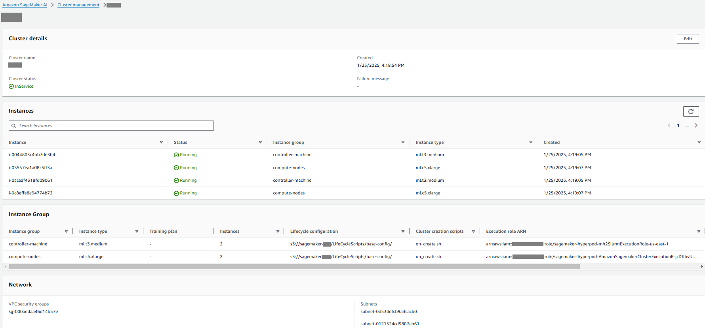

# Creating a SageMaker HyperPod

cluster

After setting up all the required resources and uploading the scripts to the Amazon S3
bucket, you can create a cluster.

1. To create a cluster, run the [`create-cluster`](../../../cli/latest/reference/sagemaker/create-cluster.md "../../../cli/latest/reference/sagemaker/create-cluster.md") AWS CLI command. The creation
   process can take up to 15 minutes to complete.

```
aws --region $REGION sagemaker create-cluster \
    --cluster-name $HP_CLUSTER_NAME \
    --vpc-config '{
        "SecurityGroupIds":["'$SECURITY_GROUP'"],
        "Subnets":["'$PRIMARY_SUBNET'", "'$BACKUP_SUBNET'"]
    }' \
    --instance-groups '[{
    "InstanceGroupName": "'$CONTOLLER_IG_NAME'",
    "InstanceType": "ml.t3.medium",
    "InstanceCount": 2,
    "LifeCycleConfig": {
        "SourceS3Uri": "s3://'$BUCKET_NAME'",
        "OnCreate": "on_create.sh"
    },
    "ExecutionRole": "'$SLURM_EXECUTION_ROLE_ARN'",
    "ThreadsPerCore": 1
},
{
    "InstanceGroupName": "'$COMPUTE_IG_NAME'",
    "InstanceType": "ml.c5.xlarge",
    "InstanceCount": 2,
    "LifeCycleConfig": {
        "SourceS3Uri": "s3://'$BUCKET_NAME'",
        "OnCreate": "on_create.sh"
    },
    "ExecutionRole": "'$COMPUTE_NODE_ROLE'",
    "ThreadsPerCore": 1
}]'
```

After successful execution, the command returns the cluster ARN like the
following.

```
{
    "ClusterArn": "arn:aws:sagemaker:`us-east-1`:`111122223333`:cluster/`cluster_id`"
}
```

2. (Optional) To check the status of your cluster, you can use the SageMaker AI
   console ([https://console.aws.amazon.com/sagemaker/](https://console.aws.amazon.com/sagemaker/ "https://console.aws.amazon.com/sagemaker/")). From the left navigation,
   choose **HyperPod Clusters**, then choose
   **Cluster Management**. Choose a cluster name to open
   the cluster details page. If your cluster is created successfully, you will
   see the cluster status is **InService**.


