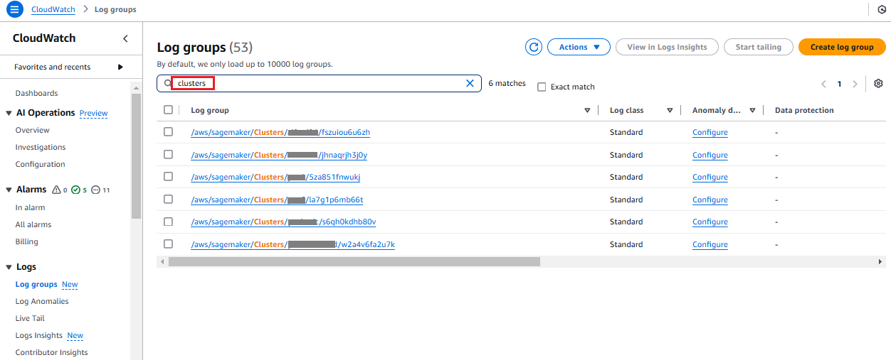

# Considering important

notes

This section provides several important notes which you might find helpful.

1. To migrate to a multi-controller Slurm cluster, complete these
   steps.
   1. Follow the instructions in [Provisioning resources using
      CloudFormation stacks](sagemaker-hyperpod-multihead-slurm-cfn.md "sagemaker-hyperpod-multihead-slurm-cfn.md") to provision all
      the required resources.
   2. Follow the instructions in [Preparing and uploading
      lifecycle scripts](sagemaker-hyperpod-multihead-slurm-scripts.md "sagemaker-hyperpod-multihead-slurm-scripts.md") to upload the
      updated lifecycle scripts. When updating the
      `provisioning_parameters.json` file, move your
      existing controller group to the `worker_groups` section,
      and add a new controller group name in the
      `controller_group` section.
   3. Run the [update-cluster](../../../cli/latest/reference/sagemaker/update-cluster.md "../../../cli/latest/reference/sagemaker/update-cluster.md") API call to create a new controller
      group and keep the original compute instance groups and controller
      group.

2. To scale down the number of controller nodes, use the [update-cluster](../../../cli/latest/reference/sagemaker/update-cluster.md "../../../cli/latest/reference/sagemaker/update-cluster.md") CLI command. For each controller instance group,
   the minimum number of controller nodes you can scale down to is 1. This
   means that you cannot scale down the number of controller nodes to 0.

###### Important

For clusters created before Jan 24, 2025, you must first update your
cluster software using the [UpdateClusterSoftware](../APIReference/API_UpdateClusterSoftware.md "../APIReference/API_UpdateClusterSoftware.md") API before running the [update-cluster](../../../cli/latest/reference/sagemaker/update-cluster.md "../../../cli/latest/reference/sagemaker/update-cluster.md") CLI command.

The following is an example CLI command to scale down the number of
controller nodes.

```
aws sagemaker update-cluster \
    --cluster-name `my_cluster` \
    --instance-groups '[{
    "InstanceGroupName": "`controller_ig_name`",
    "InstanceType": "`ml.t3.medium`",
    "InstanceCount": `3`,
    "LifeCycleConfig": {
        "SourceS3Uri": "s3://amzn-s3-demo-bucket1",
        "OnCreate": "on_create.sh"
    },
    "ExecutionRole": "`slurm_execution_role_arn`",
    "ThreadsPerCore": `1`
},
{
    "InstanceGroupName": "`compute-ig_name`",
    "InstanceType": "`ml.c5.xlarge`",
    "InstanceCount": `2`,
    "LifeCycleConfig": {
        "SourceS3Uri": "s3://amzn-s3-demo-bucket1",
        "OnCreate": "on_create.sh"
    },
    "ExecutionRole": "`compute_node_role_arn`",
    "ThreadsPerCore": `1`
}]'
```

3. To batch delete the controller nodes, use the [batch-delete-cluster-nodes](../../../cli/latest/reference/sagemaker/batch-delete-cluster-nodes.md "../../../cli/latest/reference/sagemaker/batch-delete-cluster-nodes.md") CLI command. For each controller
   instance group, you must keep at least one controller node. If you want to
   batch delete all the controller nodes, the API operation won't work.

###### Important

For clusters created before Jan 24, 2025, you must first update your
cluster software using the [UpdateClusterSoftware](../APIReference/API_UpdateClusterSoftware.md "../APIReference/API_UpdateClusterSoftware.md") API before running the [batch-delete-cluster-nodes](../../../cli/latest/reference/sagemaker/batch-delete-cluster-nodes.md "../../../cli/latest/reference/sagemaker/batch-delete-cluster-nodes.md") CLI command.

The following is an example CLI command to batch delete the controller
nodes.

```
aws sagemaker batch-delete-cluster-nodes --cluster-name `my_cluster` --node-ids `instance_ids_to_delete`
```

4. To troubleshoot your cluster creation issues, check the failure message
   from the cluster details page in your SageMaker AI console. You can also use CloudWatch
   logs to troubleshoot cluster creation issues. From the CloudWatch console, choose
   **Log groups**. Then, search `clusters` to
   see the list of log groups related to your cluster creation.


