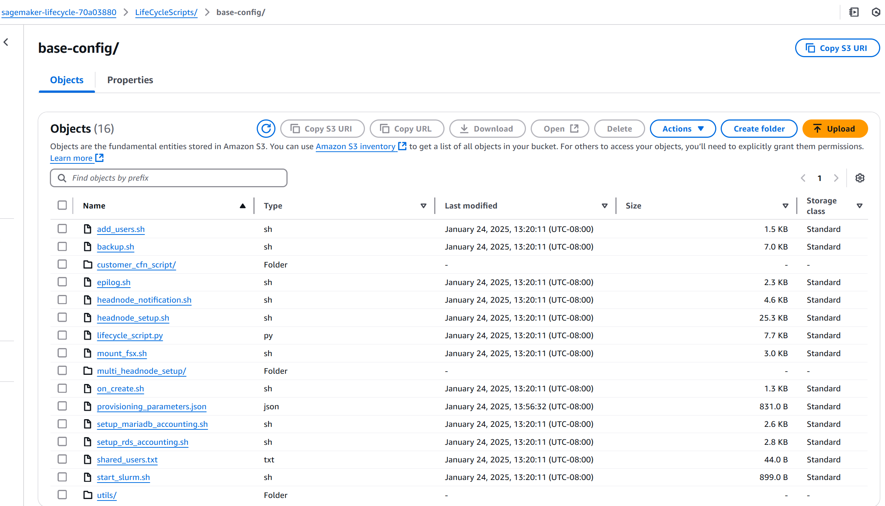

# Preparing and uploading

lifecycle scripts

After creating all the required resources, you'll need to set up [lifecycle scripts](https://github.com/aws-samples/awsome-distributed-training/tree/main/1.architectures/5.sagemaker-hyperpod/LifecycleScripts "https://github.com/aws-samples/awsome-distributed-training/tree/main/1.architectures/5.sagemaker-hyperpod/LifecycleScripts") for your SageMaker HyperPod cluster. These [lifecycle scripts](https://github.com/aws-samples/awsome-distributed-training/tree/main/1.architectures/5.sagemaker-hyperpod/LifecycleScripts "https://github.com/aws-samples/awsome-distributed-training/tree/main/1.architectures/5.sagemaker-hyperpod/LifecycleScripts") provide a [base configuration](https://github.com/aws-samples/awsome-distributed-training/tree/main/1.architectures/5.sagemaker-hyperpod/LifecycleScripts/base-config "https://github.com/aws-samples/awsome-distributed-training/tree/main/1.architectures/5.sagemaker-hyperpod/LifecycleScripts/base-config") you can use to create a basic HyperPod
Slurm cluster.

## Prepare the lifecycle scripts

Follow these steps to get the lifecycle scripts.

1. Download the [lifecycle scripts](https://github.com/aws-samples/awsome-distributed-training/tree/main/1.architectures/5.sagemaker-hyperpod/LifecycleScripts "https://github.com/aws-samples/awsome-distributed-training/tree/main/1.architectures/5.sagemaker-hyperpod/LifecycleScripts") from the GitHub repository to your
   machine.
2. Upload the [lifecycle scripts](https://github.com/aws-samples/awsome-distributed-training/tree/main/1.architectures/5.sagemaker-hyperpod/LifecycleScripts "https://github.com/aws-samples/awsome-distributed-training/tree/main/1.architectures/5.sagemaker-hyperpod/LifecycleScripts") to the Amazon S3 bucket you created in [Provision basic
   resources](sagemaker-hyperpod-multihead-slurm-cfn.md#sagemaker-hyperpod-multihead-slurm-cfn-basic "sagemaker-hyperpod-multihead-slurm-cfn.md#sagemaker-hyperpod-multihead-slurm-cfn-basic"), using the [cp](../../../cli/latest/reference/s3/cp.md "../../../cli/latest/reference/s3/cp.md")
   CLI command.

```
aws s3 cp --recursive LifeCycleScripts/base-config s3://${ROOT_BUCKET_NAME}/LifeCycleScripts/base-config
```

## Create configuration file

Follow these steps to create the configuration file and upload it to the
same Amazon S3 bucket where you store the lifecycle scripts.

1. Create a configuration file named
   `provisioning_parameters.json` with the following
   configuration. Note that `slurm_sns_arn` is optional. If not
   provided, HyperPod will not set up the Amazon SNS notifications.

```
cat <<EOF > /tmp/provisioning_parameters.json
{
  "version": "1.0.0",
  "workload_manager": "slurm",
  "controller_group": "$CONTOLLER_IG_NAME",
  "login_group": "my-login-group",
  "worker_groups": [
    {
      "instance_group_name": "$COMPUTE_IG_NAME",
      "partition_name": "dev"
    }
  ],
  "fsx_dns_name": "$SLURM_FSX_DNS_NAME",
  "fsx_mountname": "$SLURM_FSX_MOUNT_NAME",
  "slurm_configurations": {
    "slurm_database_secret_arn": "$SLURM_DB_SECRET_ARN",
    "slurm_database_endpoint": "$SLURM_DB_ENDPOINT_ADDRESS",
    "slurm_shared_directory": "/fsx",
    "slurm_database_user": "$DB_USER_NAME",
    "slurm_sns_arn": "$SLURM_SNS_FAILOVER_TOPIC_ARN"
  }
}
EOF
```

2. Upload the `provisioning_parameters.json` file to the same Amazon S3
   bucket where you store the lifecycle scripts.

```
aws s3 cp /tmp/provisioning_parameters.json s3://${ROOT_BUCKET_NAME}/LifeCycleScripts/base-config/provisioning_parameters.json
```

###### Note

If you are using API-driven configuration, the `provisioning_parameters.json` file is not required. With API-driven configuration, you define Slurm node types, partitions, and FSx mounting directly in the CreateCluster API payload. For details, see [Getting started with SageMaker HyperPod using the AWS CLI](smcluster-getting-started-slurm-cli.md "smcluster-getting-started-slurm-cli.md").

## Verify files in

Amazon S3 bucket

After you upload all the lifecycle scripts and the `provisioning_parameters.json` file, your Amazon S3 bucket should look
like the following.



For more information, see [Start with base lifecycle scripts provided by HyperPod](sagemaker-hyperpod-lifecycle-best-practices-slurm-slurm-base-config.md "sagemaker-hyperpod-lifecycle-best-practices-slurm-slurm-base-config.md").
