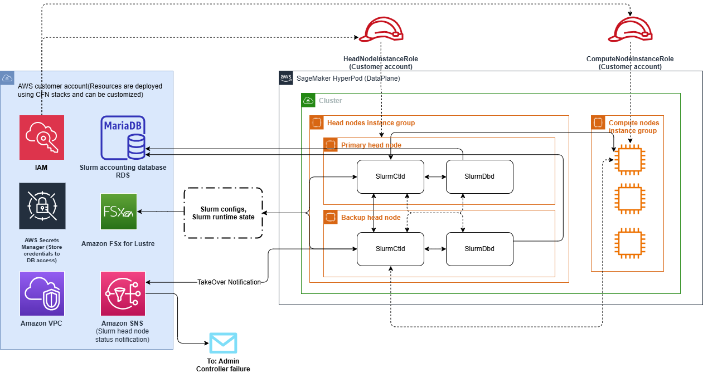

# SageMaker HyperPod multi-head node support

You can create multiple controller (head) nodes in a single SageMaker HyperPod Slurm
cluster, with one serving as the primary controller node and the others serving as
backup controller nodes. The primary controller node is responsible for controlling the
compute (worker) nodes and handling Slurm operations. The backup controller nodes
constantly monitor the primary controller node. If the primary controller node fails or
becomes unresponsive, one of the backup controller nodes will automatically take over as
the new primary controller node.

Configuring multiple controller nodes in SageMaker HyperPod Slurm clusters provides several
key benefits. It eliminates the risk of single controller node failure by providing
controller head nodes, enables automatic failover to backup controller nodes with faster
recovery, and allows you to manage your own accounting databases and Slurm configuration
independently.

## Key concepts

The following provides details about the concepts related to SageMaker HyperPod multiple
controller (head) nodes support for Slurm clusters.

**Controller node**

A controller node is an Amazon EC2 instance within a cluster that runs critical Slurm
services for managing and coordinating the cluster's operations. Specifically, it
hosts the [Slurm controller
daemon (slurmctld)](https://slurm.schedmd.com/slurmctld.html "https://slurm.schedmd.com/slurmctld.html") and the [Slurm database daemon
(slurmdbd)](https://slurm.schedmd.com/slurmdbd.html "https://slurm.schedmd.com/slurmdbd.html"). A controller node is also known as a head node.

**Primary controller node**

A primary controller node is the active and currently controlling controller node
in a Slurm cluster. It is identified by Slurm as the primary controller node
responsible for managing the cluster. The primary controller node receives and
executes commands from users to control and allocate resources on the compute nodes
for running jobs.

**Backup controller node**

A backup controller node is an inactive and standby controller node in a Slurm
cluster. It is identified by Slurm as a backup controller node that is not currently
managing the cluster. The backup controller node runs the [Slurm controller daemon
(slurmctld)](https://slurm.schedmd.com/slurmctld.html "https://slurm.schedmd.com/slurmctld.html") in standby mode. Any controller commands executed on the
backup controller nodes will be propagated to the primary controller node for
execution. Its primary purpose is to continuously monitor the primary controller
node and take over its responsibilities if the primary controller node fails or
becomes unresponsive.

**Compute node**

A compute node is an Amazon EC2 instance within a cluster that hosts the [Slurm worker daemon
(slurmd)](https://slurm.schedmd.com/slurmd.html "https://slurm.schedmd.com/slurmd.html"). The compute node's primary function is to execute jobs assigned by
the [Slurm controller daemon
(slurmctld)](https://slurm.schedmd.com/slurmctld.html "https://slurm.schedmd.com/slurmctld.html") running on the primary controller node. When a job is
scheduled, the compute node receives instructions from the [Slurm controller daemon
(slurmctld)](https://slurm.schedmd.com/slurmctld.html "https://slurm.schedmd.com/slurmctld.html") to carry out the necessary tasks and computations for that
job within the node itself. A compute is also known as a worker node.

## How it works

The following diagram illustrates how different AWS services work together to
support the multiple controller (head) nodes architecture for SageMaker HyperPod Slurm
clusters.

The AWS services that work together to support the SageMaker HyperPod multiple
controller (head) nodes architecture include the following.

AWS services that work together to support the SageMaker HyperPod multiple
controller nodes architecture | Service | Description |
| --- | --- |
| **IAM (AWS Identity and Access Management)** | Defines two IAM roles to control the access permissions: one role for the compute node instance group and the other for the controller node instance group. |
| **Amazon RDS for MariaDB** | Stores accounting data for Slurm, which holds job records and metering data. |
| **AWS Secrets Manager** | Stores and manages credentials that can be accessed by Amazon FSx for Lustre. |
| **Amazon FSx for Lustre** | Stores Slurm configurations and runtime state. |
| **Amazon VPC** | Provides an isolated network environment where the HyperPod cluster and its resources are deployed. |
| **Amazon SNS** | Sends notifications to administrators when there are status changes (Slurm controller is `ON` or `OFF`) related to the primary controller (head) node. |

The HyperPod cluster itself consists of controller nodes (primary and
backup) and compute nodes. The controller nodes run the Slurm controller (SlurmCtld)
and database (SlurmDBd) components, which manage and monitor the workload across the
compute nodes.

The controller nodes access Slurm configurations and runtime state stored in the
Amazon FSx for Lustre file system. The Slurm accounting data is stored in the
Amazon RDS for MariaDB database. AWS Secrets Manager provides secure access to the database
credentials for the controller nodes.

If there is a status change (Slurm controller is `ON` or
`OFF`) in the Slurm controller nodes, Amazon SNS sends notifications to
the admin for further action.

This multiple controller nodes architecture eliminates the single point of failure
of a single controller (head) node, enables fast and automatic failover recovery,
and gives you control over the Slurm accounting database and configurations.
